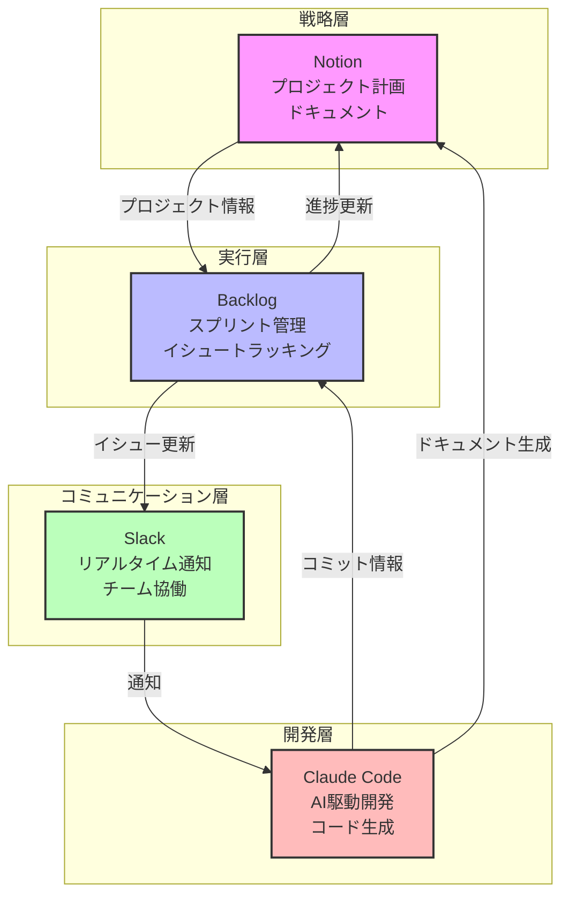
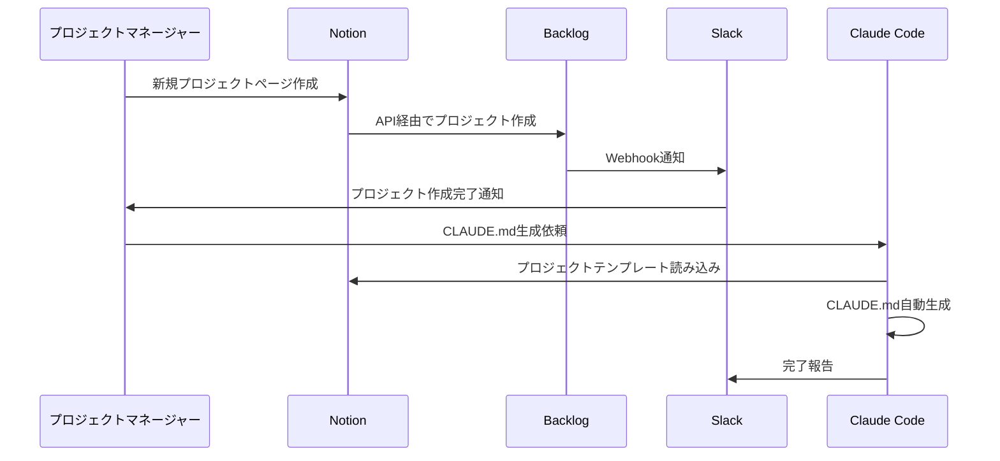
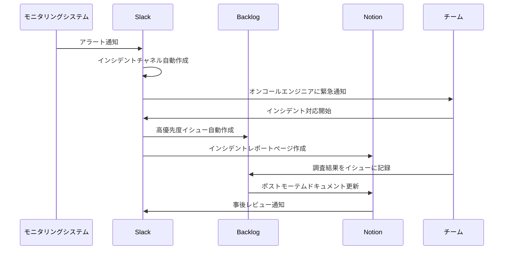

## 概要

プロジェクト管理の現実は厳しいものです。PMI（Project Management Institute）の調査によると、<strong>プロジェクトの約70%が期限、予算、品質のいずれかで失敗</strong>しています。その主な原因は、ツールの乱立、コミュニケーションの断絶、そして標準化されていないワークフローです。

本記事では、以下の4つのツールを統合し、プロジェクト管理を標準化する実践的な方法を解説します：

- <strong>Notion</strong>: 戦略的計画とドキュメンテーションのハブ
- <strong>Backlog</strong>: アジャイルスプリント管理とイシュートラッキング
- <strong>Slack</strong>: リアルタイムコミュニケーションと協働センター
- <strong>Claude Code</strong>: AI駆動開発支援とプロジェクトコンテキスト管理

これらのツールを正しく統合することで、<strong>定時デリバリー率80%以上、ツール切り替え時間50%削減</strong>を実現できます。

## ツール別コア機能

### Notion: 戦略的計画ハブ

Notionはデータベース中心のアーキテクチャを持ち、プロジェクトのあらゆる情報を一元管理できます。

#### データベース設計のベストプラクティス

```javascript
// Notion API でプロジェクトデータベースを作成
const { Client } = require('@notionhq/client');

const notion = new Client({ auth: process.env.NOTION_API_KEY });

async function createProjectDatabase(parentPageId) {
  const response = await notion.databases.create({
    parent: {
      type: 'page_id',
      page_id: parentPageId,
    },
    title: [
      {
        type: 'text',
        text: {
          content: 'プロジェクト管理DB',
        },
      },
    ],
    properties: {
      // プロジェクト名（タイトル）
      Name: {
        title: {},
      },
      // ステータス（選択式）
      Status: {
        select: {
          options: [
            { name: '計画中', color: 'gray' },
            { name: '進行中', color: 'blue' },
            { name: 'レビュー', color: 'yellow' },
            { name: '完了', color: 'green' },
            { name: '保留', color: 'red' },
          ],
        },
      },
      // 優先度
      Priority: {
        select: {
          options: [
            { name: '高', color: 'red' },
            { name: '中', color: 'yellow' },
            { name: '低', color: 'blue' },
          ],
        },
      },
      // 担当者（人物）
      Assignee: {
        people: {},
      },
      // 期限（日付）
      DueDate: {
        date: {},
      },
      // Backlogイシューキー（テキスト）
      BacklogKey: {
        rich_text: {},
      },
      // Slackチャネル（URL）
      SlackChannel: {
        url: {},
      },
    },
  });

  return response;
}
```

#### プロジェクトテンプレート活用法

Notionのテンプレート機能を使用して、プロジェクトの立ち上げを標準化できます：

1. <strong>プロジェクト概要ページ</strong>: 目的、スコープ、ステークホルダー
2. <strong>技術スタックDB</strong>: 使用技術、ライブラリ、バージョン情報
3. <strong>マイルストーンタイムライン</strong>: ガントビューで進捗可視化
4. <strong>リスク管理表</strong>: 潜在的リスクと対策
5. <strong>決定記録（ADR）</strong>: アーキテクチャ決定の履歴

### Backlog: アジャイルスプリント管理

Backlogは日本企業Nulabが開発したプロジェクト管理ツールで、特にアジャイル開発に強みがあります。

#### スプリント計画と追跡

Backlogの課題タイプとカスタムフィールドを活用：

```python
# Backlog API でイシューを作成（Python例）
import requests
import json

BACKLOG_SPACE = 'your-space'
API_KEY = 'your-api-key'
PROJECT_ID = 12345

def create_sprint_issue(summary, description, assignee_id, sprint_id):
    """
    スプリントイシューを作成

    Args:
        summary: イシューのタイトル
        description: イシューの説明
        assignee_id: 担当者ID
        sprint_id: スプリントのマイルストーンID
    """
    url = f'https://{BACKLOG_SPACE}.backlog.com/api/v2/issues'

    params = {
        'apiKey': API_KEY,
        'projectId': PROJECT_ID,
        'summary': summary,
        'description': description,
        'issueTypeId': 2,  # タスク
        'priorityId': 3,   # 中
        'assigneeId': assignee_id,
        'milestoneId[]': sprint_id,
    }

    response = requests.post(url, params=params)
    return response.json()

# 使用例
issue = create_sprint_issue(
    summary='ユーザー認証機能の実装',
    description='OAuth2.0を使用したソーシャルログイン機能',
    assignee_id=67890,
    sprint_id=111
)

print(f"イシュー作成完了: {issue['issueKey']}")
```

#### イシュートラッキングのベストプラクティス

1. <strong>課題タイプの標準化</strong>: タスク、バグ、改善要望、質問
2. <strong>カスタムフィールド活用</strong>: 工数見積もり、実績工数、テスト完了フラグ
3. <strong>親子関係の活用</strong>: エピック → ストーリー → タスクの階層構造
4. <strong>バーンダウンチャート</strong>: スプリント進捗の可視化

#### Webhook設定例

BacklogのWebhookを使用して、リアルタイムでSlackに通知：

```javascript
// Backlog Webhook を受け取るエンドポイント（Node.js/Express）
const express = require('express');
const axios = require('axios');

const app = express();
app.use(express.json());

// Backlog Webhook エンドポイント
app.post('/webhooks/backlog', async (req, res) => {
  const event = req.body;

  // イベントタイプに応じて処理を分岐
  switch (event.type) {
    case 1: // 課題の追加
      await notifySlack('新しい課題が追加されました', event);
      break;
    case 2: // 課題の更新
      await notifySlack('課題が更新されました', event);
      break;
    case 3: // 課題のコメント追加
      await notifySlack('新しいコメントが追加されました', event);
      break;
    case 4: // 課題の削除
      await notifySlack('課題が削除されました', event);
      break;
    default:
      console.log('未対応のイベントタイプ:', event.type);
  }

  res.status(200).send('OK');
});

async function notifySlack(message, event) {
  const slackWebhookUrl = process.env.SLACK_WEBHOOK_URL;

  const payload = {
    text: message,
    blocks: [
      {
        type: 'header',
        text: {
          type: 'plain_text',
          text: message,
        },
      },
      {
        type: 'section',
        fields: [
          {
            type: 'mrkdwn',
            text: `*課題キー:*\n<${event.content.key_id}|${event.content.summary}>`,
          },
          {
            type: 'mrkdwn',
            text: `*担当者:*\n${event.content.assignee?.name || '未割当'}`,
          },
          {
            type: 'mrkdwn',
            text: `*ステータス:*\n${event.content.status?.name}`,
          },
          {
            type: 'mrkdwn',
            text: `*更新者:*\n${event.createdUser.name}`,
          },
        ],
      },
    ],
  };

  await axios.post(slackWebhookUrl, payload);
}

app.listen(3000, () => {
  console.log('Webhook サーバーがポート3000で起動しました');
});
```

### Slack: リアルタイム協働センター

Slackは単なるチャットツールではなく、プロジェクト管理の中枢神経として機能します。

#### チャネル構造化戦略

効果的なチャネル命名規則：

```
# プロジェクト関連
proj-<プロジェクト名>         # 全般的な議論
proj-<プロジェクト名>-dev     # 開発者専用
proj-<プロジェクト名>-qa      # QA専用
proj-<プロジェクト名>-alerts  # 自動通知専用

# チーム関連
team-engineering              # エンジニアリング全体
team-frontend                 # フロントエンド
team-backend                  # バックエンド

# 自動化関連
bot-notifications             # Bot通知
bot-ci-cd                     # CI/CD結果
bot-monitoring                # モニタリングアラート
```

#### 自動化ワークフロー構築

Slack Workflow Builderを使用した自動化例：

1. <strong>スタンドアップミーティング自動化</strong>
   - トリガー: 毎日午前10時
   - アクション: チームメンバーにフォーム送信
   - 質問: 「昨日の成果」「今日の予定」「ブロッカー」

2. <strong>プルリクエスト承認フロー</strong>
   - トリガー: GitHubからのWebhook
   - アクション: レビュアーにメンション、承認ボタン表示

3. <strong>インシデント報告</strong>
   - トリガー: ショートカットメニュー
   - アクション: インシデントチャネル作成、関係者召集、Notionに記録

#### Slack Bot サンプルコード

Bolt for JavaScriptを使用したシンプルなSlack Bot：

```javascript
const { App } = require('@slack/bolt');

// Slack App の初期化
const app = new App({
  token: process.env.SLACK_BOT_TOKEN,
  signingSecret: process.env.SLACK_SIGNING_SECRET,
});

// スラッシュコマンド: /create-task
app.command('/create-task', async ({ command, ack, say, client }) => {
  await ack();

  // モーダルを開く
  await client.views.open({
    trigger_id: command.trigger_id,
    view: {
      type: 'modal',
      callback_id: 'task_creation_modal',
      title: {
        type: 'plain_text',
        text: 'タスク作成',
      },
      submit: {
        type: 'plain_text',
        text: '作成',
      },
      blocks: [
        {
          type: 'input',
          block_id: 'task_title',
          label: {
            type: 'plain_text',
            text: 'タスク名',
          },
          element: {
            type: 'plain_text_input',
            action_id: 'title',
          },
        },
        {
          type: 'input',
          block_id: 'task_description',
          label: {
            type: 'plain_text',
            text: '説明',
          },
          element: {
            type: 'plain_text_input',
            action_id: 'description',
            multiline: true,
          },
        },
        {
          type: 'input',
          block_id: 'task_assignee',
          label: {
            type: 'plain_text',
            text: '担当者',
          },
          element: {
            type: 'users_select',
            action_id: 'assignee',
          },
        },
      ],
    },
  });
});

// モーダル送信処理
app.view('task_creation_modal', async ({ ack, body, view, client }) => {
  await ack();

  // フォームデータを取得
  const values = view.state.values;
  const title = values.task_title.title.value;
  const description = values.task_description.description.value;
  const assignee = values.task_assignee.assignee.selected_user;

  // BacklogとNotionにタスクを作成（簡略化）
  // const backlogIssue = await createBacklogIssue(title, description, assignee);
  // const notionPage = await createNotionTask(title, description, assignee);

  // 確認メッセージを送信
  await client.chat.postMessage({
    channel: body.user.id,
    text: `タスク「${title}」を作成しました！`,
    blocks: [
      {
        type: 'section',
        text: {
          type: 'mrkdwn',
          text: `*タスク作成完了* ✅\n\n*タスク名:* ${title}\n*担当者:* <@${assignee}>`,
        },
      },
    ],
  });
});

// Appの起動
(async () => {
  await app.start(process.env.PORT || 3000);
  console.log('⚡️ Slack Bot が起動しました！');
})();
```

### Claude Code: AI駆動開発支援

Claude Codeは単なるコーディングアシスタントではなく、プロジェクト全体のコンテキストを理解し、開発プロセスを最適化するAIエージェントです。

#### CLAUDE.md 作成方法

プロジェクトルートに`CLAUDE.md`を配置し、プロジェクトコンテキストを定義：

````markdown
# CLAUDE.md

## プロジェクト概要

このプロジェクトは、ECサイトのバックエンドAPIを提供するNode.js/Express アプリケーションです。

## アーキテクチャ

- **言語**: TypeScript 5.3
- **フレームワーク**: Express 4.18
- **データベース**: PostgreSQL 15
- **ORM**: Prisma 5.0
- **認証**: JWT + OAuth2.0
- **API仕様**: OpenAPI 3.1

## ディレクトリ構造

```
src/
├── controllers/    # リクエストハンドラー
├── services/       # ビジネスロジック
├── repositories/   # データアクセス層
├── middlewares/    # ミドルウェア
├── types/          # TypeScript型定義
└── utils/          # ユーティリティ関数
```

## 開発ガイドライン

### コーディング規約

- ESLint + Prettier 使用
- 関数には必ずJSDocコメント
- ユニットテストカバレッジ80%以上
- すべてのAPIエンドポイントにスキーマバリデーション

### プロジェクト管理統合

- **Notion**: プロジェクトドキュメント（[リンク](notion-url)）
- **Backlog**: イシュートラッキング（[リンク](backlog-url)）
- **Slack**: #proj-ecommerce-dev チャネル

### 命令

新しい機能を実装する際：
1. Backlogイシューを確認
2. 関連するNotionドキュメントを読む
3. テスト駆動開発（TDD）で実装
4. コミット前にlint + test実行
5. PRをGitHubに作成し、Slackで通知
````

#### MCPサーバー設定

Claude CodeのModel Context Protocol（MCP）を使用して、外部ツールと統合：

```json
{
  "mcpServers": {
    "notion": {
      "command": "npx",
      "args": [
        "-y",
        "@notionhq/client"
      ],
      "env": {
        "NOTION_API_KEY": "${NOTION_API_KEY}"
      }
    },
    "backlog": {
      "command": "node",
      "args": [
        "./mcp-servers/backlog-server.js"
      ],
      "env": {
        "BACKLOG_API_KEY": "${BACKLOG_API_KEY}",
        "BACKLOG_SPACE": "${BACKLOG_SPACE}"
      }
    },
    "slack": {
      "command": "npx",
      "args": [
        "-y",
        "@slack/bolt"
      ],
      "env": {
        "SLACK_BOT_TOKEN": "${SLACK_BOT_TOKEN}"
      }
    }
  }
}
```

カスタムBacklog MCPサーバー例：

```javascript
// mcp-servers/backlog-server.js
const { MCPServer } = require('@anthropic/mcp');
const axios = require('axios');

const server = new MCPServer({
  name: 'backlog-mcp',
  version: '1.0.0',
});

// ツール: Backlogイシューを取得
server.tool({
  name: 'get_backlog_issue',
  description: 'Backlogからイシュー情報を取得',
  parameters: {
    issueKey: {
      type: 'string',
      description: 'イシューキー（例: PROJ-123）',
      required: true,
    },
  },
  handler: async ({ issueKey }) => {
    const space = process.env.BACKLOG_SPACE;
    const apiKey = process.env.BACKLOG_API_KEY;

    const response = await axios.get(
      `https://${space}.backlog.com/api/v2/issues/${issueKey}`,
      {
        params: { apiKey },
      }
    );

    return {
      content: [
        {
          type: 'text',
          text: JSON.stringify(response.data, null, 2),
        },
      ],
    };
  },
});

// ツール: Backlogイシューを作成
server.tool({
  name: 'create_backlog_issue',
  description: 'Backlogに新しいイシューを作成',
  parameters: {
    projectId: {
      type: 'number',
      description: 'プロジェクトID',
      required: true,
    },
    summary: {
      type: 'string',
      description: 'イシューのタイトル',
      required: true,
    },
    description: {
      type: 'string',
      description: 'イシューの説明',
      required: false,
    },
    issueTypeId: {
      type: 'number',
      description: '課題タイプID（1:バグ, 2:タスク, 3:要望, 4:その他）',
      required: true,
    },
    priorityId: {
      type: 'number',
      description: '優先度ID（2:高, 3:中, 4:低）',
      required: true,
    },
  },
  handler: async ({ projectId, summary, description, issueTypeId, priorityId }) => {
    const space = process.env.BACKLOG_SPACE;
    const apiKey = process.env.BACKLOG_API_KEY;

    const response = await axios.post(
      `https://${space}.backlog.com/api/v2/issues`,
      null,
      {
        params: {
          apiKey,
          projectId,
          summary,
          description,
          issueTypeId,
          priorityId,
        },
      }
    );

    return {
      content: [
        {
          type: 'text',
          text: `イシュー作成完了: ${response.data.issueKey}`,
        },
      ],
    };
  },
});

server.start();
```

#### プロジェクトコンテキスト管理

Claude Codeでプロジェクトコンテキストを効果的に管理する方法：

1. <strong>CLAUDE.mdの活用</strong>: プロジェクト固有のルール、アーキテクチャ、命令を記述
2. <strong>.claude/agents/</strong>: 専門タスク用のサブエージェント定義
3. <strong>MCPサーバー</strong>: 外部ツール（Notion、Backlog）とのリアルタイム連携
4. <strong>スラッシュコマンド</strong>: 頻繁な操作を自動化（例: `/sync-notion`）

## 統合ワークフロー構築

### アーキテクチャ概要

4つのツールがどのように連携するかを図示します：



### 自動化シナリオ

#### 1. プロジェクト作成フロー



<strong>実装例：Notion → Backlog 自動連携</strong>

```javascript
// Notion Database 監視とBacklog同期
const { Client } = require('@notionhq/client');
const axios = require('axios');

const notion = new Client({ auth: process.env.NOTION_API_KEY });

async function syncNotionToBacklog(databaseId) {
  // Notionから新規プロジェクトを取得
  const response = await notion.databases.query({
    database_id: databaseId,
    filter: {
      property: 'BacklogSynced',
      checkbox: {
        equals: false,
      },
    },
  });

  for (const page of response.results) {
    const properties = page.properties;

    // プロジェクト情報を抽出
    const projectName = properties.Name.title[0]?.plain_text;
    const description = properties.Description?.rich_text[0]?.plain_text;
    const dueDate = properties.DueDate?.date?.start;

    // Backlogにプロジェクトを作成
    const backlogResponse = await axios.post(
      `https://${process.env.BACKLOG_SPACE}.backlog.com/api/v2/projects`,
      null,
      {
        params: {
          apiKey: process.env.BACKLOG_API_KEY,
          name: projectName,
          key: generateProjectKey(projectName),
          chartEnabled: true,
          useWikiTreeView: true,
          projectLeaderCanEditProjectLeader: false,
        },
      }
    );

    const backlogProjectId = backlogResponse.data.id;

    // NotionページにBacklogプロジェクトIDを記録
    await notion.pages.update({
      page_id: page.id,
      properties: {
        BacklogProjectId: {
          number: backlogProjectId,
        },
        BacklogSynced: {
          checkbox: true,
        },
      },
    });

    // Slackに通知
    await notifySlack(
      `新規プロジェクト「${projectName}」がBacklogに同期されました！\n` +
      `Backlog: https://${process.env.BACKLOG_SPACE}.backlog.com/projects/${backlogProjectId}`
    );
  }
}

function generateProjectKey(name) {
  // プロジェクト名から英字のみを抽出して大文字化
  return name
    .replace(/[^a-zA-Z]/g, '')
    .toUpperCase()
    .substring(0, 10);
}

// 定期実行（5分ごと）
setInterval(() => {
  syncNotionToBacklog(process.env.NOTION_PROJECT_DB_ID);
}, 5 * 60 * 1000);
```

#### 2. タスク同期フロー

開発者がBacklogでイシューのステータスを更新すると、自動的にNotionとSlackが更新されます。

```javascript
// Backlog Webhook → Notion + Slack 同期
app.post('/webhooks/backlog', async (req, res) => {
  const event = req.body;

  if (event.type === 2 && event.content.changes) {
    // ステータス変更を検出
    const statusChange = event.content.changes.find(
      (change) => change.field === 'status'
    );

    if (statusChange) {
      const issueKey = event.content.key_id;
      const oldStatus = statusChange.old_value;
      const newStatus = statusChange.new_value;

      // Notionのタスクデータベースを更新
      await updateNotionTaskStatus(issueKey, newStatus);

      // Slackに通知
      await notifySlackStatusChange(issueKey, oldStatus, newStatus, event.createdUser);
    }
  }

  res.status(200).send('OK');
});

async function updateNotionTaskStatus(issueKey, newStatus) {
  // NotionでBacklogKeyが一致するページを検索
  const response = await notion.databases.query({
    database_id: process.env.NOTION_TASK_DB_ID,
    filter: {
      property: 'BacklogKey',
      rich_text: {
        equals: issueKey,
      },
    },
  });

  if (response.results.length > 0) {
    const pageId = response.results[0].id;

    // ステータスを更新
    await notion.pages.update({
      page_id: pageId,
      properties: {
        Status: {
          select: {
            name: mapBacklogStatusToNotion(newStatus),
          },
        },
      },
    });
  }
}

function mapBacklogStatusToNotion(backlogStatus) {
  const mapping = {
    '未対応': '計画中',
    '処理中': '進行中',
    '処理済み': 'レビュー',
    '完了': '完了',
  };
  return mapping[backlogStatus] || '計画中';
}

async function notifySlackStatusChange(issueKey, oldStatus, newStatus, user) {
  const slackWebhookUrl = process.env.SLACK_WEBHOOK_URL;

  await axios.post(slackWebhookUrl, {
    blocks: [
      {
        type: 'section',
        text: {
          type: 'mrkdwn',
          text: `*イシューステータス変更*\n\n` +
                `*イシュー:* ${issueKey}\n` +
                `*変更者:* ${user.name}\n` +
                `${oldStatus} → *${newStatus}*`,
        },
      },
    ],
  });
}
```

#### 3. インシデント管理フロー

本番環境で問題が発生した際の自動化フロー：



#### 4. Claude Code 開発フロー

開発者がClaude Codeを使用してコードを実装する際のワークフロー：

```bash
# Claude Codeセッション開始
$ claude code

# プロンプト例
> @backlog PROJ-123のイシューを確認して、要件を教えて

# Claude Codeがbacklog MCPサーバーを使用してイシュー取得
# 要件を分析し、実装計画を提案

> 実装を開始して。TDDで進めて。

# Claude Codeがテストファースト開発で実装
# 完了後、Backlogイシューのステータスを「処理済み」に更新
# Slackで完了報告
```

### 実践コードサンプル

#### 包括的な統合スクリプト

すべてのツールを連携させる統合スクリプト：

```javascript
// integration-hub.js
const { Client: NotionClient } = require('@notionhq/client');
const { App: SlackApp } = require('@slack/bolt');
const axios = require('axios');
const express = require('express');

// ===== 初期化 =====
const notion = new NotionClient({ auth: process.env.NOTION_API_KEY });

const slack = new SlackApp({
  token: process.env.SLACK_BOT_TOKEN,
  signingSecret: process.env.SLACK_SIGNING_SECRET,
});

const backlogApi = axios.create({
  baseURL: `https://${process.env.BACKLOG_SPACE}.backlog.com/api/v2`,
  params: { apiKey: process.env.BACKLOG_API_KEY },
});

const webhookApp = express();
webhookApp.use(express.json());

// ===== 統合ロジック =====

/**
 * NotionからBacklogへのタスク同期
 */
async function syncTasksNotionToBacklog() {
  console.log('Notion → Backlog 同期開始...');

  // Notionから未同期タスクを取得
  const response = await notion.databases.query({
    database_id: process.env.NOTION_TASK_DB_ID,
    filter: {
      and: [
        {
          property: 'BacklogSynced',
          checkbox: { equals: false },
        },
        {
          property: 'Status',
          select: { does_not_equal: '完了' },
        },
      ],
    },
  });

  for (const page of response.results) {
    const props = page.properties;

    // Backlogイシューを作成
    const backlogIssue = await backlogApi.post('/issues', null, {
      params: {
        projectId: process.env.BACKLOG_PROJECT_ID,
        summary: props.Name.title[0]?.plain_text,
        description: props.Description?.rich_text[0]?.plain_text || '',
        issueTypeId: 2, // タスク
        priorityId: mapNotionPriorityToBacklog(props.Priority?.select?.name),
      },
    });

    // NotionページにBacklog情報を記録
    await notion.pages.update({
      page_id: page.id,
      properties: {
        BacklogKey: { rich_text: [{ text: { content: backlogIssue.data.issueKey } }] },
        BacklogSynced: { checkbox: true },
      },
    });

    // Slack通知
    await slack.client.chat.postMessage({
      channel: process.env.SLACK_CHANNEL_ID,
      text: `新しいタスク「${backlogIssue.data.issueKey}」がBacklogに同期されました`,
    });

    console.log(`✅ ${backlogIssue.data.issueKey} を作成`);
  }
}

/**
 * Backlog Webhook ハンドラー
 */
webhookApp.post('/webhooks/backlog', async (req, res) => {
  try {
    const event = req.body;

    // イシュー更新イベント
    if (event.type === 2) {
      await handleBacklogIssueUpdate(event);
    }

    // コメント追加イベント
    if (event.type === 3) {
      await handleBacklogComment(event);
    }

    res.status(200).send('OK');
  } catch (error) {
    console.error('Webhook処理エラー:', error);
    res.status(500).send('Error');
  }
});

async function handleBacklogIssueUpdate(event) {
  const issueKey = event.content.key_id;
  const changes = event.content.changes || [];

  // ステータス変更を検出
  const statusChange = changes.find((c) => c.field === 'status');
  if (statusChange) {
    // Notion更新
    await updateNotionTaskStatus(issueKey, statusChange.new_value);

    // Slack通知
    await slack.client.chat.postMessage({
      channel: process.env.SLACK_CHANNEL_ID,
      text: `📊 ${issueKey}: ${statusChange.old_value} → ${statusChange.new_value}`,
    });
  }
}

async function handleBacklogComment(event) {
  const issueKey = event.content.key_id;
  const comment = event.content.comment.content;
  const author = event.createdUser.name;

  // Slack通知（スレッド形式）
  await slack.client.chat.postMessage({
    channel: process.env.SLACK_CHANNEL_ID,
    text: `💬 新しいコメント on ${issueKey}`,
    blocks: [
      {
        type: 'section',
        text: {
          type: 'mrkdwn',
          text: `*${author}* が ${issueKey} にコメントしました:\n\n${comment}`,
        },
      },
    ],
  });
}

/**
 * Slack コマンドハンドラー
 */
slack.command('/sync-tasks', async ({ command, ack, respond }) => {
  await ack();

  await respond('タスク同期を開始します...');

  try {
    await syncTasksNotionToBacklog();
    await respond('✅ 同期が完了しました！');
  } catch (error) {
    await respond(`❌ エラーが発生しました: ${error.message}`);
  }
});

/**
 * ユーティリティ関数
 */
function mapNotionPriorityToBacklog(notionPriority) {
  const mapping = { '高': 2, '中': 3, '低': 4 };
  return mapping[notionPriority] || 3;
}

async function updateNotionTaskStatus(issueKey, backlogStatus) {
  const response = await notion.databases.query({
    database_id: process.env.NOTION_TASK_DB_ID,
    filter: {
      property: 'BacklogKey',
      rich_text: { equals: issueKey },
    },
  });

  if (response.results.length > 0) {
    await notion.pages.update({
      page_id: response.results[0].id,
      properties: {
        Status: {
          select: { name: mapBacklogStatusToNotion(backlogStatus) },
        },
      },
    });
  }
}

function mapBacklogStatusToNotion(backlogStatus) {
  const mapping = {
    '未対応': '計画中',
    '処理中': '進行中',
    '処理済み': 'レビュー',
    '完了': '完了',
  };
  return mapping[backlogStatus] || '計画中';
}

// ===== サーバー起動 =====
(async () => {
  // Slack Bot起動
  await slack.start(process.env.SLACK_PORT || 3000);
  console.log('⚡️ Slack Bot が起動しました');

  // Webhook サーバー起動
  webhookApp.listen(process.env.WEBHOOK_PORT || 3001, () => {
    console.log('🔗 Webhook サーバーが起動しました');
  });

  // 定期同期（10分ごと）
  setInterval(async () => {
    try {
      await syncTasksNotionToBacklog();
    } catch (error) {
      console.error('定期同期エラー:', error);
    }
  }, 10 * 60 * 1000);
})();
```

## 標準化プロセス導入ステップ

プロジェクト管理の標準化は一夜にして成るものではありません。段階的なアプローチが成功の鍵です。

### フェーズ1: 評価（1〜2週）

#### 目標
- 現状のツール使用状況を把握
- チームの痛点を特定
- 成功指標を定義

#### 実施項目
1. <strong>現状分析</strong>
   - 使用中のツールリスト作成
   - ツール間のデータフローマッピング
   - 重複作業の特定

2. <strong>ステークホルダーインタビュー</strong>
   - 開発者: コーディング〜デプロイまでのワークフロー
   - PM: プロジェクト計画〜追跡のプロセス
   - QA: テスト管理の課題

3. <strong>ベースライン測定</strong>
   - ツール切り替え時間（平均）
   - ステータス報告に要する時間
   - プロジェクト成功率（定時デリバリー）

### フェーズ2: 設計（3〜6週）

#### 目標
- 統合アーキテクチャを設計
- 標準ワークフローを定義
- パイロットプロジェクトを選定

#### 実施項目
1. <strong>ツール選定とアカウント準備</strong>
   - Notion: チームワークスペース作成
   - Backlog: プロジェクトスペース設定
   - Slack: ワークスペース構成
   - Claude Code: チームライセンス取得

2. <strong>データモデル設計</strong>
   - Notionデータベーススキーマ
   - Backlogプロジェクト構造
   - Slackチャネル命名規則

3. <strong>統合フロー設計</strong>
   - API連携ポイント特定
   - Webhook設定計画
   - 自動化シナリオ作成

4. <strong>ドキュメント作成</strong>
   - ツール利用ガイド
   - ワークフローマニュアル
   - トラブルシューティングガイド

### フェーズ3: ツール実装（7〜10週）

#### 目標
- 各ツールを設定
- 統合スクリプトを実装
- テスト環境で検証

#### 実施項目
1. <strong>Notion セットアップ</strong>
   - プロジェクト管理データベース作成
   - タスクデータベース作成
   - ドキュメントテンプレート作成
   - API統合テスト

2. <strong>Backlog セットアップ</strong>
   - プロジェクト作成
   - カスタムフィールド設定
   - Webhook設定
   - Git連携

3. <strong>Slack セットアップ</strong>
   - チャネル構造構築
   - Bot作成とインストール
   - Workflow Builder設定
   - 通知ルール定義

4. <strong>Claude Code セットアップ</strong>
   - CLAUDE.md作成
   - MCPサーバー実装
   - スラッシュコマンド定義
   - プロジェクトテンプレート作成

5. <strong>統合スクリプト開発</strong>
   - Notion ↔ Backlog 同期
   - Backlog → Slack 通知
   - Claude Code MCP統合
   - エラーハンドリングとロギング

### フェーズ4: パイロット（11〜14週）

#### 目標
- 小規模チームでテスト
- フィードバック収集
- 問題点の洗い出しと修正

#### 実施項目
1. <strong>パイロットチーム選定</strong>
   - 5〜10名の小規模チーム
   - 新規プロジェクトで開始
   - 積極的なフィードバック提供を期待

2. <strong>トレーニング実施</strong>
   - ツール基本操作（各2時間）
   - 統合ワークフロー（4時間）
   - ハンズオンセッション（8時間）

3. <strong>実運用開始</strong>
   - 週次チェックイン
   - 問題点の即座修正
   - フィードバックログ管理

4. <strong>メトリクス収集</strong>
   - ツール切り替え時間
   - タスク完了率
   - チーム満足度調査

### フェーズ5: 全社展開（15〜20週）

#### 目標
- 段階的に全チームへ展開
- ベストプラクティスの共有
- サポート体制の確立

#### 実施項目
1. <strong>展開計画策定</strong>
   - チーム優先順位付け
   - 週ごとの展開スケジュール
   - リソース配分

2. <strong>トレーニングプログラム</strong>
   - オンボーディング資料
   - ビデオチュートリアル
   - Q&Aセッション

3. <strong>サポート体制</strong>
   - ヘルプデスクSlackチャネル
   - チャンピオンプログラム（各チーム1名）
   - エスカレーションフロー

### フェーズ6: 継続的改善

#### 目標
- 定期的なレビューと最適化
- 新機能の評価と導入
- ベストプラクティスの更新

#### 実施項目
1. <strong>月次レビュー</strong>
   - メトリクス分析
   - チームフィードバック
   - 改善アクションアイテム

2. <strong>四半期最適化</strong>
   - ワークフロー見直し
   - 自動化の拡張
   - 新ツール評価

3. <strong>ナレッジ共有</strong>
   - 成功事例のドキュメント化
   - 社内勉強会開催
   - ベストプラクティス更新

## 成功指標と測定

標準化の効果を定量的に測定することが重要です。

### 時間削減

#### ツール切り替え時間
- <strong>導入前</strong>: 1日あたり平均60分（複数ツール間の移動）
- <strong>目標</strong>: 1日あたり平均30分（50%削減）
- <strong>測定方法</strong>: タイムトラッキングツールまたはアンケート

#### ステータス報告時間
- <strong>導入前</strong>: 週あたり120分（手動でステータス更新）
- <strong>目標</strong>: 週あたり48分（60%削減）
- <strong>測定方法</strong>: 自動化によるログ分析

### プロジェクト成功率

#### 定時デリバリー率
- <strong>導入前</strong>: 45%（プロジェクトの半分以上が遅延）
- <strong>目標</strong>: 80%以上
- <strong>測定方法</strong>: Backlogのマイルストーン達成率

#### 予算遵守率
- <strong>導入前</strong>: 60%
- <strong>目標</strong>: 85%以上
- <strong>測定方法</strong>: Notionの予算管理データベース

### チーム効率性

#### スプリント速度
- <strong>導入前</strong>: 平均30ストーリーポイント/スプリント
- <strong>目標</strong>: 平均45ストーリーポイント/スプリント（50%向上）
- <strong>測定方法</strong>: Backlogのバーンダウンチャート

#### バグ解決時間
- <strong>導入前</strong>: 平均5.2日
- <strong>目標</strong>: 平均3.0日以下
- <strong>測定方法</strong>: Backlogのイシュートラッキング

### ROI計算例

```
【年間コスト】
- Notion Business: $15 × 50名 × 12ヶ月 = $9,000
- Backlog Premium: $35 × 50名 × 12ヶ月 = $21,000
- Slack Business+: $12.50 × 50名 × 12ヶ月 = $7,500
- Claude Code Pro: $20 × 50名 × 12ヶ月 = $12,000
- 統合開発・保守: $30,000
--------------------------------------------------
合計: $79,500

【年間削減効果】
- 時間削減: 30分/日 × 50名 × 240営業日 = 6,000時間
  → $75/時間換算 = $450,000
- プロジェクト成功率向上: 35% → 80%
  → 遅延コスト削減 = $200,000（推定）
--------------------------------------------------
合計: $650,000

【ROI】
($650,000 - $79,500) / $79,500 × 100 = 717%
```

## 注意点とヒント

### 避けるべき失敗

#### 1. 過度な自動化
<strong>問題</strong>: すべてを自動化しようとして、複雑すぎるシステムを構築
<strong>対策</strong>:
- 手動の方が効率的なタスクを見極める
- 80/20の法則：20%の作業が80%の時間を占める部分を自動化
- シンプルさを優先

#### 2. ツール乱立
<strong>問題</strong>: 標準化したはずが、さらに多くのツールを追加してしまう
<strong>対策</strong>:
- 新ツール追加は慎重に評価（3ヶ月のトライアル期間）
- 既存ツールで代替できないか検証
- チーム全体の合意を必須とする

#### 3. 不十分なトレーニング
<strong>問題</strong>: ツールを導入しただけで、チームが使いこなせない
<strong>対策</strong>:
- 段階的なオンボーディング
- ハンズオンセッション重視
- チャンピオンプログラム（各チーム1名の専門家育成）

#### 4. 硬直的なプロセス
<strong>問題</strong>: 標準化が厳格すぎて、チームの柔軟性を損なう
<strong>対策</strong>:
- ガイドラインであってルールではない
- チームごとのカスタマイズを許容
- 定期的なフィードバックループ

#### 5. メンテナンス疎か
<strong>問題</strong>: 統合スクリプトやWebhookが壊れても気づかない
<strong>対策</strong>:
- モニタリングとアラート設定
- 月次ヘルスチェック
- ドキュメントの継続的更新

### 成功要因

#### 段階的導入
一度にすべてを変えるのではなく、フェーズごとに進める：
- フェーズ1: ツール単体の習熟
- フェーズ2: 基本的な統合（Webhook通知）
- フェーズ3: 高度な自動化（双方向同期）

#### チームフィードバック反映
定期的なフィードバックセッション：
- 週次: パイロットチームとの1on1
- 月次: 全チームサーベイ
- 四半期: レトロスペクティブ

#### ドキュメント重視
生きたドキュメントを維持：
- Notionに一元管理
- ビデオチュートリアル作成
- FAQの継続的更新

#### 継続的最適化
3ヶ月ごとに見直し：
- 使われていない機能の削除
- 新たな痛点の特定
- 最新ツール機能の評価

## 結論

### 重要ポイント

1. <strong>4つのツールのシナジー効果</strong>
   - Notion: 戦略層（プロジェクト計画とドキュメント）
   - Backlog: 実行層（スプリント管理とイシュートラッキング）
   - Slack: コミュニケーション層（リアルタイム協働）
   - Claude Code: 開発層（AI駆動開発支援）

2. <strong>標準化による成功率向上</strong>
   - プロジェクト定時デリバリー率: 45% → 80%以上
   - ツール切り替え時間: 60分/日 → 30分/日（50%削減）
   - バグ解決時間: 5.2日 → 3.0日以下
   - ROI: 717%（年間）

3. <strong>段階的導入の重要性</strong>
   - フェーズ1〜2: 評価と設計（1〜6週）
   - フェーズ3〜4: 実装とパイロット（7〜14週）
   - フェーズ5〜6: 全社展開と継続改善（15週〜）

4. <strong>成功の鍵</strong>
   - 適度な自動化（すべてを自動化しない）
   - 充実したトレーニング
   - 継続的なフィードバックループ
   - 生きたドキュメント

### 次のステップ

#### 今すぐ始められること

1. <strong>現状分析</strong>（1週間）
   - 現在使用中のツールをリスト化
   - チームメンバーに痛点をヒアリング
   - ベースライン指標を測定

2. <strong>無料トライアル開始</strong>（2週間）
   - Notion: 個人用無料プラン
   - Backlog: 30日間無料トライアル
   - Slack: 無料プラン
   - Claude Code: 14日間無料トライアル

3. <strong>最小限の統合を試す</strong>（2週間）
   - Backlog Webhook → Slack 通知
   - 手動でNotionとBacklogを連携
   - Claude CodeのCLAUDE.mdを作成

4. <strong>パイロットプロジェクト選定</strong>（1日）
   - 小規模プロジェクト（5〜10名）
   - 新規プロジェクト推奨
   - 3〜6ヶ月の期間

#### リソース

- <strong>公式ドキュメント</strong>
  - [Notion API Documentation](https://developers.notion.com/)
  - [Backlog API Documentation](https://developer.nulab.com/docs/backlog/)
  - [Slack API Documentation](https://api.slack.com/)
  - [Claude Code Documentation](https://docs.claude.com/en/docs/claude-code)

- <strong>統合例リポジトリ</strong>
  - GitHub: notion-backlog-integration
  - GitHub: slack-project-management-bot
  - GitHub: claude-code-mcp-servers

- <strong>コミュニティ</strong>
  - Notion Communit Forum
  - Backlog User Group（日本語）
  - Slack Community
  - Claude Code Discord

プロジェクト管理の標準化は、チームの生産性向上と成功率向上への確実な投資です。本記事で紹介した4つのツールの統合により、<strong>データの断絶を解消し、自動化でチームを疲弊から解放し、AIで開発速度を加速</strong>できます。

今日から小さく始めて、段階的に拡大していきましょう。3ヶ月後、あなたのチームは驚くほど効率的になっているはずです。

---

<strong>著者について</strong>: 本記事は、複数のスタートアップと大企業でプロジェクト管理標準化を支援してきた経験と、最新のツール調査に基づいて執筆されました。ご質問やフィードバックがあれば、コメント欄またはSlackコミュニティでお気軽にどうぞ。
