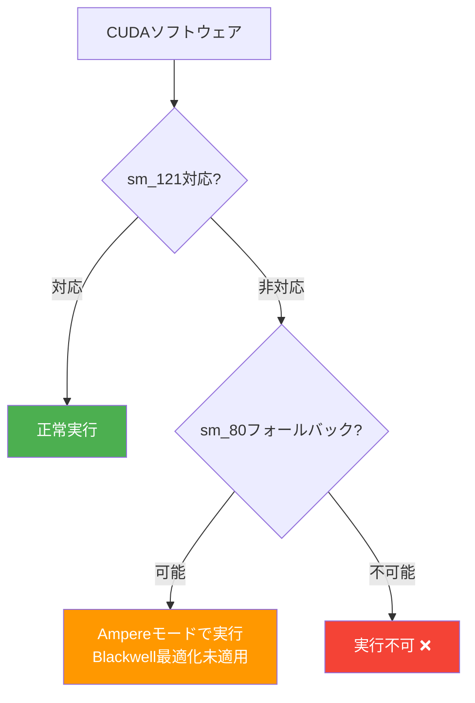

## 概要

NVIDIA DGX Sparkは「3,000ドルの個人向けAIスーパーコンピュータ」として2025年のCESで発表されました。128GB統合メモリとBlackwellアーキテクチャを搭載したデスクトップ級AIワークステーションというポジショニングでした。しかし、実際のユーザーからの報告は、マーケティングとかなり異なる現実を示しています。

Redditのr/LocalLLaMAコミュニティで、あるユーザーがDGX Sparkを1週間使用した後に返品を決めたという投稿が大きな反響を呼びました。核心的な問題は<strong>CUDAソフトウェア互換性</strong>でした。

## sm121：データセンターでもゲーミングでもない特殊アーキテクチャ

DGX Sparkの最大の問題点はGPUアーキテクチャにあります。

| 区分 | アーキテクチャ | SMバージョン | 特徴 |
|------|---------------|-------------|------|
| データセンターBlackwell | GB200/B200 | sm_100 | tcgen05テンソルコア、フルBlackwell |
| ゲーミングBlackwell | RTX 5090等 | sm_120 | ゲーミング最適化 |
| <strong>DGX Spark</strong> | <strong>GB10</strong> | <strong>sm_121</strong> | <strong>独自アーキテクチャ、RTコア搭載</strong> |
| Ampere | A100等 | sm_80 | 6年前のアーキテクチャ |

DGX Sparkはデータセンター用Blackwell（sm_100）でも、ゲーミング用Blackwell（sm_120）でもない、<strong>sm_121という独自のアーキテクチャ</strong>を使用しています。これにより多くのCUDAソフトウェアが動作しないか、sm_80（Ampere）フォールバックコードパスで実行されます。

## ハンドヘルドゲーミングチップ流用疑惑

NVIDIA公式フォーラムで担当者が残した回答が疑惑をさらに深めました：

> sm80-class kernels can execute on DGX Spark because Tensor Core behavior is very similar, particularly for GEMM/MMAs (closer to the GeForce Ampere-style MMA model). DGX Spark not has tcgen05 like jetson Thor or GB200, due die space with RT Cores and DLSS algorithm

この回答から明らかになった重要な事実を整理すると：

1. <strong>テンソルコアがBlackwell級ではない</strong>：tcgen05（Blackwellの第5世代テンソルコア）がなく、AmpereスタイルのMMAモデルに近い
2. <strong>RTコアとDLSSアルゴリズムがダイスペースを占有</strong>：AI開発キットにゲーミング機能がなぜ必要なのか疑問
3. <strong>Jetson ThorやGB200とは異なる設計</strong>：同じBlackwellという名前を使いながら内部は完全に異なる

これらの事実は、DGX SparkのGPUが元々<strong>ゲーミングハンドヘルドデバイス用に設計されたチップ</strong>をAIワークステーションに転用した可能性を示唆しています。統合メモリをサポートするゲーミングGPUという点がこの仮説を裏付けています。

## CUDAソフトウェア互換性の実態

実際に報告されている互換性の問題：

- <strong>Triton</strong>：sm_80コードパスにフォールバックするパッチが適用（[GitHub Issue #8335](https://github.com/triton-lang/triton/issues/8335)）
- <strong>多数のCUDAライブラリ</strong>：sm_121を認識できずビルド失敗またはランタイムエラーが発生
- <strong>Blackwell最適化機能</strong>：FP4/FP6量子化などBlackwell専用機能が使用不可

さらに問題なのは、NVIDIAフォーラムの担当者が<strong>存在しないソフトウェアバージョンやリリース</strong>を引用して問題が解決済みだと回答した点です。これはLLMハルシネーションの疑いがあり、NVIDIAのカスタマーサポートの品質に対する懸念も提起されています。

## ハードウェア品質の問題

ソフトウェア互換性以外にも基本的なハードウェアの問題が報告されています：

- <strong>HDMIディスプレイ出力の不具合</strong>：1080p 144Hzモニターで出力できない事例が多数
- <strong>ServeTheHomeなどの専門レビュアー</strong>も同様のディスプレイ問題を確認
- 「out of the box」体験を標榜しながら基本的なディスプレイ接続に問題があるのは深刻な品質問題

## 消費者への教訓

DGX Sparkのケースから得られる教訓は明確です：

1. <strong>マーケティング名称に騙されないこと</strong>：「Blackwell」という名前が付いていてもデータセンターBlackwellとは完全に異なる製品
2. <strong>SMバージョンを確認すること</strong>：GPUの実際のコンピューティング能力はSMアーキテクチャバージョンで決まる
3. <strong>ソフトウェアエコシステムの確認は必須</strong>：ハードウェアスペックより実際に使いたいソフトウェアが動作するかが重要
4. <strong>初期ユーザーレビューを待つこと</strong>：特に新しいカテゴリの製品は実使用レビューを確認してから購入判断

## Apple Siliconとの比較

同じ統合メモリアーキテクチャを使用するApple Silicon（M4 Ultra等）との比較も意味があります：

| 項目 | DGX Spark | Mac Studio（M4 Ultra） |
|------|-----------|----------------------|
| メモリ | 128GB統合 | 最大512GB統合 |
| メモリ帯域幅 | 〜273GB/s | 〜819GB/s |
| CUDA対応 | sm_121（制限的） | 非対応（Metal使用） |
| ソフトウェア互換性 | 部分的 | MLXエコシステム成熟 |
| 価格 | 〜$3,000 | 〜$4,000〜 |

Apple SiliconはCUDAをサポートしていませんが、MLXフレームワークのエコシステムが急速に成熟しており、ローカルLLM推論ではむしろ安定した体験を提供しています。

## 結論

DGX Sparkは「CUDAエコシステムの力を個人デスクトップで」という魅力的な約束をしましたが、現実は<strong>6年前のAmpereレベルのCUDA互換性</strong>と<strong>ゲーミングチップベースの限定的なAI性能</strong>というギャップが存在します。

消費者向けAIハードウェア市場はまだ初期段階です。NVIDIAがsm_121に対する完全なソフトウェアサポートを提供するまで、DGX Sparkの購入は慎重に判断すべきです。「AIワークステーション」というラベルにプレミアムを支払う前に、実際にどのようなワークロードを実行できるのか必ず確認してください。

## 参考資料

- [Reddit r/LocalLLaMA - PSA: NVIDIA DGX Spark has terrible CUDA software](https://www.reddit.com/r/LocalLLaMA/comments/1r569eb/psa_nvidia_dgx_spark_has_terrible_cuda_software/)
- [Triton Issue #8335 - sm_121互換性パッチ](https://github.com/triton-lang/triton/issues/8335)
- [NVIDIA Developer Forum - DGX Spark sm121 Support Discussion](https://forums.developer.nvidia.com/t/dgx-spark-sm121-software-support-is-severely-lacking-official-roadmap-needed/357663)
