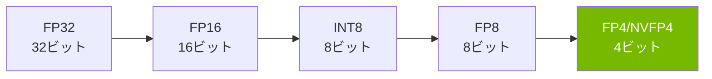
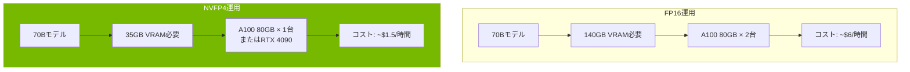
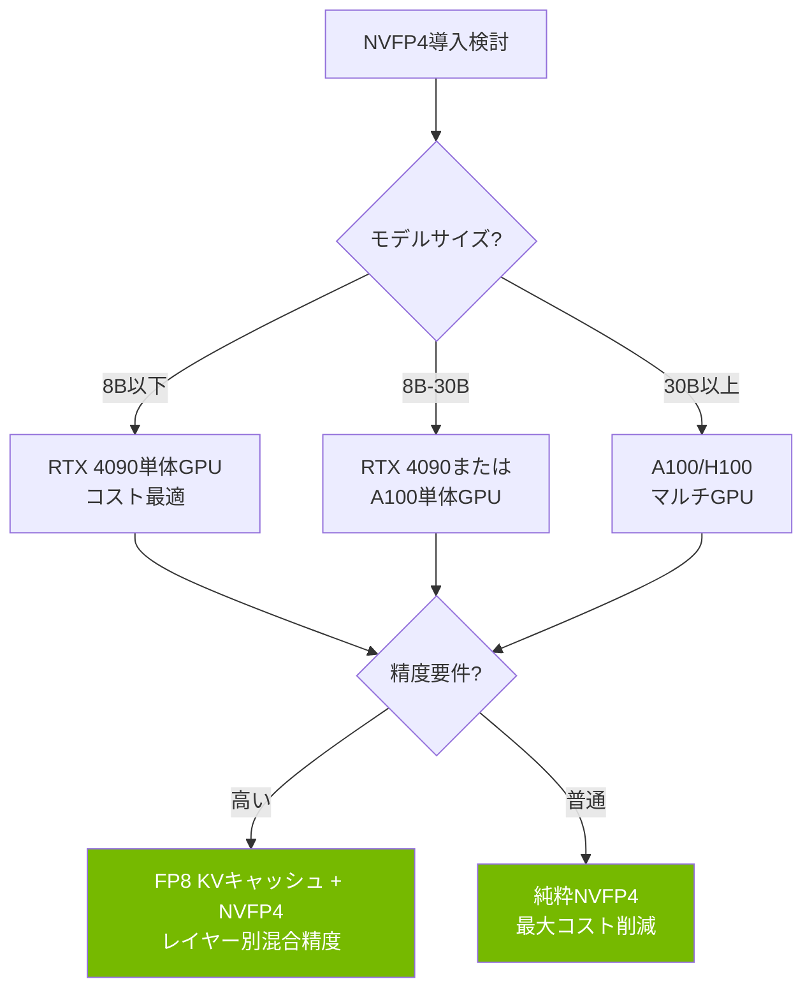

## 概要

LLM推論コストが企業のAI導入における最大のボトルネックとなっています。GPUメモリ使用量、電力消費、そしてハードウェア投資コストまで — モデルが大きくなるほどコストは指数関数的に増加します。NVIDIAが発表した<strong>NVFP4（4ビット浮動小数点）</strong>量子化フォーマットは、この構造を根本的に変える可能性を持つ技術です。

FP32（32ビット）からFP4（4ビット）への移行は、単純計算でも<strong>8倍のメモリ削減</strong>を意味し、実際のベンチマークでも精度損失を最小限に抑えながらこの数値に近い結果が出ています。

本記事では、NVFP4の技術的原理、実際の性能データ、そしてLLM運用コスト構造への影響を分析します。

## FP4量子化とは何か

### ビット数削減の歴史

LLM量子化の流れを時系列で整理すると以下のようになります：



各段階でモデルの重みを表現するビット数が減少し、メモリ使用量と演算コストが削減されます。核心は<strong>精度をどれだけ維持できるか</strong>です。

### NVFP4の構造

NVFP4はNVIDIAがBlackwellアーキテクチャからハードウェアレベルでサポートする4ビット浮動小数点フォーマットです。一般的なINT4とは異なり、<strong>浮動小数点表現</strong>を使用してダイナミックレンジをより広く維持します。

| フォーマット | ビット数 | FP32比メモリ | ダイナミックレンジ | ハードウェアサポート |
|------------|---------|------------|----------------|-----------------|
| FP32 | 32 | 1x | 非常に広い | 全GPU |
| FP16 | 16 | 2x | 広い | ほとんど |
| FP8 | 8 | 4x | 普通 | Ada/Blackwell |
| NVFP4 | 4 | 8x | 普通 | Blackwell/Ada* |

*Ada Lovelace（RTX 4090など）ではコミュニティプロジェクトを通じてサポート

### Microscaling（MX）フォーマット

NVFP4の核心的なイノベーションの一つが<strong>Microscaling</strong>技術です。重みを小さなブロック単位に分割し、各ブロックごとに個別のスケーリングファクターを適用する方式です。

```
ブロックサイズ: 32要素
各ブロック = [4ビット重み × 32] + [8ビットスケールファクター × 1]

実効ビット = 4 + (8/32) = 4.25ビット/要素
```

この方式により、極端なビット削減でも各ブロックの値分布を精密に補正でき、INT4と比較してはるかに優れた精度を達成します。

## 実践ベンチマーク：AdaLLMプロジェクト

Reddit r/LocalLLaMAコミュニティで話題となった<strong>AdaLLM</strong>プロジェクトは、NVFP4をRTX 4090（Ada Lovelace）で実際に動作させた結果を公開しました。

### Qwen3-8B NVFP4の性能

| バッチサイズ | 総トークン | 所要時間（秒） | スループット（tok/s） | VRAM（GB） |
|-----------|----------|-------------|-------------------|----------|
| 1 | 128 | 3.39 | 37.79 | 7.55 |
| 4 | 512 | 3.44 | 148.87 | 7.55 |
| 8 | 1024 | 3.45 | 297.16 | 7.56 |
| 16 | 2048 | 4.36 | 469.34 | 7.56 |

### Gemma3-27B NVFP4の性能

| バッチサイズ | 総トークン | 所要時間（秒） | スループット（tok/s） | VRAM（GB） |
|-----------|----------|-------------|-------------------|----------|
| 1 | 128 | 9.40 | 13.62 | 19.83 |
| 4 | 512 | 9.53 | 53.70 | 19.84 |

<strong>主な結果</strong>：
- Qwen3-8B：FP16比でVRAM 2.4倍削減、スループット損失約20-25%
- Gemma3-27B（27Bパラメータ）：RTX 4090単体GPUに搭載可能
- メモリではなく<strong>演算効率</strong>でのスループット損失のため、バッチサイズが大きくなるほどコスト効率は改善

## コスト構造の変化分析

### GPUメモリ削減効果

FP4量子化が実際の運用コストに与える影響をシナリオ別に分析します。



### コスト比較シミュレーション

70Bパラメータモデル基準の月間運用コストを推定すると：

| 項目 | FP16 | NVFP4 | 削減率 |
|------|------|-------|-------|
| GPU数 | 2× A100 | 1× A100 | 50% |
| 時間単価 | ~$6.00 | ~$1.50 | 75% |
| 月間コスト（24/7） | ~$4,320 | ~$1,080 | 75% |
| 消費電力 | ~600W | ~300W | 50% |

FP32基準と比較するとメモリ面で8倍の削減が可能であり、FP16基準でも4倍に近いコスト削減を達成します。

## 精度維持の秘訣

### MXFP4 vs 従来のINT4

「Bridging the Gap Between Promise and Performance for Microscaling FP4 Quantization」論文（2025年）では、MXFP4/NVFP4フォーマットの精度維持メカニズムを詳細に分析しています。

主要な技法：

1. <strong>Microscaling補正</strong>：32要素ごとに独立したスケールファクターを適用し、値分布の歪みを最小化
2. <strong>FP8 KVキャッシュ</strong>：Key-ValueキャッシュにはFP8を使用してアテンション計算の精度を維持
3. <strong>レイヤー別適応的量子化</strong>：感度の高いレイヤーは高精度を維持し、感度の低いレイヤーにはより積極的な量子化を適用
4. <strong>キャリブレーションデータ基盤の最適化</strong>：実際の入力データ分布を反映して量子化パラメータを調整

### 品質検証結果

コミュニティベンチマークでNVFP4モデルは以下のような性能を示しています：

- <strong>Perplexity増加</strong>：FP16比で1-3%以内
- <strong>ダウンストリームタスク</strong>：MMLU、HellaSwagなどで1-2%以内の性能差
- <strong>コーディングベンチマーク</strong>：HumanEvalで実用的なレベルの性能を維持

## 実践適用ガイド

### AdaLLMでNVFP4モデルを実行する

```bash
# インストール
pip install git+https://github.com/BenChaliah/NVFP4-on-4090-vLLM.git

# Qwen3-8B NVFP4モデルのサービング
adallm serve nvidia/Qwen3-8B-NVFP4

# FP8 GEMMパスの有効化（オプション）
export NVFP4_FP8=1
adallm serve nvidia/Qwen3-8B-NVFP4
```

### サポートモデル

現在AdaLLMでサポートされているNVFP4モデル：

- <strong>nvidia/Qwen3-8B-NVFP4</strong>：8Bパラメータ、RTX 4090で7.5GB VRAM
- <strong>Gemma3-27B-it-NVFP4</strong>：27Bパラメータ、RTX 4090で19.8GB VRAM
- <strong>Qwen3 MoEバリアント</strong>：サポートされていますが最適化はまだ進行中

### プロダクション導入時の考慮事項



## 今後の展望

### Blackwellアーキテクチャのネイティブ FP4サポート

NVIDIAのBlackwell GPU（B100、B200）はFP4を<strong>ハードウェアレベルでネイティブサポート</strong>します。現在のAda Lovelaceでのソフトウェアベースの実装とは異なり、Blackwellでは：

- 専用FP4テンソルコアによる追加パフォーマンス向上
- スループット損失のないFP4演算
- より大きなモデルの単体GPU搭載が可能

### 産業的インパクト

FP4量子化の普及は以下のような変化をもたらすでしょう：

1. <strong>LLMサービス価格の低下</strong>：APIベースLLMサービスの価格が現在の1/4〜1/8レベルに低下する可能性
2. <strong>エッジデバイスへのデプロイ</strong>：70Bモデルがコンシューマ向けGPUで動作可能になり、オンプレミスLLM導入が加速
3. <strong>スタートアップの参入障壁低下</strong>：高性能LLM運用に必要な初期投資コストが大幅に減少
4. <strong>環境への影響</strong>：GPU消費電力の削減によるAI産業のカーボンフットプリント縮小

## 結論

NVIDIAのNVFP4量子化技術は、LLM推論コスト構造を根本的に変える可能性を持つ技術です。FP32比で8倍、FP16比で4倍のメモリ削減を達成しながらも実用的なレベルの精度を維持するという点で、これは単なる最適化ではなく<strong>パラダイムシフト</strong>です。

特にAdaLLMのようなコミュニティプロジェクトがRTX 4090でもNVFP4を実用的に動作させられることを証明したことは、この技術がデータセンターだけでなく個人開発者や小規模チームにも実質的な価値を提供できることを示しています。

2026年以降のBlackwellアーキテクチャの普及とともに、FP4量子化はLLM運用の新たな標準になる可能性が高いでしょう。

## 参考資料

- [AdaLLM: NVFP4-first inference on RTX 4090](https://github.com/BenChaliah/NVFP4-on-4090-vLLM) — GitHub
- [Bridging the Gap Between Promise and Performance for Microscaling FP4 Quantization](https://arxiv.org/abs/2509.17880) — arXiv
- [Reddit r/LocalLLaMA コミュニティの議論](https://www.reddit.com/r/LocalLLaMA/) — ベンチマークとユーザーフィードバック
- [NVIDIA Blackwell Architecture](https://www.nvidia.com/en-us/data-center/technologies/blackwell-architecture/) — 公式ドキュメント
