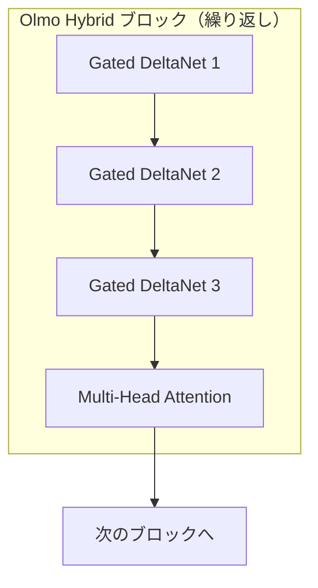

## なぜハイブリッドアーキテクチャなのか

2026年3月、AI2（Allen Institute for AI）がOlmo Hybridを公開しました。7Bパラメータ規模のこのモデルは、TransformerのAttentionレイヤーとリニアRNN（Gated DeltaNet）レイヤーを組み合わせたハイブリッドアーキテクチャを採用しています。

核心的な成果は明確です：<strong>MMLUにおいてOlmo 3と同等の精度を49%少ないトークンで達成</strong>。これは事実上、2倍のデータ効率を意味します。

本記事では、Olmo Hybridのアーキテクチャ設計、ベンチマーク結果、理論的背景、そしてEM/CTO視点での実務への示唆を分析します。

## アーキテクチャ：3:1 DeltaNet-Attentionパターン

Olmo Hybridの核心は3:1パターンです。ネットワーク全体で3つのGated DeltaNetサブレイヤーの後に1つのMulti-Head Attentionサブレイヤーが繰り返されます。

- <strong>Gated DeltaNet（75%）</strong>：状態追跡（ステートトラッキング）に特化。線形計算量です。
- <strong>Multi-Head Attention（25%）</strong>：精密な情報検索（プリサイスリコール）に特化しています。

## ベンチマーク：数値で見る効率性

### データ効率

| ベンチマーク | Olmo 3比トークン削減率 | 意味 |
|---------|----------------------|------|
| MMLU | 49%削減 | 約2倍のデータ効率 |
| Common Crawl評価 | 35%削減 | 一般テキストでも効率的 |

### 長文コンテキスト処理

| 評価 | Olmo Hybrid（DRoPE） | Olmo 3 |
|------|---------------------|--------|
| RULER 64Kトークン | 85.0 | 70.9 |

### 学習スループット
学習速度での損失はありません。効率向上はアーキテクチャ自体から生まれます。

## 学習インフラと規模

- 7Bパラメータ、6兆トークンで事前学習
- 512 GPU（NVIDIA H100 → HGX B200へマイグレーション）
- B200ベースの学習における最初の事例の一つです

## 理論的背景：ハイブリッドがより強い理由

### 表現力（Expressivity）の分析
- ハイブリッドモデルはTransformer単体よりも表現力が豊かです
- 2つのアーキテクチャの強みが組み合わさり、合計以上の効果を発揮します

### スケーリング則
規模が大きくなるほど効率の利得が増加します：

| パラメータ規模 | トークン削減倍率 |
|-------------|-------------|
| 1B | 〜1.3倍 |
| 7B | 〜1.5倍 |
| 70B（予測） | 〜1.9倍 |

## 完全オープンリリース
Base、SFT、DPOの各段階別モデル、すべての重み、中間チェックポイント、全学習コード、技術レポートが公開されています。

## EM/CTO視点での示唆

1. <strong>同じ予算でより高性能なモデルの学習が可能</strong>
2. <strong>64Kトークンでの性能向上</strong> → 長文コンテキスト活用の拡大
3. <strong>学習コスト50%削減の可能性</strong>
4. <strong>オープンソースエコシステムの成熟</strong>

## 今後の展望
1. Pure Transformerの時代は終わりつつあります
2. スケーリング則がハイブリッドに有利です
3. オープンソースモデルの競争力が強化されています

## 参考資料
- [AI2公式ブログ](https://allenai.org/blog/olmohybrid)
- [技術レポート](https://allenai.org/papers/olmo-hybrid)
- [Hugging Faceモデル](https://huggingface.co/allenai/Olmo-Hybrid-7B)
- [Lambda学習事例](https://lambda.ai/blog/open-model-open-metrics-how-lambda-and-the-olmo-team-trained-olmo-hybrid)
