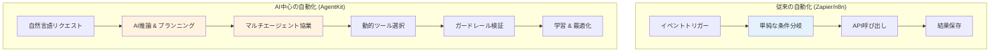
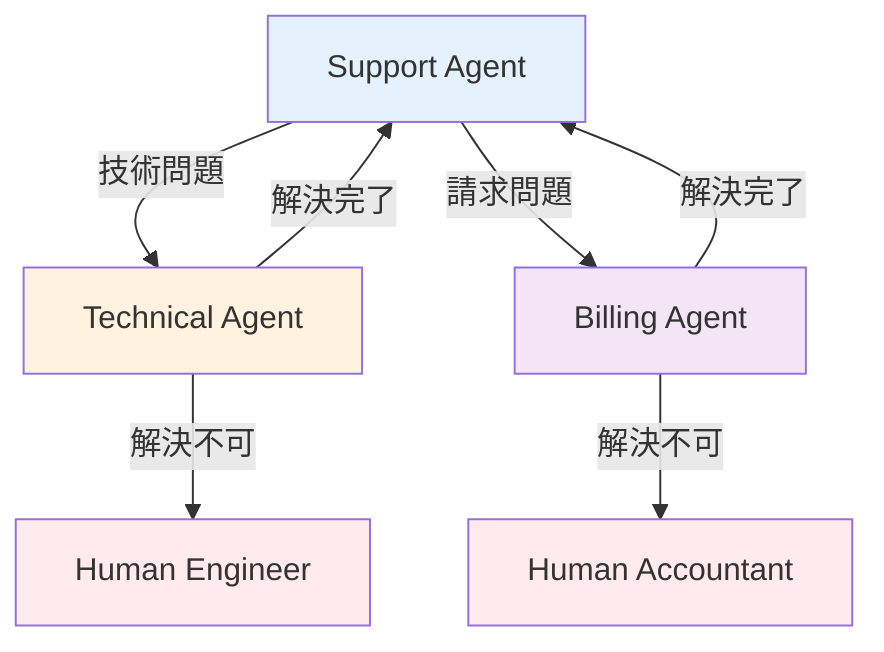

> <strong>シリーズ: OpenAI AgentKit マスター</strong> (1/2)
>
> 1. <strong>OpenAI AgentKit 完全ガイド第 1 部：コアコンセプトとはじめ方</strong> ← 現在の記事
> 2. [OpenAI AgentKit 完全ガイド第 2 部：実践適用と高度なパターン](/ja/blog/ja/openai-agentkit-tutorial-part2)

# OpenAI AgentKit 完全ガイド第 1 部：コアコンセプトとはじめ方

2025 年 10 月 6 日、サンフランシスコで開催された OpenAI DevDay で、Sam Altman は開発者エコシステムを完全に変える発表を行いました。それが<strong>AgentKit</strong>です。

「プロトタイプからプロダクションまで、はるかに少ない摩擦でエージェントを構築、デプロイ、最適化するために必要なすべて」という Sam Altman の言葉通り、AgentKit は単なる API アップデートではありません。これは<strong>AI がワークフローの中心に立つ新しいパラダイム</strong>です。

この記事では、AgentKit のコアコンセプトを理解し、最初の AI エージェントを実際に作成する完全なチュートリアルを提供します。

## 要点まとめ (TL;DR)

- 🎯 <strong>AgentKit = AI ワークフロープラットフォーム</strong>: Zapier/n8n と競合するが、AI 推論がコア
- 🧩 <strong>4 つのコアコンポーネント</strong>: Agent Builder (ビジュアル), ChatKit (UI), Connector Registry (ツール), Evals (パフォーマンス)
- 🐍 <strong>Python SDK 提供</strong>: `openai-agents`パッケージでコードファースト開発可能
- 🔌 <strong>MCP ネイティブサポート</strong>: "AI アプリの USB-C"でツール統合を標準化
- 📊 <strong>ベータ段階</strong>: Agent Builder は現在ベータ、2025 年 11 月 1 日から課金開始
- 💡 <strong>いつ使う?</strong>: AI 中心のワークフロー、マルチエージェント協業、複雑な意思決定の自動化

## AgentKit とは何か?

### OpenAI の戦略的転換

OpenAI はもはや「API プロバイダー」ではありません。AgentKit を通じて<strong>プラットフォーム企業</strong>へと進化しています。

既存のワークフロー自動化ツール（Zapier、n8n、Make）が<strong>「API を接続すること」</strong>に焦点を当てていたのに対し、AgentKit は<strong>「AI が推論しながら調整するワークフロー」</strong>を作ります。



<strong>コアな違い</strong>:

- 従来のツール: 事前定義された<strong>ルールベースフロー</strong>
- AgentKit: AI が<strong>状況を理解して決定</strong>するエージェンティックフロー

### 4 つのコアコンポーネント

AgentKit は 4 つの統合システムで構成されています：

#### 1️⃣ Agent Builder (ベータ)

<strong>"AI ワークフローの Figma"</strong>

- ドラッグ&ドロップビジュアルキャンバス
- ノーコード/ローコードマルチエージェントシステム設計
- インラインプレビュー&テスト
- バージョン管理内蔵
- 付箋でチーム協業サポート

<strong>いつ使う?</strong>:

- 非開発者と協業する時
- 複雑なワークフローを可視化する時
- 迅速なプロトタイピングが必要な時

#### 2️⃣ ChatKit

<strong>"埋め込み可能な ChatGPT UI"</strong>

- アプリにすぐに組み込めるチャットインターフェース
- ファイルアップロード対応（月 1GB 無料）
- Agent Builder ワークフローと統合
- ホワイトラベルカスタマイズ

<strong>いつ使う?</strong>:

- SaaS に AI チャット機能を追加
- カスタマーサポートボットを構築
- 内部ツールに AI インターフェースを追加

#### 3️⃣ Connector Registry

<strong>"エージェントのためのツールボックス"</strong>

- 中央集権的ツールおよびデータ管理
- MCP（Model Context Protocol）サーバーサポート
- 管理者権限制御
- セキュアなツール統合

<strong>いつ使う?</strong>:

- エンタープライズ環境でツールアクセス制御
- MCP サーバーでカスタムツール追加
- 外部 API を安全に接続

#### 4️⃣ Evals (評価システム)

<strong>"エージェントパフォーマンスダッシュボード"</strong>

- トレースグレーディング（実行ログ評価）
- データセット管理
- 自動プロンプト最適化
- リアルタイムデバッグ

<strong>いつ使う?</strong>:

- エージェントパフォーマンス測定
- プロンプト A/B テスト
- プロダクションモニタリング
- コスト最適化

## コアコンセプト: Agents, Handoffs, Guardrails

AgentKit の哲学を理解するには、3 つのコア原則を知る必要があります：

### 1. Agents (エージェント)

<strong>定義</strong>: 特定の役割とツールを持つ LLM

```python
from agents import Agent

agent = Agent(
    name="Customer Support Agent",
    instructions="""
    あなたはSaaS企業のカスタマーサポートスペシャリストです。
    あなたの役割:
    - 製品の質問に答える
    - 技術的な問題をトラブルシューティング
    - 必要に応じて人間にエスカレーション
    """,
    tools=[search_knowledge_base, create_ticket]
)
```

<strong>コア</strong>: エージェントは単なるプロンプトではありません。彼らは<strong>役割、ツール、制約</strong>を持つ自律的なアクターです。

### 2. Handoffs (ハンドオフ)

<strong>定義</strong>: エージェント間のタスク委任

```python
from agents import Agent

support_agent = Agent(
    name="Support Agent",
    instructions="基本的な問い合わせに対応",
    handoffs=["Technical Agent", "Billing Agent"]
)

technical_agent = Agent(
    name="Technical Agent",
    instructions="技術的な問題を解決",
    handoffs=["Support Agent"]  # 戻ることも可能
)
```

<strong>使用パターン</strong>:

- <strong>階層的委任</strong>: マネージャー → スペシャリスト
- <strong>ピア協業</strong>: エージェント同士の協力
- <strong>エスカレーション</strong>: AI → 人間



### 3. Guardrails (ガードレール)

<strong>定義</strong>: 入出力検証および安全装置

```python
from agents import Agent, guardrails

agent = Agent(
    name="Content Generator",
    instructions="マーケティングコンテンツを生成",
    input_guardrails=[
        guardrails.no_pii,           # 個人情報ブロック
        guardrails.content_filter    # 有害コンテンツフィルター
    ],
    output_guardrails=[
        guardrails.brand_voice_check, # ブランドトーン検証
        guardrails.factual_accuracy   # 事実確認
    ]
)
```

<strong>なぜ重要?</strong>:

- プロダクション環境での<strong>安全性保証</strong>
- <strong>コスト暴走防止</strong>（無限ループ、不要な API 呼び出し）
- <strong>ブランド保護</strong>（不適切な応答をブロック）
- <strong>コンプライアンス</strong>（規制遵守）

## 最初のエージェントを作る: ステップバイステップチュートリアル

### 事前準備

#### 1. OpenAI アカウントと API キー

```bash
# 1. https://platform.openai.com でサインアップ
# 2. API Keysメニューでキー生成
# 3. 環境変数として設定
export OPENAI_API_KEY=sk-proj-...
```

#### 2. Python SDK インストール

```bash
# Python 3.8以上が必要
pip install openai-agents
```

#### 3. インストール確認

```python
from agents import Agent, Runner

print("✓ OpenAI Agents SDKインストール完了")
```

### チュートリアル 1: シンプルな天気エージェント

<strong>目標</strong>: 都市名を受け取り天気情報を提供するエージェント

#### Step 1: ツール定義

```python
from agents.tools import function_tool

@function_tool
def get_weather(location: str) -> str:
    """
    指定された場所の現在の天気情報を取得します。

    Args:
        location: 都市名（例：「東京」「ソウル」）

    Returns:
        温度を含む天気の説明
    """
    # 実際にはAPI呼び出し（例：OpenWeatherMap）
    # ここではシミュレーション
    weather_data = {
        "東京": "曇り、18°C",
        "ソウル": "晴れ、22°C",
        "ニューヨーク": "雨、15°C"
    }

    return weather_data.get(
        location,
        f"{location}の天気情報が見つかりません"
    )
```

<strong>コア</strong>: `@function_tool`デコレーターが関数をエージェントが使用できるツールに変換します。Docstring がエージェントにツールの使い方を教えます。

#### Step 2: エージェント作成

```python
from agents import Agent

weather_agent = Agent(
    name="Weather Assistant",
    instructions="""
    あなたは親切な天気アシスタントです。
    ユーザーが天気について尋ねたら、get_weatherツールを使用してください。
    フレンドリーで会話的な応答を提供してください。
    都市が見つからない場合は、近くの代替案を提案してください。
    """,
    tools=[get_weather]
)
```

#### Step 3: エージェント実行

```python
from agents import Runner

# 同期実行
result = Runner.run_sync(
    weather_agent,
    "東京の天気はどう?"
)

print(result.final_output)
# 出力: "東京の現在の天気は曇りで、気温は18°Cです!"
```

<strong>非同期実行</strong>（プロダクション環境）:

```python
import asyncio

async def main():
    result = await Runner.run(
        weather_agent,
        "What's the weather in Seoul?"
    )
    print(result.final_output)

asyncio.run(main())
```

### チュートリアル 2: マルチエージェントカスタマーサポートシステム

<strong>目標</strong>: 質問を分類し、適切な専門エージェントにルーティング

#### Step 1: 専門エージェントの定義

```python
from agents import Agent

# テクニカルサポートエージェント
technical_agent = Agent(
    name="Technical Support",
    instructions="""
    あなたはテクニカルサポートスペシャリストです。
    以下をサポートします:
    - ログイン問題
    - APIエラー
    - パフォーマンス問題

    問題が緊急の場合は、Human Engineerにハンドオフします。
    """,
    handoffs=["Triage Agent"]  # 戻ることも可能
)

# 請求サポートエージェント
billing_agent = Agent(
    name="Billing Support",
    instructions="""
    あなたは請求スペシャリストです。
    以下をサポートします:
    - 支払い問題
    - サブスクリプション変更
    - 返金リクエスト

    請求について話す前に、常にユーザーIDを確認してください。
    """,
    handoffs=["Triage Agent"]
)

# 製品情報エージェント
product_agent = Agent(
    name="Product Expert",
    instructions="""
    あなたは製品エキスパートです。
    以下の質問に答えます:
    - 機能と能力
    - ベストプラクティス
    - ユースケースと例

    詳細で教育的な応答を提供してください。
    """,
    handoffs=["Triage Agent"]
)
```

#### Step 2: トリアージ（分類）エージェント

```python
triage_agent = Agent(
    name="Triage Agent",
    instructions="""
    あなたはカスタマーサポートの最初の窓口です。

    あなたの仕事:
    1. ユーザーを温かく迎える
    2. 問題を理解する
    3. 適切なスペシャリストにルーティング:
       - Technical Support: ログイン、エラー、バグ
       - Billing Support: 支払い、サブスクリプション
       - Product Expert: 機能、ハウツー質問

    不明な場合は、明確化のための質問をしてください。
    """,
    handoffs=["Technical Support", "Billing Support", "Product Expert"]
)
```

#### Step 3: 実行とテスト

```python
# テスト1: 技術問題
result = Runner.run_sync(
    triage_agent,
    "APIを呼び出すときに401エラーが出ます"
)
print(result.final_output)
# → Technical Supportエージェントにハンドオフ

# テスト2: 請求問題
result = Runner.run_sync(
    triage_agent,
    "今月2回請求されました"
)
print(result.final_output)
# → Billing Supportエージェントにハンドオフ

# テスト3: 製品質問
result = Runner.run_sync(
    triage_agent,
    "Webhookを統合する方法は?"
)
print(result.final_output)
# → Product Expertエージェントにハンドオフ
```

#### Step 4: セッションで会話履歴を管理

```python
from agents import Runner, Session

# 新しいセッション開始
session = Session()

# 複数ターンの会話
turns = [
    "アカウントのヘルプが必要です",
    "ログインできません",
    "パスワードが無効と表示されます",
    "はい、リセットを試みました"
]

for user_message in turns:
    result = Runner.run_sync(
        triage_agent,
        user_message,
        session=session  # セッション渡しで履歴を保持
    )
    print(f"User: {user_message}")
    print(f"Agent: {result.final_output}\n")
```

<strong>セッションの重要性</strong>:

- 会話コンテキストの保持（以前の質問を記憶）
- ハンドオフ後も履歴を保存
- プロダクションではデータベースにセッションを保存

## Agent Builder: ビジュアル開発

コードが負担なら? Agent Builder のビジュアルキャンバスを使いましょう。

### Agent Builder アクセス

1. https://platform.openai.com/agent-builder にアクセス
2. OpenAI アカウントでログイン
3. "New Agent"をクリック

### キャンバス UI 構成

```
┌────────────────────────────────────────────────┐
│  [New] [Save] [Deploy] [Preview]               │  ← ツールバー
├────────────────────────────────────────────────┤
│                                                │
│   ┌─────┐      ┌─────┐      ┌─────┐          │
│   │Agent│─────▶│Tool │─────▶│Agent│          │  ← ノードベースワークフロー
│   │  A  │      │  X  │      │  B  │          │
│   └─────┘      └─────┘      └─────┘          │
│      │                          │             │
│      └──────┬──────────────────┘             │
│             ▼                                 │
│         ┌─────┐                               │
│         │Guard│                               │  ← ガードレール
│         │rail │                               │
│         └─────┘                               │
│                                                │
│  [Properties Panel] ─────────────────────────▶│  ← 設定パネル
│  Name: Agent A                                │
│  Instructions: [テキスト入力]                   │
│  Tools: [選択]                                 │
│  Handoffs: [選択]                              │
└────────────────────────────────────────────────┘
```

### ビジュアルでマルチエージェントを作成

<strong>シナリオ</strong>: コンテンツ生成ワークフロー

1. <strong>"Agent"ノードをドラッグ</strong> → "Content Planner"

   - Instructions: "トピックに基づいてコンテンツアウトラインを作成"

2. <strong>"Agent"ノードをドラッグ</strong> → "Content Writer"

   - Instructions: "アウトラインからブログ記事を書く"
   - Connect: Planner → Writer

3. <strong>"Agent"ノードをドラッグ</strong> → "SEO Optimizer"

   - Instructions: "SEO 向けにコンテンツを最適化"
   - Connect: Writer → SEO Optimizer

4. <strong>"Guardrail"ノードをドラッグ</strong> → "Quality Check"

   - Type: Output Validation
   - Rules: 最低 500 語、盗作なし
   - Connect: SEO Optimizer → Quality Check

5. <strong>"Preview"をクリック</strong> → テスト実行

6. <strong>"Deploy"をクリック</strong> → プロダクションデプロイ

### ビジュアル vs コード: いつ何を使う?

| 基準                       | Agent Builder (ビジュアル)         | Python SDK (コード)              |
| -------------------------- | ---------------------------------- | -------------------------------- |
| <strong>学習曲線</strong>               | 低い（直感的）                     | 中程度（プログラミング必要）     |
| <strong>柔軟性</strong>                 | 限定的                             | 無制限                           |
| <strong>協業</strong>                   | 優れている（非開発者含む）         | 普通（開発者中心）               |
| <strong>バージョン管理</strong>         | 内蔵 UI                            | Git 統合                         |
| <strong>デバッグ</strong>               | ビジュアルトレース                 | コードレベルデバッグ             |
| <strong>プロダクションデプロイ</strong> | ワンクリック                       | CI/CD パイプライン               |
| <strong>推奨ユースケース</strong>       | プロトタイプ、ビジネスワークフロー | エンタープライズ、複雑なロジック |

<strong>ベストプラクティス</strong>: ビジュアルでプロトタイプ → コードでプロダクション化

## Model Context Protocol (MCP) 統合

### MCP とは?

<strong>"AI アプリのための USB-C"</strong> - ツールとデータソースを標準化された方法で接続

従来の方式:

```
エージェント ─┬─ Custom API 1 (カスタムコード)
              ├─ Custom API 2 (別のカスタムコード)
              └─ Custom API 3 (さらに別の...)
```

MCP 方式:

```
エージェント ─── MCP Protocol ─┬─ MCP Server 1 (標準化)
                                ├─ MCP Server 2 (標準化)
                                └─ MCP Server 3 (標準化)
```

### AgentKit で MCP を使用

#### 1. MCP サーバー追加

```python
from agents import Agent
from agents.mcp import MCPServer

# MCPサーバー接続
notion_server = MCPServer(
    url="http://localhost:3000/mcp/notion",
    capabilities=["read_database", "create_page"]
)

# エージェントにMCPサーバー接続
agent = Agent(
    name="Notion Assistant",
    instructions="ユーザーのNotionデータベース管理を支援",
    mcp_servers=[notion_server]
)
```

#### 2. Connector Registry で管理

```python
from agents import ConnectorRegistry

# 組織のMCPサーバー登録
registry = ConnectorRegistry()

registry.add_server(
    name="Company Notion",
    mcp_url="http://internal.mcp/notion",
    permissions=["read", "write"],
    allowed_teams=["marketing", "product"]
)

# エージェントでレジストリ使用
agent = Agent(
    name="Marketing Agent",
    connector_registry=registry
)
```

<strong>メリット</strong>:

- ツール再利用（複数エージェントで同じ MCP サーバー使用）
- 中央集権的権限管理
- 標準化されたエラーハンドリング

### MCP エコシステム

<strong>主要 MCP サーバー</strong>:

- Notion MCP
- Google Drive MCP
- Slack MCP
- GitHub MCP
- PostgreSQL MCP

<strong>自分で作る</strong>: https://modelcontextprotocol.io/docs

## ガードレールを深く理解する

### なぜガードレールが必須なのか?

<strong>実際のプロダクション事故例</strong>:

- チャットボットが顧客の個人情報を暴露
- 無限ループで$10,000 の API 請求
- ブランドガイドライン違反コンテンツ生成
- 有害コンテンツ生成

<strong>ガードレールの役割</strong>: このような事故を事前に防ぐ

### 入力ガードレール (Input Guardrails)

<strong>ユーザー入力を検証</strong>

```python
from agents import Agent, guardrails

agent = Agent(
    name="Customer Support",
    instructions="...",
    input_guardrails=[
        guardrails.no_pii(          # 個人情報ブロック
            block_email=True,
            block_ssn=True,
            block_credit_card=True
        ),
        guardrails.content_filter(  # 有害コンテンツフィルター
            hate_speech=True,
            harassment=True,
            self_harm=True
        ),
        guardrails.language_check(  # サポート言語確認
            allowed_languages=["ko", "en", "ja"]
        )
    ]
)
```

<strong>動作</strong>:

1. ユーザー入力到着
2. ガードレールを順次実行
3. ブロック時 → エージェントに到達しない
4. 通過時 → エージェント処理

### 出力ガードレール (Output Guardrails)

<strong>エージェント応答を検証</strong>

```python
agent = Agent(
    name="Content Generator",
    instructions="...",
    output_guardrails=[
        guardrails.brand_voice(        # ブランドトーン検証
            tone="professional",
            avoid_words=["cheap", "worst", "scam"]
        ),
        guardrails.fact_check(          # 事実確認
            verify_statistics=True,
            verify_quotes=True
        ),
        guardrails.length_limit(        # 長さ制限
            min_words=100,
            max_words=500
        ),
        guardrails.no_hallucination(    # ハルシネーション防止
            require_citations=True
        )
    ]
)
```

<strong>動作</strong>:

1. エージェント応答生成
2. ガードレールで順次検証
3. 失敗時 → 再生成またはエラー返却
4. 通過時 → ユーザーに送信

### カスタムガードレールを作成

```python
from agents.guardrails import Guardrail

class CustomProfanityFilter(Guardrail):
    def __init__(self, banned_words: list[str]):
        self.banned_words = banned_words

    def validate(self, text: str) -> tuple[bool, str]:
        """
        Returns (is_valid, error_message)
        """
        for word in self.banned_words:
            if word.lower() in text.lower():
                return False, f"禁止語を含む: {word}"
        return True, ""

# 使用
agent = Agent(
    name="Family-Friendly Bot",
    output_guardrails=[
        CustomProfanityFilter(
            banned_words=["不適切語1", "不適切語2", "禁止語"]
        )
    ]
)
```

### ガードレールのベストプラクティス

1. <strong>入力と出力の両方を保護</strong>: 双方向防御
2. <strong>階層的ガードレール</strong>: 高速チェック優先、高コストチェックは後
3. <strong>明確なエラーメッセージ</strong>: ユーザーになぜブロックされたか通知
4. <strong>ロギング</strong>: ガードレールブロック履歴を追跡して改善
5. <strong>テスト</strong>: 悪意のある入力でガードレールをテスト

## セッションと会話履歴管理

### セッションの重要性

エージェントと<strong>複数ターン会話</strong>をする際、以前のコンテキストを記憶する必要があります。

```python
# セッションなし（コンテキストなし）
result1 = Runner.run_sync(agent, "私の名前はJohnです")
result2 = Runner.run_sync(agent, "私の名前は何ですか?")
# 回答: "あなたの名前は分かりません"  ← 以前の会話を記憶できない

# セッション使用（コンテキスト保持）
session = Session()
result1 = Runner.run_sync(agent, "私の名前はJohnです", session=session)
result2 = Runner.run_sync(agent, "私の名前は何ですか?", session=session)
# 回答: "あなたの名前はJohnです"  ← 以前の会話を記憶
```

### セッション永続性 (Persistence)

```python
from agents import Session
import json

# セッション作成と使用
session = Session(user_id="user_123")
result = Runner.run_sync(agent, "こんにちは!", session=session)

# セッションをJSONとして保存
session_data = session.to_dict()
with open("session_user_123.json", "w") as f:
    json.dump(session_data, f)

# 後でセッションを復元
with open("session_user_123.json", "r") as f:
    session_data = json.load(f)

restored_session = Session.from_dict(session_data)
result = Runner.run_sync(agent, "何について話しましたか?", session=restored_session)
```

<strong>プロダクション環境</strong>: Redis や PostgreSQL にセッション保存

```python
import redis

redis_client = redis.Redis(host='localhost', port=6379)

# セッション保存
redis_client.set(
    f"session:{user_id}",
    json.dumps(session.to_dict()),
    ex=3600  # 1時間後に期限切れ
)

# セッションロード
session_data = redis_client.get(f"session:{user_id}")
session = Session.from_dict(json.loads(session_data))
```

## コスト最適化戦略

AgentKit は強力ですが、誤って使用するとコストが急増する可能性があります。

### 1. 適切なモデル選択

```python
# ❌ 非効率: すべてのタスクにGPT-5 Proを使用
expensive_agent = Agent(
    name="Simple Bot",
    model="gpt-5-pro",  # 非常に高価
    instructions="はいかいいえで答えてください"
)

# ✅ 効率: タスクに合ったモデルを選択
cheap_agent = Agent(
    name="Simple Bot",
    model="gpt-realtime-mini",  # 安価で高速
    instructions="はいかいいえで答えてください"
)
```

<strong>モデル選択ガイド</strong>:

- 単純な分類/ルーティング: `gpt-realtime-mini`
- 一般的なタスク: `gpt-4o`
- 複雑な推論: `gpt-5-pro`

### 2. プロンプト最適化

```python
# ❌ 非効率: 長いプロンプト
agent = Agent(
    instructions="""
    あなたは非常に役立つ、フレンドリーで、知識豊富なアシスタントで、
    ユーザーのすべての質問や懸念を喜んで助けます。
    常に詳細で包括的な回答を提供し、あらゆる可能な角度と考慮事項を
    カバーします...
    [500語の不要な指示]
    """
)

# ✅ 効率: 簡潔なプロンプト
agent = Agent(
    instructions="ユーザーの質問に明確かつ簡潔に答えてください。"
)
```

<strong>トークン = コスト</strong>: プロンプトが短いほど安価

### 3. ガードレールで無限ループを防止

```python
from agents import guardrails

agent = Agent(
    name="Research Agent",
    instructions="...",
    output_guardrails=[
        guardrails.max_iterations(5),      # 最大5回反復
        guardrails.max_tool_calls(10),     # 最大10回ツール呼び出し
        guardrails.timeout_seconds(30)     # 30秒制限
    ]
)
```

### 4. キャッシング活用

```python
from agents import Agent, caching

agent = Agent(
    name="Product Expert",
    instructions="...",
    enable_caching=True  # 繰り返し質問をキャッシュ
)

# 最初の呼び出し: 完全コスト
result1 = Runner.run_sync(agent, "AgentKitとは何ですか?")

# 2番目の呼び出し: キャッシュから返却（無料）
result2 = Runner.run_sync(agent, "AgentKitとは何ですか?")
```

### 5. Evals でモニタリング

```python
from agents import Evals

evals = Evals()

# コストアラート設定
evals.set_alert(
    metric="cost_per_day",
    threshold=100.00,  # 1日$100超過時にアラート
    action="email"
)

# 異常パターン検出
evals.monitor(
    agent_name="Customer Support",
    anomaly_detection=True  # 急激なコスト増加を検出
)
```

## プロダクションデプロイチェックリスト

### デプロイ前確認事項

#### ✅ 機能テスト

- [ ] すべてのハンドオフパスをテスト
- [ ] エッジケース処理を確認
- [ ] エラーハンドリングを検証
- [ ] タイムアウトシナリオをテスト

#### ✅ 安全性

- [ ] 入力ガードレール設定
- [ ] 出力ガードレール設定
- [ ] PII 保護を確認
- [ ] コンプライアンスレビュー（GDPR、CCPA など）

#### ✅ パフォーマンス

- [ ] 応答時間測定（<3 秒目標）
- [ ] コスト見積もり（予想トラフィック基準）
- [ ] 同時リクエスト負荷テスト
- [ ] キャッシング戦略策定

#### ✅ モニタリング

- [ ] Evals ダッシュボード設定
- [ ] アラートルール定義
- [ ] ロギングインフラ構築
- [ ] エラートラッキング（Sentry など）

#### ✅ ドキュメンテーション

- [ ] エージェント動作方法を文書化
- [ ] チームメンバーオンボーディングガイド作成
- [ ] API ドキュメント（ChatKit 使用時）
- [ ] 障害対応プレイブック

### デプロイ方法

#### Agent Builder からデプロイ

1. Agent Builder で"Deploy"をクリック
2. デプロイ環境を選択（Staging / Production）
3. バージョンタグを入力（例：`v1.0.0`）
4. "Confirm Deploy"をクリック
5. Webhook URL を受け取る（ChatKit 統合時）

#### Python SDK デプロイ

```python
# deploy.py
from agents import Agent, deploy

agent = Agent(
    name="Production Agent",
    instructions="..."
)

# OpenAIプラットフォームにデプロイ
deployment = deploy(
    agent=agent,
    environment="production",
    version="1.0.0"
)

print(f"Deployed at: {deployment.url}")
```

<strong>CI/CD 統合</strong>:

```yaml
# .github/workflows/deploy.yml
name: Deploy Agent
on:
  push:
    branches: [main]

jobs:
  deploy:
    runs-on: ubuntu-latest
    steps:
      - uses: actions/checkout@v2
      - name: Deploy to OpenAI
        run: |
          pip install openai-agents
          python deploy.py
        env:
          OPENAI_API_KEY: ${{ secrets.OPENAI_API_KEY }}
```

## 実践ユースケース

### ケース 1: カスタマーサポート自動化（Clay）

<strong>結果</strong>: 10 倍成長

<strong>実装</strong>:

```python
support_system = Agent(
    name="Support Triage",
    instructions="顧客問い合わせを分類してルーティング",
    handoffs=[
        "Tier 1 Support",   # 一般的な質問
        "Tier 2 Support",   # 技術的な問題
        "Sales Team",       # 営業問い合わせ
        "Human Agent"       # 複雑なケース
    ]
)
```

<strong>成果</strong>:

- 80%自動解決率
- 平均応答時間 5 分 → 30 秒
- 顧客満足度 15%向上

### ケース 2: コンテンツ生成パイプライン

<strong>実装</strong>:

```python
content_planner = Agent(
    name="Content Planner",
    instructions="SEO最適化されたコンテンツアウトラインを作成"
)

content_writer = Agent(
    name="Writer",
    instructions="アウトラインから魅力的なブログ記事を書く"
)

seo_optimizer = Agent(
    name="SEO Optimizer",
    instructions="検索エンジン向けに最適化"
)

# ワークフロー
result = Runner.run_sync(
    content_planner,
    "AgentKitチュートリアルについてのコンテンツを作成",
    handoff_chain=[content_writer, seo_optimizer]
)
```

<strong>成果</strong>:

- コンテンツ生産速度 5 倍
- SEO スコア平均 85+維持
- ライターの燃え尽き症候群減少

### ケース 3: 研究補助システム

<strong>実装</strong>:

```python
@function_tool
def search_papers(query: str) -> list:
    """学術論文を検索"""
    # arXiv、PubMed API呼び出し
    pass

@function_tool
def extract_key_findings(paper_url: str) -> str:
    """論文から重要な発見を抽出"""
    pass

research_agent = Agent(
    name="Research Assistant",
    instructions="""
    研究者を以下で支援:
    1. 関連論文を検索
    2. 重要な発見を抽出
    3. 情報を統合
    4. 今後の研究方向を提案
    """,
    tools=[search_papers, extract_key_findings]
)
```

<strong>成果</strong>:

- 文献調査時間 70%短縮
- より広範な研究カバレッジ
- 見逃した重要論文を発見

## 次のステップ

これで AgentKit のコアコンセプトを理解し、最初のエージェントを作成しました。

<strong>次回予告</strong>: [OpenAI AgentKit 完全ガイド第 2 部: 実践適用と高度なパターン](/ja/blog/ja/openai-agentkit-tutorial-part2)では:

- 🏗️ <strong>実践アーキテクチャパターン</strong>: エンタープライズグレードのマルチエージェントシステム設計
- 🔧 <strong>高度なツール統合</strong>: MCP サーバーを自分で作る、外部 API 連携
- 📊 <strong>パフォーマンス最適化</strong>: Evals を活用した A/B テストとプロンプト最適化
- 🛡️ <strong>セキュリティとコンプライアンス</strong>: プロダクション環境の安全装置
- 💼 <strong>実際のケーススタディ</strong>: 3 つの業界別完全実装例

## 追加リソース

### 公式ドキュメント

- OpenAI AgentKit 公式ページ: https://openai.com/agent-platform/
- Agents SDK ドキュメント: https://openai.github.io/openai-agents-python/
- MCP プロトコル: https://modelcontextprotocol.io/

### コミュニティ

- OpenAI Developer Forum: https://community.openai.com/
- AgentKit GitHub: https://github.com/openai/openai-agents-python
- Reddit: r/OpenAI

### チュートリアル動画

- OpenAI DevDay 2025 Keynote（YouTube）
- AgentKit Deep Dive（公式チャンネル）

---

<strong>次回お会いしましょう!</strong> 実践事例で一緒に AgentKit をマスターしましょう。

_質問やフィードバックがあれば、コメントで残してください。すべてのご意見に回答します!_
