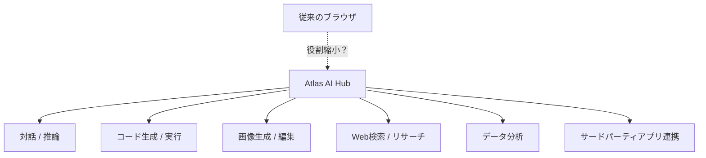
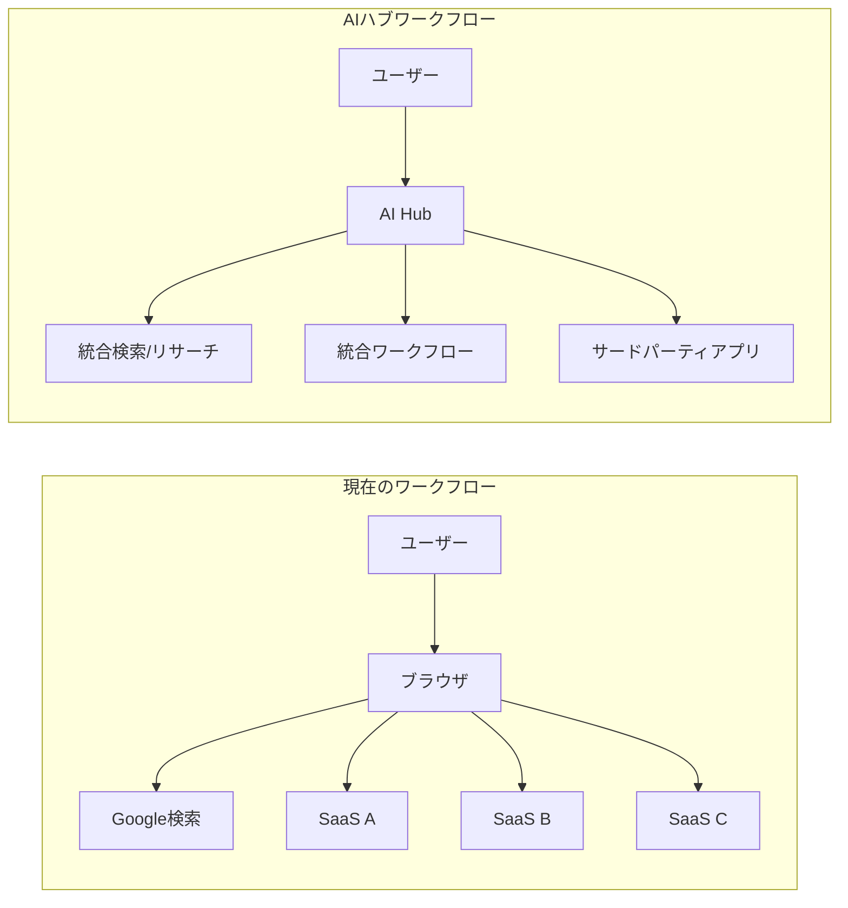

## 概要

OpenAIが<strong>Atlas</strong>というコードネームの統合AIアプリハブを開発中というニュースが伝わり、テック業界で熱い議論が続いています。Dan Shipperをはじめとするアナリストたちが注目する核心的な問いは一つです — <strong>AIネイティブプラットフォームがWebブラウザの役割を根本的に変えるのか？</strong>

本記事ではAtlasのコンセプト、AIアプリハブが登場する背景、そしてブラウザが迎えうる変化を分析します。

## Atlasとは何か？

OpenAIのAtlasは単なるChatGPTの拡張ではありません。これまで分散していたAI機能 — 対話、コード生成、画像生成、データ分析、Web検索 — を<strong>一つの統合プラットフォーム</strong>に束ねることが核心です。

主な特徴を整理すると：

- <strong>マルチモーダル統合</strong>：テキスト、画像、コード、データを一つのインターフェースで処理
- <strong>アプリエコシステム</strong>：GPTsやプラグインを超えた本格的なアプリストア形態
- <strong>コンテキスト継続性</strong>：タスク間でコンテキストが維持される統合ワークフロー
- <strong>エージェントベース</strong>：ユーザーの意図を把握し、適切なツールを自動呼び出し

## なぜ今AIアプリハブなのか？

### 1. ブラウザの限界が露呈している

Webブラウザは1990年代に設計された<strong>ドキュメントビューア</strong>から出発しました。タブ、ブックマーク、拡張機能を追加しながら進化してきましたが、根本的なパラダイムは変わっていません。

| 側面 | ブラウザパラダイム | AIハブパラダイム |
|------|-------------------|------------------|
| インタラクション | URL入力 → ページレンダリング | 意図表現 → 結果生成 |
| 探索方式 | 手動ナビゲーション | 自動情報収集・統合 |
| アプリ連携 | タブ間の手動切替 | 統合ワークフロー |
| データ活用 | サイト別隔離 | クロスアプリコンテキスト共有 |

### 2. AIエージェント時代の到来

2025〜2026年はAIエージェントが本格的に実用化される時期です。ClaudeのComputer Use、OpenAIのOperator、GoogleのMarinerなど、<strong>AIが直接コンピュータを操作する</strong>技術が登場しました。

こうした環境では、ユーザーがブラウザを開いて自分で検索し、複数のサイトを行き来する行為がますます非効率に感じられるようになります。

### 3. スーパーアプリトレンドのAI版

アジアではWeChat、LINE、KakaoTalkなどの<strong>スーパーアプリ</strong>がすでにブラウザの役割を一部代替しています。AtlasはこのスーパーアプリモデルをAIネイティブで再解釈したものと見ることができます。

## ブラウザは本当に降格するのか？

結論から言うと、<strong>完全な代替ではないが、役割の変化は不可避</strong>です。

### ブラウザが依然として強い領域

- <strong>オープンWeb</strong>：検閲のない自由な情報アクセス
- <strong>標準ベースのエコシステム</strong>：HTML/CSS/JSという普遍的標準
- <strong>開発者ツール</strong>：Web開発とデバッグの中核ツール
- <strong>プライバシー</strong>：AIハブに全データを預けることへの抵抗

### AIハブが浸食する領域

- <strong>情報検索</strong>：すでにGoogle検索トラフィックがAI回答により減少中
- <strong>コンテンツ消費</strong>：要約、翻訳、分析が融合した新しい消費方式
- <strong>業務自動化</strong>：複数のSaaSを行き来していた作業の統合
- <strong>アプリ発見</strong>：アプリストアのようにAIベースツールを発見・利用

## 開発者への示唆

### 1. プラットフォーム戦略の再考

WebベースSaaSを作る開発者であれば、AIハブプラットフォームにも対応する戦略が必要です。MCP（Model Context Protocol）のような標準がすでにAIツール連携のインターフェースとして定着しつつあります。

### 2. AIネイティブUX設計

URLとページベースではなく、<strong>意図と結果ベース</strong>のUXを考える必要があります。ユーザーが「このデータを分析して」と言えば、適切なツールを選択して結果を提示する体験が標準になるでしょう。

### 3. データポータビリティ

AIハブ間の競争が激化すると、ユーザーのデータとワークフローを移行できる<strong>ポータビリティ</strong>が重要な差別化要素になります。

## 競争構図

Atlasはopen AIだけの戦略ではありません。主要プレイヤーの動きを見ると：

| 企業 | 製品/戦略 | 特徴 |
|------|-----------|------|
| OpenAI | Atlas | ChatGPTベースの統合ハブ |
| Google | Gemini + Workspace | 既存生産性ツールとの深い統合 |
| Anthropic | Claude + MCP | オープンプロトコルベースのツール連携 |
| Apple | Apple Intelligence | デバイスネイティブAI統合 |
| Microsoft | Copilot | Windows + Officeエコシステム統合 |

## 結論

OpenAI Atlasに代表されるAIアプリハブの登場は、<strong>ブラウザの終焉</strong>ではなく、<strong>コンピューティングインターフェースの進化</strong>です。

スマートフォンがPCを代替しなかったものの主要コンピューティングデバイスの地位を獲得したように、AIハブはブラウザを代替せずとも<strong>日常的なデジタル作業の起点</strong>となる可能性が高いです。

開発者として私たちは、この変化に二つの視点を持つべきです：

1. <strong>機会</strong>：AIハブエコシステムで新しいアプリやサービスを作れるチャンス
2. <strong>警戒</strong>：特定プラットフォームに依存しないよう、オープンWebと標準の価値を守ること

ブラウザは降格するのではなく、<strong>役割が再定義</strong>されるのです。

## 参考資料

- [Dan Shipper on X — OpenAI Atlas分析](https://x.com/danshipper/status/2021615258540879936)
- [OpenAI公式ブログ](https://openai.com/blog)
- [MCP（Model Context Protocol）仕様](https://modelcontextprotocol.io)
