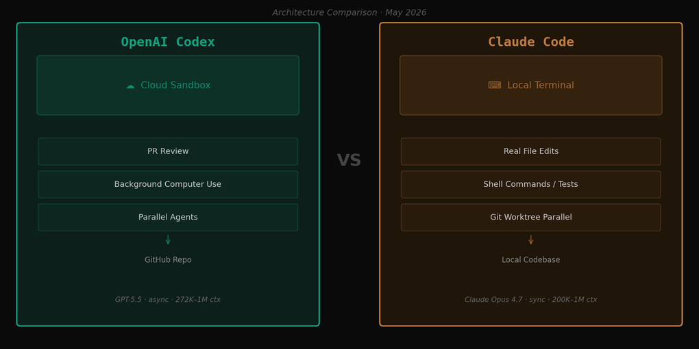
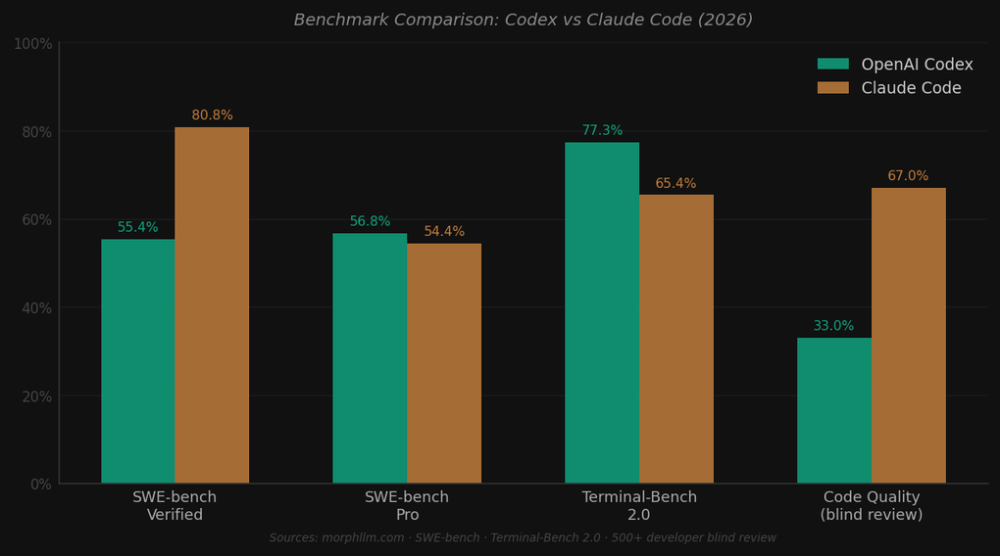

「今Claude Codeを使っているんですが、Codexに乗り換えるべきでしょうか？」

この2週間で、同じ質問を3回受けました。4月16日にOpenAIがCodexに大型アップデートを実施し、バックグラウンドコンピューター使用、Mac上での並列エージェント実行、PRレビュー、インアプリブラウザ、90以上のプラグインを一度に公開してからです。さらに1週間後の4月23日には、GPT-5.5をCodexに統合しました。

直接使ってみたかと聞かれれば、答えはノーです。CodexクラウドエージェントはChatGPT Pro、Business、Enterpriseサブスクリプションが必要で、私は今Claude Codeに最適化されたワークフローで動いています。そのため、この記事はSource Reviewレーンです。OpenAI公式changelog、リリースブログ、morphllm.comのベンチマーク分析、DataCampなど複数の比較記事を基に、毎日使っているClaude Codeとの違いを整理しました。直接実行していない部分を実行したかのように書くことはしません。

比較記事を読んでいて感じたのは、2つのツールに対する評価が使う人によって極端に分かれるという点でした。「Codexに移ったら生産性が2倍になった」という声と「Claude Code対比でコード品質が落ちすぎる」という不満が、同じスレッドに共存しています。この温度差がツール自体の品質の違いというより、使用シナリオの違いから来ていることを、今回の比較をまとめながら確信しました。

## Codexの4月アップデート：何が変わったか

以前のCodexを知っている人は少し混乱するかもしれません。2021年のCodexは、GitHub Copilotの初期を支えたコード補完モデルでした。OpenAIはその名前を全く別の製品に付けました。現在のCodexはクラウドベースのコーディングエージェントです。

2025年末からOpenAIは、CodexをChatGPTインターフェース内に組み込まれたクラウドコーディングエージェントとして再ポジショニングしました。基本的な使い方はこうです。ユーザーがChatGPTでタスクを指示すると、Codexが接続されたGitHubリポジトリをクラウドサンドボックスに展開し、非同期でコードを書いたり修正したりして、完了したらPRを開きます。自分が別の作業をしている間にエージェントがコーディングを進める方式です。

4月16日のアップデートでこのエージェントが大幅に拡張されました。公式changelogとリリースブログ、releasebot.ioのCodexアップデート追跡記録を分析すると、主な変更点は4つに整理できます。

<strong>バックグラウンドコンピューター使用</strong>。CodexがMac上で独立したエージェントとして動作し、他のアプリケーションを直接操作できるようになりました。エージェントが画面を見て、クリックし、タイピングする方式です。複数のエージェントを同時に動かしても互いに干渉しないとのことです。OpenAIの説明によれば「APIを公開していないアプリを扱うフロントエンドの反復作業やテスト」に有用だとしています。ただし、この機能は4月時点で段階的ロールアウト中で、Pro以上のユーザーに先行公開されています。

<strong>PRレビューとインアプリブラウザ</strong>。以前からCodexはPRを自動的に開く機能がありましたが、今回レビュー機能が追加されました。コードを書いてPRを上げて、フィードバックをもとに修正するサイクルをCodex内で完結できます。インアプリブラウザでフロントエンドの結果を直接確認しながら反復する機能も追加されました。

<strong>90以上のプラグイン</strong>。今回のアップデートでSlack、Jira、GitHubなど外部サービスと連携するプラグインが大幅に拡充されました。MCPサーバーのサポートも改善されています。

<strong>GPT-5.5統合（4月23日）</strong>。4月23日にGPT-5.5がCodexのデフォルトモデルになりました。OpenAIの説明では、GPT-5.5は「マルチステップタスク、計画立案、ツール使用、結果検証」で前バージョンより強化されています。[GPT-5.5リリース分析](/ja/blog/ja/openai-gpt-5-5-release-claude-comparison-april-2026)でモデル自体の特性をより詳しく扱っていますので参考にしてください。

## アーキテクチャの違い — 単なる機能差ではない

比較を正確に行うには、まず2つのツールの基本設計が本質的に異なることを認める必要があります。機能リストを並べると似ているように見える部分もありますが、実際には全く異なる問題を解決しようとして作られたツールです。

Claude Codeはローカルターミナルで動作します。ファイルシステムを直接読み書きし、シェルコマンドを実行し、テストを走らせ、gitを操作します。同期的（synchronous）です。コマンドを入力するとすぐに反応し、結果を見ながら次の指示を出します。密なフィードバックループが核心です。

Codexは非同期的（asynchronous）です。GitHubリポジトリをクラウドサンドボックスにアップロードしてタスクを指示し、自分は別の作業をします。Codexが完了するとPRが上がってきます。フィードバックループは遅いですが、その間に完全に別の作業ができます。「この機能実装しておいて、午前中のミーティング行ってくるね」が基本的な使用シナリオです。

2つが根本的に異なる状況に合わせて最適化されている、ということをまず理解しないと、同じ基準で比較すること自体が間違ったアプローチになりかねません。

同期式Claude Codeが優位なのは、要件が作業中に変わり続ける場合です。複雑なバグを追跡するとき、アーキテクチャを探索しながら絞り込むとき、「こうやってみてダメならあうやって試す」を繰り返すときは速いフィードバックループが重要です。また、既存のローカル環境、環境変数、プライベートな依存関係が多いプロジェクトはクラウドサンドボックスで再現するのが難しいです。CodexはGitHubリポジトリにアクセスできても、ローカルからしかアクセスできないデータベース、内部API、社内VPN内のサービスには届きません。

非同期式Codexが優位なのは、タスクが明確で独立している場合です。「このモジュールのテストカバレッジを80%にして」「このAPIエンドポイントをリファクタリングしたPR作って」のように結果物が明確な作業は、非同期で委任するのが効率的です。また、複数の開発者が各自のフィーチャーブランチを同時に進めているチーム環境では、各ブランチにCodexエージェントを割り当てて並列で動かすことで実質的な時間短縮につながる可能性があります。

## ベンチマーク：数字が語ることと語らないこと

数値を見ると、一方が圧倒的に優れているとは言えない複雑な絵が見えてきます。

調べた限りでは、公開ベンチマーク基準でSWE-bench VerifiedはClaude Codeが80.8%、Codexが55.4%です。25%ポイントの差は大きいです。一方SWE-bench ProはCodex 56.8%、Claude Code 54.4%でほぼ同点です。Terminal-Bench 2.0ではCodexが77.3%でClaude Code（65.4%）を上回っています。ターミナル中心の作業ではCodexが強いということです。

ベンチマークより興味深いのは、500人以上の開発者が参加したRedditブラインドレビューの結果です。誰が書いたか隠した状態でコード品質だけを評価すると67%がClaude Code側を良いと評価しました。しかし「日常的にどちらのツールを使うか」という質問では65%がCodexを選びました。コードの品質が低いと感じながらもCodexを選ぶという逆説です。

この逆説の理由として2つの可能性が考えられます。一つは<strong>ワークフロー統合</strong>です。CodexはChatGPTインターフェース内にあります。すでにChatGPTを日常的に使っている開発者なら新しいツールを学ぶことなく自然に使えます。Claude Codeはターミナル、gitフロー、ローカル環境設定に慣れていないと使いこなせません。

もう一つは<strong>タスクサイズと委任パターン</strong>です。「コード品質」を判断するブラインドレビューは通常、小さな単位のコード片を比較します。一方、実務でCodexがよく使われるのは「このフィーチャー実装して」という成果物単位の委任です。

SWE-bench Verifiedの25%ポイントの差については「別のことを測定しているから関係ない」と片付けることは難しいです。このベンチマークはGitHubイシューを実際のPRで解決する能力を測定するもので、CodexがPR自動化に注力しているという観点から直接的な指標です。Codex側にこの数値に関する公式な説明があるか探しましたが、まだ見つかっていません。

注目すべき点として<strong>ベンチマークバージョン</strong>もあります。SWE-benchにはLite、Verified、Proなど複数のバリエーションがあり、どのバージョンでどの設定でテストしたかによって数値が大きく異なります。Codexが難易度の高いタスクセットであるProでは差が縮まるということは、「中程度の難易度の実際のイシュー」を処理する能力では差があると解釈するのが自然かもしれません。

## コスト：安く見えるが実際の計算は複雑

Codexがトークン価格基準で安いという分析が複数出ています。公開情報を総合すると、GPT-5.5 CodexモデルはClaude Sonnet対比で入力トークンが約2倍安く、出力トークンも1.67倍程度安いとされています。morphllm.comではトークン効率まで考慮すると「実質的に8倍のコスト優位」が可能と主張しています。

この数値をそのまま受け取らない理由が2つあります。

第一に、比較条件が標準化されていません。Claude Codeはローカルでファイルを読み書きしてその結果をコンテキストとして積み上げる方式でトークンを使います。CodexはクラウドサンドボックスでGitHubリポジトリ全体を読んで処理します。同じタスクを2つの環境で比較可能な形で再現することが難しいです。「8倍優位」という数値がどんな条件で出たのか確認する方法がありません。

第二に、サブスクリプション費用が含まれる必要があります。Codexクラウドエージェントは現在ChatGPT Pro（月20ドル）、Business、Enterpriseでのみ使えます。Claude Codeも同様にサブスクリプション費用が別途かかります。現実的なコスト比較をするには、チームがすでにChatGPT Businessサブスクリプション（月30ドル/人）を使っているかどうかが決定的です。すでに使っているならCodexは追加コストなしで使えます。

第三に、非同期作業の隠れたコストがあります。Codexがクラウドで非同期で動いている間、結果が期待と違った場合その修正コストはどう計算するか。同期式Claude Codeでは途中で修正できますが、非同期PRがおかしな状態で上がってきた場合はレビューして修正して再実行するサイクルが追加されます。これはトークンコストではなく時間コストです。

## Claude Codeユーザーから見たCodexの魅力と限界

私はこのブログの自動化、エージェントパイプライン構築、スクリプト開発をClaude Codeで行っています。Codexの発表を見て「これは試してみたい」と思ったシナリオがあり、「これは自分の環境には合わない」と思った部分もありました。

試してみたいと感じた部分は<strong>非同期PRバッチ作業</strong>です。例えばブログ投稿10件のfrontmatterフォーマットを一括修正しなければならない状況なら、Codexに指示してコーヒーを飲んでいる方が、Claude Codeで一つずつ監視するより効率的かもしれません。また、複数の開発者が各自のフィーチャーブランチを同時に進めているチーム環境では、並列エージェントの利点が大きく現れる可能性があります。

反面、私のメインワークフローに合わないと感じた部分は2つあります。

<strong>フィードバックループの密度</strong>。私が行うほとんどの作業は「試して確認して調整する」を速く繰り返す方式です。[Git Worktreeを使ったClaude Code並列セッション](/ja/blog/ja/claude-code-parallel-sessions-git-worktree)で複数の作業を同時に進められる環境がすでにあり、これが私のやり方に合っています。

<strong>既存インフラの移行コスト</strong>。このブログの自動化パイプラインはClaude Code hooks、カスタムコマンド、スラッシュスキルで構成されています。Codexに移行するにはこのインフラを再構成する必要があります。

また、Codexの安定性の歴史も覚えておく必要があります。5ヶ月前に[GPT-5.3 Codexロールアウト停止事件](/ja/blog/ja/gpt53-codex-rollout-pause)がありました。プラットフォームの信頼性問題でデプロイを一時停止しなければなりませんでした。今回の大規模アップデートはあのときよりはるかに規模が大きいです。クラウドエージェントサービスはローカルCLIと違い、サービス障害が発生すると作業環境全体が止まります。ローカルターミナルベースのClaude Codeはインターネットが切れても最低限ファイル編集はできます。

## 2026年5月時点での私の判断

[Cursor 3、Claude Code、Windsurf比較](/ja/blog/ja/cursor-3-vs-claude-code-vs-windsurf-2026)でも似たような結論を出しました。結局「どんなツールか」より「どんなワークフローか」が先です。

Codexの4月アップデートは明らかに意味のある進展です。クラウドエージェントワークスペースとしての方向性が具体化し、GPT-5.5統合でモデル性能も上がりました。非同期並列処理を望むチームなら今すぐ探索してみる価値のある時期です。

ただし、SWE-bench Verifiedでの25%ポイントの差、クラウドサンドボックスでのデバッグの透明性不足、実際のコスト計算の複雑さは私が簡単に乗り越えられない部分です。

私の判断はこうです。今Claude Codeをうまく使っているなら、Codexを完全代替ツールとして見るより「非同期委任に特化した補完ツール」としてテストすることをお勧めします。反面、要件が流動的で速いフィードバックループが必要な個人開発者には、現在のClaude Codeの同期式ローカル環境の方が合っています。

AI コーディングツール市場は今6ヶ月ごとに판が変わります。この記事を書いている時点でもGoogle I/O 2026（5月19〜20日）があと10日に迫っており、そこでGoogleのエージェンティックコーディング発表があればまた別の比較基準が生まれます。そのような状況でツールを選ぶ最も実用的な基準は、「今のワークフローでどこにボトルネックがあるか」です。

Codexを直接試せる環境ができたら、その経験を別の記事でまとめるつもりです。Source Reviewで比較できることと、直接使った後に言えることは違います。今のこの比較が示しているのは、2つのツールのどちらかが「間違っている」ということではなく、それぞれ異なる開発パターンに最適化されているということです。それをまず理解して選択することが正解です。

---

*この記事はOpenAI公式changelog（[developers.openai.com/codex/changelog](https://developers.openai.com/codex/changelog)）、リリースブログ（[openai.com/index/introducing-upgrades-to-codex/](https://openai.com/index/introducing-upgrades-to-codex/)）、morphllm.comベンチマーク分析、DataCamp比較記事を基にしたSource Reviewです。Codexクラウドエージェントは直接実行しておらず、実行していない内容を実行したかのように記述していません。*
