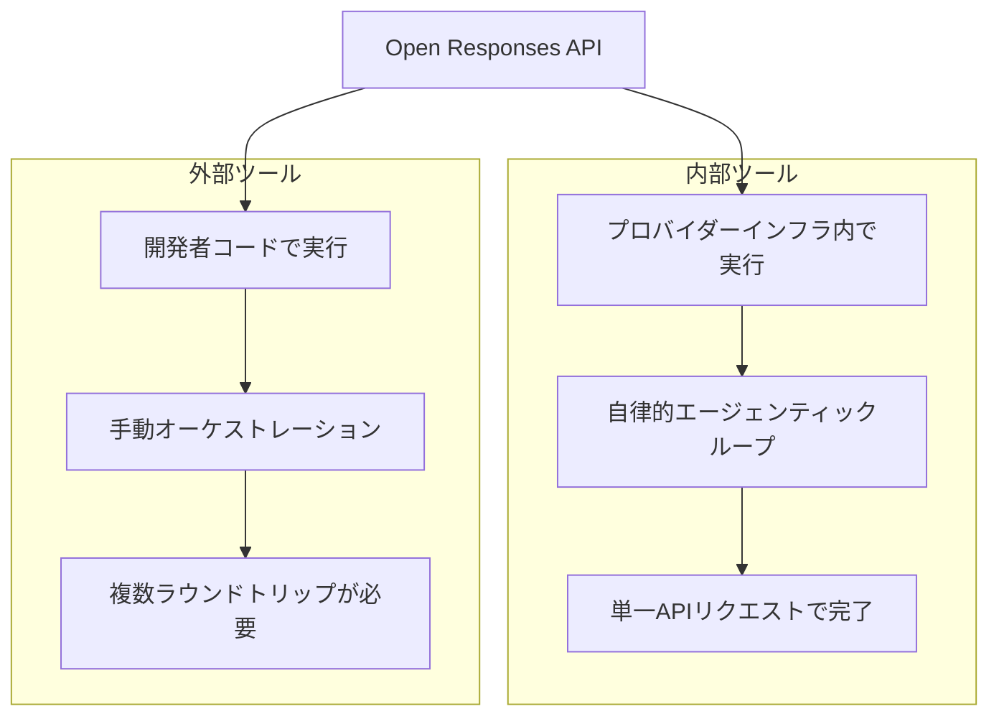
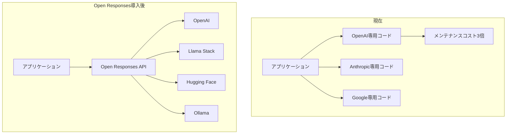

## なぜ今エージェンティックAIに「標準」が必要なのか

2026年3月現在、エージェンティックAIエコシステムは爆発的に成長しています。AnthropicのClaude Agent SDK、OpenAIのAgentKit、GoogleのAgent Development Kit、LangChain、CrewAIなど数多くのフレームワークが競争しながら開発チームに選択の自由を与えましたが、同時に深刻なフラグメンテーション問題を生み出しました。

各フレームワークごとにツール呼び出し方式、レスポンス形式、エージェントループの処理方法がバラバラであるため、モデルを入れ替えたり複数のモデルを並行運用しようとすると、インテグレーションコードをゼロから書き直す必要がある状況が繰り返されていました。ある開発者の言葉を借りれば、<strong>「ラッパーのためのラッパーをまた書く」</strong>悪循環でした。

OpenAIが2026年2月に公開した<strong>Open Responses</strong>スペックは、この問題に正面から挑みます。ベンダーニュートラルなオープン仕様として、エージェンティックAIワークフローを標準化し、プロバイダー間の切り替えコストを劇的に削減することを目指しています。

## Open Responsesの核心コンセプト3つ

Open Responsesスペックは3つの核心コンセプトを定義しています。

### 1. Items — エージェントインタラクションのアトミック単位

Itemsは、モデルの入力、出力、ツール呼び出し、推論状態を表現するアトミック単位です。従来のChat Completions APIの`messages`配列が単純なテキストの交換のみを表現していたのに対し、Itemsはエージェンティックワークフローのすべてのステップをタイプセーフに表現します。

```typescript
// Itemsのタイプ例
type Item =
  | { type: "message"; role: "user" | "assistant"; content: string }
  | { type: "function_call"; name: string; arguments: string; call_id: string }
  | { type: "function_call_output"; call_id: string; output: string }
  | { type: "reasoning"; content: string };  // 推論プロセスの公開
```

<strong>核心的な違い</strong>：`function_call`、`function_call_output`、`reasoning`タイプが追加され、エージェントのツール使用と思考プロセスを構造的にトラッキングできます。

### 2. Reasoning Visibility — モデルの思考プロセスの可視化

Open Responsesは、モデルの推論プロセスをプロバイダーが制御する方式で公開します。以前は各プロバイダーが独自の方式（OpenAIの`reasoning_content`、Anthropicの`thinking`ブロックなど）で推論プロセスを露出していましたが、Open Responsesはこれを統一された`reasoning` Itemタイプで標準化します。

```json
{
  "type": "reasoning",
  "content": "ユーザーが在庫データを要求したため、まずinventory APIを呼び出し、結果を分析してからサマリーを提供します。",
  "provider_metadata": {
    "visibility": "full"
  }
}
```

これはプロダクション環境でエージェントの意思決定プロセスをデバッグし、監査（オーディット）する上で核心的な要素です。

### 3. Tool Execution Models — 内部 vs 外部ツール実行

Open Responsesはツール実行を2つのモデルで明確に区分します。



<strong>内部ツール（Internal Tools）</strong>：プロバイダーインフラ内で実行されます。モデルが自律的に推論→ツール呼び出し→結果反映→再推論のサイクルを繰り返し、最終結果のみを1つのAPIレスポンスとして返します。複数のラウンドトリップなしに複雑なエージェンティックワークフローを処理できます。

<strong>外部ツール（External Tools）</strong>：開発者のアプリケーションコードで実行されます。モデルがツール呼び出しをリクエストすると、開発者側で直接実行し、結果を再度渡す方式です。セキュリティが重要な作業やプロバイダーに委任できない作業に適しています。

## サポートエコシステム：すでに動き出している

Open Responsesの最大の強みは、リリースと同時に確保した広範なエコシステムサポートです。

| パートナー | タイプ | 意義 |
|--------|------|------|
| Hugging Face | オープンソースハブ | 数千のモデルに対する標準APIアクセス |
| OpenRouter | モデルルーター | マルチプロバイダー間のシームレスな切り替え |
| Vercel | フロントエンドプラットフォーム | AI SDKインテグレーションによるフロントエンド開発の標準化 |
| LM Studio | ローカル推論 | ローカルモデルでも同一APIを使用 |
| Ollama | ローカル推論 | セルフホスティング環境での標準化 |
| vLLM | 推論エンジン | ハイパフォーマンス推論サーバーとの互換性 |
| Red Hat / Llama Stack | エンタープライズ | Llamaモデルベースのエンタープライズエージェント構築 |

<strong>注目すべき点</strong>：このリストにはOpenAIの直接の競合（Hugging Face、Ollama、vLLM）が含まれています。これはOpen ResponsesがOpenAI専用スペックではなく、真の業界標準を目指しているという強力なシグナルです。

## 実践的な実装パターン

### 基本的なAPI呼び出し

既存のChat CompletionsからResponses APIへの移行は直感的です。

```python
# 従来: Chat Completions API
response = client.chat.completions.create(
    model="gpt-4o",
    messages=[
        {"role": "user", "content": "在庫状況を分析してください"}
    ],
    tools=[inventory_tool],
)

# 新規: Open Responses API
response = client.responses.create(
    model="gpt-4o",
    input="在庫状況を分析してください",
    tools=[inventory_tool],
)
# response.output_textに最終結果（ツール呼び出し＋分析完了後）
```

<strong>核心的な違い</strong>：Chat Completionsではツール呼び出しが発生すると開発者が直接ツールを実行し結果を再送するループを実装する必要がありましたが、Responses APIは内部ツールの場合、この全サイクルを自動で処理します。

### ツールアクセス制御パターン

Red HatのLlama Stack実装で示されたツールアクセス制御パターンは、プロダクションで特に有用です。

```python
# 状態別ツールアクセス制御
tool_config = {
    "skip_all_tools": False,        # すべてのツールを無効化
    "skip_mcp_servers_only": False,  # MCPサーバーのみ無効化
    "allowed_tools": ["search", "calculator"],  # 特定のツールのみ許可
}

response = client.responses.create(
    model=model,
    input=messages,
    tools=tools_to_use,
    **tool_config,
)
```

### セキュリティ：リクエストごとのヘッダー分離

```python
# MCPサーバーにユーザーごとの認証情報を渡しつつ、
# エージェント自体にはユーザー情報を露出しない
mcp_config = {
    "server_url": "https://api.internal/mcp",
    "headers": {
        "AUTHORITATIVE_USER_ID": current_user.id,
        "Authorization": f"Bearer {user_token}",
    }
}
```

このパターンにより、エージェントが誤動作しても他のユーザーのデータにアクセスできないことが保証されます。

## EM/CTO視点：なぜこれが重要なのか

### 1. ベンダーロックイン脱却 — マルチモデル戦略の現実化

現在、多くのエンジニアリングチームが「GPT-4oで始めたがClaudeに乗り換えたい、しかしインテグレーションコードを全部書き直さなければならない」という問題を抱えています。Open Responsesはこの問題を根本的に解決します。



<strong>コスト削減効果</strong>：プロバイダーごとのインテグレーションコードを1つの標準インターフェースに統合すれば、インテグレーションレイヤーのメンテナンスコストを60〜80%削減できます。

### 2. 段階的マイグレーション戦略

Open Responsesの導入はビッグバン型の切り替えではなく、段階的マイグレーションが可能です。

<strong>Phase 1（1〜2週間）</strong>：新規機能にのみResponses APIを適用
- 既存のChat Completionsコードはそのまま維持
- 新しいエージェンティック機能のみResponses APIで開発

<strong>Phase 2（1〜2ヶ月）</strong>：コアワークフローの移行
- ツール呼び出しが頻繁なワークフローから順次移行
- パフォーマンスベンチマーク比較（ラウンドトリップ回数、レスポンスタイム）

<strong>Phase 3（四半期）</strong>：マルチプロバイダーの有効化
- OpenRouterや自前のプロキシを使ったプロバイダー自動切り替えロジックの実装
- コスト、パフォーマンス、可用性に基づくダイナミックルーティング

### 3. オブザーバビリティとガバナンス

Reasoning Visibilityは単なるデバッグツールではなく、<strong>AIガバナンスの中核インフラ</strong>です。

- <strong>監査証跡</strong>：エージェントがなぜ特定の決定を下したのかを構造的に記録
- <strong>コンプライアンス</strong>：金融、医療などの規制産業におけるAI意思決定プロセスの透明性確保
- <strong>品質保証</strong>：推論プロセスを分析してエージェントの判断品質を定量的に評価

## Chat Completions vs Responses API比較

| 項目 | Chat Completions | Responses API |
|------|------------------|---------------|
| ツール呼び出し処理 | 開発者がループ実装 | 内部ツールは自動処理 |
| 推論の可視性 | プロバイダーごとに異なる | 標準化された`reasoning`タイプ |
| マルチモーダル | 別途設定が必要 | ネイティブサポート |
| ストリーミング | テキストベース | イベントベースストリーミング |
| プロバイダー切り替え | コード書き直しが必要 | エンドポイントの変更のみ |
| エージェンティックループ | 手動実装 | フレームワーク内蔵 |

<strong>OpenAIの公式見解</strong>：Chat Completions APIは引き続きサポートされますが、すべての新規プロジェクトにはResponses APIが推奨されています。

## 残された課題と現実的な考慮事項

### AnthropicとGoogleは？

現在、Open ResponsesスペックにAnthropicとGoogleは公式パートナーとして参加していません。この2社がそれぞれのエージェントフレームワーク（Claude Agent SDK、Google ADK）を保有しているため、Open Responsesを受け入れるか独自標準を推進するかはまだ不確実です。

ただし、OpenAIとAnthropicの社員30名以上が最近共同で国防総省の訴訟で協力した事例からもわかるように、AI業界の協力関係は競争関係と共存しています。標準化に対する業界のニーズが高まれば、合流する可能性は十分にあります。

### プロダクション対応レベル

Open Responsesはまだ初期段階です。スペックドキュメント、スキーマ、適合性テストツールが[openresponses.org](https://openresponses.org)で公開されていますが、プロダクション環境での大規模な検証事例はまだ限定的です。アーリーアダプターチームは新規プロジェクトにまず適用し、安定性を検証するのが現実的です。

## 結論：エンジニアリングリーダーのためのアクションアイテム

Open Responsesスペックの登場は、エージェンティックAIエコシステムが「フレームワーク乱立期」から「標準化期」へ移行していることを示しています。これはHTTPがWebを統一したように、エージェンティックAIワークフローに共通言語を提供しようとする試みです。

エンジニアリングリーダーとして今やるべきこと：

1. <strong>スペックレビュー</strong>：[openresponses.org](https://openresponses.org)でスペックドキュメントを確認し、現在のチームのエージェンティックワークフローとの互換性を評価
2. <strong>パイロットプロジェクト</strong>：新規エージェンティック機能の1つをResponses APIで実装してみて、既存のChat Completionsベースと開発生産性を比較
3. <strong>マルチプロバイダー戦略の策定</strong>：OpenRouter、Llama Stackなどを活用し、プロバイダー切り替えコストを最小化するアーキテクチャを検討
4. <strong>チーム能力の強化</strong>：エージェンティックAI開発が単純なAPI呼び出しからワークフロー設計へ進化しているため、チームのエージェント設計能力の強化に投資

エージェンティックAIの標準化はまだ始まったばかりです。この流れに早く乗るチームが競争優位を獲得するでしょう。

## 参考資料

- [Open Responses Specification — openresponses.org](https://openresponses.org)
- [InfoQ: Open Responses Specification Enables Unified Agentic LLM Workflows](https://www.infoq.com/news/2026/02/openai-open-responses/)
- [Red Hat: Automate AI agents with the Responses API in Llama Stack](https://developers.redhat.com/articles/2026/03/09/automate-ai-agents-responses-api-llama-stack)
- [OpenAI: Migrate to the Responses API](https://developers.openai.com/api/docs/guides/migrate-to-responses/)
- [OpenAI: New tools for building agents](https://openai.com/index/new-tools-for-building-agents/)
