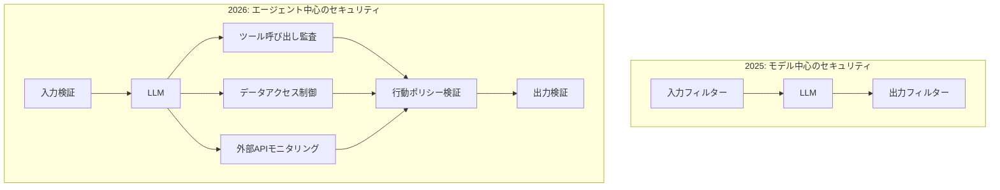
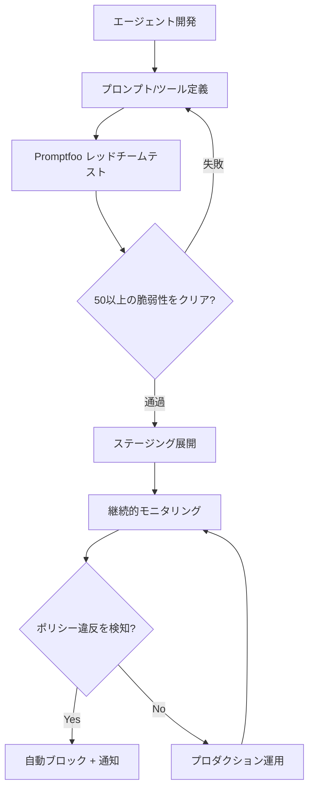
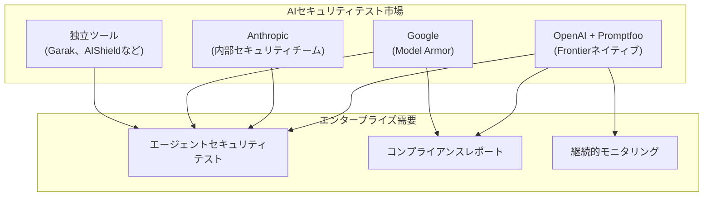

2026年3月9日、OpenAIはAIセキュリティテストプラットフォームであるPromptfooの買収を発表しました。Fortune 500企業の25%以上が利用し、35万人の開発者コミュニティを持つこのオープンソースツールが、OpenAIのエンタープライズプラットフォームFrontierに統合されます。この買収は単なる企業買収を超え、<strong>「AIエージェントにもセキュリティパイプラインが不可欠」</strong>という業界の共通認識が形成されたことを示しています。

## Promptfooとは何か

PromptfooはIan WebsterとMichael D'Angeloが2024年に設立したAIセキュリティプラットフォームです。当初はシンプルなプロンプト評価ツールとして始まりましたが、現在ではAIシステム全体のレッドチームテストと脆弱性スキャンを実行する総合的なセキュリティフレームワークへと進化しています。

### 主要機能

```yaml
# Promptfooの主要機能領域
Red Teaming:
  - 50以上の脆弱性タイプを自動テスト
  - 動的攻撃生成（静的なジェイルブレイク試行ではなくML基盤）
  - ビジネスロジック理解に基づくカスタマイズテスト

Vulnerability Scanning:
  - プロンプトインジェクション
  - ガードレール回避
  - データ漏洩
  - SSRF攻撃
  - 機密情報の露出
  - BOLA脆弱性

Enterprise:
  - CI/CDパイプライン統合
  - SSO / 監査ログ
  - プロダクション継続モニタリング
  - オンプレミス展開サポート
  - NIST AIリスク管理フレームワーク対応
```

特に注目すべきはPromptfooのレッドチームアプローチです。従来の静的なジェイルブレイクリストを使い回すのではなく、<strong>最新のML技術で訓練されたエージェントが対象アプリケーションに合わせた動的な攻撃を生成</strong>します。これにより実際の攻撃者の行動をはるかに精確にシミュレーションできます。

## なぜこの買収が重要なのか

### 1. AIエージェントセキュリティのパラダイムシフト

2025年までAIセキュリティのほとんどは「モデルの安全性」に焦点を当てていました。RLHFでモデルを調整し、出力フィルターを付け、ガードレールを設定するアプローチです。しかし2026年のAIエージェントは<strong>ツールを呼び出し、データにアクセスし、外部システムと相互作用</strong>します。攻撃対象領域が根本的に変わったのです。



### 2. Fortune 500の25%がすでに利用中

Promptfooを単純なスタートアップ買収と見なしにくい理由は、すでに<strong>Fortune 500の25%（約127社）</strong>がAI開発ライフサイクルでこのツールを活用しているからです。これはOpenAIがエンタープライズ市場での地位を強化する戦略的な動きといえます。

### 3. Frontierプラットフォームとの統合

OpenAIのエンタープライズプラットフォームFrontierは、企業がAIコワーカーを構築・運用するために使われています。PromptfooのセキュリティテストがFrontierにネイティブ統合されることで：

- <strong>開発 → セキュリティテスト → デプロイ</strong>が一つのパイプラインで完結
- エージェントのデプロイ前に自動レッドチームテストを実施
- プロダクション環境の継続的なセキュリティモニタリング
- ポリシー違反行動のリアルタイム検知

## AIエージェントDevSecOpsパイプライン

この買収を契機に、AIエージェント開発にも従来のソフトウェアのDevSecOpsに近いパイプラインが確立されつつあります。



### 従来のDevSecOpsとの比較

| 領域 | 従来のDevSecOps | AIエージェントDevSecOps |
|------|-------------|-------------------|
| コードスキャン | SAST/DAST | プロンプトインジェクションスキャン |
| 脆弱性テスト | ペネトレーションテスト | AIレッドチームテスト |
| アクセス制御 | RBAC/ABAC | ツール呼び出し権限ポリシー |
| 継続的モニタリング | WAF/IDS | 行動ポリシーモニタリング |
| コンプライアンス | SOC2/ISO27001 | NIST AI RMF |
| インシデント対応 | SIEMアラート | エージェント自動ブロック |

## EM/CTOが今すぐ準備すべきこと

### 1. AIセキュリティテストをCI/CDに組み込む

PromptfooはすでにCI/CD統合をサポートしています。AIエージェントをデプロイしているチームであれば、今すぐ導入できます。

```yaml
# .github/workflows/ai-security-test.yml
name: AI Agent Security Test
on:
  pull_request:
    paths:
      - 'agents/**'
      - 'prompts/**'

jobs:
  security-test:
    runs-on: ubuntu-latest
    steps:
      - uses: actions/checkout@v4

      - name: Install Promptfoo
        run: npm install -g promptfoo

      - name: Run Red Team Tests
        run: |
          promptfoo redteam run \
            --config agents/config.yaml \
            --output results/security-report.json

      - name: Check Results
        run: |
          promptfoo redteam report \
            --input results/security-report.json \
            --fail-on-vulnerability
```

### 2. エージェントの行動ポリシーを文書化する

エージェントがどのツールを呼び出せるか、どのデータにアクセスできるか、どの行動が禁止されているかを明示的に定義する必要があります。

```yaml
# agent-policy.yaml
agent: customer-support-bot
version: "1.0"

allowed_tools:
  - knowledge_base_search
  - ticket_create
  - ticket_update

forbidden_actions:
  - 顧客個人情報の外部送信
  - 返金金額$500超過の承認
  - 内部システム管理者権限の使用

data_access:
  allowed:
    - customer_tickets
    - product_catalog
  denied:
    - employee_records
    - financial_reports

escalation_triggers:
  - 法的紛争に関するリクエスト
  - 個人情報削除リクエスト
  - セキュリティインシデントの報告
```

### 3. セキュリティテスト基準を策定する

NIST AIリスク管理フレームワークを基盤に、チームに適したセキュリティテスト基準を策定します。

| テストカテゴリ | 最低基準 | 推奨基準 |
|-------------|---------|---------|
| プロンプトインジェクション | 90%ブロック率 | 99%ブロック率 |
| ガードレール回避 | 95%ブロック率 | 99.5%ブロック率 |
| データ漏洩防止 | 100%ブロック | 100%ブロック |
| ツール悪用検知 | 85%検知率 | 95%検知率 |
| ポリシー違反検知 | 90%検知率 | 98%検知率 |

## オープンソースエコシステムへの影響

OpenAIはPromptfooのオープンソースプロジェクトを継続して維持すると表明しています。現在13万人の月間アクティブユーザーと35万人の開発者が、マルチプロバイダー（GPT、Claude、Gemini、Llamaなど）でPromptfooを利用しています。

これは二つの意味を持ちます：

1. <strong>セキュリティテストの民主化</strong>：大企業だけでなく、スタートアップや個人開発者もAIエージェントのセキュリティテストを実施できる
2. <strong>ベンダー中立性の維持可否</strong>：OpenAI傘下となった後も、ClaudeやGeminiなど競合モデルへのサポートが継続されるか注視する必要がある

実際に、OpenAIが買収したオープンソースプロジェクトの長期的な行方は見守る必要があります。コミュニティの信頼を維持しながら、Frontierとの差別化されたエンタープライズ機能を提供するバランスが鍵となります。

## 競合構図の分析



この買収によってOpenAIはエージェントセキュリティテスト分野で最も強力なポジションを確保しました。他のプレイヤーがどう対応するかが、2026年後半のAIセキュリティ市場の核心的な注目点になるでしょう。

## まとめ：エージェント時代の必須インフラ

この買収は明確なメッセージを伝えています：<strong>AIエージェントをプロダクションに展開するなら、セキュリティテストは選択肢ではなく必須条件</strong>です。

Engineering ManagerやCTOであれば、今すぐ以下の三つを始めてください：

1. <strong>現在のAIエージェントの攻撃対象領域を把握</strong>する。エージェントがどのツールを呼び出し、どのデータにアクセスしているかのインベントリを作成してください。
2. <strong>Promptfoo CLIをチームに導入</strong>する。オープンソースなので費用なしで始められます。`npx promptfoo@latest redteam init`で5分以内に最初のレッドチームテストを実行できます。
3. <strong>エージェントの行動ポリシーをコードで管理</strong>する。人が読めるYAMLポリシーファイルを作成し、CI/CDで自動検証してください。

AIエージェントの能力が高まるにつれ、そのエージェントを安全に運用するためのインフラの重要性も増していきます。Promptfoo買収は、このインフラが今や業界標準として定着しつつあることを示す重要な出来事です。

## 参考資料

- [OpenAI Promptfoo買収公式発表](https://openai.com/index/openai-to-acquire-promptfoo/)
- [TechCrunch: OpenAI acquires Promptfoo to secure its AI agents](https://techcrunch.com/2026/03/09/openai-acquires-promptfoo-to-secure-its-ai-agents/)
- [Promptfoo公式サイト](https://www.promptfoo.dev/)
- [Promptfoo GitHubリポジトリ](https://github.com/promptfoo/promptfoo)
- [NIST AI Risk Management Framework](https://www.nist.gov/artificial-intelligence/risk-management-framework)
