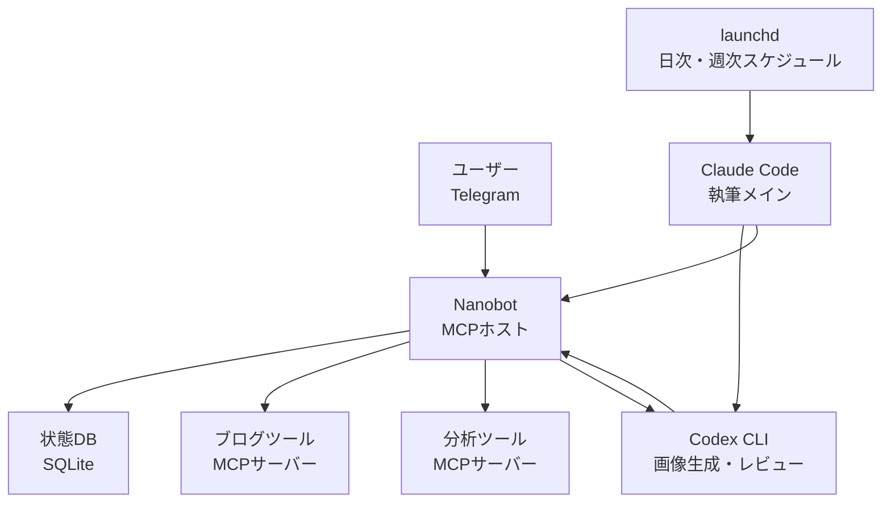

4月4日の朝、Anthropicからメールが届きました。Claude Pro契約ではOpenClawのようなサードパーティツールがもう使えない、という通知です。正確には「サブスクリプションで発行されたOAuthトークンを外部ツールで利用することを禁じる」というポリシーですが、OpenClawユーザーの立場からすれば事実上同じ意味です([VentureBeatの記事](https://venturebeat.com/technology/anthropic-cuts-off-the-ability-to-use-claude-subscriptions-with-openclaw-and))。

2月にOpenClaw向けのCodex移行ガイドまで書いた身としては、ちょっと放心しました。あの記事は「Claude/Geminiの規約が揺れているから、Codexをバックアップとして仕込んでおこう」というトーンだったのですが、二ヶ月でそのバックアップがメインに昇格した格好です。そして4月24日にGPT-5.5がリリースされ([OpenAI発表](https://openai.com/index/introducing-gpt-5-5/))、盤面がもう一度動きました。

いまの私の自動化スタックはこんな構成です。Claude + launchdがメインエンジン、Codexが重い処理(画像生成、レビュー)、Nanobot + Telegramが状態管理と雑用。OpenClawはきれいに抜けました。一ヶ月のあいだに三回の乗り換えを経験したので、その過程で学んだことを残しておこうと思います。

## 最初の逃げ道 — まずはlaunchdで生き延びる

OAuth遮断の通知を受けて真っ先にやったのは、OpenClawをオフにすることでした。きれいに止めたというより、そこに刺さっていたcronタスクをどこに移すかを決めるほうが大きな問題だったのです。

私のOpenClaw設定には、デイリーのブログ発行、デイリーの締めチェック、ウィークリーの戦略レビュー、合計三つのスケジューラが入っていました。cronではなくOpenClaw独自のスケジューラだったので、ツールが使えなくなるとこのスケジュールも一緒に死にました。一週間ほどは手動で回しました。手間がかかりすぎる。

そこでmacOSのlaunchdに移行しました。この選択には二つの理由がありました。一つ、別途デーモンが要らないこと。cronよりもOSネイティブなのがlaunchdです。二つ、OpenClawのような外部ツールにまた縛られたくなかった。一度乗り換えたのが心残りで、今度はいちばん薄いレイヤーを選んだのです。

```xml
<!-- ~/Library/LaunchAgents/net.jangwook.daily-post.plist -->
<plist version="1.0">
  <dict>
    <key>Label</key>
    <string>net.jangwook.daily-post</string>
    <key>ProgramArguments</key>
    <array>
      <string>/bin/zsh</string>
      <string>-lc</string>
      <string>cd /path/to/blog && claude code --command "/write-post-auto"</string>
    </array>
    <key>StartCalendarInterval</key>
    <dict>
      <key>Hour</key><integer>15</integer>
      <key>Minute</key><integer>23</integer>
    </dict>
  </dict>
</plist>
```

`launchctl load`で登録して、`launchctl list | grep jangwook`で生きているかを確認。それで終わりです。一時間でOpenClawのスケジューラ全部をlaunchdに移しました。意外なほど素直に動きました。そして、この記事を書いている時点までずっと回り続けています。これが今回の引っ越しで唯一いじらなかったレイヤーです。

OpenClawのような全部入りツールの罠はここにあります。マルチエージェント、チャネル、スケジューラを一つのバケツに入れてくれるので最初は楽です。ところがそのバケツが割れると、中にある正常なものまで一緒に流れ出てしまう。スケジューリングはlaunchdで十分でしたし、どうせ十分だったのなら最初からlaunchdでやるべきだった、とそのとき気づきました。

最初はlaunchdがcronより面倒だと聞いて先延ばしにしていましたが、いざ移してみたらplistファイル一枚で完結するので大したことはなかったです。macOSの再起動後にも自動で復活する点、システムログにきちんと記録される点はcronより上です。一つだけ煩わしいのはplistを更新したあとに `launchctl unload && load` を二回打たないといけないこと。それを除けばOpenClawのスケジューラよりデバッグしやすい。少なくともログがどこに溜まっているかは分かりますから。

## Channelsはその場しのぎだった、しかもその場しのぎが長すぎた

3月にAnthropicがClaude Code Channelsを発表しました。Telegramでメッセージを送るとローカル端末のClaudeが応答する機能で、ちょうどOpenClawのTelegramチャネルとほぼ同じUXを提供してくれるものです。私はこれを暫定的なつなぎとして使いました。「OpenClawがなくてもTelegramからClaudeを呼べるなら、OAuth遮断の即時的な痛みは減る」という計算です。

実際よく動きました。移動中にTelegramで「今日の分析レポート回しといて」と送れば、家のmac miniが受け取って処理し、結果をTelegramに返してくる。一ヶ月近くこのスタイルで使っていました。[Channelsの使用記](/ja/blog/ja/claude-code-channels-telegram-bridge)にも書いたとおりです。

問題はChannelsが「メッセージ-応答」モデルだという点です。状態を持たない。「ゆうべ走らせたバックフィルジョブ、どこまで進んだ?」と聞いても、Channelsはそのバックフィルジョブの存在を知りません。毎回新しいセッションに入って一から尋ねるようなものです。OpenClawはチャネルごとに文脈を保持してくれていましたが、Channelsはそうではない。

これが一ヶ月積み重なるとイライラがたまってきました。具体的にどんなイライラかというと、深夜2時にバックフィルジョブの進捗を見ようとTelegramを送ったのに、Channelsが「どのバックフィルジョブのことでしょうか?」と返してくる、そんな感じです。五回目に同じ返事を受け取ったときはノートPCを投げそうになりました。

「Telegramというチャネルはそのまま使うけれど、その後ろに状態管理レイヤーが必要だ」という結論がはっきりしました。状態のないチャネルは人間用メッセンジャーであって、自動化のインターフェースではありません。ちょうどそのタイミングでGPT-5.5の発表が出て、ついでにCodexを別契約しました。

## Codexの上にOpenClawをもう一度入れてみた30分

GPT-5.5が4月24日にリリースされたとき([OpenAI発表](https://openai.com/index/introducing-gpt-5-5/))、正直少し興奮しました。私のOpenClaw移行ガイドで書いていた「Codexバックアップ」が本当にメインになるシナリオだったからです。価格が二倍になった点は([apidogの分析](https://apidog.com/blog/gpt-5-5-pricing/) 入力 $5/M、出力 $30/M)少し気になりましたが、トークン効率が上がったという話である程度相殺されました。

Codexの別契約を済ませて、いちばん最初にやったのが、お恥ずかしながら、OpenClawを再インストールすることでした。「どうせCodexはToS問題がないから、OpenClawにCodexだけ挿しておけば、昔のワークフローそのまま回せるんじゃないか?」 30分で後悔しました。正確に言うと、OpenClaw自体はちゃんとインストールできましたし、Codexアダプタも問題なくつながりました。問題はそのあとです。

OpenClawが重い理由はモデル依存ではありません。50を超えるインテグレーションを一度に抱えていること、独自スケジューラ、独自チャネルマネージャ、独自のノードグラフ — これら全部を支えるランタイムが常駐していなければならない。Codexを呼ぶだけの仕事のためにこのランタイムを丸ごと立ち上げておくのは、あまりにも過剰でした。mac miniのメモリ占有率を見ながらため息をついて、その晩のうちに全部消しました。

これはOpenClawの責任というより、私がOpenClawを誤って使っていたということです。OpenClawは[チャネル連携とマルチエージェントルーティング](https://docs.openclaw.ai/concepts/multi-agent)を一箇所でオーケストレーションするツールです。そこで私が実際に使っていたのは「Claudeで記事を書く + Telegramで結果を受け取る」程度でした。95%の機能を使わないまま100%の重さを背負っていたわけです。

これをOpenClawがよく作られたツールであることを否定する意味で受け取らないでほしいです。私はいまでも[OpenClawインストールガイド](/ja/blog/ja/openclaw-installation-tutorial)に書いたあの長所たち — マルチモデル、チャネルシステム、ノードグラフ — を認めています。ただ、その長所たちが私の作業には必要なかった、というだけのことです。

## Nanobotに乗り換えたあと

Nanobotは偶然出会いました。Obot AIが作っている[オープンソースのMCPホスト](https://github.com/nanobot-ai/nanobot)で([公式紹介](https://obot.ai/blog/introducing-nanobot-a-new-framework-for-turning-mcp-servers-into-ai-agents/))、Goで書かれていて、アルファ段階で、コードが小さい。本当に小さいです。READMEどおりに引っ張ってくると、バイナリ一つとYAML一枚がほぼ全てです。

設定ファイルはこんな形です。

```yaml
# nanobot.yaml
agents:
  blog-ops:
    model: gpt-5.5
    instructions: |
      あなたはjangwook.netブログ運営アシスタントです。
      Telegramから入ってくる依頼を受けて、適切なMCPツールを呼び出す。
    tools:
      - blog-publisher
      - analytics-reader
      - codex-handoff

mcpServers:
  blog-publisher:
    command: node
    args: [./scripts/mcp-blog-publisher.js]
  analytics-reader:
    command: python3
    args: [./scripts/mcp-ga.py]
  codex-handoff:
    command: bash
    args: [./scripts/codex-bridge.sh]
```

インストールしてから一時間以内にTelegramボットと連携しました。正確には、Telegramでメッセージが来るとNanobotが受けて、MCPツール呼び出し(ブログ発行スクリプト、分析スクリプトなど)にルーティングし、結果をTelegramに投げ返す構造です。OpenClawでやっていたことと結果的には同じ。ただし重さが違います。

Nanobotで私が気に入っている点を二つ。

<strong>コードが読めるという点</strong>がまず一つ目。OpenClawはどこかの時点から、私が追いかけきれないほど大きくなりました。どこで何が詰まっているのかを追うには、Discordを漁るかGitHub Issueを検索するしかなかった。Nanobotはmainブランチのコード全体を30分以内に通読できます。これはアルファ段階のツールを本番に使うときに、意外なほど大事な安全網になります。「ダメなら自分でパッチを当てる」という選択肢が生きていることと、ないこととでは差が大きい。

<strong>軽い</strong>というのが二つ目。mac miniでバックグラウンド常駐させていてもメモリをほとんど食わない。Goバイナリ一つだからでしょうか。OpenClawがオンになっていたときはファンが回っていた作業が、Nanobotだと静かです。ノートPCを持ってカフェに行ってもバッテリーの心配がない。

## Telegramはステータスボードで、Codexは作業員

いまの構成を絵にするとこうなります。



真ん中で二つの世界をつないでいるのがNanobotです。一方にはlaunchdが回す定時タスク(Claudeがメインで記事を書き、Codexが画像・レビューを受け持つ)、もう一方にはTelegramから来る即興のリクエスト。Nanobotは両方を受けとめて状態をSQLiteに記録し、進行状況をTelegramに投げ返します。

ここでTelegramの役割が変わりました。Channelsの時期は「コマンドライン」でした。命令を投げると返事が来る場所。いまは「ステータスボード」です。ゆうべ走らせた発行ジョブがどこまで進んだのか、次のスケジュールまで何時間残っているのか、最後のビルドが成功したのかをTelegramで即座に確認できます。命令はほとんど送りません。定時ジョブが勝手に回り、私は結果だけを見る。

Codexの役割もはっきりしました。Claudeが原稿を書き、書き終わるとCodexが二つの仕事を引き受けます。ヒーロー画像の生成と、コードレビュー。GPT-5.5のトークン効率がよくなったというのは、ここで体感できます。同じレビュー作業を5.4で回していたときよりも応答速度が目に見えて早い。正確なベンチマークはありません、私の主観的な感覚です。

価格の話は少し触れておく必要があります。GPT-5.5は入力 $5/M、出力 $30/Mで、5.4比でちょうど二倍になりました。これを見て最初はちょっと腹が立ちました。ところが一週間回してみて請求書を開けたら、5.4時代とほぼ同じだったのです。OpenAIが「トークンを少なく使って同じ結果を出す」と言っていたのは、マーケティング文句だけではなかったらしい。同じコードレビュー作業で、5.4が平均12kトークンほど使っていたのが、5.5では6〜7kくらいまで落ちました。価格が2倍になったのにトークンが半分になったので、実質的な請求額は近い水準です。高くなったのは事実ですが、破滅的な値段ではありません。

ただしこれは私のワークフロー基準です。もしCodexをIDE内のコード補完用に使っているなら、トークン使用量は違う形で出てくるはずです。コードレビューは入力が短くて出力も短いので、トークン効率の改善が効きやすいケースなんです。

## Nanobotの限界 — 正直なところ

ここまで読むと「Nanobot最高」という話に聞こえそうですが、そうではありません。一ヶ月近く使ってみて、はっきりした限界が二つあります。

<strong>一つ、マルチエージェントがない</strong>。Nanobotは本質的にMCPホストです。LLMが一つ、ツール群を呼び出す構造。「複数のエージェントが互いに会話しながら仕事を分担する」というパターンはできません。OpenClawはこれをノードグラフでうまく解いていた。私のワークフローの90%は「一つのエージェントに複数のツール」なのでNanobotで足りますが、残り10%はたまに物足りない。

<strong>二つ、UIがほぼ無い</strong>。localhost:8080にチャットUIは立ち上がりますが、OpenClawの統合ダッシュボードのようなものは期待できません。アルファ段階だからです。事実上、Telegramが私のダッシュボードです。これは良いことではなく、ほかに選択肢がないからそうなっているだけ。誰かが横で「自分の状態見てよ」と言ったときに見せられる画面がない。

三つ目の限界は少し微妙ですが、<strong>Nanobotがアルファ段階なのでいつ壊れてもおかしくない</strong>ということ。GitHubの[リリースページ](https://github.com/nanobot-ai/nanobot/releases)を見てもしょっちゅう変更されています。一度0.x系のバージョンを上げたらMCPハンドシェイクの互換性が崩れ、一時間デバッグしたことがあります。これはアルファのツールを使うなら受け入れるべき部分で、Nanobotの責任ではありません。

## ではOpenClawは終わったのか — いいえ、私が合わなかっただけです

この記事の結論は「NanobotがOpenClawより優れている」ではありません。ツールの重さは作業の複雑さに合っていなければならない、という話です。私の作業がNanobotサイズだったのにOpenClawを使っていた、それに気づくまでに二ヶ月かかった、それだけのことです。

OpenClawが向いている場面は確かにあります。私が考える基準はこうです。エージェント間でメッセージをやりとりするワークフローがあって、そのメッセージの形式が自由テキストで、しかも一回きりではなく繰り返し回るのなら、OpenClawのような重量級オーケストレーターが答えになります。ノードグラフ、チャネル、マルチエージェントの文脈管理 — これを自前で書くのは本当に大仕事です。

私がやっていなかったのは「自分のワークフローはそこまで複雑なのか?」という問いでした。答えは「いいえ」です。Claudeが記事を書き、Codexが画像を描き、両方の結果がSQLiteに書き込まれ、Telegramがそれを表示する。エージェント同士の会話のようなものはありません。メッセージのやりとりも要らない。こういうワークフローにOpenClawランタイム丸ごとは過剰なんです。

それからもう一つ。Codexが良くなったことが、この決定の大きな要因でした。GPT-5.4の頃なら、Nanobotのように「一つのLLMにツールを複数」という構造は弱かったはずです。モデルがツール選択をしょっちゅう間違えていましたから。5.5はそこが目に見えて改善された。ツール呼び出しの精度が上がると、マルチエージェントに分割する理由が減ります。一人が賢ければ、何人も会議する必要が減るのと同じ話です。

もう一つ正直に言うと、この引っ越しのすべてはOAuth遮断の一発から始まりました。Anthropicがあの方針を出していなかったら、私はいまもOpenClawに縛られていたはずです。「ちゃんと回ってるのに、なぜ変える?」という慣性に勝てるのは、ほぼ外部からのショックだけ。今回のショックのおかげで自動化スタックがより軽く、より明瞭になったというのは、少し皮肉な話です。Anthropicとしては補助金の回収が目的であって、ユーザーのワークフロー整理が目的ではなかったでしょうが、結果的には私の助けになりました。

来月はNanobotのコードを一度じっくり読んでみるつもりです。MCPホストがツール呼び出しの結果をどうやってコンテキストに差し戻すのか、状態管理はどうやっているのか。アルファのツールだからこそ面白い。成熟してしまえば中を覗く必要もなくなりますから。もし私が直接パッチを送る場面が出てくれば、それ自体がまた記事のネタになりそうです。
