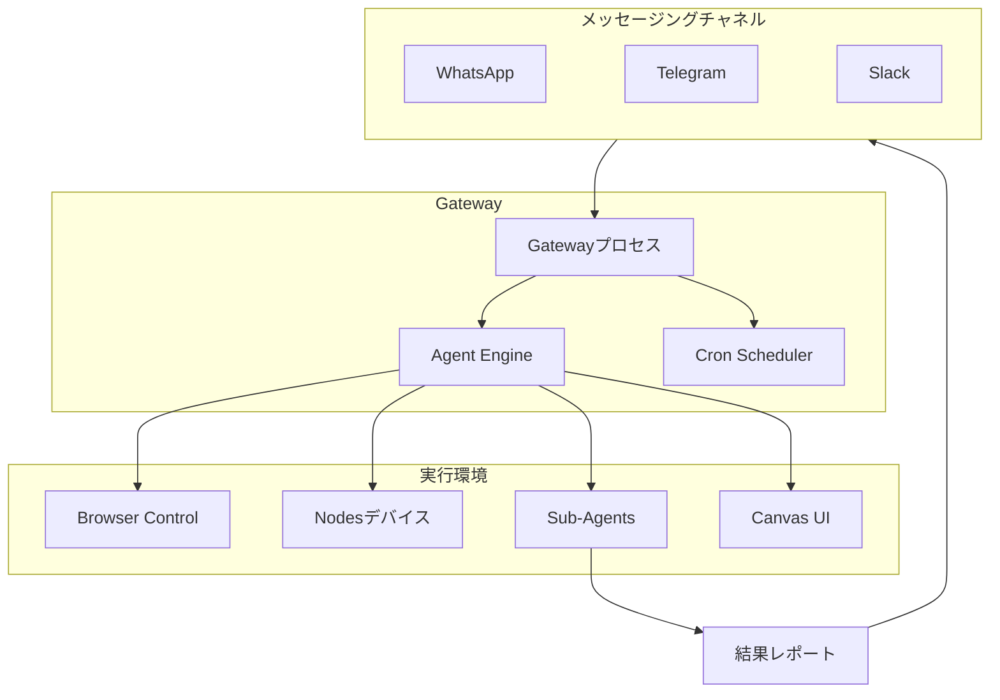
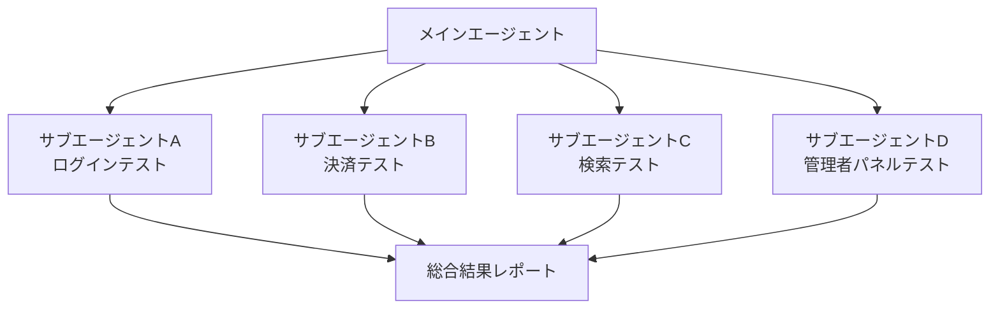
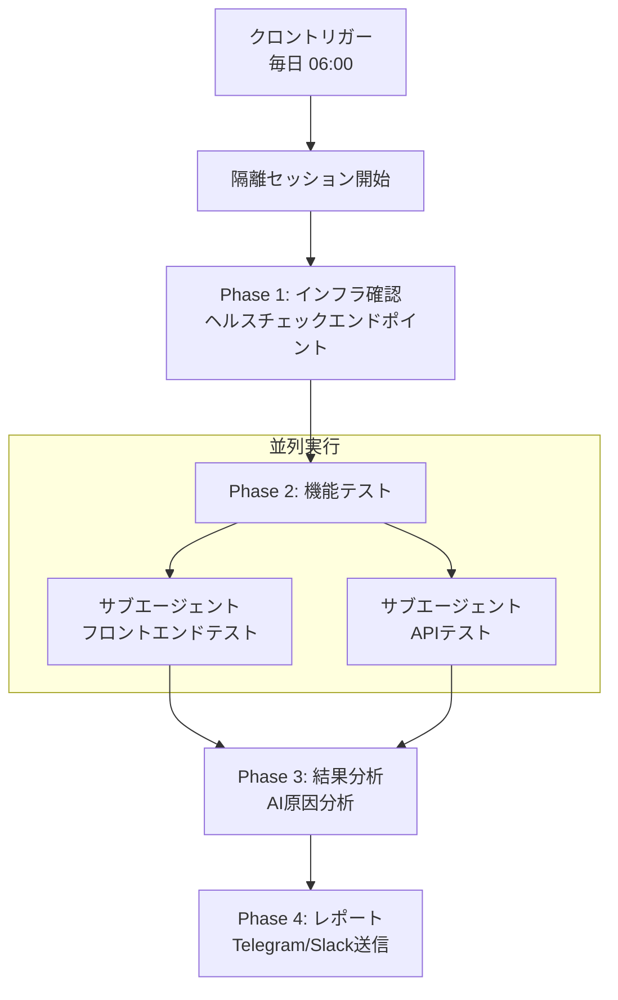

## 概要

Selenium、Cypress、Playwrightなどの従来のE2Eテストツールは、CSSセレクターと命令型コードでテストを記述します。UIが変更されるとセレクターが壊れ、数十のテストファイルを修正しなければなりません。

<strong>OpenClaw</strong>はこの問題を根本的に異なるアプローチで解決します。AIエージェントがアクセシビリティツリー（Accessibility Tree）をベースにWebページを理解し、自然言語で記述されたテストシナリオを解釈して実行します。ブラウザ自動化、デバイス管理、クロンスケジューリング、マルチエージェントオーケストレーションをひとつのプラットフォームで統合運用できます。

本記事では、OpenClawのコア機能をE2Eテストの観点から分析し、実際にテスト自動化システムを構築する方法を解説します。

## OpenClawアーキテクチャの理解

OpenClawは<strong>Gateway中心構造</strong>を採用しています。GatewayはすべてのメッセージングチャネルとWebSocketコントロールプレーンを管理する単一の長時間実行プロセスです。



E2Eテストの観点から各コンポーネントの役割は次のとおりです：

| コンポーネント | 役割 | テストでの用途 |
|--------------|------|--------------|
| <strong>Gateway</strong> | 統合コントロールプレーン | テストインフラの中央ハブ |
| <strong>Browser</strong> | ChromiumベースWeb自動化 | Webアプリの機能・UIテスト |
| <strong>Nodes</strong> | デバイス制御（macOS/iOS/Android） | クロスプラットフォームテスト |
| <strong>Cron</strong> | スケジューリングエンジン | 定期テスト実行トリガー |
| <strong>Sub-agents</strong> | 並列エージェント実行 | テストスイートの並列化 |
| <strong>Canvas</strong> | ビジュアルワークスペース | UIリグレッションテスト・結果ダッシュボード |

## ブラウザ自動化：アクセシビリティツリーベースのテスト

### スナップショットとRefシステム

OpenClawブラウザ自動化の核心は<strong>スナップショットベースのインタラクション</strong>です。CSSセレクターの代わりにアクセシビリティツリーを使用するため、UI構造が変更されても意味的に同一の要素を特定できます。

```bash
# AIスナップショット生成 — ページ要素に数値refを割り当て
openclaw browser snapshot

# refベースのインタラクション
openclaw browser click 12          # ref=12の要素をクリック
openclaw browser type 23 "hello"   # ref=23にテキスト入力

# インタラクション可能な要素のみフィルタリング
openclaw browser snapshot --interactive
openclaw browser click e12         # ロールrefベースのクリック
```

このアプローチの利点は<strong>セルフヒーリング（Self-healing）</strong>です。ボタンのクラス名が`btn-primary`から`button-main`に変わっても、アクセシビリティツリーにおける「Submit」ロールのボタンは依然として同一に識別されます。

### ログインフローのテスト例

エージェントに自然言語でテストシナリオを伝えます：

```bash
openclaw agent --message "以下の順序でログインフローをテストしてください：
  1. https://myapp.com/loginにアクセス
  2. メールフィールドにtest@example.comを入力
  3. パスワードフィールドにpassword123を入力
  4. ログインボタンをクリック
  5. ダッシュボードURLにリダイレクトされることを確認
  6. ダッシュボードにウェルカムメッセージが表示されることを確認
  結果をスクリーンショットとともに報告してください。"
```

エージェントは内部的に以下のようなツール呼び出しを実行します：

```bash
browser open https://myapp.com/login
browser snapshot --interactive
browser type <email-ref> "test@example.com"
browser type <password-ref> "password123"
browser click <submit-ref>
browser wait --url "**/dashboard" --timeout-ms 10000
browser snapshot
# → AIがスナップショットを分析してダッシュボード要素を確認
```

### ステート管理と環境設定

E2Eテストにおいて環境設定は必須です。OpenClawは豊富なステート管理APIを提供します：

```bash
# Cookieで認証セッションを設定
openclaw browser cookies set session abc123 --url "https://myapp.com"

# デバイスエミュレーション
openclaw browser set device "iPhone 14"

# ネットワーク状態テスト
openclaw browser set offline on              # オフラインモード
openclaw browser set headers --json '{"X-Debug":"1"}'  # カスタムヘッダー

# ローカライゼーションテスト
openclaw browser set geo 37.7749 -122.4194   # サンフランシスコ
openclaw browser set locale en-US
openclaw browser set timezone America/New_York
```

### ウェイト（Wait）機能

非同期UI変化を待機するさまざまな戦略をサポートしています：

```bash
# 複合条件の待機
openclaw browser wait "#main" \
  --url "**/dashboard" \
  --load networkidle \
  --fn "window.ready===true" \
  --timeout-ms 15000
```

テキスト、URLパターン（glob）、ネットワークアイドル状態、JavaScript条件、CSSセレクターを組み合わせて精密な待機ロジックを構成できます。

### リモートブラウザ統合

CI/CD環境ではBrowserlessのようなリモートブラウザを接続できます：

```json5
{
  browser: {
    enabled: true,
    defaultProfile: "browserless",
    profiles: {
      browserless: {
        cdpUrl: "https://production-sfo.browserless.io?token=<API_KEY>",
      },
    },
  },
}
```

## ノード（Nodes）：クロスプラットフォームデバイステスト

### ノードの種類と機能

ノードはGatewayにWebSocketで接続するコンパニオンデバイスです。

| ノードタイプ | サポート機能 |
|------------|------------|
| <strong>macOSアプリ</strong> | Canvas、Camera、Screen Recording、System Run |
| <strong>iOSアプリ</strong> | Canvas、Camera、Location |
| <strong>Androidアプリ</strong> | Canvas、Camera、Chat、Location、SMS、Screen Recording |
| <strong>Headless</strong> | System Run、System Which |

### マルチノードテストパイプライン

```bash
# ノードA（サーバー）：テスト環境を起動
openclaw nodes run --node "Server" -- docker compose up -d

# ノードB（デスクトップ）：ブラウザテストを実行
openclaw browser open https://server-node:3000
openclaw browser snapshot

# ノードC（モバイル）：実デバイスUIキャプチャ
openclaw nodes camera snap --node "iPhone" --facing front

# ノードD（ビルドサーバー）：ユニットテストを実行
openclaw nodes run --node "Build Node" -- npm test
```

### 物理デバイスの検証

カメラ機能を活用すれば、IoTデバイスのLED状態確認や物理的なUI変化の検証なども可能です：

```bash
# カメラで実物の状態をキャプチャ
openclaw nodes camera snap --node "IoT-Monitor" --facing back

# 画面録画でUIフローを記録
openclaw nodes screen record --node "Android-Test" --duration 10s --fps 10
```

## クロン（Cron）：定期テストスケジューリング

### スケジュールタイプ

| タイプ | 説明 | 例 |
|-------|------|-----|
| `at` | 一回限りの実行 | デプロイ5分後のスモークテスト |
| `every` | 固定間隔 | 30分ごとのヘルスチェック |
| `cron` | 5フィールド式 + タイムゾーン | 毎日07時に全体テスト |

### パターン1：毎朝の全体E2Eテスト

```bash
openclaw cron add \
  --name "Daily E2E Suite" \
  --cron "0 6 * * *" \
  --tz "Asia/Tokyo" \
  --session isolated \
  --message "全体E2Eテストを実行してください：
    1. https://myapp.comにアクセスしてロード時間を確認
    2. ログインフローを検証
    3. コアビジネスロジックをテスト
    4. APIレスポンスを確認
    5. 結果をスクリーンショットとともにサマリー報告" \
  --model "anthropic/claude-sonnet-4-5" \
  --deliver \
  --channel telegram \
  --to "DevTeam"
```

ポイントは`--session isolated`です。隔離セッションで実行されるため、メインエージェントのコンテキストを汚染しません。

### パターン2：デプロイ後のスモークテスト

```bash
openclaw cron add \
  --name "Post-Deploy Smoke" \
  --at "5m" \
  --session isolated \
  --message "デプロイ後スモークテスト：
    1. ヘルスチェックエンドポイントのレスポンス確認
    2. メインページの正常ロード確認
    3. ログイン可否の確認" \
  --deliver \
  --channel slack \
  --to "channel:C_DEPLOYMENTS" \
  --delete-after-run
```

`--delete-after-run`フラグにより、一回限りの実行後にクロンジョブが自動削除されます。

### パターン3：週次ディープ分析

```bash
openclaw cron add \
  --name "Weekly Deep Test" \
  --cron "0 2 * * 0" \
  --tz "Asia/Tokyo" \
  --session isolated \
  --message "週次ディープE2Eテスト：
    1. 全ユーザーフローの検証
    2. パフォーマンスメトリクスの収集
    3. アクセシビリティ検査
    4. クロスブラウザ互換性の確認
    5. 先週比の変更点分析" \
  --model "anthropic/claude-opus-4-5" \
  --thinking high \
  --deliver
```

ディープ分析には`claude-opus-4-5`と`--thinking high`オプションを使用して、より深い推論を行います。

### クロン vs ハートビート

| 基準 | ハートビート | クロン |
|------|-----------|-------|
| 正確なタイミング | △（〜30分間隔） | ○（正確な時刻） |
| セッション隔離 | ×（メインセッション） | ○（isolated） |
| モデルオーバーライド | × | ○ |
| コスト効率 | ○（バッチ処理） | △（ジョブ単位コスト） |

<strong>推奨</strong>：定期E2Eテストにはクロン（isolated）、軽量なステートモニタリングにはハートビートを使用します。

## サブエージェントを活用したテストオーケストレーション

### 並列テスト実行

サブエージェントはバックグラウンドで独立して実行されるエージェントです。複数のテストを同時に実行し、完了時に結果を自動的にレポートします。



同時実行数の制御設定：

```json5
{
  agents: {
    defaults: {
      subagents: {
        maxConcurrent: 8,  // 最大同時実行数
      },
    },
  },
}
```

### 段階別検証パイプライン

実運用では単純な並列ではなく、<strong>段階別パイプライン</strong>が必要です：



### マルチエージェント環境構成

エージェントごとに異なる環境をターゲットにできます：

```json5
{
  agents: {
    list: [
      {
        id: "staging-tester",
        name: "Staging Tester",
        workspace: "~/.openclaw/workspace-staging",
        model: "anthropic/claude-sonnet-4-5",
      },
      {
        id: "prod-tester",
        name: "Production Tester",
        workspace: "~/.openclaw/workspace-prod",
        model: "anthropic/claude-opus-4-5",
      },
    ],
  },
  bindings: [
    { agentId: "staging-tester", match: { channel: "slack", peer: { kind: "channel", id: "C_STAGING" } } },
    { agentId: "prod-tester", match: { channel: "telegram" } },
  ],
}
```

## キャンバス（Canvas）：UI検証と結果ダッシュボード

### ビジュアルリグレッションテスト

キャンバスはmacOSアプリに内蔵されたエージェント制御のビジュアルワークスペースです：

```bash
# テスト対象URLをロード
openclaw nodes canvas present --node <id> --target https://myapp.com

# 現在の状態をキャプチャ
openclaw nodes canvas snapshot --node <id> --format png --max-width 1200

# JavaScriptでDOM検証
openclaw nodes canvas eval --node <id> --js "document.querySelectorAll('.error').length"
```

AIエージェントがキャプチャしたスナップショットを分析し、レイアウト変更、ビジュアル要素の欠落、カラーの一貫性などを検証します。

### テスト結果ダッシュボード

A2UI（Agent-to-UI）プロトコルを通じてリアルタイムのテストダッシュボードを構成できます：

```bash
cat > /tmp/test-dashboard.jsonl <<'EOF'
{"surfaceUpdate":{"surfaceId":"dashboard","components":[
  {"id":"root","component":{"Column":{"children":{"explicitList":["header","results"]}}}},
  {"id":"header","component":{"Text":{"text":{"literalString":"E2E Test Dashboard"},"usageHint":"h1"}}},
  {"id":"results","component":{"Text":{"text":{"literalString":"✅ 45 passed | ❌ 2 failed | ⏭ 3 skipped"},"usageHint":"body"}}}
]}}
{"beginRendering":{"surfaceId":"dashboard","root":"root"}}
EOF

openclaw nodes canvas a2ui push --jsonl /tmp/test-dashboard.jsonl --node <id>
```

キャンバスからエージェント実行をトリガーして、ダッシュボード上で直接テストを再実行することも可能です。

## 実践活用パターン

### SaaS製品の日次ステータス検証

```bash
openclaw cron add \
  --name "SaaS Health Check" \
  --cron "0 7 * * *" \
  --tz "Asia/Tokyo" \
  --session isolated \
  --message "SaaSステータスチェック：
    1. ブラウザでアクセスしてロード時間を確認
    2. テストアカウントでログイン
    3. ダッシュボードのコアウィジェットのロード確認
    4. APIヘルスチェックレスポンスの確認
    5. 問題発見時は即時報告、正常であれば簡潔なサマリー
    結果はスクリーンショットとともに報告してください。" \
  --deliver \
  --channel telegram
```

### クロスデバイステスト

```bash
# エミュレーションベースのテスト
openclaw browser set device "iPhone 14"
openclaw browser open https://myapp.com
openclaw browser screenshot --full-page

openclaw browser set device "iPad Pro"
openclaw browser open https://myapp.com
openclaw browser screenshot --full-page

# 実iOSデバイス（ノード）
openclaw nodes canvas present --node "iPhone" --target https://myapp.com
openclaw nodes canvas snapshot --node "iPhone" --format png
```

### アクセシビリティテスト

```bash
# アクセシビリティツリーのスナップショット
openclaw browser snapshot --format aria

# AIエージェントにアクセシビリティ分析を依頼
openclaw agent --message "ARIAスナップショットを分析して：
  1. WCAG 2.1 AA基準の違反事項を検出
  2. キーボードナビゲーションの可否を確認
  3. スクリーンリーダー互換性を確認
  4. 改善推奨事項を提示"
```

### パフォーマンスモニタリング

```bash
openclaw cron add \
  --name "Performance Monitor" \
  --cron "*/15 * * * *" \
  --session isolated \
  --message "パフォーマンス測定：
    1. ブラウザアクセス後のロード時間を測定
    2. コンソールエラーを確認
    3. ネットワークリクエストの遅延を確認
    4. Core Web Vitals関連のJS評価を実行
    問題が検出された場合のみ報告してください。" \
  --model "anthropic/claude-sonnet-4-5"
```

## 制限事項と考慮点

### 技術的な制限

| 制限 | 説明 | 代替手段 |
|------|------|---------|
| CSSセレクター非対応 | アクションで直接CSSセレクターを使用不可 | スナップショットrefベースのアクセス |
| refの不安定性 | ページナビゲーション時にrefが無効化 | アクション前にスナップショットを再実行 |
| AIの非決定性 | 同一テストの結果が異なる可能性 | コア検証ポイントを明確に指定 |
| ノードのフォアグラウンド要件 | camera/canvasはアプリがフォアグラウンドである必要 | headlessノードを活用 |

### コスト最適化

- 日常テストには`claude-sonnet-4-5`（低コストモデル）を使用
- ディープ分析にのみ`claude-opus-4-5`を使用
- ハートビートで軽量チェックをバッチ処理
- サブエージェント並列実行時に`maxConcurrent`を適切に設定

### セキュリティ考慮事項

- ブラウザプロファイルにログインセッションが含まれる可能性があるため、機密情報として取り扱い
- `evaluate`関数はページコンテキストで任意のJSを実行するため、プロンプトインジェクションに注意
- リモートCDPエンドポイントはトンネリングで保護
- execツールのセキュリティモード（`deny`/`allowlist`/`full`）を適切に設定

## スタートガイド

```bash
# 1. Gatewayのインストールと設定
openclaw onboard --install-daemon

# 2. ブラウザの有効化
openclaw config set browser.enabled true

# 3. 最初のスモークテストクロンを登録
openclaw cron add \
  --name "Smoke Test" \
  --cron "0 7 * * *" \
  --tz "Asia/Tokyo" \
  --session isolated \
  --message "https://myapp.comにアクセスして、メインページが正常にロードされるか確認してください。" \
  --deliver

# 4. ノードペアリング（デバイステストが必要な場合）
openclaw nodes status
openclaw devices approve <requestId>

# 5. テストスイートが大きくなればサブエージェントで並列化
# 6. Telegram/Slackでレポートチャネルを設定
```

## まとめ

OpenClawをE2Eテストに活用する主なメリットは次のとおりです：

1. <strong>自然言語ベースのテスト定義</strong> — テストコードを書く必要がなく、シナリオを自然言語で記述
2. <strong>セルフヒーリング</strong> — アクセシビリティツリーベースでUI変更に強い耐性
3. <strong>クロスプラットフォーム</strong> — Web、iOS、Android、サーバーをひとつのシステムでテスト
4. <strong>インテリジェントなレポート</strong> — AIが結果を分析し原因を推論してレポート
5. <strong>柔軟なスケジューリング</strong> — クロン + ハートビートでさまざまなテスト周期に対応

従来のテストツールを完全に置き換えるというよりは、<strong>スモークテスト、ビジュアルリグレッションテスト、クロスデバイス検証</strong>といったシナリオで強みを発揮します。大量の反復テストや複雑なビジネスロジックの検証には、既存ツールとの相互補完が適切です。

## 参考資料

- [OpenClaw公式ドキュメント](https://docs.openclaw.ai)
- [Browser Toolドキュメント](https://docs.openclaw.ai/tools/browser)
- [Nodesドキュメント](https://docs.openclaw.ai/nodes)
- [Cron Jobsドキュメント](https://docs.openclaw.ai/automation/cron-jobs)
- [Sub-Agentsドキュメント](https://docs.openclaw.ai/tools/subagents)
- [Canvas (macOS)](https://docs.openclaw.ai/platforms/mac/canvas)
