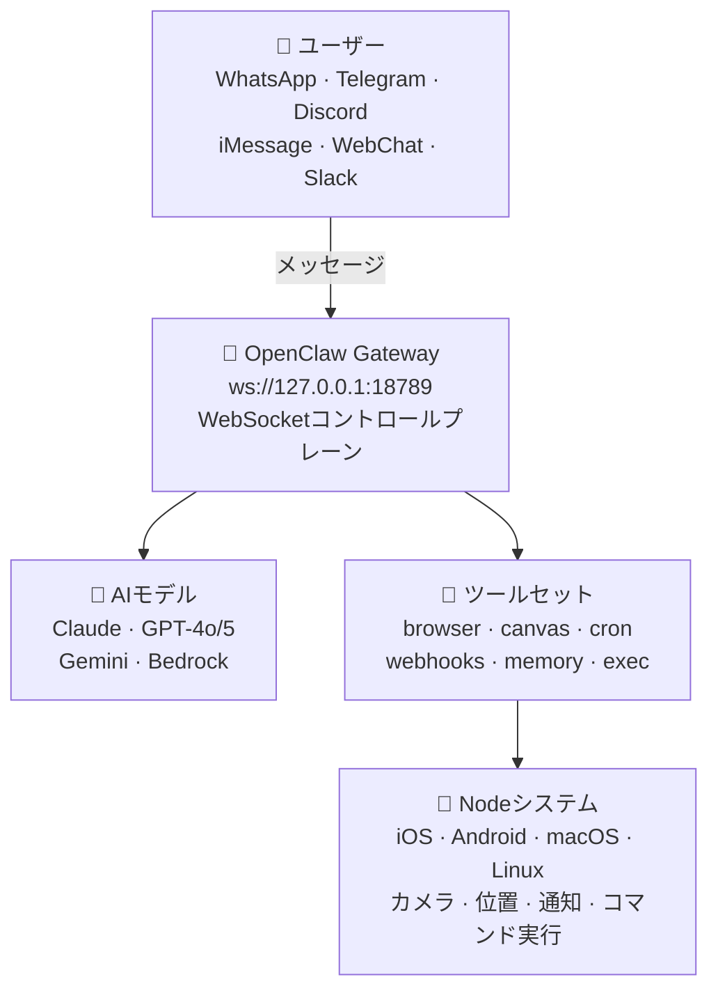

> 📚 <strong>シリーズ：OpenClaw 完全攻略</strong>
> - <strong>第1回：紹介編（この記事）</strong> — OpenClawとは？なぜ特別なのか？
> - [第2回：チュートリアル編](/ja/blog/ja/openclaw-installation-tutorial/) — インストールから最初の会話まで
> - [第3回：実践活用編](/ja/blog/ja/openclaw-practical-usage/) — スキル、自動化、上級ワークフロー

---

## 🤖 AIアシスタント時代、なぜOpenClawなのか？

ChatGPT、Claude、Gemini… 最近AIチャットボットを使ったことがない人はいないでしょう。でも、こんなことを考えたことはありませんか？

> 「このAIを<strong>自分のTelegram</strong>でそのまま使えないかな？」  
> 「<strong>スマホのカメラ</strong>をAIが制御できたら？」  
> 「データが他人のサーバーに溜まるのはちょっと気になる…」  
> 「複数のAIモデルを自由に切り替えて使えないかな？」

まさにこうした悩みを解決するために生まれたプロジェクトがあります。<strong>OpenClaw</strong> 🦞 です。

今回はOpenClawとは何か、何が特別なのか、そしてどんな人にぴったりのツールなのかを徹底的に紹介します！

---

## 🦞 OpenClawとは？

<strong>OpenClaw</strong>はオープンソースの<strong>パーソナルAIアシスタントプラットフォーム</strong>です。

簡単に言えば、皆さんが毎日使っているメッセンジャー（Telegram、WhatsApp、Discordなど）に<strong>自分だけのAIアシスタントを接続できるシステム</strong>です。AIモデルを自分で選んで接続し、さまざまなツールやスキルを追加して独自のワークフローを構築できます。

| 項目 | 内容 |
|---|---|
| <strong>ライセンス</strong> | MIT（完全に自由に使用可能） |
| <strong>GitHub</strong> | [github.com/openclaw/openclaw](https://github.com/openclaw/openclaw) |
| <strong>公式ドキュメント</strong> | [docs.openclaw.ai](https://docs.openclaw.ai) |
| <strong>制作者</strong> | Peter Steinberger([@steipete](https://twitter.com/steipete))、Mario Zechner(Pi制作者) |
| <strong>スキルマーケット</strong> | [ClawHub](https://clawhub.com) |
| <strong>コミュニティ</strong> | Discord — [discord.gg/clawd](https://discord.gg/clawd) |

MITライセンスなので、個人でも企業でも自由に使用・修正できます。コミュニティも活発に運営されているので、気になることがあればDiscordに参加してみてください！ 💬

### GitHubリポジトリを見てみよう

以下はOpenClawのGitHubリポジトリのメインページです。READMEでプロジェクトの全体構造とクイックスタートガイドを確認できます。


---

## ✨ 主な特徴

### 📱 マルチチャネル — どこからでもAIと会話

OpenClawの最大の魅力の一つは<strong>チャネルの多様性</strong>です。

- <strong>WhatsApp</strong> — Baileysを通じたWhatsApp Webプロトコル連携
- <strong>Telegram</strong> — grammYベースのBot API（DM + グループ）
- <strong>Discord</strong> — discord.jsベースのBot API（DM + サーバーチャネル）
- <strong>iMessage</strong> — macOSのimsg CLI統合
- <strong>Mattermost</strong> — プラグインによるBot連携
- <strong>Slack、Signal、MS Teams</strong> — 追加プラグイン
- <strong>WebChat</strong> — ブラウザから直接アクセスするローカルチャットUI

別途アプリをインストールする必要なく、<strong>すでに使っているメッセンジャーですぐに</strong>AIアシスタントを利用できます。Telegramでメッセージを送るようにAIに話しかけるだけでOKです。

### 💻 マルチプラットフォーム

- <strong>macOS</strong> — ネイティブアプリ + メニューバーコンパニオン
- <strong>iOS</strong> — ノードアプリでペアリング + Canvasサーフェス
- <strong>Android</strong> — ノードアプリでCanvas + Chat + Camera
- <strong>Windows</strong> — ネイティブサポート（WSL2も対応）
- <strong>Linux</strong> — ネイティブ + サーバーデプロイ

事実上すべての主要プラットフォームをサポートしています。

### 🏗️ Gatewayアーキテクチャ

OpenClawの心臓部は<strong>Gateway</strong>です。単一のコントロールプレーンとして動作し、`ws://127.0.0.1:18789`を通じてすべてのチャネルとツールを一つに接続します。

Gatewayの主な役割：
- <strong>チャネル接続管理</strong> — すべてのメッセンジャーチャネルのWebSocket接続を管理
- <strong>エージェントブリッジ</strong> — Piコーディングエージェントとのみ RPC通信
- <strong>ツールルーティング</strong> — ブラウザ、ファイルシステム、cronなどのツール呼び出しを中継
- <strong>セッション管理</strong> — DMは共有`main`セッションに、グループは隔離されたセッションに自動ルーティング
- <strong>Canvasホスト</strong> — `http://<gateway>:18793`でノードWebView用UIを提供
- <strong>ダッシュボード</strong> — `http://127.0.0.1:18789/`でブラウザControl UIから設定管理

### 🧠 多彩なAIモデルサポート

- <strong>Anthropic Claude</strong>（Opus、Sonnet、Haiku）
- <strong>OpenAI</strong>（GPT-4o、GPT-5、o1など）
- <strong>Google Gemini</strong>
- <strong>Amazon Bedrock</strong>経由のモデルアクセス
- <strong>Subscription Auth</strong> — Claude Pro/Max、ChatGPT/Codex OAuth連携

一つのモデルに縛られず、用途に応じて<strong>自由にモデルを切り替え</strong>られます。cronジョブには安価なモデルを、重要な分析には高性能モデルを割り当てるといった<strong>モデルルーティング</strong>も可能です。

### 🔧 強力なツールセット

OpenClawに内蔵されたツールは単なるプラグインではなく、<strong>エージェントが実際に世界と対話する手段</strong>です。

| ツール | 説明 |
|---|---|
| 🌐 `browser` | AIがWebページを直接探索・操作（Chrome拡張リレー含む） |
| 🎨 `canvas` | エージェントが制御する視覚的ワークスペース — ノードWebViewにUI表示 |
| ⏰ `cron` | 一回限りのリマインダーから繰り返しタスクまでGateway内蔵スケジューラ |
| 🔗 `webhooks` | 外部サービス（GitHub、Gmailなど）とリアルタイム連携 |
| 🧠 `memory_search` | 過去の会話や保存された情報を自然言語で検索 |
| 💬 `message` | チャネル間メッセージ送信、編集、リアクション |
| 📱 `nodes` | iOS/Android/macOSデバイスのリモート制御 |
| 🖥️ `exec` | シェルコマンド実行（PTYサポート、セキュリティ承認システム） |
| 📝 `read`/`write`/`edit` | ファイルシステム直接操作 |
| 🔍 `web_search`/`web_fetch` | Web検索およびページコンテンツ抽出 |
| 🎤 `tts` | テキストを音声に変換 |

### 🛒 Skillsシステム & ClawHub

<strong>AgentSkillsフォーマット</strong>と互換性のあるスキルシステムを備えており、<strong>ClawHubマーケットプレイス</strong>で他のユーザーが作成したスキルをインストールしたり、自分のスキルを共有したりできます。


スキルは3か所からロードされます（優先順位順）：
1. <strong>ワークスペーススキル</strong>（`<workspace>/skills/`） — 最高優先度
2. <strong>管理スキル</strong>（`~/.openclaw/skills/`） — すべてのエージェントで共有
3. <strong>バンドルスキル</strong> — OpenClawパッケージに含まれるデフォルトスキル

スキルのインストールは1行で完了：
```bash
npx clawhub@latest install <スキル名>
```

### 📲 ノードシステム

iOS、Android、macOSデバイスを<strong>ノード</strong>として接続すれば、AIが物理世界と対話できます：

| 機能 | 説明 |
|---|---|
| 📷 カメラスナップ | 前面/背面カメラで撮影 |
| 🎬 カメラクリップ | 短い動画を録画 |
| 🖥️ 画面録画 | 現在の画面をキャプチャ |
| 🔔 プッシュ通知 | システム/オーバーレイ/自動通知を送信 |
| 📍 位置確認 | GPS位置情報を取得（coarse/balanced/precise） |
| 📱 SMS | AndroidノードからSMS送信 |
| ⌨️ コマンド実行 | ノードホストでシェルコマンド実行（Exec承認必要） |

ノードはGateway WebSocketに接続され、<strong>ペアリング承認</strong>を経て有効化されます。スマホがAIの目と耳になるわけです！

### 🤖 マルチエージェントシステム

OpenClawは一つのGatewayで<strong>複数のエージェントを同時に運用</strong>できます。

- <strong>エージェント別ワークスペース</strong> — それぞれ独立した作業空間
- <strong>エージェント別サンドボックス</strong> — Docker基盤の隔離実行環境
- <strong>エージェント別ツール制限</strong> — 特定のエージェントには`exec`をブロックし`read`のみ許可するなど
- <strong>バインディングルール</strong> — WhatsAppグループA → 業務エージェント、Telegram DM → パーソナルエージェント
- <strong>サブエージェント</strong> — メインエージェントがバックグラウンドタスクをサブエージェントに委任

### 🎙️ Voice Wake + Talk Mode

キーボードなしで<strong>音声でAIと会話</strong>できます。macOSアプリのWake word機能で呼び出し、Talk Modeで自然な会話を続けましょう。

---

## 🏛️ アーキテクチャ全体像



核心原則：
- <strong>Loopback-first</strong>：Gateway WSはデフォルトでlocalhostのみバインド
- <strong>1つのGateway、1つのホスト</strong>：WhatsApp Webセッション所有権の競合防止
- <strong>トークンベース認証</strong>：非ローカルバインド時はトークン必須
- <strong>Tailscale/VPN</strong>：リモートアクセスはSSHトンネルやTailnet利用を推奨

---

## 🆚 他のAIアシスタントとの違いは？

| 比較項目 | ChatGPT / Claude アプリ | <strong>OpenClaw</strong> |
|---|---|---|
| ホスティング | クラウド（他社サーバー） | <strong>セルフホスティング</strong>（自分のPC） |
| データプライバシー | サーバーに保存 | <strong>ローカルにのみ保存</strong> 🔒 |
| 利用チャネル | 専用アプリ/Webのみ | <strong>Telegram、Discordなど既存メッセンジャー</strong> |
| AIモデル | 当該企業のモデルのみ | <strong>Claude、GPT、Gemini自由選択</strong> |
| 拡張性 | 限定的（プラグインストア） | <strong>スキル、Webhook、cron、MCP、カスタムツール</strong> |
| デバイス制御 | ❌ 不可 | ✅ <strong>カメラ、画面、位置、コマンド実行</strong> |
| 自動化 | ❌ 不可 | ✅ <strong>cron、ハートビート、Webhook</strong> |
| マルチエージェント | ❌ 不可 | ✅ <strong>エージェント別ルーティング、サンドボックス</strong> |
| オープンソース | ❌ | ✅ <strong>MITライセンス</strong> |

核心的な違いを一行でまとめると：

> <strong>「他人のサービスを借りるのではなく、自分のインフラの上で自分のルールで動くAIアシスタント。」</strong>

---

## 🎯 こんな方におすすめ！

- 🔐 <strong>プライバシーを重視する方</strong> — すべてのデータが自分のPCにのみ残ります
- 🛠️ <strong>自動化好きな開発者</strong> — cron、Webhook、スキル、MCPで無限に拡張
- 📱 <strong>複数のメッセンジャーを使う方</strong> — TelegramでもDiscordでもどこでも同じAIアシスタント
- 🤓 <strong>AI技術を自分で触ってみたい方</strong> — オープンソースだからコードレベルで理解可能
- 🏠 <strong>ホームオートメーションに興味がある方</strong> — NodeシステムでIoT的な活用が可能
- 👨‍💼 <strong>チームにAIを導入したい方</strong> — マルチエージェントで役割別AI運用が可能
- 🔧 <strong>既存ワークフローにAIを統合したい方</strong> — Webhook、n8n、Makeなどと簡単に連携

逆に、「ChatGPTのWebでたまに質問する程度」で満足されている方なら、わざわざOpenClawまで使う必要はないかもしれません。OpenClawは<strong>「AIを自分の生活に深く統合したい人」</strong>のためのツールです。

---

## 🌍 プロジェクトエコシステム

OpenClawは単独プロジェクトではなく、複数のコンポーネントで構成された<strong>エコシステム</strong>です：

| コンポーネント | 役割 |
|---|---|
| <strong>OpenClaw Gateway</strong> | コアランタイム — チャネル、ツール、エージェント管理 |
| <strong>Pi</strong> | コーディングエージェントエンジン — RPCモードでGatewayと通信 |
| <strong>ClawHub</strong> | スキルレジストリ — 検索、インストール、更新、共有 |
| <strong>OpenClaw.app</strong> | macOSデスクトップアプリ — メニューバー + Voice Wake |
| <strong>OpenClaw iOS</strong> | iPhone/iPadノードアプリ — Canvas + カメラ |
| <strong>OpenClaw Android</strong> | Androidノードアプリ — Canvas + Chat + Camera |
| <strong>公式ドキュメント</strong> | docs.openclaw.ai — 総合ガイド |

---

## 📢 次回予告

今回の記事ではOpenClawとは何か、なぜ特別なのかを紹介しました。

<strong>[第2回：チュートリアル編](/ja/blog/ja/openclaw-installation-tutorial/)</strong>では、実際にOpenClawを<strong>インストールして設定するプロセス</strong>をステップバイステップで一緒に進めていきます！

- Node.jsインストール & Gatewayオンボーディング
- Telegramチャネル接続とペアリング
- 最初のAI会話を始める
- ワークスペースのファイル構造を理解する

> 🦞 <strong>「百聞は一Runに如かず」</strong> — 次回、実際に動かしてみましょう！

---

*この記事が役に立ったらシェアをお願いします！質問は[Discordコミュニティ](https://discord.gg/clawd)で歓迎です。* 🙌
