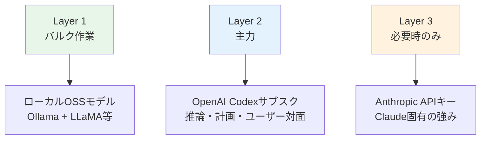

## 発端：ClaudeとGeminiのToS変更

2026年初頭、Anthropic（Claude）とGoogle（Gemini）が利用規約を更新しました。問題の核心は、<strong>サブスクリプション（Pro/Max等）のOAuth認証をサードパーティツールで使えるのか</strong>という点です。

これまで多くのOpenClawユーザーがClaude ProやGemini AdvancedをOAuthで接続し、エージェントを動かしていました。ToS変更を受けて「このまま使い続けて大丈夫か？」という不安が広がり、コミュニティで代替策の議論が始まりました。

結論から言えば、<strong>OpenAIのChatGPT Plus/Proサブスクリプションに含まれるCodex OAuthは、サードパーティ連携を明示的に許可</strong>しています。この記事では、実際の切り替え手順と注意点を整理します。

## 切り替え前に確認すること

すぐに移行する前に、3つのポイントを押さえておきましょう。

- <strong>プロンプトの互換性</strong>：ClaudeとGPT-5.x-Codexは同じプロンプトでも異なる応答をします。`SOUL.md`や`AGENTS.md`を数日かけて調整する必要があります
- <strong>モデルごとの強み</strong>：Codexはコードとツール呼び出し（Tool Use）に強い一方、エッセイやSNS投稿のような自然な文章ではClaudeの評価が高いです
- <strong>APIキーという選択肢</strong>：Claudeを使い続けたい場合、サブスクOAuthではなくAPIキー方式（`console.anthropic.com`）が使えます。ただし、Opusでエージェントループを回すと月$100を超えやすいので注意が必要です

## 切り替え手順（4ステップ）

コミュニティで検証済みの手順です。所要時間は約15分です。

### ステップ1：バックアップ

まず現在の設定をまるごとバックアップします。

```bash
cd ~
tar -czf openclaw-backup.tgz .openclaw
```

チャネル設定、メモリ、cronジョブ、認証情報がすべてこの中に入ります。

### ステップ2：オンボーディングウィザードの実行

```bash
openclaw onboard --auth-choice openai-codex
```

ウィザードが始まるといくつか質問が表示されます。下表の通り選択してください。

| 画面 | 選択 | 理由 |
|------|------|------|
| "This is risky" 警告 | <strong>そのまま進む</strong> | プロバイダー変更に伴う動作差異の案内です |
| Setup mode | <strong>Quickstart</strong> | デフォルト値で素早く設定します |
| 既存値の扱い | <strong>⚠️ 必ず "Use existing values"</strong> | "Reset"を選ぶとチャネル・メモリ・cron設定がすべて消えます |

ブラウザが開いたら、ChatGPTアカウントでログインして権限を承認します。

<strong>🔴 注意</strong>：承認が終わったら、<strong>ターミナルのウィザードをすぐ閉じてください。</strong>既存の設定がある状態でウィザードを最後まで進めると、設定が上書きされる可能性があります。

### ステップ3：デフォルトモデルの変更

```bash
openclaw models set openai-codex/gpt-5.3-codex
```

### ステップ4：確認

```bash
openclaw models status --plain
```

`primary`に`openai-codex/gpt-5.3-codex`と表示されれば完了です。

## Anthropic認証の完全削除（任意）

既存の認証をきれいに整理したい場合は以下を実行します。

```bash
# フォールバックモデルの削除
openclaw models fallbacks clear

# 認証順序の削除
openclaw models auth order clear --provider anthropic

# 環境変数の整理（~/.openclaw/.env）
# ANTHROPIC_API_KEY=... の行を削除

# ゲートウェイ再起動と状態確認
openclaw gateway restart
openclaw doctor
```

## エージェント別のモデル設定 — 見落としがちなポイント

切り替え後に最もよくあるミスがここです。<strong>`openclaw models set`はグローバルデフォルトしか変更しません。</strong>エージェントに個別にモデルが指定されている場合、そのエージェントは以前のモデルをそのまま使います。

`openclaw.json`の`agents.list`を確認しましょう。

```json
{
  "agents": {
    "defaults": {
      "model": {
        "primary": "openai-codex/gpt-5.3-codex"  // ← グローバル（変更済み）
      }
    },
    "list": [
      {
        "id": "branding",
        "model": {
          "primary": "anthropic/claude-opus-4-6"  // ← まだClaude
        }
      }
    ]
  }
}
```

エージェント別にモデルを変える方法は2つあります。

```bash
# 方法1：cronジョブ単位でモデルを指定
openclaw cron edit <cron-id> --model "openai-codex/gpt-5.3-codex"

# 方法2：エージェントのmodelブロックを削除 → グローバルデフォルトに従う
```

一括で切り替えるなら、エージェント別の`model`ブロックを削除するのが簡単です。

## レイヤー戦略 — コミュニティ推奨アーキテクチャ

一つのプロバイダーに頼り切るのではなく、用途ごとにモデルを分ける<strong>レイヤー戦略</strong>がコミュニティで定着しつつあります。



| Layer | 用途 | モデル | 課金 |
|-------|------|--------|------|
| <strong>Layer 1</strong> | ファイル処理、探索的作業 | ローカルOSS（Ollama + LLaMA等） | 無料（電気代のみ） |
| <strong>Layer 2</strong> | 推論、計画、ユーザー対面 | OpenAI Codexサブスク | 月額 |
| <strong>Layer 3</strong> | Claudeの強みが必要なとき | Anthropic APIキー | トークン課金 |

この構成なら、プロバイダーがポリシーを変えても<strong>設定ファイルを1行修正するだけ</strong>で対応できます。

## 切り替え後の体感

実際に移行したユーザーの共通した感想です。

- <strong>プロンプト調整は必須</strong>：`SOUL.md`、`AGENTS.md`を数日かけて調整しないと安定しません
- <strong>コード・ツール呼び出しは確かに強い</strong>：コード生成とTool Useで体感できる違いがあります
- <strong>自然な文章は惜しい</strong>：エッセイやSNS投稿ではClaudeの方が自然だという評価が多いです
- <strong>安定性は高い</strong>：OAuth認証が安定しており、トークン消費を気にせずエージェントを回せます

## Claudeを使い続けたい場合

APIキー方式はToSに関係なく利用できます。

```bash
openclaw onboard --auth-choice anthropic
```

`console.anthropic.com`でAPIキーを発行し、トークン課金で運用します。Opusのエージェントループでは月額が$100を超えやすいため、コスト管理が重要です。

## 比較まとめ

| 項目 | Claude サブスクOAuth | Codex サブスクOAuth | Claude APIキー |
|------|---------------------|---------------------|----------------|
| ToSリスク | ⚠️ 不確実 | ✅ 明示的に許可 | ✅ 合法 |
| 月額コスト | サブスク料 | サブスク料 | 使用量比例 |
| 文章品質 | ⭐⭐⭐ | ⭐⭐ | ⭐⭐⭐ |
| コード/ツール | ⭐⭐ | ⭐⭐⭐ | ⭐⭐ |
| 切り替え難度 | — | 簡単（15分） | 簡単 |

最も大切なのは、<strong>特定のプロバイダーに依存しない構成</strong>を作っておくことです。OpenClawの設定ベースのアーキテクチャを活かせば、どのプロバイダーがポリシーを変えても柔軟に対応できます。

## 参考資料

- [OpenClaw公式ドキュメント — プロバイダー設定](https://docs.openclaw.ai/providers/openai)
- [OpenClaw Discordコミュニティ](https://discord.com/invite/clawd)
- [OpenAI Codex認証ガイド](https://docs.openclaw.ai/cli/index)
