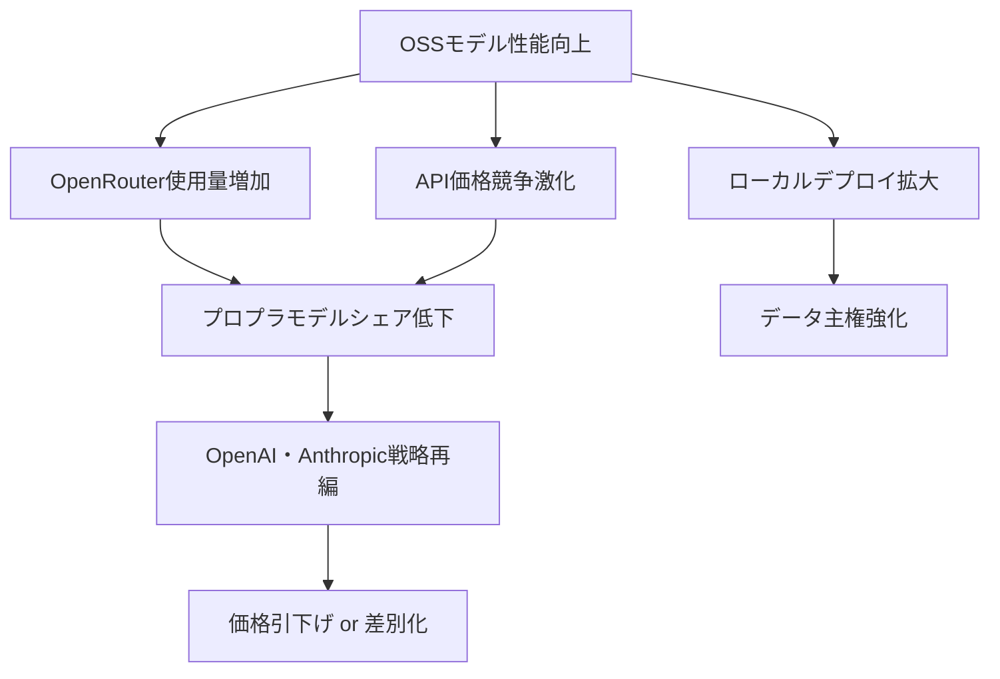

## 概要

AIモデルルーティングプラットフォーム<strong>OpenRouter</strong>の週間利用ランキングで、驚くべき変化が観測されました。TOP5モデルのうち<strong>4つがオープンソースモデル</strong>で占められたのです。Qwen3-Coder、DeepSeek R2、MiniMax M2.5などが上位を独占し、これまで当然視されてきたプロプライエタリ（独占）モデルの優位が崩れつつあることを示しています。

本記事では、OpenRouterランキングデータを基に、オープンソースモデルが実際の使用量ベースでプロプラモデルを上回るようになった構造的要因を分析します。

## OpenRouter週間ランキング：何が変わったのか

### TOP5構成

Redditのr/LocalLLAMAコミュニティで共有されたデータによると、OpenRouter週間利用量TOP5は以下の通りです：

| 順位 | モデル | 種類 | 特徴 |
|------|--------|------|------|
| 1 | Qwen3-Coder | 🟢 OSS | Alibabaのコーディング特化モデル |
| 2 | DeepSeek R2 | 🟢 OSS | 推論特化の大規模モデル |
| 3 | MiniMax M2.5 | 🟢 OSS | コスト効率の高い汎用モデル |
| 4 | GPT-4.1 | 🔵 プロプラ | OpenAIのフラッグシップ |
| 5 | Llama 4 Maverick | 🟢 OSS | Metaのオープンソース大規模モデル |

5つ中4つがオープンソースという事実は、単なる数値以上の意味を持ちます。<strong>実際の開発者がコストを支払いながら選択した結果</strong>だからです。

### OpenRouterが重要な理由

OpenRouterは、様々なAIモデルを単一APIでアクセスできるプラットフォームです。ユーザーが自らモデルを選択し、実際のトークン使用量に応じてコストを支払います。そのため、このランキングは<strong>マーケティングやベンチマークではなく、実使用の選好度</strong>を反映しています。

## オープンソースモデルが選ばれる5つの理由

### 1. 圧倒的なコスト効率

オープンソースモデルはAPIプロバイダー間の競争が活発で、同等性能に対するコストが大幅に低くなっています。Qwen3-CoderはGPT-4.1比で<strong>約1/10の価格</strong>で同等のコーディング性能を提供します。

```
コスト比較（1Mトークン基準、推定）:
┌─────────────────┬──────────┬──────────┐
│ モデル          │ 入力     │ 出力     │
├─────────────────┼──────────┼──────────┤
│ GPT-4.1         │ $2.00    │ $8.00    │
│ Qwen3-Coder     │ $0.20    │ $0.60    │
│ DeepSeek R2     │ $0.30    │ $1.20    │
│ MiniMax M2.5    │ $0.15    │ $0.60    │
└─────────────────┴──────────┴──────────┘
```

### 2. 性能格差の消滅

2024年まではGPT-4が圧倒的な性能優位を誇りましたが、2025〜2026年にかけてオープンソースモデルの性能が急速に向上しました：

- <strong>Qwen3-Coder</strong>：コーディングベンチマークでGPT-4.1と同等以上の性能
- <strong>DeepSeek R2</strong>：数学・推論で最上位の性能、Chain-of-Thought推論に強み
- <strong>MiniMax M2.5</strong>：汎用タスクでコスト対比最高効率

### 3. 透明性とカスタマイズ可能性

オープンソースモデルは重みが公開されており、以下が可能です：

- <strong>ファインチューニング</strong>：特定ドメインへのカスタム最適化
- <strong>ローカルデプロイ</strong>：データプライバシーの確保
- <strong>アーキテクチャ理解</strong>：モデル動作原理の検証
- <strong>セルフホスティング</strong>：ベンダーロックインのないインフラ構築

### 4. 中国AI企業の攻撃的オープンソース戦略

Alibaba（Qwen）、DeepSeek、MiniMaxなどの中国AI企業は、最高性能モデルをオープンソースで公開する戦略を取っています：

- <strong>エコシステム先占</strong>：開発者コミュニティの獲得
- <strong>API収益モデル</strong>：オープンソースでユーザーを誘致し、クラウドAPIで収益化
- <strong>グローバル影響力拡大</strong>：欧米プロプラモデルとの差別化

### 5. コミュニティドリブンの最適化

オープンソースモデルはリリース後、コミュニティによって急速に最適化されます：

- <strong>量子化（Quantization）</strong>：GGUF、GPTQ、AWQなどで推論コスト削減
- <strong>推論最適化</strong>：vLLM、TensorRT-LLMなど高性能推論エンジンの適用
- <strong>アダプター共有</strong>：LoRAアダプターによるドメイン特化

## プロプライエタリモデルの残る強み

オープンソースの躍進にもかかわらず、プロプラモデルが依然として優位を持つ領域があります：

- <strong>マルチモーダル統合</strong>：GPT-4o、Geminiなどのビジョン・音声統合能力
- <strong>エンタープライズサポート</strong>：SLA、コンプライアンス、技術支援
- <strong>安全性フィルタリング</strong>：企業向けセーフティガードレール
- <strong>最先端研究</strong>：新アーキテクチャの革新は依然として大手ラボから始まる

しかし、こうした強みも時間の経過とともにオープンソースコミュニティが急速にキャッチアップしている傾向にあります。

## 業界への影響



### 開発者への示唆

1. <strong>マルチモデル戦略の採用</strong>：単一ベンダー依存を避け、OpenRouterのようなルーターを活用
2. <strong>コスト最適化</strong>：タスク別最適モデル選択（コーディング → Qwen3-Coder、推論 → DeepSeek R2）
3. <strong>ローカルデプロイの検討</strong>：機密データ処理時にオープンソースモデルのセルフホスティング
4. <strong>コミュニティ参加</strong>：オープンソースモデルの量子化・ファインチューニング成果の共有と活用

## 結論

OpenRouter週間ランキングでオープンソースモデル4つがTOP5を占めたことは、一時的な変化ではありません。コスト効率、性能格差の解消、カスタマイズ可能性、中国企業の攻撃的戦略、コミュニティ最適化という5つの構造的要因が生み出した<strong>パラダイムシフト</strong>です。

プロプライエタリモデルがなくなることはありませんが、「最高性能＝独占モデル」という公式はすでに崩壊しました。今後のAIエコシステムは、オープンソースとプロプラの共存の中で、<strong>実用性とコスト効率が選択の核心基準</strong>となる時代に突入しています。

## 参考資料

- [Reddit r/LocalLLaMA — 4 of the top 5 most used models on OpenRouter this week are Open Source](https://www.reddit.com/r/LocalLLaMA/comments/1r6g14s/4_of_the_top_5_most_used_models_on_openrouter/)
- [OpenRouter Rankings](https://openrouter.ai/rankings)
- [Qwen3-Coder 公式ページ](https://huggingface.co/Qwen)
- [DeepSeek 公式サイト](https://www.deepseek.com/)
