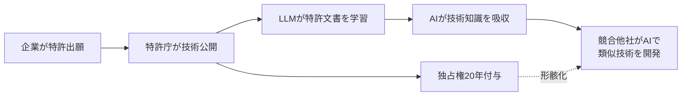
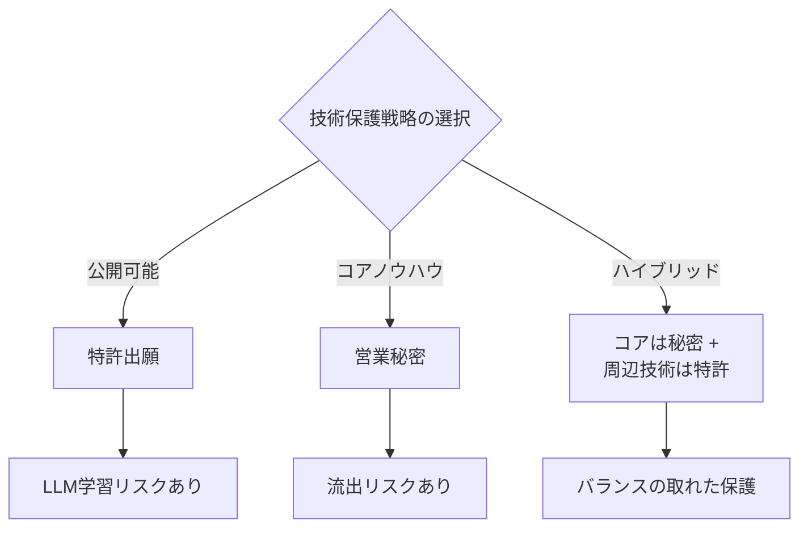

## 概要

Mark CubanがX（旧Twitter）で興味深い指摘をしました。<strong>「特許を公開するとLLMの学習素材になる」</strong>というものです。特許制度は本来「技術公開の対価として独占権を付与する」という社会的契約の上に成り立っています。しかしLLMが公開された特許文書を大量に学習することで、この前提が根本的に揺らいでいます。

本記事では、Cubanの指摘を出発点に、LLM時代における特許戦略の変化を分析します。

## Mark Cubanの核心的指摘

Cubanの主張を整理すると以下のとおりです：

1. <strong>特許は公開文書である</strong>：特許庁に出願すると技術内容が詳細に公開される
2. <strong>LLMは公開データを学習する</strong>：特許文書も学習データに含まれる
3. <strong>結果的にAIが特許技術を「知る」ことになる</strong>：独占権はあるが、技術知識自体はAIに吸収される

これは単なる特許侵害の問題を超え、<strong>特許制度の根本的な価値交換が崩れる状況</strong>を意味します。

## 特許制度の前提が揺らぐ理由

### 伝統的な特許の社会的契約

特許制度は200年以上にわたり、以下の前提で機能してきました：

| 発明者側 | 社会側 |
|----------|--------|
| 技術を詳細に公開 | 20年間の独占権付与 |
| 実施可能なレベルで記載 | 特許満了後の自由実施 |
| 技術進歩への貢献 | 後続発明の基盤提供 |

### LLMが変えるゲームのルール

LLM時代には、この契約のバランスが大きく崩れます：

- <strong>学習速度</strong>：人間のエンジニアが数年かかる特許をAIは数秒で学習
- <strong>抽象化能力</strong>：特許のコアアイデアを抽出し、変形した形で活用可能
- <strong>規模の問題</strong>：数百万件の特許を同時に学習し、技術間の接点を発見
- <strong>法的グレーゾーン</strong>：AIが学習した知識に基づく開発が特許侵害かどうか不明確

### 実際に起きていること

すでに複数の事例でこの問題が現実化しています：

1. <strong>コード生成AI</strong>：GitHub Copilotなどが特許されたアルゴリズムと類似するコードを生成するケース
2. <strong>創薬AI</strong>：公開された医薬特許を学習したAIが類似化合物を設計するケース
3. <strong>ハードウェア設計</strong>：半導体特許を学習したAIが回路設計を補助するケース

## 企業の特許戦略はどう変わるべきか

### 1. 営業秘密（トレードシークレット）戦略の復活

特許の代わりに営業秘密で保護する戦略が再注目されています。

<strong>メリット</strong>：
- LLMが学習できない（非公開のため）
- 期間制限なし（20年 vs 永久）
- 出願コスト不要

<strong>デメリット</strong>：
- リバースエンジニアリングに脆弱
- 独立発明者に対抗不可
- 従業員の転職時に流出リスク

### 2. 防衛的特許戦略の強化

特許を攻撃的な武器ではなく、<strong>防衛手段</strong>として活用する戦略です：

- <strong>パテントプール</strong>：業界全体で特許を共有し相互牽制
- <strong>防衛的公開（Defensive Publication）</strong>：特許出願の代わりに技術を先行技術として公開し、競合の特許化を防止
- <strong>クロスライセンシング</strong>：相互ライセンスによる技術交換

### 3. AI時代に適した特許の書き方

特許文書自体をLLMが容易に学習できないように作成するアプローチです：

- <strong>コアノウハウの分離</strong>：特許には最低限の情報のみ記載し、実施のための詳細ノウハウは営業秘密で保護
- <strong>抽象化レベルの調整</strong>：クレームは広く、明細書は戦略的に作成
- <strong>多層保護戦略</strong>：一つの技術を複数の特許と営業秘密の組み合わせで保護

### 4. AI学習制限のための法的対応

法的・政策的な次元での対応も必要です：

- <strong>特許データのAI学習制限法案</strong>：一部の国で議論中
- <strong>robots.txt方式の特許保護</strong>：特許データベースに学習制限メタデータを追加
- <strong>AI生成発明の特許性議論</strong>：AIが発明したものに特許を付与できるかの問題

## 業界別影響分析

| 業界 | 影響度 | 主要リスク | 推奨戦略 |
|------|--------|-----------|----------|
| 製薬/バイオ | 非常に高い | 化合物特許がAI創薬に活用 | 営業秘密 + 特許ハイブリッド |
| 半導体 | 高い | 回路設計特許がAI設計補助に活用 | コア工程は営業秘密化 |
| ソフトウェア | 中程度 | アルゴリズム特許がコード生成に影響 | OSS + サービスモデル転換 |
| 機械/製造 | 中程度 | 構造特許がCAD自動設計に活用 | 製造ノウハウの秘密維持 |

## 結論

Mark Cubanの指摘は単なる懸念ではなく、<strong>特許制度の根本的な再検討</strong>を求める問題提起です。LLMがあらゆる公開知識を吸収する時代に、「技術公開＝独占権」という200年来の社会的契約はもはや本来の機能を果たせない可能性があります。

企業は以下の3点を即座に検討すべきです：

1. <strong>現在の特許ポートフォリオのLLM露出度評価</strong>
2. <strong>営業秘密と特許の最適な組み合わせの再設計</strong>
3. <strong>AI時代に適した知財戦略ロードマップの策定</strong>

特許戦略のパラダイムが変わりつつあります。迅速に適応する企業だけが技術的優位性を維持できるでしょう。

## 参考資料

- [Mark CubanのXポスト](https://x.com/mcuban/status/2020857921928581592) — 特許公開とLLM学習に関する原文
- [WIPO — AIと知的財産権](https://www.wipo.int/about-ip/en/artificial_intelligence/) — 世界知的所有権機関のAI関連政策議論
- [USPTO — AI関連特許ガイドライン](https://www.uspto.gov/initiatives/artificial-intelligence) — 米国特許庁のAI発明関連ガイダンス
