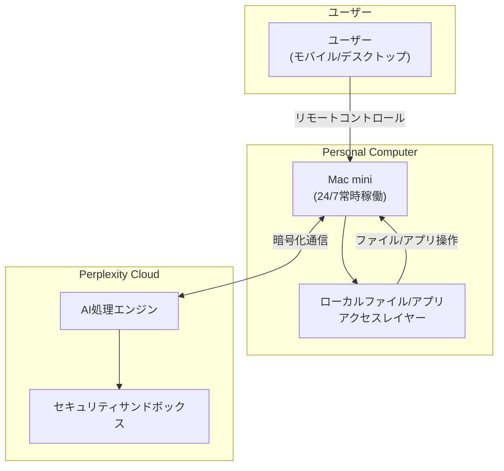
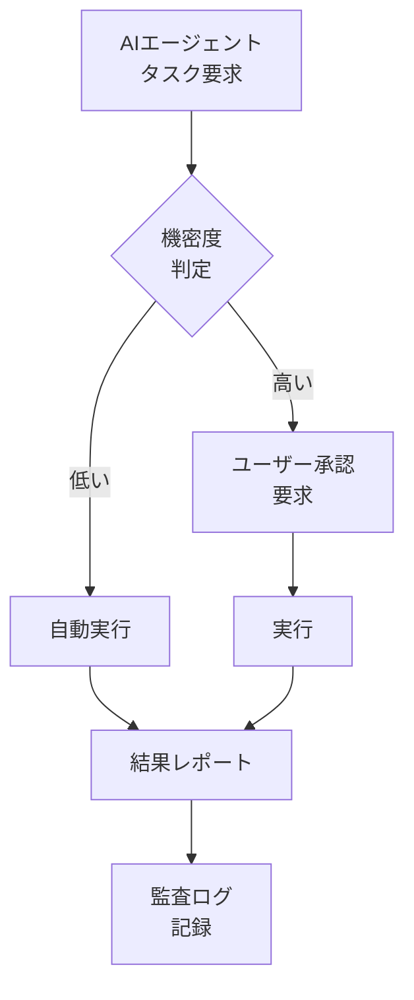

## 「Everything is Computer」 — AIがそのままコンピュータになる

2026年3月11日、Perplexityは<strong>「Everything is Computer」</strong>というビジョンを発表し、3つの製品を同時に公開しました。Computer、Personal Computer、Computer for Enterpriseです。この発表の核心はシンプルです — AIはもはや「ツール」ではなく「自分の代わりに動くコンピュータ」であるということです。

本記事では、EM（Engineering Manager）の視点からPerplexity Computerが開発チームと組織に与える影響を分析します。

## Perplexity Computer製品群の分析

### 1. Computer — クラウドAIエージェント

基本製品であるComputerは、Perplexityのクラウド上で動作するAIエージェントです。ウェブブラウジング、コード実行、データ分析などのタスクをユーザーの代わりに実行します。

### 2. Personal Computer — 24/7常時AIプロキシ

<strong>最も注目すべき製品</strong>はPersonal Computerです。専用のMac mini上で常時起動しており、ユーザーのファイルやアプリにアクセスして24時間業務を処理するデジタルプロキシとして機能します。

主な特徴：

- <strong>常時起動</strong>：Mac miniで24/7稼働し、ユーザーが寝ている間も作業を進行
- <strong>ローカルアクセス</strong>：Macのファイルシステムとアプリに直接アクセス可能
- <strong>リモートコントロール</strong>：どこからでも、どのデバイスからでも制御可能
- <strong>セキュリティモデル</strong>：機密性の高い操作はユーザー承認が必要、全アクション履歴を記録、キルスイッチ内蔵
- <strong>料金</strong>：月額200ドルのサブスクリプション

### 3. Computer for Enterprise — 組織単位のAIエージェント

Enterprise版は個人ではなく<strong>チームと組織</strong>向けに設計されています。Snowflake、Salesforce、HubSpotなどのビジネスソフトウェアと直接連携し、SlackのDMやチャンネルで協働できます。

<strong>主な成果</strong>：16,000件以上のクエリを対象とした内部テストにおいて、McKinsey、Harvard、MIT、BCGなどが使用する機関ベンチマーク基準で<strong>4週間で3.25年分の業務を完了</strong>し、約160万ドルの人件費を削減しました。

セキュリティインフラ：

- SOC 2 Type II認証
- SAML SSO
- 監査ログ（Audit logs）
- 管理者コントロール
- 隔離されたクラウド環境での作業実行

## 4週間 = 3.25年、この数値が意味するもの

PerplexityのEnterpriseテスト結果を分解してみましょう。

| 項目 | 数値 |
|---|---|
| 処理クエリ数 | 16,000件以上 |
| 等価業務時間 | 3.25年（約6,760時間） |
| 実際の所要時間 | 4週間（約672時間） |
| 生産性倍率 | <strong>約10倍</strong> |
| 削減人件費 | 160万ドル（約2.4億円） |

EM視点で、この数値は2つのことを示唆しています。

<strong>第一に、反復的な分析業務の自動化</strong>です。財務データの照会、市場分析、レポート作成といった業務はAIエージェントが処理できます。チームメンバーはこうした反復業務から解放され、より高い価値の意思決定に集中できるようになります。

<strong>第二に、「AI人員」という概念の登場</strong>です。月額200ドルで24時間稼働するジュニアアナリストを1人雇用したのと同等です。10人のチームにAIエージェント2台を追加すれば、12人規模のアウトプットを出せるという計算が可能になります。

## EMが注目すべき3つのポイント

### 1. ガバナンスモデル — 信頼とコントロールのバランス

Perplexity Computerは興味深いガバナンスモデルを提示しています。

核心は<strong>段階的権限（Graduated Authority）</strong>です。低リスクのタスクは自動で、機密性の高いタスクは承認を得て実行します。すべてのアクションはログに記録され、キルスイッチで即座に停止できます。

このパターンは、Galileoの Agent Control（3月13日にリリースされたAIエージェント向けオープンソースガバナンスプラットフォーム）が提示する原則とも一致しています。エンタープライズAIエージェント運用において、<strong>集中型ポリシー管理</strong>と<strong>ランタイムミティゲーション</strong>が業界標準になりつつあります。

### 2. 「常時AI」が変える業務パターン

AIエージェントが24時間稼働するということは、<strong>非同期業務の最大化</strong>を意味します。

- <strong>AS-IS</strong>：業務 → 退勤 → 翌日に続きを作業
- <strong>TO-BE</strong>：業務指示 → 退勤 → AIが夜通し作業 → 出勤時に結果レビュー

このパターンが実現すれば、チームのスループットは飛躍的に向上します。ただし、EMには新たなマネジメント能力が求められます。

- <strong>タスク分解能力</strong>：AIに委任できるタスクと人間が行うべきタスクを区別する能力
- <strong>結果レビュー能力</strong>：AIのアウトプットの品質を迅速に検証するスキル
- <strong>非同期オーケストレーション</strong>：AIエージェントのタスクキューを管理し、優先順位を調整する役割

### 3. コスト対効果の計算

| 比較項目 | ジュニア開発者 | Perplexity Personal Computer |
|---|---|---|
| 月額コスト | 4,000〜6,000ドル | 200ドル |
| 稼働時間 | 8時間/日 | 24時間/日 |
| 作業範囲 | 広範囲 | 分析/調査/自動化に特化 |
| 判断力 | 高い | 限定的（監督が必要） |
| 成長可能性 | 無限 | モデルアップデートに依存 |

AIエージェントはジュニア開発者を<strong>代替</strong>するものではなく、チームの<strong>オーグメンテーション（augmentation）</strong>のためのツールです。ジュニア開発者に反復業務をさせる代わりにAIエージェントに処理させ、ジュニア開発者はより高度な問題解決に取り組めるよう導くことが正しい活用法です。

## 競合構図と市場展望

Perplexity Computerは単独で存在しているわけではありません。現在、「常時AIエージェント」市場は急速に形成されています。

| 製品 | 特徴 | アプローチ |
|---|---|---|
| Perplexity Personal Computer | Mac miniベースの24/7エージェント | 専用ハードウェア + クラウドAI |
| OpenClaw | オープンソースAIアシスタント（21万スター） | 自前のハードウェアで実行 |
| Anthropic Claude | MCPベースのツール連携エージェント | API + プロトコル標準化 |
| OpenAI Codex | コーディング特化エージェント | クラウド専用 |

Gartnerは<strong>2026年末までにエンタープライズアプリの40%にAIエージェントが搭載される</strong>と予測しています（2025年の5%未満から急増）。常時AIエージェントはこの流れの最前線に位置しています。

## 導入時の考慮事項

今すぐPerplexity Computerを導入する必要はありません。しかし、以下の事項は準備しておくべきです。

1. <strong>AI委任可能な業務リストの作成</strong>：チーム内で反復的に行われている調査、分析、レポート作成業務をリストアップしましょう。
2. <strong>ガバナンスフレームワークの設計</strong>：AIエージェントにどのレベルの権限を与えるか、どの作業に人間の承認が必要かを定義しましょう。
3. <strong>非同期ワークフローの設計</strong>：AIエージェントにタスクを委任し、結果をレビューするプロセスを設計しましょう。
4. <strong>セキュリティポリシーの見直し</strong>：ローカルファイルへのアクセス、クラウドへのデータ転送、監査ログ管理に関するセキュリティポリシーを点検しましょう。

## まとめ

Perplexity Computerの登場は、AIエージェントが「対話ツール」から「常時業務処理者」へと進化する分水嶺です。月額200ドルで24時間稼働するデジタルプロキシ、4週間で3.25年分の業務を処理するエンタープライズエージェント — こうした数値はもはやSFではありません。

EMやCTOにとって重要なのはこの技術そのものではなく、<strong>この技術をチームにどう統合するか</strong>という戦略です。ガバナンスモデルを設計し、非同期ワークフローを構築し、AIと人間の役割を明確に区分する組織が先行するでしょう。

## 参考資料

- [Perplexity: Everything is Computer](https://www.perplexity.ai/hub/blog/everything-is-computer)
- [Computer for Enterprise](https://www.perplexity.ai/hub/blog/computer-for-enterprise)
- [Perplexity Personal Computer — 9to5Mac](https://9to5mac.com/2026/03/11/perplexitys-personal-computer-is-a-cloud-based-ai-agent-running-on-mac-mini/)
- [Enterprise 3.25 Years in 4 Weeks — PYMNTS](https://www.pymnts.com/news/artificial-intelligence/2026/perplexity-computer-enterprise-completed-3-years-work-4-weeks/)
- [Gartner AI Agent Prediction](https://www.gartner.com/en/newsroom/press-releases/2025-08-26-gartner-predicts-40-percent-of-enterprise-apps-will-feature-task-specific-ai-agents-by-2026-up-from-less-than-5-percent-in-2025)
