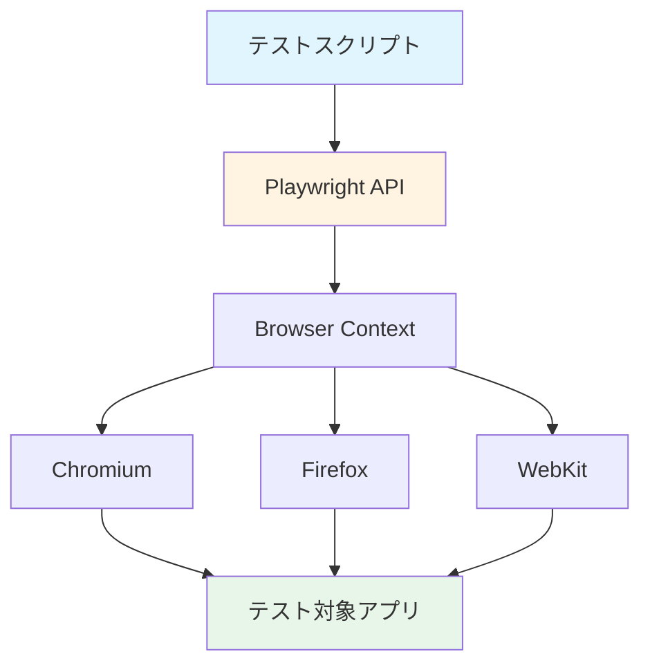
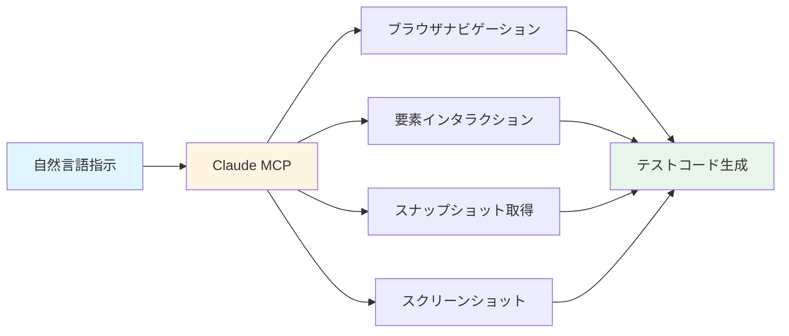

## 概要

現代のウェブ開発において、E2E(End-to-End)テストは品質保証の要となっています。しかし、従来のテスト作成は時間がかかり、メンテナンスコストも高いという課題がありました。

PlaywrightとAI技術の組み合わせは、この状況を一変させます。本記事では、MicrosoftのPlaywrightフレームワークとAIベースのコード生成ツールを活用し、効率的で保守性の高いE2Eテスト環境を構築する方法を詳しく解説します。

<strong>この記事で学べること</strong>:
- PlaywrightとAI Codegenの基本概念
- TypeScriptを使った実践的なテスト実装
- GitHub ActionsによるCI/CD統合
- ビジュアルリグレッションテストの導入
- 実務で即活用できるベストプラクティス

## Playwrightの核心概念

### Playwrightとは

PlaywrightはMicrosoftが開発したモダンなE2Eテスティングフレームワークです。Chromium、Firefox、WebKitの3つのブラウザエンジンをサポートし、クロスブラウザテストを簡単に実装できます。

<strong>主な特徴</strong>:
- <strong>自動待機機能</strong>: 要素が準備できるまで自動的に待機
- <strong>高速実行</strong>: 並列テスト実行とヘッドレスモードによる高速化
- <strong>信頼性</strong>: ネットワーク傍受、モック機能による安定したテスト
- <strong>開発者体験</strong>: TypeScript完全サポート、優れたデバッグツール

### アーキテクチャ概要



Playwrightは独自のプロトコルを使用してブラウザを制御し、各ブラウザエンジンとの通信を最適化しています。この設計により、従来のSeleniumよりも高速で信頼性の高いテストが可能になります。

## AIベースのテスト生成

### Playwright Codegen - 自動コード生成

Playwright Codegenは、ブラウザ操作を記録し、自動的にテストコードを生成するツールです。

<strong>基本的な使い方</strong>:

```bash
# Codegenの起動
npx playwright codegen https://example.com

# 特定のブラウザで記録
npx playwright codegen --browser=firefox https://example.com

# デバイスエミュレーション
npx playwright codegen --device="iPhone 13" https://example.com
```

<strong>生成されるコードの例</strong>:

```typescript
import { test, expect } from '@playwright/test';

test('ユーザーログインフロー', async ({ page }) => {
  // ページに移動
  await page.goto('https://example.com/login');

  // フォーム入力
  await page.fill('input[name="email"]', 'user@example.com');
  await page.fill('input[name="password"]', 'password123');

  // ログインボタンをクリック
  await page.click('button[type="submit"]');

  // ログイン成功を確認
  await expect(page).toHaveURL('https://example.com/dashboard');
  await expect(page.locator('h1')).toContainText('ダッシュボード');
});
```

### Claude Code + Playwright MCP統合

Claude Code MCPサーバーは、Playwrightの機能をAIエージェントに統合し、自然言語でテストを作成できるようにします。

<strong>MCPサーバーの主要機能</strong>:



<strong>MCP設定例</strong> (`claude_desktop_config.json`):

```json
{
  "mcpServers": {
    "playwright": {
      "command": "npx",
      "args": [
        "-y",
        "@executeautomation/playwright-mcp-server"
      ]
    }
  }
}
```

### AI支援によるテスト作成の利点

1. <strong>学習曲線の短縮</strong>: セレクタ構文やAPIを完全に理解していなくても開始可能
2. <strong>ベストプラクティスの自動適用</strong>: AIが推奨パターンを提案
3. <strong>迅速なプロトタイピング</strong>: アイデアから実装までの時間を大幅短縮
4. <strong>コードレビュー支援</strong>: 生成されたコードの改善点を提案

## 実践実装ガイド

### Step 1: プロジェクトセットアップ

```bash
# 新規プロジェクト作成
mkdir my-e2e-tests
cd my-e2e-tests

# package.json初期化
npm init -y

# Playwrightインストール
npm install -D @playwright/test

# ブラウザインストール
npx playwright install
```

### Step 2: 基本設定

`playwright.config.ts`を作成:

```typescript
import { defineConfig, devices } from '@playwright/test';

export default defineConfig({
  // テストディレクトリ
  testDir: './tests',

  // タイムアウト設定
  timeout: 30 * 1000,
  expect: {
    timeout: 5000
  },

  // 並列実行設定
  fullyParallel: true,

  // 失敗時の再試行
  retries: process.env.CI ? 2 : 0,

  // ワーカー数
  workers: process.env.CI ? 1 : undefined,

  // レポーター
  reporter: [
    ['html'],
    ['json', { outputFile: 'test-results.json' }],
    ['junit', { outputFile: 'test-results.xml' }]
  ],

  // 共通設定
  use: {
    // ベースURL
    baseURL: 'http://localhost:3000',

    // トレース記録
    trace: 'on-first-retry',

    // スクリーンショット
    screenshot: 'only-on-failure',

    // ビデオ記録
    video: 'retain-on-failure',
  },

  // プロジェクト設定
  projects: [
    {
      name: 'chromium',
      use: { ...devices['Desktop Chrome'] },
    },
    {
      name: 'firefox',
      use: { ...devices['Desktop Firefox'] },
    },
    {
      name: 'webkit',
      use: { ...devices['Desktop Safari'] },
    },
    // モバイルテスト
    {
      name: 'Mobile Chrome',
      use: { ...devices['Pixel 5'] },
    },
    {
      name: 'Mobile Safari',
      use: { ...devices['iPhone 12'] },
    },
  ],

  // 開発サーバー起動
  webServer: {
    command: 'npm run dev',
    url: 'http://localhost:3000',
    reuseExistingServer: !process.env.CI,
  },
});
```

### Step 3: 実践的なテストケース

#### ログインフロー完全版

```typescript
import { test, expect } from '@playwright/test';

test.describe('ユーザー認証フロー', () => {
  // 各テスト前の共通処理
  test.beforeEach(async ({ page }) => {
    await page.goto('/login');
  });

  test('正常なログインが成功する', async ({ page }) => {
    // フォーム入力
    await page.fill('[data-testid="email-input"]', 'test@example.com');
    await page.fill('[data-testid="password-input"]', 'SecurePass123!');

    // ログインボタンクリック
    await page.click('[data-testid="login-button"]');

    // リダイレクト待機
    await page.waitForURL('/dashboard');

    // ダッシュボード要素の確認
    await expect(page.locator('h1')).toContainText('ダッシュボード');

    // ユーザー情報の表示確認
    await expect(page.locator('[data-testid="user-profile"]'))
      .toContainText('test@example.com');
  });

  test('無効な認証情報でエラーメッセージが表示される', async ({ page }) => {
    await page.fill('[data-testid="email-input"]', 'wrong@example.com');
    await page.fill('[data-testid="password-input"]', 'wrongpassword');

    await page.click('[data-testid="login-button"]');

    // エラーメッセージの確認
    const errorMessage = page.locator('[data-testid="error-message"]');
    await expect(errorMessage).toBeVisible();
    await expect(errorMessage).toContainText('メールアドレスまたはパスワードが正しくありません');
  });

  test('パスワード表示トグルが機能する', async ({ page }) => {
    const passwordInput = page.locator('[data-testid="password-input"]');
    const toggleButton = page.locator('[data-testid="password-toggle"]');

    // 初期状態: パスワード非表示
    await expect(passwordInput).toHaveAttribute('type', 'password');

    // トグルクリック: 表示
    await toggleButton.click();
    await expect(passwordInput).toHaveAttribute('type', 'text');

    // 再度クリック: 非表示
    await toggleButton.click();
    await expect(passwordInput).toHaveAttribute('type', 'password');
  });
});
```

#### ショッピングカート操作

```typescript
test.describe('ショッピングカート機能', () => {
  test('商品の追加から購入完了まで', async ({ page }) => {
    await page.goto('/products');

    // 商品選択
    const firstProduct = page.locator('[data-testid="product-card"]').first();
    await firstProduct.click();

    // 商品詳細ページ
    await expect(page).toHaveURL(/\/product\/\d+/);

    // カート追加
    await page.click('[data-testid="add-to-cart"]');

    // カートバッジの更新確認
    await expect(page.locator('[data-testid="cart-badge"]'))
      .toContainText('1');

    // カートページへ移動
    await page.click('[data-testid="cart-icon"]');
    await expect(page).toHaveURL('/cart');

    // 商品がカートに存在することを確認
    const cartItems = page.locator('[data-testid="cart-item"]');
    await expect(cartItems).toHaveCount(1);

    // 数量変更
    await page.click('[data-testid="increase-quantity"]');
    await expect(page.locator('[data-testid="item-quantity"]'))
      .toContainText('2');

    // 合計金額の確認
    const totalPrice = page.locator('[data-testid="total-price"]');
    await expect(totalPrice).toBeVisible();

    // チェックアウト
    await page.click('[data-testid="checkout-button"]');
    await expect(page).toHaveURL('/checkout');
  });

  test('空のカートで警告メッセージが表示される', async ({ page }) => {
    await page.goto('/cart');

    const emptyMessage = page.locator('[data-testid="empty-cart-message"]');
    await expect(emptyMessage).toBeVisible();
    await expect(emptyMessage).toContainText('カートは空です');

    // チェックアウトボタンが無効化されている
    await expect(page.locator('[data-testid="checkout-button"]'))
      .toBeDisabled();
  });
});
```

#### フォームバリデーション

```typescript
test.describe('お問い合わせフォーム', () => {
  test.beforeEach(async ({ page }) => {
    await page.goto('/contact');
  });

  test('必須フィールドのバリデーション', async ({ page }) => {
    // 空の状態で送信
    await page.click('[data-testid="submit-button"]');

    // 各フィールドのエラーメッセージ確認
    await expect(page.locator('[data-testid="name-error"]'))
      .toContainText('名前を入力してください');
    await expect(page.locator('[data-testid="email-error"]'))
      .toContainText('メールアドレスを入力してください');
    await expect(page.locator('[data-testid="message-error"]'))
      .toContainText('メッセージを入力してください');
  });

  test('メールアドレス形式のバリデーション', async ({ page }) => {
    await page.fill('[data-testid="email-input"]', 'invalid-email');
    await page.click('[data-testid="submit-button"]');

    await expect(page.locator('[data-testid="email-error"]'))
      .toContainText('有効なメールアドレスを入力してください');
  });

  test('正常な送信が成功する', async ({ page }) => {
    // フォーム入力
    await page.fill('[data-testid="name-input"]', '山田太郎');
    await page.fill('[data-testid="email-input"]', 'yamada@example.com');
    await page.fill('[data-testid="message-input"]', 'お問い合わせ内容です。');

    // 送信
    await page.click('[data-testid="submit-button"]');

    // 成功メッセージの確認
    await expect(page.locator('[data-testid="success-message"]'))
      .toContainText('送信が完了しました');
  });
});
```

### Step 4: Page Object Model(POM)パターン

再利用性と保守性を向上させるため、Page Object Modelを導入します。

```typescript
// pages/LoginPage.ts
import { Page, Locator } from '@playwright/test';

export class LoginPage {
  readonly page: Page;
  readonly emailInput: Locator;
  readonly passwordInput: Locator;
  readonly loginButton: Locator;
  readonly errorMessage: Locator;

  constructor(page: Page) {
    this.page = page;
    this.emailInput = page.locator('[data-testid="email-input"]');
    this.passwordInput = page.locator('[data-testid="password-input"]');
    this.loginButton = page.locator('[data-testid="login-button"]');
    this.errorMessage = page.locator('[data-testid="error-message"]');
  }

  async goto() {
    await this.page.goto('/login');
  }

  async login(email: string, password: string) {
    await this.emailInput.fill(email);
    await this.passwordInput.fill(password);
    await this.loginButton.click();
  }

  async getErrorMessage(): Promise<string> {
    return await this.errorMessage.textContent() || '';
  }
}
```

<strong>POMを使用したテスト</strong>:

```typescript
import { test, expect } from '@playwright/test';
import { LoginPage } from './pages/LoginPage';

test('POMパターンを使用したログインテスト', async ({ page }) => {
  const loginPage = new LoginPage(page);

  await loginPage.goto();
  await loginPage.login('test@example.com', 'SecurePass123!');

  await expect(page).toHaveURL('/dashboard');
});
```

## GitHub Actions CI/CD統合

### ワークフロー設定

`.github/workflows/playwright.yml`を作成:

```yaml
name: Playwright Tests

on:
  push:
    branches: [ main, develop ]
  pull_request:
    branches: [ main, develop ]

jobs:
  test:
    timeout-minutes: 60
    runs-on: ubuntu-latest

    strategy:
      fail-fast: false
      matrix:
        browser: [chromium, firefox, webkit]

    steps:
    - name: リポジトリのチェックアウト
      uses: actions/checkout@v4

    - name: Node.jsのセットアップ
      uses: actions/setup-node@v4
      with:
        node-version: 20
        cache: 'npm'

    - name: 依存関係のインストール
      run: npm ci

    - name: Playwrightブラウザのインストール
      run: npx playwright install --with-deps ${{ matrix.browser }}

    - name: テスト実行
      run: npx playwright test --project=${{ matrix.browser }}
      env:
        CI: true

    - name: テストレポートのアップロード
      uses: actions/upload-artifact@v4
      if: always()
      with:
        name: playwright-report-${{ matrix.browser }}
        path: playwright-report/
        retention-days: 30

    - name: テスト結果のアップロード
      uses: actions/upload-artifact@v4
      if: always()
      with:
        name: test-results-${{ matrix.browser }}
        path: test-results/
        retention-days: 30

  report:
    name: レポート生成
    runs-on: ubuntu-latest
    needs: test
    if: always()

    steps:
    - name: テストレポートのダウンロード
      uses: actions/download-artifact@v4
      with:
        path: all-reports

    - name: 統合レポート生成
      run: |
        echo "すべてのテストが完了しました"
        # ここにレポート統合ロジックを追加可能
```

### 環境別設定

```typescript
// playwright.config.ts
import { defineConfig } from '@playwright/test';

export default defineConfig({
  use: {
    baseURL: process.env.CI
      ? 'https://staging.example.com'
      : 'http://localhost:3000',

    // CI環境ではヘッドレスモード強制
    headless: !!process.env.CI,
  },

  // CI環境では並列実行を抑制
  workers: process.env.CI ? 1 : undefined,

  // CI環境では再試行回数を増やす
  retries: process.env.CI ? 2 : 0,
});
```

## ビジュアルリグレッションテスト

### スクリーンショット比較

Playwrightの組み込み機能を使用したビジュアルテスト:

```typescript
test('ホームページのビジュアルリグレッション', async ({ page }) => {
  await page.goto('/');

  // ページ全体のスクリーンショット比較
  await expect(page).toHaveScreenshot('homepage.png', {
    fullPage: true,
    maxDiffPixels: 100,
  });
});

test('ボタンコンポーネントのビジュアル確認', async ({ page }) => {
  await page.goto('/components');

  const button = page.locator('[data-testid="primary-button"]');

  // 要素のスクリーンショット比較
  await expect(button).toHaveScreenshot('primary-button.png');

  // ホバー状態
  await button.hover();
  await expect(button).toHaveScreenshot('primary-button-hover.png');
});
```

### Percy統合(オプション)

より高度なビジュアルテストには、Percyなどのサービスを統合できます:

```bash
npm install --save-dev @percy/cli @percy/playwright
```

```typescript
import { test } from '@playwright/test';
import percySnapshot from '@percy/playwright';

test('Percyビジュアルテスト', async ({ page }) => {
  await page.goto('/');

  // Percyにスナップショット送信
  await percySnapshot(page, 'Homepage');

  // レスポンシブテスト
  await page.setViewportSize({ width: 375, height: 667 });
  await percySnapshot(page, 'Homepage - Mobile');
});
```

## ベストプラクティスと注意事項

### セレクタ戦略

<strong>推奨される優先順位</strong>:

1. <strong>data-testid属性</strong>: `page.locator('[data-testid="submit-button"]')`
2. <strong>role属性</strong>: `page.getByRole('button', { name: '送信' })`
3. <strong>ラベルテキスト</strong>: `page.getByLabel('メールアドレス')`
4. <strong>プレースホルダー</strong>: `page.getByPlaceholder('名前を入力')`
5. <strong>CSS/XPath</strong>: 最終手段として使用

<strong>アンチパターン</strong>:

```typescript
// 避けるべき: 脆弱なCSSセレクタ
await page.click('.btn.btn-primary.mt-4');

// 推奨: 明示的なdata属性
await page.click('[data-testid="submit-button"]');
```

### 待機戦略

Playwrightの自動待機を活用:

```typescript
// 自動待機(推奨)
await page.click('button'); // 要素が準備完了まで自動待機

// 明示的待機(必要な場合のみ)
await page.waitForSelector('[data-testid="loading"]', { state: 'hidden' });
await page.waitForLoadState('networkidle');

// タイムアウトカスタマイズ
await page.click('button', { timeout: 10000 });
```

### エラーハンドリング

```typescript
test('エラーハンドリングの例', async ({ page }) => {
  // ソフトアサーション(テスト継続)
  await expect.soft(page.locator('h1')).toContainText('期待値');
  await expect.soft(page.locator('p')).toBeVisible();

  // try-catchでカスタムエラー処理
  try {
    await page.click('[data-testid="optional-button"]', { timeout: 3000 });
  } catch (error) {
    console.log('オプショナル要素が見つかりませんでした');
  }

  // 条件付きアサーション
  const element = page.locator('[data-testid="dynamic-element"]');
  if (await element.isVisible()) {
    await expect(element).toHaveText('動的コンテンツ');
  }
});
```

### テストデータ管理

```typescript
// fixtures/testData.ts
export const testUsers = {
  admin: {
    email: 'admin@example.com',
    password: 'AdminPass123!',
  },
  regularUser: {
    email: 'user@example.com',
    password: 'UserPass123!',
  },
};

// テストで使用
import { testUsers } from './fixtures/testData';

test('管理者ログイン', async ({ page }) => {
  const loginPage = new LoginPage(page);
  await loginPage.login(testUsers.admin.email, testUsers.admin.password);
});
```

### パフォーマンス最適化

```typescript
test.describe('パフォーマンステスト', () => {
  test('ページロード時間の測定', async ({ page }) => {
    const startTime = Date.now();

    await page.goto('/');

    const loadTime = Date.now() - startTime;
    expect(loadTime).toBeLessThan(3000); // 3秒以内
  });

  test('Lighthouse統合', async ({ page }) => {
    await page.goto('/');

    // Playwrightのパフォーマンスメトリクス
    const metrics = await page.evaluate(() => {
      const navigation = performance.getEntriesByType('navigation')[0] as PerformanceNavigationTiming;
      return {
        domContentLoaded: navigation.domContentLoadedEventEnd - navigation.fetchStart,
        loadComplete: navigation.loadEventEnd - navigation.fetchStart,
      };
    });

    expect(metrics.domContentLoaded).toBeLessThan(2000);
  });
});
```

### デバッグテクニック

```typescript
test('デバッグ支援機能', async ({ page }) => {
  // ステップバイステップ実行
  await page.pause();

  // コンソールログの取得
  page.on('console', msg => console.log('ブラウザコンソール:', msg.text()));

  // スクリーンショット保存
  await page.screenshot({ path: 'debug-screenshot.png' });

  // トレース記録
  await page.context().tracing.start({ screenshots: true, snapshots: true });
  // ... テストアクション
  await page.context().tracing.stop({ path: 'trace.zip' });
});
```

## 結論

Playwright + AIの組み合わせは、E2Eテスト自動化における革新的なアプローチです。本記事で紹介した内容をまとめます:

<strong>主要なポイント</strong>:
1. <strong>Playwright Codegen</strong>: ブラウザ操作から自動的にテストコード生成
2. <strong>Claude MCP統合</strong>: 自然言語でテストを記述可能
3. <strong>TypeScript完全サポート</strong>: 型安全性と優れた開発者体験
4. <strong>CI/CD統合</strong>: GitHub Actionsで自動テスト実行
5. <strong>ビジュアルリグレッション</strong>: UIの意図しない変更を検出

<strong>次のステップ</strong>:
- 既存プロジェクトにPlaywrightを導入
- POMパターンでテストの保守性を向上
- CI/CDパイプラインに統合
- ビジュアルテストで品質をさらに強化

E2Eテストは初期投資が必要ですが、長期的には開発速度の向上とバグ削減につながります。Playwrightの強力な機能とAI支援を活用し、効率的なテスト自動化を実現しましょう。

## 参考資料

### 公式ドキュメント
- [Playwright公式ドキュメント](https://playwright.dev/)
- [Playwright Test Runner](https://playwright.dev/docs/test-runners)
- [Playwright Codegen](https://playwright.dev/docs/codegen)
- [Microsoft Playwright GitHub](https://github.com/microsoft/playwright)

### MCPとAI統合
- [Playwright MCP Server](https://github.com/executeautomation/playwright-mcp-server)
- [Claude MCP Documentation](https://modelcontextprotocol.io/)
- [Chrome DevTools MCP](https://github.com/yuiseki/mcp-server-chrome-devtools)

### コミュニティリソース
- [Playwright Discord](https://discord.com/invite/playwright)
- [Playwright YouTube Channel](https://www.youtube.com/@Playwrightdev)
- [Awesome Playwright](https://github.com/mxschmitt/awesome-playwright)

### 関連技術
- [Percy Visual Testing](https://percy.io/)
- [GitHub Actions Documentation](https://docs.github.com/actions)
- [TypeScript Handbook](https://www.typescriptlang.org/docs/)

---

<strong>著者より</strong>: E2Eテスト自動化は継続的な改善プロセスです。小さく始めて、徐々にカバレッジを拡大していくことをお勧めします。質問やフィードバックがあれば、コメント欄でお気軽にお知らせください。
