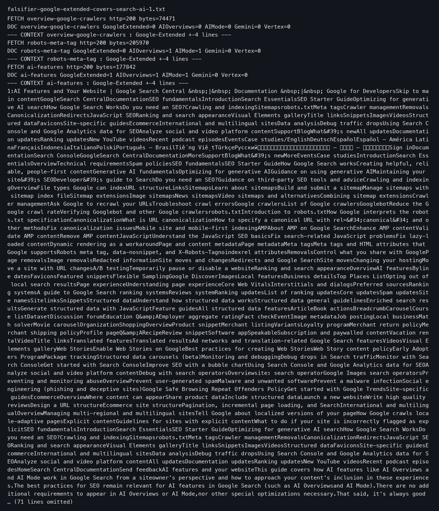

Google が AI 検索まわりでサイト運営者に見せている案内には、入り口と出口で厚さの差がある。入り口には専用の説明ページと貼り付けるだけで動くボタン用コードが用意され、出口は開発者文書のたった一文にまとめられている。三つの文書の表面と自サイト12URLの実測がその差を示す。

## Preferred Source と抜け道の非対称

Google は、サイトを「好まれる情報源」として AI の回答に載せる仕組みを出した。名前は Preferred Source という。読者が好みのサイトを選ぶと、そのサイトの内容が AI の回答で目立つ形で示される。公式文書には、こう書いてある。

> In AI Mode and AI Overviews, your content can be highlighted with a "preferred" badge for users who have selected your site as a preferred source.
> — [Preferred sources / Google Search Central](https://developers.google.com/search/docs/appearance/preferred-sources)

発表のブログ記事は、運営者にこの機能の設定場所を直接案内する。

> If you're a publisher, you can find the new "Preferred Source" button code in our Google Search Central documentation to get started.
> — [Personalize search and discover news with preferred sources / Google blog 発表文 (Aug 20, 2026)](https://blog.google/products-and-platforms/products/search/personalize-search-discover-news/)

いっぽうで、サイトを AI 検索から外したいときの説明は、別のページに一行しかない。そこには、ページから見せる情報の量を制限するための指定方法として四つの名前が並んでいる。

> To limit the information shown from your pages in Search, use nosnippet, data-nosnippet, max-snippet, or noindex controls.
> — [AI features / Google Search Central](https://developers.google.com/search/docs/appearance/ai-features)

この四つは「スニペット指定」と呼ばれるものだ。スニペットとは、検索結果に表示されるページの要約文のこと。nosnippet は「要約を見せるな」、data-nosnippet は「この部分だけ見せるな」、max-snippet は「要約はこの長さまで」、noindex は「このページ自体を見せるな」という、ページに付けられる目印である。同じ文書のどこを探しても、opt out という、外すことを申し込む意味の言葉は見つからない。原文のHTML（ウェブページを書くための言語）で数えても0件だった。

## 入る方向と出る方向で文書の量が違う

街の商店で考えれば分かりやすい。招き入れる側は、初日から店先に看板を出し、チラシを配り、来客用のボタンまで用意した。その一方で、店から抜ける方法は、店の奥の細則に一行書いてあるだけである。抜け道が制度上あることと、読者がその一行を見つけられることは別の話だ。Google の文書はこの形をしている。入る方向には新しい製品として専用のページが立ち、出る方向には昔からある目印の名前が一文に並べられている。

## 発表文の言葉の分布

非対称は発表文そのものの言葉遣いからも読み取れる。発表文の中で preferred source という言葉は7回出てくる。AI Overviews は1回、AI Mode は2回だ。いっぽう検索から外すことを示す言葉は、実質的に0回である。opt out が1回だけ出てくるが、それは読者がニュースレターの受け取りをやめる欄の文で、検索には関係しない。

つまり発表の日は、入る方向の言葉だけで文書が埋め尽くされ、出る方向の言葉はほとんど書かれていなかった。運営者がこの発表文だけ読めば、「AI 検索に載せる方法」は頭に残るが、「外す方法」は残らない。

## Google-Extended と検索掲載の公的な分離

robots.txt による指定について、よくある誤解がある。robots.txt という、サイトに来る収集プログラム（クローラー）への依頼書を書くためのファイルに、Google-Extended という名前で「来るな」と書いているサイトは多い。「AI に使われるのは困るから」という理由でだ。しかし Google 自身の文書は、この指定が検索への掲載には何の影響もないと明言している。

> Google-Extended does not impact a site's inclusion in Google Search nor is it used as a ranking signal in Google Search.
> — [Google-Extended / Google Search Central (google-common-crawlers)](https://developers.google.com/search/docs/crawling-indexing/google-common-crawlers)

AI 機能の文書も、Google-Extended は「Google のその他のシステム」向けとして別のページへ誘導している。

> To limit AI training and grounding in some of Google's other systems, read more about Google-Extended.
> — [AI features / Google Search Central](https://developers.google.com/search/docs/appearance/ai-features)

Google は AI Overviews（検索結果に表示される AI のまとめ回答）と AI Mode（対話形式で答える AI 検索）を「検索に組み込まれた機能」と位置づけている。だから検索から外す制御は、検索用の目印であるスニペット指定に一本化される。この設計は筋が通っている。反論の考えも成り立つ。nosnippet や noindex は何年も使われてきた標準指定であり、制御を一つにまとめるのは一貫した設計だ。運営者が使わないのは選択の結果だという主張である。規則の内部ではこの言い分は正しい。ただし同じ日に、入る側には専用ページとボタン用コードと規模の数字が与えられ、出る側には四語を並べた一文しか残らなかった。論理が正しくても、厚さの差は数値として実在する。

## 自サイトの12URLで指定が実際に付いているか

規則が存在しても、ページに目印が付いていなければ効かない。そこで自サイトのサイトマップから12URLを標本として抜き出し、各ページに「要約を見せるな」といった目印が付いているかを調べた。結果は0件だった。12URLすべてで meta タグ（ページに付けられる設定の目印）は空で、スニペット指定はどこにも着地していなかった。

いっぽう自サイトがオンにしていたのは、robots.txt に書いた Google-Extended への拒否の2行と、Content-Signal（コンテンツの使い方に対する希望を示す宣言）という別の宣言一つだった。つまり「AI には使われたくない」という意思は robots.txt に書かれているのに、検索の AI 機能から実際に外すための指定はどこにも書かれていない。意思と実際の設定がずれたままだったわけだ。文書に経路が書いてあっても、その経路が自分のページに実装されていなければ何も起きない。

## この判断が間違っている条件と運営者の次の点検

この記事の判断には、崩れる条件がはっきりある。Google が「この指定一つで検索の AI 機能からも外れる」と公式文書に明記するか、スニペット指定以外に外すための別の公式な方法を文書に載せたら、この記事の見立ては間違いになる。

運営者が次に動けることは二つある。AI の回答に自分のサイトが出るのを抑えたい運営者やチームのリードは、次の三点をする。サイトのURLをいくつかリストにする。各ページに「要約を見せない」という目印が付いていないかを数える。そのリストを点検記録として残す。逆に、検索や AI の回答に自分のサイトがもっと出ることを望む人は、目印が付いていないことだけを確認すればよい。robots.txt の AI 関係の名前は検索の掲載と無関係なので、その行を安心にも心配にも使う必要はない。

## この記事が確認できなかったこと

Search Console（Google がサイト運営者に提供する管理画面）の選択や解除のスイッチが実際どう並んでいるかは確認していない。認証付きの画面が必要で、この記事は公式文書の表面だけを見た。また、スニペット指定が AI Overviews の引用に実際どう効くかも測っていない。文書はスニペットの資格と AI 引用の資格を同じ条件に束ねてはいるが、原因と結果の実測は別の問題だ。次に見るべきことは二つある。自サイトの12URLという標本が意図した状態なのか、点検不足の結果なのかをチームで確かめること。文書は更新されるので、この記録は2026年8月21日時点のものだと位置づけることである。

## 参考資料

1. [AI features / Google Search Central](https://developers.google.com/search/docs/appearance/ai-features) — Google
2. [Google-Extended / Google Search Central (google-common-crawlers)](https://developers.google.com/search/docs/crawling-indexing/google-common-crawlers) — Google
3. [Preferred sources / Google Search Central](https://developers.google.com/search/docs/appearance/preferred-sources) — Google
4. [Personalize search and discover news with preferred sources / Google blog 발표문 (Aug 20, 2026)](https://blog.google/products-and-platforms/products/search/personalize-search-discover-news/) — Google