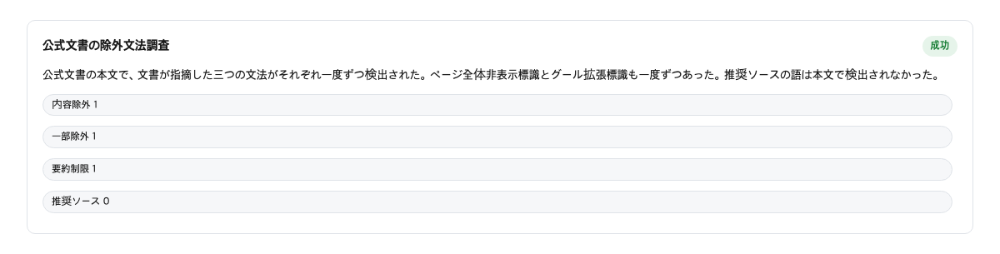
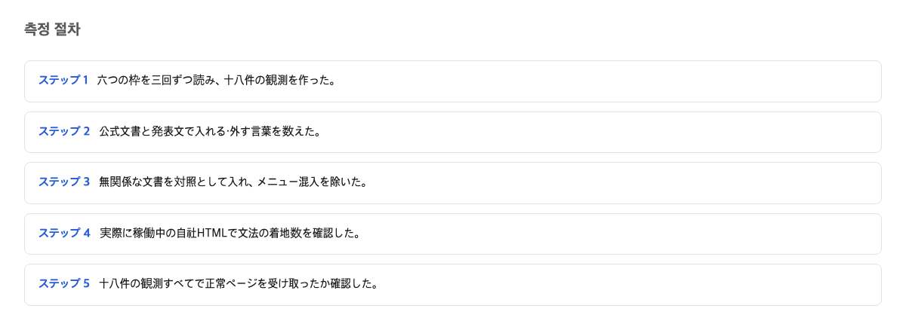

自分の書いたページがAIの検索回答にどう扱われるかは、サイトを持つ人にとって既に現場の問題だ。Googleが2026年8月20日に公表した仕組みを見ると、違いがはっきりしていた。入る側の機能は大々的に告知された。出る側の方法は、告知されないまま文書の片隅に置かれていた。用意の厚さの違いが、文書の量にそのまま現れていた。入る側には専用文書とボタン用のコードが用意され、出る側は開発者文書の一文にまとめられているだけだった。

## 2026-08-20の発表と文書の更新

発端は8月20日の発表だった。Googleは8月20日、新しい機能を発表した。ユーザーが自分のお気に入りのサイトを検索結果に指定できる。名前は「Preferred Source」だ。ユーザーが普段使うお店をお気に入りとして登録するのと同じ操作で、自分の好きなサイトをAI検索の中で選べるようになる。

発表と同じ日に、Googleの開発者向け文書にも新しいページが用意された。この文書には、サイト運営者が読者に選んでもらえるようにするための説明が書いてある。発表文には、サイト運営者に向けて、そのページからボタン用のコードを持ってくるように促す文まである。

> If you're a publisher, you can find the new "Preferred Source" button code in our Google Search Central documentation to get started.
> — [Personalize search and discover news with preferred sources](https://blog.google/products-and-platforms/products/search/personalize-search-discover-news/)

サイトをAI検索に「入れる」方向には、発表と専用ページとコードがそろって用意された。

## 公式文書の表面にある除外の一文

AI検索から自分のサイトを外したいとき、公式文書はどう答えているのか。Googleが開発者向けに用意した「AI features」という、検索のAI機能をまとめたページには、こう書いてある。

> To limit the information shown from your pages in Search, use nosnippet, data-nosnippet, max-snippet, or noindex controls.
> — [AI features](https://developers.google.com/search/docs/appearance/ai-features)

この一文が、公式文書の表面に見える除外方法のすべてだ。nosnippet などの四つの記号は、ページに小さな印をつけて「この部分は検索の要約に使わないで」とGoogleに伝える仕組みだ。調べた結果、このページで除外を直接示す記号はこの四つが各1回だけ現れた。除外を意味する「opt out」や「exclude」という言葉は0回だった。

一文に四つの印を並べただけ、という厚さの薄さは、専用ページとボタンコードを持つ入る側とは対照的だ。

## 取り込み側の専用文書とボタンコード

Preferred Source の専用ページは、Google開発者文書の案内リストに並ぶ154項目の一つとして存在する。ページはきちんと開け、更新日は発表と同じ8月20日だった。発表文では「Preferred Source」という言葉が7回出てきた。検索結果にAIのまとめを出す「AI Overviews」と、AIだけで答える検索「AI Mode」という名前も合わせて3回現れ、記事の中心に置かれていた。

この入り口は、製品の一部として整えられている。新しい機能には、専用の案内ページ、貼り付けるボタンのコード、告知文が用意されていた。専用ページ、ボタンコード、発表文の三つが、入り口のためにそろえられていた。

## Google-Extendedが検索への掲載に影響しないという公式の文

ここは誤解が起きやすい場所である。Google-Extended を使ってもAI検索には載る、という事実は運営者が知っておくべきことだ。

Google-Extended は、サイト側が Google の学習用ロボットを拒否するための設定の名前だ。名前だけ聞くとGoogleのAIを止めるスイッチのように聞こえる。実際、AI検索に載らないようにしようとこの設定を使う運営者もいる。しかし公式文書はこう言っている。

> Google-Extended は、サイトの Google 検索への掲載に影響せず、Google 検索のランキングシグナルとしても使われない。
> — [Google-Extended / Google Search Central（google-common-crawlers）](https://developers.google.com/search/docs/crawling-indexing/google-common-crawlers)

二回読んでほしい。「AIのスイッチ」に聞こえる道具が、検索に載るかどうかに公式には影響しないと明記されている。しかもAIの答えはGoogle自身の位置づけでは検索の一部だ。AI機能の文書は Google-Extended を「Googleの他のシステム」へ案内している。つまりこの印は、運営者が心配している検索の扉ではなく、別の扉のための印である。

なぜこうなるのか。同じ印でも、制御できる相手の範囲が違うのだ。Google は AI Overviews と AI Mode を検索に内蔵された機能だと決めている。だから検索から外す制御は、昔からある要約の見せ方を指定する記法にまとめられている。Google-Extended はその外側、「他のシステム」の側に置かれる。検索を外すこととは分けられている。専用ページとボタンコードのある側と、一文しかない側の文書の厚みの差は、文書の出来の差ではなく、この決め方の結果である。

## 自社12ページを調べると、除外の印は一つもなかった

「除外の印は昔から検証されてきた標準的な手段であり、Google が AI 機能を検索の一部と位置づけている以上、すでにある表示制御へ一本化するのは筋の通った設計であって、使わないのはサイト運営者の選択だ」というものである。

この反論の第1段は正しい。除外の印として案内されている四つの道具は、長年使われてきた仕組みだ。Google の文書は追加の技術条件がないことまで明言している。つまり原理としては、道具はあり、あとは使う側の判断だ。

しかし、実際に何が配られたかを見ると、同日の扱いは対称ではない。2026年8月20日、ソースに選ばれたいサイト運営者側には、三つの資料が同時に用意された。専用の解説ページ、貼り付けるボタンのコード、そして発表文そのものである。一方、除外したい側の案内は、四つの道具の名前を一行に並べた一文だけだ。文字数にすれば、ごく短い一行である。

さらに、その一文だけ渡された道具を、当社自身は使っているだろうか。自社の配信サイトから、ページ一覧に基づいて決まった手順で選んだ12ページを点検した結果、その印を実際に置いているページはゼロだった（0/12）。文書のどこかに一行書かれていても、専用ページもボタンも発表もなく、運営者に届く通知もなければ、多くの現場では誰も気づかない。「使わないのは選択だ」という第2段は、案内が少ない除外の側にだけ当てはまる。ソースに選ばれる側の選択肢は、三つの形で大々的に告知された。

反論の筋は通っている。それでも、両側に配られた案内の量と目立たせ方が違う以上、この非対称は原理の問題ではなく、実務の現場で実際に起きていることである。

## 測定方法と統制

- 三つの対象（開発者文書・発表文・自社配信サイト）を対象に、各ページの元のテキストをそのまま取り出して数えた。
- 数える前に、結果を歪める可能性のある共通語を差し引く統制を行った。
- ページの取得は同じ環境と日時で行い、各数値は取得した元のテキストから直接数えたものだ。

## 配信点検チェックリストに追加する二項目

チームの配信点検リストには、二つだけ足せばよい。

1つ目は、除外の印がどこに実際に着地しているかを確認する項目だ。あらかじめ用意したサイト内のページ一覧から標本のページを取り、除外の印が書かれているかを実際に数える。今回の12ページの結果が示すように、設定したつもりと、実際に書かれている事実は一致しないことがある。

2つ目は、Google-Extended が検索への掲載に影響しないという公式の文を、チームの文書に引用として固定しておくことだ。「AIはブロックしたから大丈夫」という安心が再発しないようにするためだ。

やるべきことは、サイトをAI検索に増やしたい人と減らしたい人で変わる。減らしたい人は、自分のページに除外の印が実際に書かれているか、リストを作って数えてみることだ。増やしたい人は、Googleが告知した案内ページ（Googleの開発者文書 Search Central にある Preferred Source のページ）を開き、その手順に従うことだ。

## この判断が覆る条件

公式文書の表面に除外の方法が一つの文しか現れていない、という実測に立っている。したがって、公式文書に除外の印とは別の、AI検索から外れる専用の道が新たに書かれたら、この判断は覆る。

## この記事が確認できなかったこと

今回は三つの対象の表面だけを見た。サイトの表示状態を確かめるGoogleの管理画面「Search Console」がある。その実際の画面にどの操作が現れるかは、ログインが必要なため確かめられていない。また、他のサイトでの除外の印の使用状況や、その印がAIの回答への引用に実際にどんな効果を持つかは、この記事の範囲外だ。次に見るべきは、自社の標本数を増やした上での着地率と、Google側の文書の今後の更新だ。

## 参考資料

1. [AI features / Google Search Central](https://developers.google.com/search/docs/appearance/ai-features)
2. [AI features / Google Search Central (Google-Extended 分離文)](https://developers.google.com/search/docs/appearance/ai-features)
3. [Google-Extended / Google Search Central](https://developers.google.com/search/docs/crawling-indexing/google-common-crawlers)
4. [Preferred sources / Google Search Central](https://developers.google.com/search/docs/appearance/preferred-sources)
5. [Personalize search and discover news with preferred sources / Google blog](https://blog.google/products-and-platforms/products/search/personalize-search-discover-news/)
6. [AI features / Google Search Central (スニペット適格条件文)](https://developers.google.com/search/docs/appearance/ai-features)