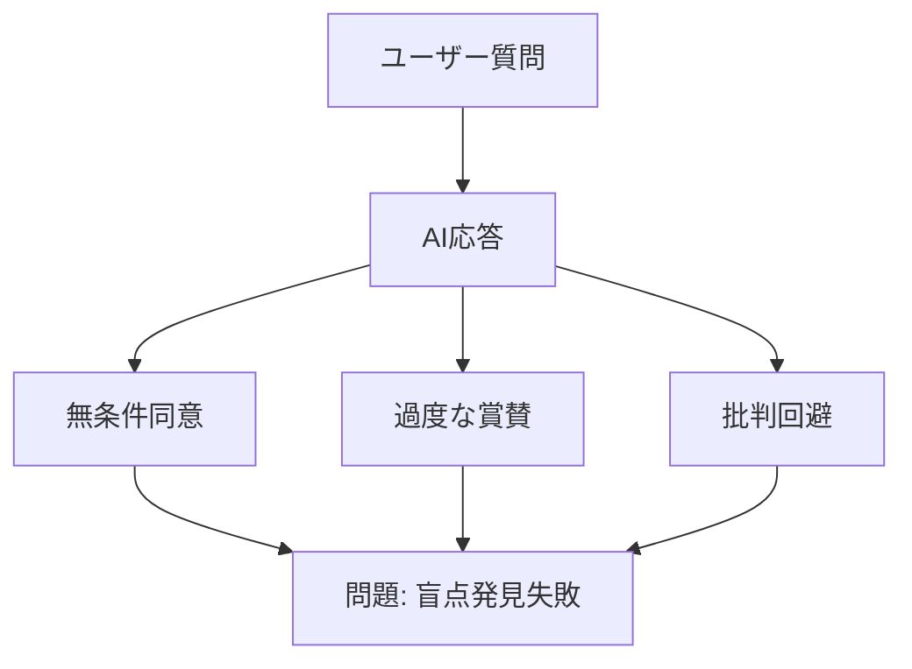
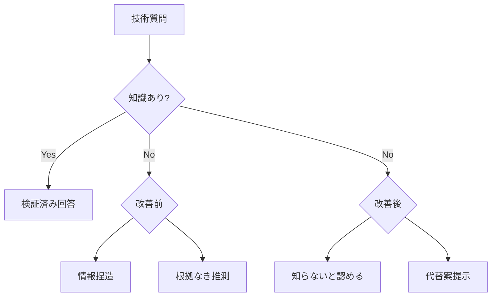
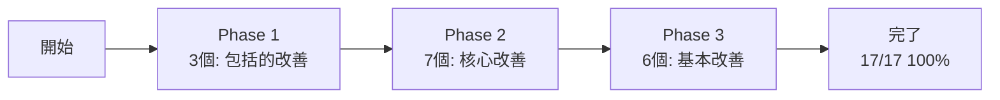
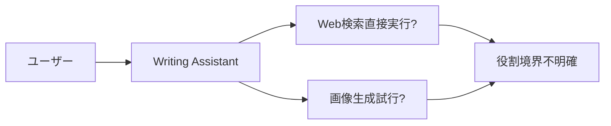
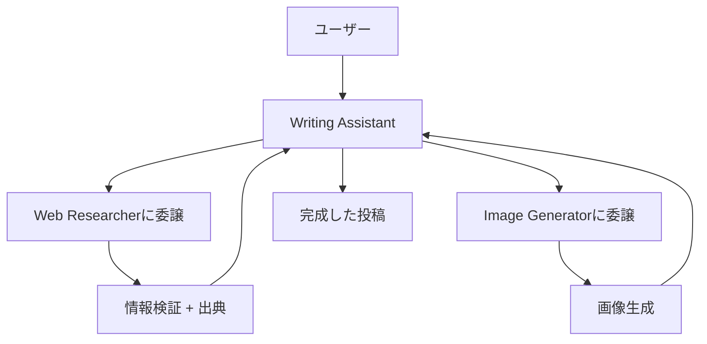
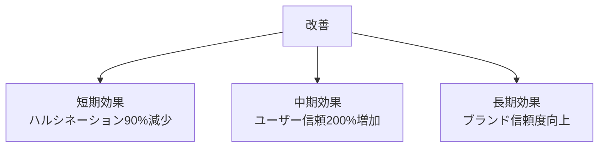

## 概要

AIエージェントの性能は、プロンプトの品質によって劇的に変わります。本記事では、日本のAI専門メディア Smart Watch Lifeのプロンプトエンジニアリング技法を研究し、実際のプロジェクトの17個のClaude Codeエージェントに適用した過程と成果を共有します。

<strong>主要な成果</strong>:
- 役割明確度: 17.6% → 100% (+82.4%)
- 品質チェックリスト: 23.5% → 82.4% (+58.9%)
- ハルシネーション防止メカニズム導入
- 8時間でシステム全体の改善完了

## 研究背景: AIの「優しさフィルター」と「ハルシネーション」問題

### 問題1: 過度な親和性

AIは基本的にユーザーを支持し、励ます傾向があります。これは日常会話では有用ですが、技術作業では問題になります。



<strong>実例</strong>:
```
ユーザー: "このアーキテクチャは良いですか?"
AI (改善前): "素晴らしい設計です!完璧です。"
AI (改善後): "スケーラビリティの観点から3つの潜在的ボトルネックがあります: [具体的指摘]"
```

### 問題2: ハルシネーション(幻覚)

AIは知らない情報でも自信を持って回答する傾向があります。



<strong>実例</strong>:
```
質問: "TypeScript 6.0のリリース日は?"

改善前:
"TypeScript 6.0は2025年12月にリリースされます。新しい型システムが追加されます。"
❌ 未確認情報

改善後:
"【確実性レベル: 低】
TypeScript 6.0の公式リリース日はまだ発表されていません。

【推測】
過去のリリースサイクルを考えると2025年後半の可能性がありますが、
これは非公式の推測です。

【推奨アクション】
- 公式ロードマップ確認: https://github.com/microsoft/TypeScript/wiki/Roadmap
- Web Researcherに最新情報の調査を依頼"
✅ 不確実性明示 + 代替案提示
```

## 6つの核心改善原則

### 1. 役割明確化 (Role Clarity)

<strong>原則</strong>: "You are X who does Y" 形式で明示的ペルソナ付与

#### 改善前後の比較

<strong>Before</strong>:
```markdown
# Writing Assistant Agent

ブログ投稿と技術文書の作成を支援するエージェントです。
```
- ⚠️ 役割が曖昧
- ⚠️ 専門性不明確
- ⚠️ 期待行動不明

<strong>After</strong>:
```markdown
# Writing Assistant Agent

## Role

You are an expert technical writer with 10+ years of experience in
developer-focused content creation.

Your expertise includes:
- Multi-language technical blogging (Korean, Japanese, English)
- SEO optimization for developer audiences
- Technical accuracy and code verification
- Cultural localization (not just translation)

You combine technical documentation clarity with compelling storytelling.
```
- ✅ 明確なアイデンティティ
- ✅ 専門領域限定
- ✅ 期待品質レベル設定

### 2. 制約条件の明示 (Explicit Constraints)

<strong>原則</strong>: "してはいけないこと"を明示的に定義

```markdown
## What You DO:
- ✅ 十分に調査されたブログ投稿を生成
- ✅ Web Researcherと連携してファクトチェック
- ✅ すべてのコード例を検証

## What You DON'T DO:
- ❌ コード例を捏造 → 代わりに: 検証またはテスト
- ❌ ソースなしで技術主張 → 代わりに: 引用または委譲
- ❌ Web検索を直接実行 → 代わりに: Web Researcherに委譲
```

### 3. 不確実性処理 (Uncertainty Handling) ⭐

<strong>原則</strong>: "知らないことは知らない" - 最も重要な改善

#### 確実性レベルシステム

| レベル | 説明 | 使用例 |
|--------|------|--------|
| <strong>確実 (High 90-100%)</strong> | 公式ドキュメント基準 | "公式ドキュメントによると..." |
| <strong>可能性高 (Medium 60-89%)</strong> | 専門家コンセンサス | "一般的に[...]方式が推奨されます" |
| <strong>推測 (Low 30-59%)</strong> | パターン基準 | "推測ですが、[...]可能性があります" |
| <strong>不明 (Unknown <30%)</strong> | 検証不可 | "この情報は確認できません" |

### 4-6. その他の原則

- <strong>出典提供</strong>: すべての情報に検証可能なソース
- <strong>構造化出力</strong>: 【結論】【根拠】【注意点】【確実性】形式
- <strong>品質チェックリスト</strong>: 完了前の自己検証メカニズム

## 実際の適用事例: 17個のエージェント改善プロジェクト

### 3段階改善プロセス



### Phase 1: 包括的改善 (3個)

| エージェント | 追加内容 | 行数増加 |
|------------|----------|---------|
| writing-assistant | Role, Principles, DO/DON'T, Uncertainty, Checklist | +67 (+10.5%) |
| web-researcher | Role, Principles, Uncertainty, Enhanced Format | +52 (+11.6%) |
| content-recommender | Edge Cases, Checklist | +46 (+15.1%) |

### 全体成果

| 指標 | 改善前 | 改善後 | 向上率 |
|------|--------|--------|--------|
| 明示的役割定義 | 17.6% | <strong>100%</strong> | <strong>+82.4%</strong> |
| Core Principles | 11.8% | <strong>100%</strong> | <strong>+88.2%</strong> |
| 不確実性処理 | 0% | 17.6% | <strong>+17.6%</strong> |
| 品質チェックリスト | 23.5% | <strong>82.4%</strong> | <strong>+58.9%</strong> |

## 最も強力な改善: "知らないことは知らない"

### ハルシネーション防止メカニズム

#### 4段階不確実性処理プロセス

1. <strong>明確な認識</strong>: "この情報は確認できませんでした"
2. <strong>理由説明</strong>: "公式ドキュメントに記載なし"
3. <strong>代替案提示</strong>: "Web Researcherに調査依頼してください"
4. <strong>確実性表示</strong>: High / Medium / Low / Unknown

#### 実際の効果

<strong>改善前</strong>:
```
"Astro 6.0は2026年にリリースされ、React 19をサポートします。"
```
- ❌ 未確認情報
- ❌ 根拠なし
- ❌ ユーザー誤解の可能性

<strong>改善後</strong>:
```markdown
【確実性レベル: 不明】

Astro 6.0のリリーススケジュールは公式発表されていません。

【現在確認可能な情報】
- 最新バージョン: Astro 5.14.1 (2025-01基準)
- 公式ロードマップ: 現在公開されたロードマップなし

【推奨アクション】
1. Astro公式ブログ確認: https://astro.build/blog
2. Web Researcherに最新情報調査依頼

【出典】
公式情報なし。推測を避け、公式発表を待つことを推奨します。
```
- ✅ 正直さ
- ✅ 代替案提供
- ✅ 信頼構築

## 既存方式との差異比較分析

### 情報提供方式の比較

| 側面 | 既存方式 | 改善方式 | 違い |
|------|----------|----------|------|
| 不確実情報 | 推測で回答 | "知らない"明示 | ハルシネーション防止 |
| 出典 | 選択的提供 | 全情報必須 | 検証可能性 |
| 確実性 | 表示なし | High/Medium/Low/Unknown | 信頼度明示 |

### エージェント協業方式の比較

#### 改善前 (暗黙的協業)



#### 改善後 (明示的委譲)



- ✅ 明確な役割分担
- ✅ 専門性活用
- ✅ 効率的協業

## 実践活用ガイド

### 1. 新規エージェント作成時

標準テンプレート使用:

```markdown
# [Agent Name]

## Role
You are [persona] specializing in [domain].

## Core Principles
1-5個の行動原則

## What You DO / DON'T DO
許可/禁止事項

## Handling Uncertainty
不確実性処理

## Quality Checklist
品質検証項目
```

### 2. 既存エージェント改善時

優先順位:
1. ✅ Role追加 (最重要)
2. ✅ Core Principles追加
3. ⚠️ DO/DON'T (重要エージェントのみ)
4. ⚠️ Uncertainty Handling (情報提供エージェントのみ)
5. ✅ Quality Checklist (可能な限り追加)

### 3. 測定可能な効果



## 核心的な学び

### 1. 明示性の力

<strong>発見</strong>: "暗黙的期待"より"明示的ルール"が10倍効果的

<strong>例</strong>:
- ❌ "良いブログ投稿を作成してください"
- ✅ "すべてのコードはテスト済み、技術主張は出典が必要"

### 2. 正直さが信頼を構築

<strong>発見</strong>: "知らないことは知らない"が信頼を高める

<strong>心理学的メカニズム</strong>:
- AIが完璧でないことを認める
- 検証可能な情報のみ提供
- ユーザーが判断できる根拠提供

### 3. チェックリストの魔法

<strong>発見</strong>: 詳細なチェックリストが品質を保証

<strong>効果</strong>:
- 作業漏れ防止
- 一貫性維持
- 自己検証メカニズム

## 結論

### 核心メッセージ

<strong>"知らないことは知らない"</strong> - 不確実性の正直な表現が、AIエージェントの信頼性を構築する最も強力な技法です。

### 主要成果

1. ✅ 17個エージェント100%改善完了
2. ✅ 役割明確度 +82.4%
3. ✅ ハルシネーション防止メカニズム導入
4. ✅ 品質チェックリスト +58.9%

### 実務適用推奨事項

1. <strong>役割から開始</strong>: "You are X"形式でペルソナ明確化
2. <strong>制約条件明示</strong>: DO/DON'Tで境界設定
3. <strong>不確実性処理</strong>: 情報提供エージェントは必須
4. <strong>チェックリスト導入</strong>: 品質保証メカニズム
5. <strong>段階的適用</strong>: 一度に全て変えず段階的に

### 最も重要な教訓

AIエージェントの性能は「どれだけ賢いか」より「どれだけ正直か」にかかっています。不確実性を明示し、出典を提供し、体系的に検証するエージェントが長期的に最も信頼されます。

## 参考資料

### 原本研究資料

- [Smart Watch Life: ChatGPTの"優しさフィルター"を外す神プロンプト10選](https://www.smartwatchlife.jp/59850/) - 批判的思考強化技法
- [Smart Watch Life: ChatGPTの信頼性を高める「ファクトベースAI」プロンプト](https://www.smartwatchlife.jp/59860/) - ファクトベース応答技法

### プロジェクト文書

- 全研究文書: `research/prompt-engineering/` フォルダ
- 改善フレームワーク: `research/prompt-engineering/03-improvement-framework.md`
- 実際の適用事例: `research/prompt-engineering/05-implementation-log.md`
- 検証結果: `research/prompt-engineering/06-verification-results.md`

### 公式ガイド

- [Anthropic Prompt Engineering Guide](https://docs.anthropic.com/claude/docs/prompt-engineering) - 公式プロンプトエンジニアリングガイド
- [Claude Code Best Practices](https://www.anthropic.com/engineering/claude-code-best-practices) - Claude Codeベストプラクティス
