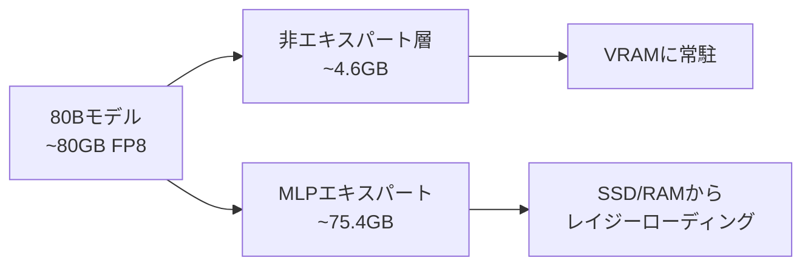

## 概要

80Bパラメータのコーディング特化モデルを8GB VRAMのノートPC用GPUで実行できるとしたら？Redditのr/LocalLLaMAコミュニティで<strong>nalexand</strong>という開発者がこれを実現したプロジェクトを公開しました。Qwen3-Coder-Next 80BをRTX 3070Ti（8GB VRAM）で<strong>1.2 tokens/s</strong>で動作させることに成功したのです。

本記事では、そのプロジェクトの核心技術であるFP8量子化、エキスパートレイジーローディング、キャッシュ最適化戦略を分析し、消費者GPUでの大規模LLM実行の実用的な意味と限界を考察します。

## 核心課題：80Bモデルを8GBに収める

### なぜ不可能に見えるのか

Qwen3-Coder-Nextは80Bパラメータモデルです。FP8量子化状態でもモデルサイズは約<strong>80GB</strong>に達します。8GB VRAM + 32GB RAM環境では、モデル全体をメモリに載せること自体が不可能です。

### 最初の試み：ディスクオフローディング

開発者はまずHugging Faceの<strong>accelerate</strong>ライブラリで`device="auto"`を使用したディスクオフローディングを試みました。結果は惨憺たるものでした。

- 速度：<strong>1トークン / 255秒</strong>
- 事実上使用不可能なレベル

これはディスクI/Oボトルネックが推論速度を極端に低下させた典型的な事例です。

## 解決策：エキスパートレイジーローディング + キャッシュ最適化

### MoEアーキテクチャの特性を活用

核心的なインサイトはモデル構造の分析から得られました。80Bモデルの大型テンソルの大半は<strong>MLPエキスパート</strong>に集中しており、残りのコンポーネントは約<strong>4.6GB</strong>でVRAMに十分収まります。



### カスタムレイジーローディングシステム

開発者はMLPエキスパート用の<strong>カスタムレイジーローディング</strong>システムを構築しました。

- <strong>2層キャッシュ</strong>：VRAMキャッシュ + Pinned RAMキャッシュ
- <strong>キャッシュヒット率</strong>：最大85%
- <strong>速度向上</strong>：255秒/トークン → 1.2 tokens/s（<strong>約300倍の高速化</strong>）

### キャッシュパラメータチューニング

```python
# VRAMキャッシュサイズ（各18単位 ≈ 約3GB）
self.max_gpu_cache = 18

# RAMキャッシュサイズ（Pinnableメモリベース）
self.max_ram_cache = 100
```

| GPU | 推奨max_gpu_cache | 予想キャッシュヒット率 |
|-----|-------------------|---------------------|
| RTX 3070Ti (8GB) | 18 | ~85% |
| RTX 5090 (32GB) | 120 | >85% |

## 技術スタックとインストール方法

### 必要環境

- <strong>モデル</strong>：`Qwen/Qwen3-Coder-Next-FP8`（Hugging Faceからダウンロード）
- <strong>GPU</strong>：8GB+ VRAM
- <strong>RAM</strong>：32GB+（Pinnableメモリは通常RAMの1/2）
- <strong>ストレージ</strong>：高速NVMe SSD推奨（PCIe 5.0 RAID 0で最大30GB/s）

### インストール手順

```bash
# 1. モデルダウンロード
hf-download Qwen/Qwen3-Coder-Next-FP8

# 2. transformersライブラリのモデリングファイルを差し替え
# transformers/models/qwen3_next/modeling_qwen3_next.py を置換

# 3. MLPエキスパート抽出
python extract_mlp.py

# 4. チャットボット起動
python coder_80b_next_chat.py
```

## 実際のパフォーマンスベンチマーク

開発者が公開したキャッシュウォームアップテストの結果です。

| プロンプト | トークン数 | 時間 | 速度 |
|-----------|-----------|------|------|
| 最初の "hi" | 11 | 21.25s | 0.52 t/s |
| 2回目の "hi" | 26 | 25.36s | 1.03 t/s |
| "all good" | 50 | 41.70s | 1.20 t/s |
| 長い応答（807トークン） | 807 | 668.81s | 1.21 t/s |

キャッシュウォームアップ後は安定して<strong>~1.2 t/s</strong>を維持します。最初のリクエストはキャッシュミスのため遅くなりますが、以降のリクエストからキャッシュヒット率が向上し速度が改善されます。

## 実用性と限界

### メリット

- <strong>コスト</strong>：クラウドAPI不要でローカルから80Bコーディングモデルを実行可能
- <strong>プライバシー</strong>：コードが外部サーバーに送信されない
- <strong>オフライン</strong>：インターネット接続なしで使用可能

### 限界

- <strong>速度</strong>：1.2 t/sはリアルタイムコーディング補助には不十分（ClaudeやGPT APIは30-80 t/s）
- <strong>初期レイテンシ</strong>：キャッシュウォームアップに時間が必要
- <strong>インストールの複雑さ</strong>：transformersライブラリのファイルを直接修正する必要あり
- <strong>メモリ要件</strong>：32GB RAMは依然として必要

### 今後の展望

| GPU | VRAM | 予想速度 |
|-----|------|---------|
| RTX 3070Ti | 8GB | ~1.2 t/s（確認済み） |
| RTX 4090 | 24GB | 5-10 t/s（推定） |
| RTX 5090 | 32GB | 20+ t/s（開発者予想） |

RTX 5090の32GB VRAMと高いメモリバンド幅で`max_gpu_cache=120`設定時、20 t/s以上が期待されます。

## ローカルLLMコーディングの最前線

このプロジェクトはローカルLLMコミュニティの「不可能を可能に」する精神をよく体現しています。<strong>nalexand</strong>開発者は以前にもLTX-2、Wan2.2、HeartMula、ACE-Step 1.5など様々な大規模モデルを低スペックGPUで最適化した実績があります。

核心的な教訓は以下の通りです。

1. <strong>モデル構造分析が最適化の出発点</strong>：MoEモデルのエキスパート分布を把握すれば選択的ローディングが可能
2. <strong>多層キャッシュが鍵</strong>：VRAM → Pinned RAM → SSD順のキャッシュ戦略が300倍の高速化を実現
3. <strong>ハードウェアの進化が格差を縮める</strong>：次世代GPUでは実用的な速度に到達する可能性

## 結論

Qwen3-Coder-Next 80Bを8GB VRAMで実行することは技術的に印象的な成果です。現在の1.2 t/sの速度はリアルタイムコーディング補助には不十分ですが、次世代GPUと最適化技法の発展により、消費者ハードウェアでの大規模コーディングモデル実行がますます現実に近づいています。

ローカルLLMに関心のある開発者は[nalexandのGitHubリポジトリ](https://github.com/nalexand/Qwen3-Coder-OPTIMIZED)を確認し、自身のハードウェアで直接実験してみることをお勧めします。

## 参考資料

- [Qwen3-Coder-OPTIMIZED GitHub](https://github.com/nalexand/Qwen3-Coder-OPTIMIZED)
- [Reddit r/LocalLLaMA 元記事](https://www.reddit.com/r/LocalLLaMA/comments/1r5m4vl/how_to_run_qwen3codernext_80b_parameters_model_on/)
- [Qwen3-Coder-Next-FP8モデル（Hugging Face）](https://huggingface.co/Qwen/Qwen3-Coder-Next-FP8)
