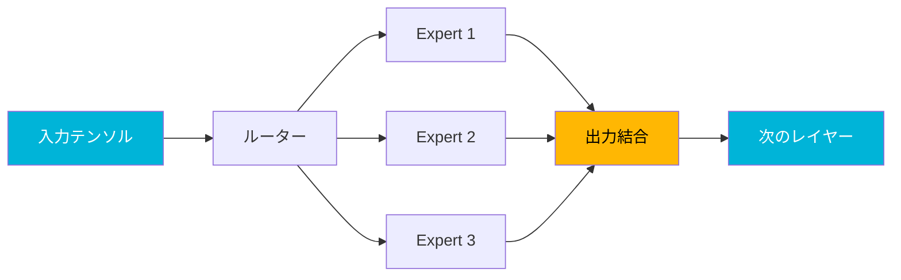

## 概要

llama.cppのコア開発者<strong>ggerganov</strong>が、Qwen3 Coder Nextモデルのコンピュートグラフを最適化する[PR #19375](https://github.com/ggml-org/llama.cpp/pull/19375)を公開しました。不要なテンソルコピー演算を排除し、グラフレベルで推論パスを再構成することで、<strong>M2 Ultraで最大38%</strong>、<strong>DGX Sparkで最大38%</strong>の速度向上を実現しています。Reddit r/LocalLLaMAで177ポイント以上の大きな注目を集めたこの最適化の核心を見ていきましょう。

## 核心アイデア：グラフレベル最適化

今回の最適化の核心はシンプルです。ggmlコンピュートグラフから<strong>不要なテンソルコピー演算を除去</strong>することです。

MoE（Mixture of Experts）アーキテクチャであるQwen3 Coder Nextは、ルーターがアクティベートするエキスパートを選択し、各エキスパートの出力を結合する過程で多くの中間テンソルコピーが発生します。従来の実装ではこれらのコピーが安全性のために過度に挿入されていましたが、ggerganovは実際に必要なコピーだけを残し、残りを排除しました。

## ベンチマーク結果

### M2 Ultra性能比較

Qwen3 Coder Next 80B.A3Bモデルを様々な量子化レベルでテストした結果です。

#### Q4_0量子化

| テスト | 従来 (t/s) | 最適化 (t/s) | 速度向上 |
|--------|-----------|-------------|----------|
| pp1（単一トークン） | 37.92 | 51.99 | <strong>1.37x</strong> |
| pp8（8トークンバッチ） | 137.75 | 176.36 | <strong>1.28x</strong> |
| pp512（プロンプト） | 930.70 | 1125.73 | <strong>1.21x</strong> |
| pp2048（長文プロンプト） | 1049.91 | 1352.31 | <strong>1.29x</strong> |
| tg32（生成） | 38.02 | 50.39 | <strong>1.33x</strong> |

#### Q4_K_M量子化

| テスト | 従来 (t/s) | 最適化 (t/s) | 速度向上 |
|--------|-----------|-------------|----------|
| pp1 | 34.00 | 46.47 | <strong>1.37x</strong> |
| pp2048 | 977.30 | 1232.47 | <strong>1.26x</strong> |
| tg32 | 34.63 | 46.43 | <strong>1.34x</strong> |

#### Q8_0量子化

| テスト | 従来 (t/s) | 最適化 (t/s) | 速度向上 |
|--------|-----------|-------------|----------|
| pp1 | 34.38 | 43.98 | <strong>1.28x</strong> |
| pp2048 | 1047.39 | 1338.82 | <strong>1.28x</strong> |
| tg32 | 33.75 | 43.78 | <strong>1.30x</strong> |

### DGX Spark性能比較

NVIDIA DGX Sparkでも有意な性能向上が確認されています。

| 量子化 | テスト | 従来 (t/s) | 最適化 (t/s) | 速度向上 |
|--------|--------|-----------|-------------|----------|
| Q4_0 | pp512 | 1055.58 | 1161.67 | <strong>1.10x</strong> |
| Q4_0 | pp2048 | 1059.00 | 1324.66 | <strong>1.25x</strong> |
| Q4_0 | tg32 | 43.11 | 59.58 | <strong>1.38x</strong> |
| Q8_0 | pp2048 | 1009.43 | 1246.61 | <strong>1.23x</strong> |
| Q8_0 | tg32 | 31.13 | 39.68 | <strong>1.27x</strong> |

DGX Sparkのtg32（トークン生成）でQ4_0基準<strong>38%の速度向上</strong>を達成した点が注目に値します。

## 技術的背景：関連バックエンド最適化

このPRは単独で存在するものではありません。グラフ最適化が効果を発揮するには、各バックエンド（Metal、CUDA、Vulkan）で非連続（non-contiguous）テンソルを直接処理できる必要があります。

### Metal（Apple Silicon）

- <strong>適応型CPU/GPUインターリーブ</strong>（[#19369](https://github.com/ggml-org/llama.cpp/pull/19369)）：ノード数に応じたCPU/GPU作業の動的分配
- <strong>バイナリカーネル統合</strong>（[#19390](https://github.com/ggml-org/llama.cpp/pull/19390)）：重複カーネルコードの除去
- <strong>ユニタリ演算統合</strong>（[#19490](https://github.com/ggml-org/llama.cpp/pull/19490)）：単項演算処理の改善
- <strong>非連続テンソルL2正規化サポート</strong>（[#19502](https://github.com/ggml-org/llama.cpp/pull/19502)）
- <strong>並行性改善</strong>（[#19555](https://github.com/ggml-org/llama.cpp/pull/19555)）

### CUDA（NVIDIA GPU）

- <strong>非連続テンソルPAD演算拡張</strong>（[#19429](https://github.com/ggml-org/llama.cpp/pull/19429)）
- <strong>CUDAグラフ有効化</strong>（[#19521](https://github.com/ggml-org/llama.cpp/pull/19521)）：Qwen3 Nextスタイルアーキテクチャ用
- <strong>融合ADD グラフミューテーション防止</strong>（[#19566](https://github.com/ggml-org/llama.cpp/pull/19566)）

### Vulkan

- <strong>L2_NORM連続行サポート</strong>（[#19604](https://github.com/ggml-org/llama.cpp/pull/19604)）
- <strong>GGML_OP_SETサポート</strong>（[#19584](https://github.com/ggml-org/llama.cpp/pull/19584)）

## 注意点：BF16テンソル問題

一部のGGUFファイルで1次元BF16テンソルが誤って含まれている場合があります。これはMetalなどのバックエンドでパフォーマンス低下を引き起こします。[#19606](https://github.com/ggml-org/llama.cpp/pull/19606)で`ffn_gate_inp_shexp`テンソルをF32として保存するよう修正し、この問題を解決しています。

## 今後の予定

ggerganovは以降の追加最適化も予告しています。

1. <strong>Qwen3ファミリーのコード重複除去</strong>（[#19597](https://github.com/ggml-org/llama.cpp/pull/19597)）：delta-netグラフの共有
2. <strong>`ggml_build_forward_select()`の活用</strong>：グラフを定数化してさらなる最適化余地を確保
3. <strong>専用delta net ggml演算の導入</strong>（[#19504](https://github.com/ggml-org/llama.cpp/pull/19504)）：より効率的なカーネル実行

## ローカルLLMユーザーへの影響

今回の最適化が意味するところをまとめます。

- <strong>Apple Siliconユーザー</strong>：M2 Ultra基準で80B MoEモデルをtg32で約50 t/sで実行可能。リアルタイム対話に十分な速度です。
- <strong>NVIDIA GPUユーザー</strong>：DGX Sparkでも20〜38%の速度向上。CUDAグラフサポートでさらなる最適化が期待されます。
- <strong>量子化の選択</strong>：Q4_0が最大の速度向上を示しますが、Q4_K_MとQ8_0でも一貫した20〜37%の改善が確認されています。
- <strong>コード変更不要</strong>：llama.cppを最新バージョンに更新するだけで自動的に適用されます。

## 結論

ggerganovによる今回のグラフレベル最適化は、llama.cppのMoEモデル推論性能を大幅に向上させました。単にカーネルを最適化するのではなく、<strong>コンピュートグラフ自体を再構成</strong>するアプローチが印象的です。特に複数のバックエンド（Metal、CUDA、Vulkan）で非連続テンソルサポートを拡大する並行作業と組み合わせることで、ローカルLLM推論の性能限界を一段階引き上げています。

Qwen3 Coder Nextのような MoEモデルをローカルで実行しているユーザーは、llama.cppを最新バージョンに更新してこの性能向上をすぐに体感してみてください。

## 参考資料

- [PR #19375: models : optimizing qwen3next graph](https://github.com/ggml-org/llama.cpp/pull/19375)
- [Reddit r/LocalLLaMA ディスカッション](https://www.reddit.com/r/LocalLLaMA/)
- [llama.cpp GitHubリポジトリ](https://github.com/ggml-org/llama.cpp)
