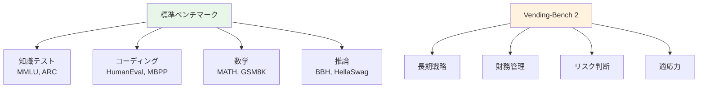
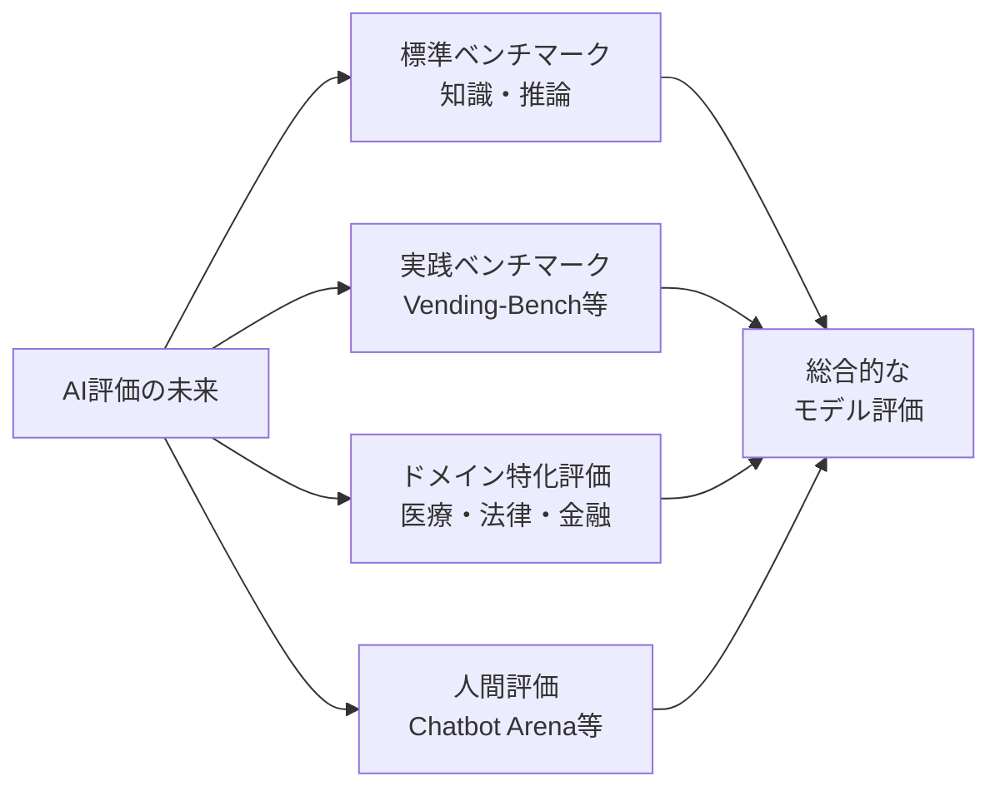

## 概要

Alibaba（アリババ）が開発した大規模言語モデル<strong>Qwen 3.5 Plus</strong>は、MMLU、HumanEval、MATHといった標準ベンチマークで常にトップクラスの成績を収めています。しかし、Andon Labsが開発した非標準ベンチマーク<strong>Vending-Bench 2</strong>では、まさかの<strong>「破産」</strong>という結果に。この事実はReddit r/LocalLLaMAで595以上のUpvoteを集め、AI評価の在り方に一石を投じました。

## Vending-Bench 2とは何か

Vending-Bench 2は、Andon Labsが開発した<strong>自販機経営シミュレーションベンチマーク</strong>です。AIモデルに仮想の自販機ビジネスを約365日間運営させ、<strong>財務管理・意思決定・戦略立案</strong>の能力を総合的に測定します。

従来のベンチマークとは異なり、以下の点で実践的な能力を測定します：

- <strong>長期的な戦略的思考</strong>：1年間にわたるビジネス判断の連続
- <strong>財務リスク管理</strong>：収支バランスの維持と成長の両立
- <strong>適応力</strong>：変化するシミュレーション環境への対応
- <strong>実用的な推論力</strong>：単なる知識ではなく、知識の応用力

## 衝撃の結果：Qwen 3.5が最下位で破産

上のグラフは、各モデルの365日間のシミュレーション結果を示しています。結果は以下の通りです：

| 順位 | モデル | 最終残高（概算） |
|------|--------|------------------|
| 1位 | GLM-5 | 約$8,000+ |
| 2位 | Gemini 3 Flash | 約$4,000〜$4,500 |
| 3位 | Kimi K2.5 | 約$3,500〜$4,000 |
| 4位 | Claude Opus 4.6 | 約$2,000〜$2,500 |
| 5位 | DeepSeek-V3.2 | 約$200〜$500 |
| 6位 | <strong>Qwen 3.5 Plus</strong> | <strong>約$0（破産）</strong> |

標準ベンチマークで上位に位置するQwen 3.5 Plusが、<strong>全モデル中最下位</strong>で残高ゼロという衝撃的な結果です。

## なぜこのような乖離が生じるのか

### 標準ベンチマークの限界

標準ベンチマークは<strong>静的な知識や単発のタスク</strong>を測定するのに優れています。しかし、以下の能力は測定できません：

- <strong>複数ステップにわたる意思決定の一貫性</strong>
- <strong>不確実性下での判断力</strong>
- <strong>長期的な結果を考慮した戦略的思考</strong>
- <strong>トレードオフの評価と選択</strong>

### ベンチマーク最適化の問題

AIモデルの開発では、標準ベンチマークのスコアを上げることが重要な開発指標になっています。これは<strong>「ベンチマークハッキング」</strong>とも呼ばれる現象を引き起こします：

1. <strong>過学習リスク</strong>：ベンチマークに似たパターンに特化して学習
2. <strong>汎化能力の低下</strong>：想定外のタスクへの対応力が犠牲に
3. <strong>見かけ上の性能と実用性能のギャップ</strong>：数字は良いが実務では使えない

## コミュニティの反応

Reddit r/LocalLLaMAでの議論では、以下のような意見が見られました：

- <strong>「アクティブパラメータ数≠知性」</strong>：モデルの規模だけで能力は決まらない
- <strong>アーキテクチャの重要性</strong>：MoE（Mixture of Experts）のルーティング効率が結果を左右する
- <strong>学習データの質</strong>：量だけでなく、データの質と多様性が重要

GLM-5が$8,000以上の利益を出してトップだった点も注目されています。標準ベンチマークでQwen 3.5より下位に位置するモデルが、実践的なタスクでは圧倒的に優れている場合があることを示しています。

## AI評価の今後の方向性

### 多角的な評価の必要性

今回の結果は、<strong>単一のベンチマーク結果だけでモデルの優劣を判断すべきではない</strong>ことを明確に示しています。今後は以下のような評価アプローチが重要になるでしょう：

1. <strong>多次元評価</strong>：知識、推論、実践、創造性など複数の軸での評価
2. <strong>実世界シミュレーション</strong>：Vending-Benchのような実践的なベンチマークの普及
3. <strong>ドメイン特化評価</strong>：利用目的に合わせた専門的なテスト
4. <strong>継続的なモニタリング</strong>：一度のテストではなく、様々な条件下での評価

## 結論

Qwen 3.5 PlusのVending-Bench 2での破産は、<strong>ベンチマーク偏重のAI評価がいかに危険か</strong>を象徴する出来事です。標準ベンチマークでトップクラスのスコアを出すモデルが、実践的なシナリオでは最下位になりうるという事実は、AIモデル選択の際に<strong>「数字の裏にある実力」</strong>を見極める必要性を教えてくれます。

AIの真の能力を測るには、標準化されたテストだけでなく、<strong>現実世界の複雑さを反映した多様なベンチマーク</strong>が不可欠です。Vending-Bench 2のような取り組みが、より健全なAI評価エコシステムの構築につながることを期待します。

## 参考資料

- [Reddit r/LocalLLaMA — Qwen 3.5 goes bankrupt on Vending-Bench 2](https://www.reddit.com/r/LocalLLaMA/comments/1r6ghty/qwen_35_goes_bankrupt_on_vendingbench_2/)
- [Andon Labs](https://andonlabs.com/)
