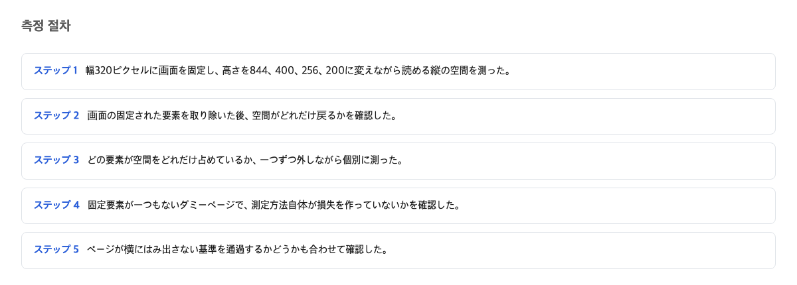
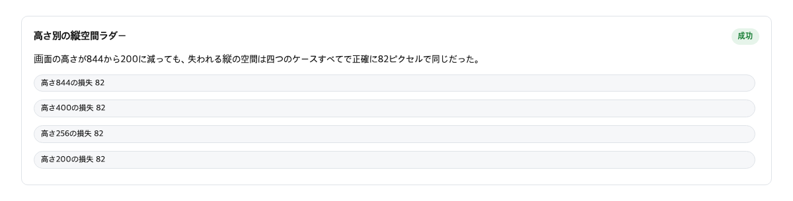
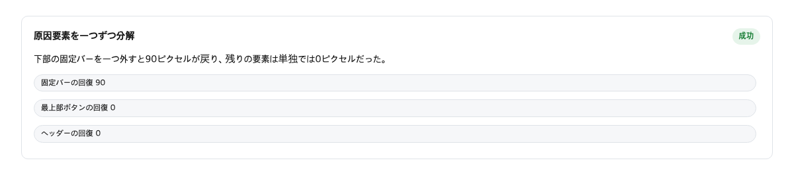
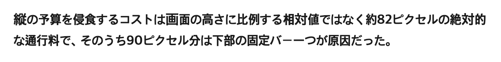

スマホの画面を指で二本広げて、文字を大きく拡大して読んだことはないだろうか。拡大すると文字は読みやすくなる。その代わり、画面に入る文字の量は減る。ここまでは誰にでも想像がつく。予想できないのはこの先だ。あるページで実際に測ったところ、画面の高さがいくら変わっても、失われる縦の空間の量はほぼ同じだった。高さ844ピクセルの画面でも、高さ200ピクセルの画面でも、失うのは同じ82ピクセルだった。小さい画面ほど大きな割合を奪われる。

## 縦の空間を測った方法

測り方は単純だった。画面に文字が見えているかどうかを、2ピクセルずつ順番に確かめる方法である。ピクセルは画面の最小の点のことだ。この測定では、縦に細長い窓を2ピクセルずつ下にずらした。その地点に本文が来ているか、別の何かが上に乗っているかを調べた。横の位置は左・中央・右の3か所で確かめた。本文に到達できた縦の長さだけを足すと、それがその画面で本当に読める縦の空間になる。

測定の対象は、公開されている実在のサイトだ。机に置いた紙のメモではなく、普段人が訪れるページをそのまま測った。測定にはブラウザを自動で動かす道具を使った。



測った結果を並べると、こうなる。この数値は、高さの異なる4種類の画面で、本文に実際に届いた縦の長さを記録したログの一部である。

```
usable_px 762  (画面の高さ 844)
usable_px 318  (画面の高さ 400)
usable_px 174  (画面の高さ 256)
usable_px 118  (画面の高さ 200)
```

## 4つの高さで同じく消えた82ピクセル

ここで違和感が生まれる。普通なら、失われる量は画面の高さに比例すると思うだろう。席が半分になれば、置ける荷物も半分になるはずだと。しかし測定結果は違った。844引く762は82。400引く318は82。256引く174も、200引く118も、同じ82だった。画面の高さが4分の1になっても、失われる量は82ピクセルのままだ。

比喩を使うなら、電車の席に似ている。車両がどんなに短くなっても、入り口に固定された机の占める幅は変わらない。車両が短くなるほど、その机が残りの席から奪う割合は大きくなる。ページの上の帯や下の帯がこの机にあたる。それらの幅は画面の高さに合わせて縮まない。だから小さい画面では、奪われる割合だけが膨らむ。高さ200ピクセルの画面では、行き先を失う縦の空間が全体の4割を超えた。



## 固定要素を外して戻ってきた90ピクセル

では、この損失の元凶は誰か。これを確かめるために、ページを飾る部品を一つずつ外す実験を行った。部品とは、上に張り付いた見出し帯や、下に張り付いた帯のことだ。画面を動かしても決して動かず、常に同じ場所を占める部品である。

外す実験では、下のほうに張り付いた帯を外しただけで90ピクセルが戻ってきた。外せる部品をすべて外した結果も同じく90ピクセルだった。個々の部品を外したときの回復量を足すと、全部外したときの量と一致する。つまり損失のほとんどを占めているのは特定の一要素で、部品同士の重なりによる見かけの損失ではなかった。一方で、右下に現れる「上へ戻る」ボタンを外しても、縦の空間は1ピクセルも戻らなかった。存在する部品のすべてが損失の犯人というわけではない。



## 横の判定基準の完全合格

奇妙なのはここからだ。このページは、正式なアクセシビリティ規格の検査に合格している。規格とは、ウェブページが多くの人に使える状態かを決める基準書である。その中の「リフロー」という項目は、画面を大きく拡大したときにページがきちんと詰め直されるかを調べる。リフローは、内容を失わずに文字列が窓の形に合わせて並び直すことだ。

リフローの検査で見るのは横方向だけである。縦に読むページなら、横幅が320 CSSピクセルに収まって横にスクロールしなければよい。CSSピクセルは画面の細かさを測る単位だ。測定した8とおりの状態はすべてこの条件を満たし、横にはみ出した量はゼロ、合格は8/8だった。

> Content can be presented without loss of information or functionality, and without requiring scrolling in two dimensions for: Vertical scrolling content at a width equivalent to 320 CSS pixels; Horizontal scrolling content at a height equivalent to 256 CSS pixels.
> — [Understanding Success Criterion 1.4.10: Reflow / W3C WAI](https://www.w3.org/WAI/WCAG22/Understanding/reflow.html)

規格の原文が求めているのは横の320ピクセルだけで、縦の長さについては何も書いていない。つまり合格しても、縦の空間がどれだけ残るかは一切保証されない。これは規格の欠陥ではなく、規格が縦を測る対象にしていないだけだ。

## 損失は割合ではなく絶対値だった

損失は割合ではなく、約82ピクセルという絶対的な値だった。割合で考えない理由は、犯人が画面の大きさに応答しないからだ。同じ90ピクセルでも、高い画面では損失は10パーセント程度ですみ、低い画面では45パーセントに達する。大きくなるのは割合のほうで、画面が小さいほど同じ82ピクセルの重みが増す。82ピクセルがどこから来たかというと、top（いちばん上まで戻った状態）では、張り付く見出し帯ではなく、文書の流れの中にある通常の見出しブロックの分だった。mid（途中まで読み進めた状態）では、下に張り付いた帯の90ピクセルの分だった。



画面がいくら縮んでも奪われる量が同じなのは、奪う側が画面のサイズに応じて縮まない部品だからだ。規格の合格は横の並びだけを見る。縦に読む場所がどれだけ残るかは、合格の有無ではなく、別の測定でしか分からない。

この結果を受けて、ページを作る人と、拡大して読む人を迎えるサイトを運営する人とでは、取るべき道が別れる。

固定の見出し帯や下の帯を置いていない文書ページを作る人なら、既存の横の検査だけで十分だ。縦の測定までは行わなくてよい。拡大して読む人を迎えるサイトを運営する人なら、もう一つの検査を足すべきだ。横幅320ピクセル、高さ200ピクセルの画面で、読める場所が何ピクセル残るかを測る。

## この記事が確認できなかったこと

この記事で確認できなかったことがある。まず、張り付く見出し帯が通常の見出しに切り替わる画面の高さの境目は、ある区間にまでしか絞れていない。次に、下の帯がたまに測定を阻害しないことがあり、その理由は広告の読み込みのタイミングを疑う程度で、突き止めていない。測定も1台の機械、1つの公開サイトの結果であり、構造の違う他のサイトにそのまま当てはめることはできない。次に確認すべきは、その境目の正確な値と、複数の構造の異なるサイトでの再測定だ。

この判断が覆る条件はこうなる。固定の部品を全部外しても縦の空間が戻らないなら、あるいは失われる量が画面の高さによって変わるなら、この記事の判断は間違いだ。

## 参考資料

1. [Understanding Success Criterion 1.4.10: Reflow / W3C WAI](https://www.w3.org/WAI/WCAG22/Understanding/reflow.html) — W3C
2. [WCAG 2.2 Success Criterion 1.4.10 Reflow (spec) / W3C](https://www.w3.org/TR/WCAG22/#reflow) — W3C
3. [CSS technique C34: Using media queries to un-fixing sticky headers / W3C WAI](https://www.w3.org/WAI/WCAG22/Techniques/css/C34) — W3C