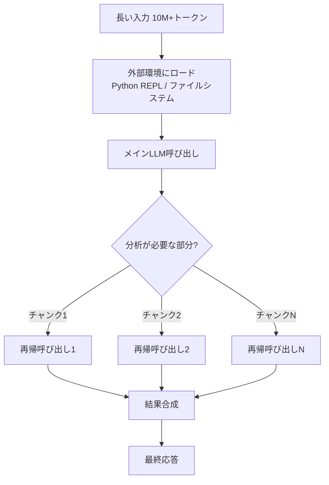
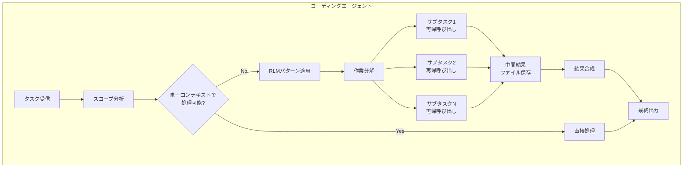
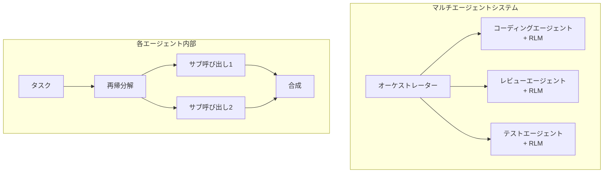

## 概要

LLMを活用したコーディングエージェントを運用していると、必ずぶつかる壁があります。<strong>コンテキストウィンドウの限界</strong>です。128Kトークンであれ200Kトークンであれ、大規模コードベースを扱うとモデルが重要な情報を見落とし始めます。いわゆる「Context Rot」— コンテキストが長くなるほどパフォーマンスが急激に低下する現象です。

MITが発表した<strong>Recursive Language Models（RLM）</strong>論文（arXiv:2512.24601）は、この問題に対する根本的な解決策を提示しています。そして最近、Tenobrusという開発者がこのアイデアをClaude Codeに直接実装して話題になりました。コーディングエージェントの内部でRLMを「スキル」として実装したのです。

AIで仕組みを作るエンジニアリングマネージャーの視点から、このアプローチがなぜ重要なのか、そして実務でどう活用できるのか分析します。

## RLMとは何か

### コアアイデア

RLMの核心はシンプルです。<strong>LLMが自分自身を再帰的に呼び出せる</strong>ようにすること。

従来の方式では、長いプロンプトをそのままモデルに投入していました。当然、コンテキストウィンドウを超えればカットされ、超えなくても途中の情報を見落とすContext Rotが発生します。

RLMは異なるアプローチを取ります：

1. <strong>外部環境にプロンプトをロード</strong>：Python REPLのような実行環境に長い入力を格納
2. <strong>プログラマティックな探索</strong>：LLMがコードを書いて必要な部分だけをpeek
3. <strong>再帰的自己呼び出し</strong>：サブタスクを自分自身の新しいインスタンスに委譲
4. <strong>結果合成</strong>：各再帰呼び出しの結果をプログラマティックに結合



### 論文の主要成果

MIT論文の結果は印象的です：

- <strong>10M+トークン処理可能</strong>：基本コンテキストウィンドウの100倍以上
- <strong>91.3%の性能向上</strong>：BrowseComp+ベンチマークでベースライン比
- <strong>Context Rot解決</strong>：入力長が増えてもパフォーマンス低下がほぼない
- <strong>コスト効率的</strong>：基本モデルの直接呼び出しと同等かそれ以下

特に注目すべきは、<strong>RLM-Qwen3-8B</strong>というネイティブ再帰モデルを学習させた結果、基本Qwen3-8B比で平均28.3%向上し、一部タスクではバニラGPT-5に迫る性能を示したことです。

## コーディングエージェントでのRLM実装

### Tenobrusの実験

TenobrusはClaude Codeの中でRLMを「スキル」として実装しました。核心となるアイデアは：

- <strong>Bashを実行環境として使用</strong>：Python REPLの代わりにBashシェル
- <strong>ファイルを変数として活用</strong>：中間結果をファイルシステムに保存
- <strong>コーディングエージェント内部で実装</strong>：別途インフラなしでエージェント自体の機能として

これは事実上、「コーディングエージェントの中でコーディングエージェントが自分自身を再帰的に呼び出す」構造です。

### なぜコーディングエージェントにRLMが必要か

実務でコーディングエージェントを運用すると、以下のような状況が頻繁に発生します：

1. <strong>大規模リファクタリング</strong>：数十ファイルにまたがる変更が必要な場合
2. <strong>コードレビュー</strong>：PRに含まれる数百ファイルの変更を分析する場合
3. <strong>デバッグ</strong>：エラーの原因が複数モジュールにまたがる場合
4. <strong>アーキテクチャ分析</strong>：コードベース全体の構造を把握する必要がある場合

単一のコンテキストウィンドウではこうした作業を適切に遂行するのは困難です。RLMパターンを適用すれば、エージェントが自ら作業を分割し、各部分を再帰的に処理した後、結果を合成できます。

### 実装アーキテクチャ

コーディングエージェントでRLMを実装する基本構造は以下の通りです：



核心ポイントは3つです：

1. <strong>自動分解</strong>：LLMが自ら作業を適切なサイズに分割
2. <strong>外部ストレージ活用</strong>：ファイルシステムを「メモリ」として使用し、コンテキストウィンドウ制限を回避
3. <strong>プログラマティックな合成</strong>：単純なconcatenationではなく、コードによるインテリジェントな結果マージ

## 単体モデルの限界とRLMの位置づけ

### マルチエージェント vs RLM

最近のAI業界では、単体モデルの限界を克服するために<strong>マルチエージェントシステム</strong>が注目されています。複数のモデルが協業する方式です。

RLMはこれとは異なるアプローチです。<strong>同じモデルが自分自身を再帰的に呼び出す</strong>ため、モデル間のコミュニケーションオーバーヘッドがなく、一貫した「思考方式」を維持できます。

| 比較項目 | マルチエージェント | RLM |
|---------|-----------------|-----|
| モデル多様性 | 複数モデル組み合わせ可能 | 単一モデル |
| 通信オーバーヘッド | 高い | 低い |
| 一貫性 | モデル間差異発生 | 同一モデルのため一貫 |
| コンテキスト拡張 | 分散処理 | 再帰的分割 |
| 実装複雑度 | 高い | 比較的低い |

### 実務でのハイブリッドアプローチ

EMとしてチームを運営する観点から見ると、RLMとマルチエージェントは<strong>二者択一ではなく相互補完的</strong>です。

- <strong>RLM</strong>：単一エージェント内部で大規模コンテキストを効率的に処理
- <strong>マルチエージェント</strong>：異なる専門性を持つエージェント間の協業

実際に最も効果的なアーキテクチャは、<strong>マルチエージェントシステムの各エージェントが内部的にRLMパターンを使用する</strong>ことです。



## 実践活用：今すぐ試せること

### 1. Claude CodeでのRLMスキル

Tenobrusのアプローチを参考にすると、以下のようなパターンでRLMを実装できます：

```bash
# 大規模コードベース分析の例
# ステップ1：ファイルリストを外部環境に保存
find src/ -name "*.ts" > /tmp/rlm_files.txt

# ステップ2：各ファイルを再帰的に分析
while read file; do
  # 各ファイルに対してサブタスクを実行
  analysis=$(claude --task "このファイルの主要インターフェースと依存関係を要約して" < "$file")
  echo "$analysis" >> /tmp/rlm_summaries.txt
done < /tmp/rlm_files.txt

# ステップ3：要約を合成して全体構造を把握
claude --task "以下の要約に基づいて全体アーキテクチャを分析して" < /tmp/rlm_summaries.txt
```

### 2. 段階的導入戦略

組織でRLMパターンを導入する際は、以下のステップを推奨します：

1. <strong>Phase 1</strong>：コードレビュー自動化にまず適用（リスクが低い）
2. <strong>Phase 2</strong>：大規模リファクタリング補助に拡張
3. <strong>Phase 3</strong>：デバッグワークフローに統合
4. <strong>Phase 4</strong>：開発パイプライン全体に適用

## 論文の示唆：今後の展望

RLM論文が示唆するところは明確です：

1. <strong>現在のLLMは過小評価されている</strong>：適切なソフトウェアインフラを整えれば性能が劇的に向上
2. <strong>コンテキストウィンドウ拡張競争は迂回できる</strong>：ハードウェア的拡張よりソフトウェア的再帰が効率的
3. <strong>ネイティブRLM学習が次のステップ</strong>：RLM-Qwen3-8Bのように再帰をネイティブに学習させればさらなる効果
4. <strong>コーディングエージェントが最初に恩恵を受ける分野</strong>：ファイルシステムという自然な外部環境が既に存在

## 結論

RLMは単に学術的なアイデアではありません。Tenobrusの実験が示すように、<strong>今すぐコーディングエージェントに実装できる実用的なパターン</strong>です。

単体モデルの限界を感じているなら、マルチエージェントシステムを構築する前に、まずRLMパターンを試してみてください。同じモデルでこれほど多くのことができるという事実に驚くことでしょう。

AIで仕組みを作る立場から言えば、RLMは「モデルを変えずにアーキテクチャで性能を引き上げる」エンジニアリングの本質を体現しています。より大きなモデルを待つのではなく、今あるモデルでより賢い構造を作ること — これがエンジニアリングマネージャーが注目すべき方向です。

## 参考資料

- [Recursive Language Models — MIT（arXiv:2512.24601）](https://arxiv.org/abs/2512.24601)
- [TenobrusのClaude Code RLM実装実験](https://x.com/tenobrus/status/2020770310958768449)
- [RLM GitHubリポジトリ](https://github.com/alexzhang13/rlm)
