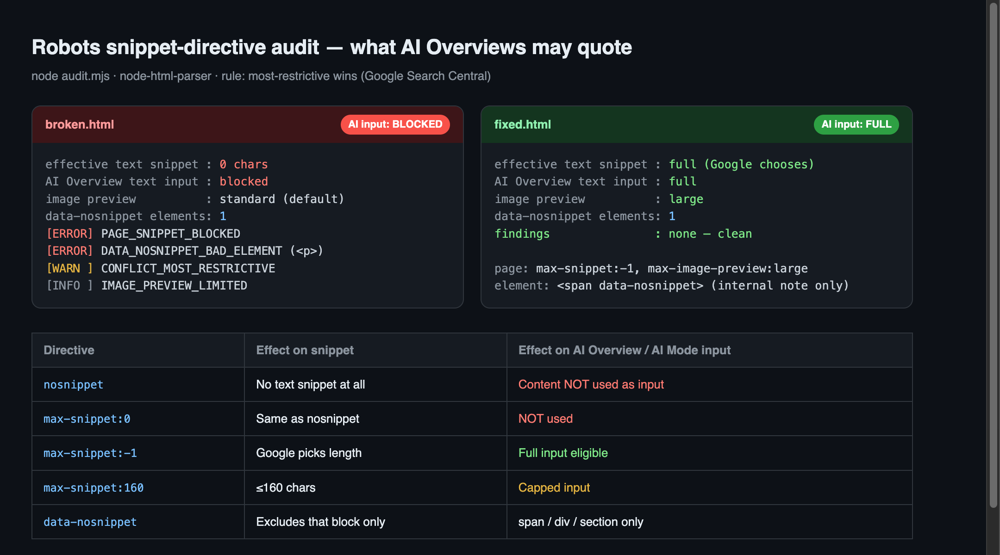

meta タグ一行は、検索結果の要約文を消すだけのものだと思っていた。今はその一行が、Google の AI Overview に自分のページが引用されるかどうかまで決める。Google Search Central のドキュメントが 2025 年以降、はっきりそう書き換えた。それなのに多くのサイトは、レイアウトテンプレートに昔コピペした `nosnippet` 一行のせいで、AI 検索に自分のコンテンツを丸ごと使わせずにいる。本人も気づかないまま。

今日はこの指示子を目で追うだけにしなかった。わざと壊したページと、直したページをそれぞれ作る。HTML をパースして「このページで AI が実際に引用できるものは何か」を判定する小さな監査スクリプトを回した。以下のログは、すべてそのサンドボックスから出た実際の出力だ。

## スニペット、AI Overview、そして robots meta が決めること

まず言葉を整理しよう。**スニペット**は検索結果でタイトルの下に出る要約文だ。以前はこれが純粋に「クリックを誘う下見」だった。**AI Overview** と **AI Mode** は、Google が検索上部（あるいは対話画面）に付ける生成型の回答である。複数ページの内容を要約して文章にし、その根拠として元ページを引用する。ここに決定的な変化がある。Google はこの生成回答が、どのページを**入力として使うか**を、従来のスニペット指示子と同じスイッチで制御することにした。

そのスイッチが `<meta name="robots">` に入れるスニペット指示子だ。ここでよく混同が起きる。`robots.txt` と robots meta タグはまったく別のレバーである。[robots.txt と llms.txt で AI クローラーのアクセスそのものを制御する話](/ja/blog/ja/ai-crawler-control-robots-txt-llms-txt-2026/)は「入れるかどうか」を決め、robots meta タグは「入った上で、索引・表示のときに何をどう見せられるか」を決める。だから順序が効く。robots.txt でクロールを止めてしまえば、Google はそのページの meta タグ自体を読めない。スニペット指示子が効くには、ページがクロール可能で索引可能でなければならない。アクセスを止めることと表示を調整することを取り違えると、意図と正反対の結果になる。

なぜ今これが重要なのか。検索トラフィックのかなりの部分が「リンクの一覧」から「要約された回答」へ移りつつあるからだ。AI 回答に根拠として引用されること自体が、新しい露出経路になった。ところがその露出の入り口が、とても古い meta タグ一行に握られている。

## 公式ルール — 四つの指示子と、正確な値

Google Search Central の robots meta ドキュメントに沿って整理する。推測ではなく、書かれているそのままだ。

`nosnippet`。定義はこうだ。「このページの検索結果にテキストスニペットや動画プレビューを表示しない」。そして決定的な一文が続く。このルールは「ウェブ検索、画像、Discover、AI Overview、AI Mode などあらゆる形式の検索結果に適用され、**コンテンツが AI Overview と AI Mode の直接的な入力として使われることも防ぐ**」。つまり `nosnippet` はもう「要約文を消す」ではなく「AI 引用の候補から外す」なのだ。

`max-snippet:[数値]`。テキストスニペットの最大文字数を決める。`0` ならスニペットなし（実質 `nosnippet` と同じ）、`-1` なら Google が長さを選ぶ、正の数ならその文字数まで。この指示子も同様に、AI Overview・AI Mode が「コンテンツを直接入力としてどれだけ使えるかを制限する」と明記されている。要するに `max-snippet:0` は引用遮断、`max-snippet:-1` は全量引用可だ。

`max-image-preview:[none|standard|large]`。検索結果に出る画像プレビューの最大サイズだ。`large` に開かないと大きな画像プレビューは出ない。既定はたいてい `standard` なので、ヒーロー画像を大きく見せたくてもこの値を触らなければ小さなサムネイルどまりになる。

`data-nosnippet`。これは meta タグではなく HTML 要素に付ける属性だ。ページ全体ではなく**特定のブロックだけ**をスニペットから外したいときに使う。落とし穴が二つある。一つ目、ドキュメントはこの属性が `span`・`div`・`section` の**三要素でしか**効かないと明言している。`<p data-nosnippet>` は単に無視される。二つ目、「既存ノードの data-nosnippet 属性を JavaScript で追加・削除するな」という警告が付いている。理由は単純だ。[AI クローラーの多くは JavaScript をレンダリングしない](/ja/blog/ja/ai-crawlers-dont-render-javascript-csr-2026/)ので、実行時に JS で付けた属性はクローラーの目には存在しないのと同じになる。サーバーが返す最初の HTML に埋め込まれていなければならない。

## 競合すれば「最も制限的なもの」が勝つ

現場で事故が起きるのはここだ。一つのページに指示子が複数掛かることがある。一般の `robots` タグが一つ、`googlebot` 専用タグが一つ、さらに CMS プラグインが仕込んだものまで。このときどれが勝つか。ドキュメントの答えは明快だ。「競合する robots ルールがある場合、**より制限的なルールが適用される**。たとえば同じページに `max-snippet:50` と `nosnippet` があれば、`nosnippet` が適用される」。

このルールの怖いところは方向性だ。緩める側には合成されず、締める側にだけ合成される。`googlebot` タグに `max-snippet:160` を入れて「Google にはスニペットを多めに出そう」としても、一般の `robots` タグに `nosnippet` が残っていれば結果はスニペット 0 だ。開けておいたつもりが、実は施錠されている状態。目でタグを二つ見比べて「大丈夫だろう」と判断するのが危ういのは、まさにこのためだ。

そこで私はこれをパーサーで監査することにした。

## ページを二枚作って、パーサーで監査した

repo の外の一時サンドボックスに、静的 HTML を二枚作った。片方は現場でよく見る失敗をそのまま詰めた `broken.html`、もう片方はそれを意図どおり直した `fixed.html` だ。

`broken.html` の `<head>` と本文には、こんなものが入っている。

```html
<!-- 失敗 1: 一般 robots に nosnippet — テンプレート全体にコピペされがち -->
<meta name="robots" content="index,follow,nosnippet">
<!-- 失敗 2: googlebot でスニペットを開こうとするが、上の nosnippet が「最も制限的」で勝つ -->
<meta name="googlebot" content="max-snippet:160">
...
<!-- 失敗 3: data-nosnippet を p に付与 → 非対応要素なので無視 -->
<p data-nosnippet>社内メモ：スニペットから外したいが p には効かない。</p>
```

`fixed.html` はページ全体を開けておき、外したい一ブロックだけを対応要素で隔離した。

```html
<!-- ページ全体: 全量スニペット + 大きい画像プレビューを許可 -->
<meta name="robots" content="index,follow,max-snippet:-1,max-image-preview:large">
...
<!-- 要素単位: 社内メモだけ、対応要素の span で -->
<span data-nosnippet>社内メモ：スニペットから除外。</span>
```

次に `node-html-parser` で HTML をパースし、一般 `robots` と `googlebot` の指示子を両方読み、「最も制限的なものが勝つ」ルールで合成した上で、`data-nosnippet` の付いた要素のタグ名を検査するスクリプト（`audit.mjs`）を書いた。合成の中核はこうだ。

```js
// nosnippet か max-snippet:0 が一つでもあれば全量遮断
function effectiveSnippetPolicy(dirsList) {
  let hardZero = false, cap = -1; // -1 = Google が長さを選ぶ
  for (const d of dirsList) {
    if (d.nosnippet) hardZero = true;
    if (d.maxSnippet === 0) hardZero = true;
    else if (d.maxSnippet > 0) cap = cap === -1 ? d.maxSnippet : Math.min(cap, d.maxSnippet);
  }
  if (hardZero) return { chars: 0, aiInput: 'blocked' };
  return { chars: cap, aiInput: cap === -1 ? 'full' : `capped@${cap}` };
}
```

二つのファイルを渡して回した、実際の出力だ。

```text
========================================================
FILE: broken.html
  effective text snippet : 0 chars
  AI Overview text input : blocked
  image preview          : standard(default)
  data-nosnippet elements: 1
  [ERROR] PAGE_SNIPPET_BLOCKED
  [WARN]  CONFLICT_MOST_RESTRICTIVE: robots=nosnippet と googlebot=max-snippet:160 が競合 → より制限的な nosnippet が勝つ（公式）。
  [INFO]  IMAGE_PREVIEW_LIMITED
  [ERROR] DATA_NOSNIPPET_BAD_ELEMENT: <p data-nosnippet> は無視。span/div/section のみ有効（公式）。
========================================================
FILE: fixed.html
  effective text snippet : full (Google chooses)
  AI Overview text input : full
  image preview          : large
  data-nosnippet elements: 1
  findings               : none — clean
========================================================
```



数字で見ると明快だ。`broken.html` は、コンテンツがどれだけ良くても AI Overview の入力から丸ごと外れる。開発者が `googlebot` に `max-snippet:160` を入れて「スニペットは開けてある」と信じていたものが、実際には施錠された扉だった。`fixed.html` は全量引用可で大きな画像プレビューも開いており、社内メモの一行だけが正確にスニペットから外れる。監査スクリプトが拾った四つの問題（全体遮断、要素の誤用、競合、画像制限）は、どれも実サイトで繰り返し出るパターンだ。

監査するときは必ず**サーバーが実際に返す HTML** を対象にすること。ブラウザの開発者ツールの Elements タブは JavaScript 実行後の DOM を見せるので、実行時に操作された meta タグがあればクローラーが見るものと食い違う。`curl -s <URL> | grep -i 'name="robots"'` のように生のレスポンスを取って確認するのが安全だ。私がはまった罠もこれだった。開発者ツールでは `max-snippet:-1` に見えるのに、サーバーの生レスポンスには CMS が仕込んだ `nosnippet` が残っていた。描画された画面ではなく、最初のバイトを見て初めて真実が出る。最初のバイトにタグがあっても、パーサーがそれを `<head>` の要素にできなければ検索エンジンは読めない。[robots meta が実際にどこへ着地するか](/ja/blog/ja/robots-meta-head-body-parser-placement-2026/)を10種のフィクスチャで測った。

これを目で判定しようとしないこと。[JSON-LD 構造化データを CI で検証したのと同じく](/ja/blog/ja/validate-structured-data-ci-jsonld-2026/)、スニペット指示子もビルドパイプラインでパーサーが自動チェックすべきだ。タグ一つが誤って掛かる瞬間を人の目は見落とすが、パーサーは見落とさない。

## 正直な限界 — 引用の「資格」であって「保証」ではない

ここで期待値を下げておく。`max-snippet:-1` と `max-image-preview:large` を開けたからといって、AI Overview が自分のページを引用してくれるわけではない。これらの指示子は**引用される資格**を開くだけで、実際に引用されるかは Google が決める。順位を上げてもくれない。Google はスニペット指示子が順位シグナルだと言ったことはない。`nosnippet` を外したから訪問者が増える、という保証もどこにもない。ページ指示子の上には Search Console プロパティのスイッチがもう一つある。HTML の PR がマージされても、親ドメインで除外を押されれば AI Overview から落ちる。[公式 GEO ガイドが残したそのスイッチ](/ja/blog/ja/official-geo-subtraction-gsc-control-2026/)を公開 URL で測った。

逆方向のトレードオフも正直に見よう。`nosnippet` を掛けるのが常に間違いというわけではない。有料コンテンツの本文、ログイン後にだけ見せるべき情報、検索結果に丸ごと出るとクリック動機が消えるページなら、スニペットを締めるのは理にかなう。ただし今は、その選択に「AI 回答に引用される機会を手放す」というコストが付くと知って決めなければならない。以前はスニペットだけを消していたが、今は生成検索での存在感まで一緒に消すことになる。

私の立場はこうだ。公開向けのコンテンツ、とくに人が答えを探して来る文書・ガイド・製品説明なら、スニペットを締める理由はほとんどない。締めるならページ全体ではなく、`data-nosnippet` で問題のブロックだけを精密に外すのが正しい。全体 `nosnippet` はたいてい「昔なぜ入れたのか誰も覚えていない」状態で残り、静かに引用機会を削り続ける。

## 開発者が今日やること

まとめると、今日確認するチェックリストはこうだ。

- **まずレイアウトテンプレートの全体 robots meta を開く。** 共通ヘッダーに `nosnippet` や `max-snippet:0` が埋まっていれば、その瞬間サイト全体が AI 引用の候補から外れている。
- **引用されたいコンテンツの既定値は** `max-snippet:-1, max-image-preview:large`。これが「AI 回答の根拠に使ってよい」という明示的なシグナルだ。
- **外したいのはページではなくブロック。** 社内メモ、ボイラープレート、有料本文のティーザーは `span`・`div`・`section` に `data-nosnippet` で隔離する。`p` や他の要素には効かない。
- **`data-nosnippet` を JavaScript でトグルしない。** サーバーが返す最初の HTML に埋める。レンダリングしないクローラーの前では、実行時属性は存在しないのと同じだ。
- **競合はパーサーで捕まえる。** 一般 `robots` と `googlebot` を両方読み、「最も制限的なものが勝つ」で合成した実効ポリシーを、目ではなく CI スクリプトで確認する。

構造化データをサーバーサイドで確実に出したい、あるいは既存サイトが AI 検索にどう露出しているかをスニペット・クローラーの観点で点検したい場合は、個人的に相談と実装のご依頼を受けている。プロフィールの問い合わせ経路から連絡してほしい。古い meta 一行がトラフィック経路を丸ごと塞いでいる例は、思ったより多い。
