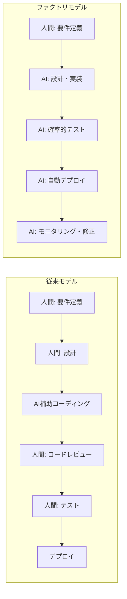
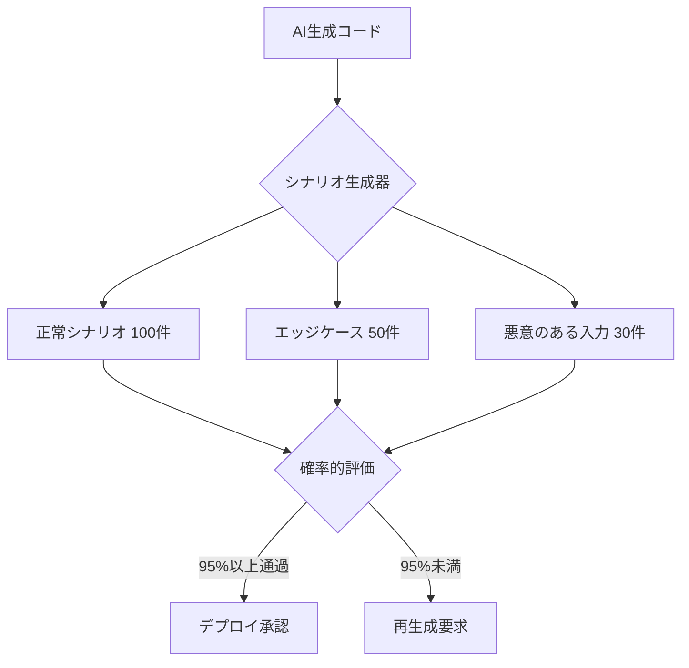
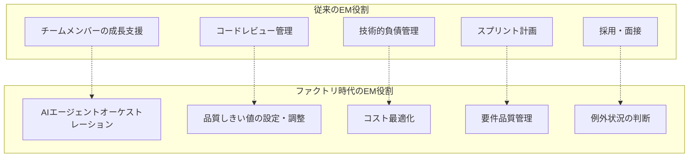

## 概要

「人間がコードを1行も書かない。」わずか1年前には大げさな未来予測に過ぎなかったこの言葉が、2026年現在、実際の運用モデルとして登場しています。

iwashi86の「[Software Factories And The Agentic Moment](https://iwashi.co/2025/02/01/Software-Factories-And-The-Agentic-Moment)」で提示された<strong>Software Factory</strong>モデルは、単なるAIコーディングツールの活用を超え、ソフトウェア開発の全プロセスを根本的に再設計します。人間の開発者がコードを書いたりレビューしたりする段階そのものを排除し、AIエージェントが要件定義からデプロイまでのパイプラインを自律的に運営する構造です。

本記事では、このファクトリモデルの核心要素である<strong>コードゼロプロセス</strong>、<strong>シナリオベースの確率的テスト</strong>、<strong>1日1000ドルのコンピューティングコスト構造</strong>、そして<strong>EM（Engineering Manager）の役割の根本的変化</strong>を分析します。

## コードゼロの開発プロセス

### 従来モデル vs ファクトリモデル

従来のAI支援開発は、人間の開発者が中心でした。GitHub Copilotがコードを提案し、人間がレビュー・修正する方式です。しかしSoftware Factoryモデルは、この前提そのものを覆します。



ファクトリモデルにおける人間の役割は、<strong>「何を作るか」を定義すること</strong>に集中します。「どう作るか」は完全にAIエージェントの領域です。

### コードレビューが消える理由

人間がコードをレビューしないということは、品質を諦めるという意味ではありません。むしろ<strong>人間によるレビューの限界</strong>を認識することです。

- 人間のレビュアーが1日に処理できるPR数には物理的な限界があります
- AIエージェントが1日に数百のPRを生成する環境では、人間のレビューがボトルネックになります
- 代わりに<strong>シナリオベースの確率的テスト</strong>が品質ゲートの役割を担います

## シナリオベースの確率的テスト

### 決定論的テストの限界

従来のソフトウェアテストは決定論的です。「入力Aを入れたら出力Bが出るべき」という断定的な検証です。しかしAIが生成したコードには、異なるアプローチが必要です。



### 確率的テストの原理

確率的テストは100%の通過を要求しません。代わりに<strong>統計的に有意なレベルの正確度</strong>を検証します。

1. <strong>シナリオ自動生成</strong>: AIが多様な使用シナリオを自動で生成します
2. <strong>大量実行</strong>: 数百〜数千のシナリオを並列で実行します
3. <strong>統計的評価</strong>: 全体の通過率、パフォーマンス分布、エラーパターンを分析します
4. <strong>しきい値ベースの判断</strong>: 事前に定義された通過率（例: 95%）を超えたらデプロイを承認します

この方式は、製造業の<strong>統計的品質管理（SQC）</strong>に似ています。すべての製品を一つ一つ検査する代わりに、統計的サンプリングで全体の品質を保証するのです。

### テストコストとコード生成コストの逆転

興味深い点は、<strong>テストコストがコード生成コストを上回る</strong>現象です。コード生成は1回で済みますが、そのコードの品質を検証するために数百のシナリオを実行する必要があるためです。これが1日1000ドルというコンピューティングコストの主要因です。

## 1日1000ドルのコンピューティングコスト

### コスト構造の分析

Software Factoryの運営に1日約1000ドルのコンピューティングコストが必要という推定は、以下の構成で説明されます。

| 項目 | 比率 | 日次コスト（推定） |
|------|------|-------------------|
| AIエージェント推論（コード生成） | 30% | ~$300 |
| シナリオベーステスト実行 | 40% | ~$400 |
| CI/CDパイプライン | 15% | ~$150 |
| モニタリング・ロールバックシステム | 15% | ~$150 |

### 開発者人件費との比較

シニアエンジニア1人の日次人件費を$500〜$800と算定すると、1日$1000のコンピューティングコストは<strong>エンジニア1.5〜2人分に相当</strong>します。しかしAIファクトリが処理する作業量は、人間チームの数十倍に達します。

```
ファクトリモデルの経済性:
- 日次コスト: ~$1,000（コンピューティング）
- 日次成果物: PR 200〜500件処理
- 人間チーム同等の成果物: エンジニア20〜50人必要
- 人間チーム日次コスト: $10,000〜$40,000
```

この10倍以上のコスト効率が、Software Factoryモデルの経済的根拠です。もちろんこれは<strong>反復的・定型的な作業</strong>での比較であり、まったく新しいアーキテクチャ設計のような創造的な作業には、まだ人間の関与が必要です。

## EM（Engineering Manager）の役割変化

### 従来のEMの役割

従来のEMは以下のような役割を果たしていました：

- チームメンバーの技術的成長支援
- コードレビュープロセスの管理
- スプリント計画と作業配分
- 技術的負債の管理
- 採用と面接

### ファクトリ時代のEM

Software Factoryモデルにおいて、EMの役割は根本的に変化します。



具体的に見ると：

1. <strong>AIエージェントオーケストレーション</strong>: どのエージェントをどの組み合わせで運用するか、エージェント間の協業パターンを設計します
2. <strong>品質しきい値の設定</strong>: 確率的テストの通過基準をビジネス要件に合わせて調整します。決済システムは99.9%、管理画面は95%など
3. <strong>コスト最適化</strong>: 1日$1000のコンピューティング予算をどのタスクにどれだけ配分するか決定します
4. <strong>要件品質管理</strong>: AIが正しいコードを生成するには、要件が明確である必要があります。曖昧な要件は曖昧な成果物を生みます
5. <strong>例外状況の判断</strong>: AIが処理できないエッジケースに対する最終判断を下します

### EMから「ファクトリマネージャー」へ

この変化の核心は、EMが<strong>人を管理する役割</strong>から<strong>システムを管理する役割</strong>へ転換されることです。人間のチームメンバーの能力を育てる代わりに、AIエージェントパイプラインの効率を最適化する役割が中心になります。

これは製造業で現場監督が自動化ラインの導入により「工場管理者」へ役割が変わったのと類似するパターンです。

## 現実的な課題と限界

### ファクトリモデルが適している領域

- CRUD中心のビジネスロジック
- 定型化されたAPI開発
- 反復的なUIコンポーネントの実装
- マイグレーション・リファクタリング作業

### まだ人間が必要な領域

- システムアーキテクチャの根本的な設計
- ビジネスドメインの深い理解が必要な判断
- 規制対応とコンプライアンス
- ユーザー体験の感性的な評価

### 組織的な課題

- <strong>信頼の問題</strong>: AIが生成したコードを人間がレビューなしにプロダクションにデプロイすることへの組織の信頼構築
- <strong>責任の問題</strong>: AIが作ったバグの責任の所在
- <strong>成長の問題</strong>: ジュニアエンジニアがコードを書かない環境でどのように成長するか

## 結論

Software Factoryモデルは、ソフトウェア開発の<strong>産業革命</strong>と呼ぶにふさわしいものです。手工業から工場生産へ転換されたように、ソフトウェア開発も職人の手作業から自動化されたファクトリラインへ移行しています。

重要なのは、この変化が開発者を不要にするのではなく、<strong>開発者の役割を再定義</strong>するということです。コードを書く人から、システムを設計・監督する人へ。EMはチームを管理する人から、ファクトリラインを最適化する人へ。

1日$1000のコンピューティングコストは、この転換への入場料です。そしてこのコストは下がり続けるでしょう。本当の問いは「このモデルは可能か？」ではなく、<strong>「私たちの組織はこの転換に備えているか？」</strong>です。

## 参考資料

- [Software Factories And The Agentic Moment — iwashi86](https://iwashi.co/2025/02/01/Software-Factories-And-The-Agentic-Moment)
- [Anthropic Claudeのエージェンティックコーディングパターン](https://docs.anthropic.com/en/docs/agents)
- [Statistical Quality Control in Manufacturing — ASQ](https://asq.org/quality-resources/statistical-quality-control)
