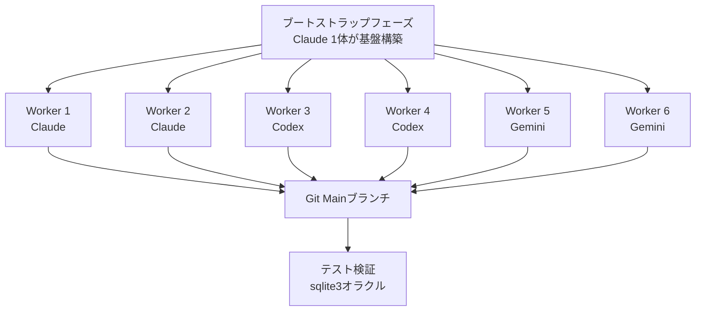
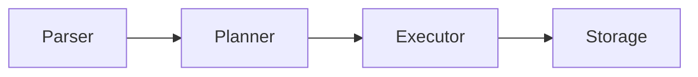

## 概要

6体のAIエージェント（Claude 2体、Codex 2体、Gemini 2体）が<strong>並列で協業</strong>し、RustでSQLite互換データベースエンジンを構築した実験が公開されました。成果物は約19,000行のコード、282個のユニットテストをパスする完成度の高いシステムです。

この実験は[Kian Kyarsのブログ記事](https://kiankyars.github.io/machine_learning/2026/02/12/sqlite.html)で詳しく紹介されており、Hacker Newsで63ポイントを記録して注目を集めました。

## アーキテクチャ：分散システムとしてのソフトウェア開発

このプロジェクトの核心アイデアはシンプルです。<strong>ソフトウェアエンジニアリングを分散システムとして扱う</strong>こと。調整手段はgit、ロックファイル、テスト、マージ規律です。

### ワークフロー



### エージェントループ

各エージェントは以下のループを無限に繰り返します：

1. 最新のmainブランチをプル
2. スコープが定められたタスクを1つクレーム（ロックファイル）
3. 実装＋sqlite3をオラクルとしたテスト
4. 共有進捗ドキュメント/ノート更新
5. プッシュ

## 実装された機能

このスウォームが構築したSQLiteクローンの完成度は驚くべきものです：

| レイヤー | 実装項目 |
|----------|----------|
| <strong>パーサー</strong> | SQLパーサー |
| <strong>プランナー</strong> | 統計ベースクエリプランニング |
| <strong>エグゼキューター</strong> | Volcanoモデルエグゼキューター |
| <strong>ストレージ</strong> | ページャー、B+ツリー |
| <strong>トランザクション</strong> | WAL、リカバリー、トランザクションセマンティクス |
| <strong>機能</strong> | JOIN、集計、インデックス、グループ集計 |

合計<strong>154コミット</strong>、開発期間2日間（2026-02-10〜02-12）。

## 調整コストの現実

最も興味深い発見は<strong>調整コスト（coordination tax）</strong>です。

```
全コミット数: 154
調整関連コミット: 84 (54.5%)
├── ロッククレーム
├── ロック解除
├── ステールロック整理
└── タスク調整
```

<strong>全コミットの54.5%が純粋な調整オーバーヘッド</strong>でした。これはマルチエージェントシステムの並列スループットがロック衛生とステールロック整理規律に大きく依存することを示しています。

## 成功要因の分析

### 1. オラクルベース検証＋高テスト頻度

sqlite3を正解（oracle）として使用し、各エージェントの出力を検証しました。`cargo test`と`./test.sh`による高速フィードバックループが決定的でした。

### 2. 強いモジュール境界



パーサー→プランナー→エグゼキューター→ストレージという明確なモジュール境界のおかげで、エージェントが<strong>直交的なスライス</strong>で作業でき、マージコンフリクトが最小化されました。

### 3. 共有状態ドキュメントは「ドキュメント」ではなく「ランタイム」

PROGRESS.mdやデザインノートは単なるドキュメントではなく、<strong>システムのランタイム状態</strong>として機能しました。これはマルチエージェント協業における共有状態管理の重要性を示しています。

## 限界と教訓

### コアレッサーの不在

重複とドリフトを整理するためのコアレッサーエージェントが実装されましたが、プロジェクト終了時に一度だけ実行されました。Geminiは全重複除去を完了できず途中で停止しました。<strong>コアレッサーは他のエージェントと同じ頻度で実行すべき</strong>です。

### トークン使用量の追跡不可

各プラットフォームが異なるフォーマットを使用するため、どのエージェントが最も貢献したか把握できませんでした。

### ドキュメント爆発

PROGRESS.mdが490行まで膨れ上がり、notesディレクトリに膨大な量のドキュメントが蓄積されました。これはエージェント間通信のコストを示しています。

## 先行研究との比較

この実験は[Verdent AIのマルチエージェントSWE-bench結果](/ja/blog/multi-agent-swe-bench-verdent)と同じ文脈にあります。Verdentがベンチマークでの並列実行効果を示したのに対し、このSQLiteプロジェクトは<strong>実際のシステム構築におけるマルチエージェント分業</strong>を実証しています。

核心的な共通点：

- エージェントに<strong>狭いインターフェース</strong>、<strong>共通の真実ソース</strong>、<strong>高速フィードバック</strong>を与えれば、実際のシステムコードで複合的なスループットを得られる
- テストは<strong>アンチエントロピー力</strong>である

## 核心まとめ

| 項目 | 数値 |
|------|------|
| エージェント数 | 6体（Claude 2＋Codex 2＋Gemini 2） |
| コード行数 | 約19,000行（Rust） |
| コミット数 | 154 |
| 調整オーバーヘッド | 54.5% |
| テスト | 282個パス |
| 開発期間 | 2日間 |

## 結論

この実験はマルチエージェント開発の可能性と限界を同時に示しています。6体のエージェントが2日間で19,000行の動作するデータベースエンジンを作り上げたことは印象的ですが、コミットの半数以上が調整オーバーヘッドだったという事実は見過ごせません。

<strong>並列性は強力ですが、厳格なタスク境界があってこそ効果的</strong>です。そしてテストは単なる品質保証ではなく、エージェントシステムのエントロピーに対抗する核心メカニズムです。

## 参考資料

- [Building SQLite With a Small Swarm — Kian Kyars](https://kiankyars.github.io/machine_learning/2026/02/12/sqlite.html)
- [GitHub: kiankyars/sqlite](https://github.com/kiankyars/sqlite)
- [GitHub: kiankyars/parallel-ralph](https://github.com/kiankyars/parallel-ralph)
- [Anthropic: Building a C Compiler](https://www.anthropic.com/engineering/building-c-compiler)
- [Cursor: Scaling Agents](https://cursor.com/blog/scaling-agents)
