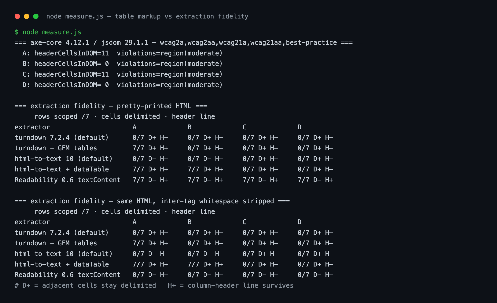

抽出器を通したあとの文字列がこうなっていた。

```text
Monday11:00-15:0014:30Lunch only
TuesdayClosedn/aRegular holiday
```

閉店時刻とラストオーダーがくっついて `15:0014:30` になっている。元のページでは罫線の引かれた普通の表だ。ブラウザで見れば何の問題もなく、アクセシビリティ監査も違反0件を返した。それでも同じHTMLをテキストへ還元した瞬間、値どうしが接着した。

最初はライブラリ側の不具合を疑った。ところがマークアップを変えて測り直すと、結果を分けていたのは表の組み方のほうだった。そこで同一のデータを4通りのマークアップで用意し、アクセシビリティツールと抽出器に並べて通した。以下の数値はすべて、そのサンドボックスから出た実際の出力である。

## 表には読み手が3種類いる

表のマークアップを考えるとき、たいていは目に見える読み手だけを想定する。画面で表を見る人だ。実際には3種類いる。

ひとつめが<strong>アクセシビリティツリー</strong>。ブラウザはDOMをそのまま支援技術へ渡すわけではない。要素の役割・名前・状態だけを抽出した別のツリーを構築し、スクリーンリーダーへ公開する。表においてこのツリーが担うべき核心は、セルの値ではなく<strong>セルとヘッダーの結びつき</strong>だ。「14:30」という値だけでは何の意味も持たない。それが月曜日の行のラストオーダー列だという事実が付いて、はじめて情報になる。W3C WAIの表チュートリアルはこの点を明記している（[Tables Tutorial](https://www.w3.org/WAI/tutorials/tables/)）。

> Data tables are used to organize data with a logical relationship in grids. Accessible tables need HTML markup that indicates header cells and data cells and defines their relationship. Assistive technologies use this information to provide context to users.

同じ文書はもう一文添える。「Relying on visual cues alone is not sufficient to create an accessible table.」太字とグレーの背景がヘッダーに見えるのは、人間の目にだけだ。

ふたつめが<strong>検索クローラー</strong>。HTMLをそのままパースするので、この層は比較的寛容だ。

3つめの重みが、ここ数年で急に増した。<strong>HTMLをテキストやMarkdownへ還元する抽出パイプライン</strong>だ。ページ本文を要約したり引用したりするツール、RAGのインデクサ、各種のコンテンツ収集器は、HTMLを丸ごと扱わないことが多い。本文領域を切り出し、タグを剥がし、プレーンテキストかMarkdownに変換したうえで、そのテキストを使う。この還元の過程で何が残り何が消えるかは、マークアップと変換器の設定だけで決まる。先のW3C文書がさらりと書き添えている一文が、まさにこの地点を指している。「Tables markup is often lost when converting from one format to another, though some programs may provide functionality to assist converting table markup.」

肝心なのは、この3者で失敗条件が違うことだ。アクセシビリティツリーはヘッダーセルの存在で生き、抽出パイプラインは `<table>` という要素そのもので生きる。片方だけを満たすマークアップが存在しうる。実験はそこから始めた。

## 同じデータを4通りに組む

7行4列の営業時間表をひとつ用意した。列はDay / Hours / Last order / Note、行は月曜から日曜まで。値は4通りとも文字単位で同一で、表を囲む段落もCSSも共通にした。違うのは表を構成する要素だけだ。

<strong>A. セマンティックな表の完全版</strong>

```html
<table>
  <caption>Opening hours</caption>
  <thead><tr><th scope="col">Day</th><th scope="col">Hours</th>…</tr></thead>
  <tbody>
    <tr><th scope="row">Monday</th><td>11:00-15:00</td><td>14:30</td>…</tr>
  </tbody>
</table>
```

<strong>B. tableではあるがヘッダーセルがない版</strong>。`<caption>` も `<thead>` もなく、すべてのマスが `<td>` だ。現場でいちばんよく出会う形でもある。管理画面から貼り付けた表や、CMSのエディタが吐いた表はたいていこうなる。

```html
<table>
  <tr><td>Day</td><td>Hours</td><td>Last order</td><td>Note</td></tr>
  <tr><td>Monday</td><td>11:00-15:00</td><td>14:30</td><td>Lunch only</td></tr>
</table>
```

<strong>C. divグリッドにARIAのroleを付けた版</strong>。CSS Gridでマスを描き、`role="table"`、`role="row"`、`role="columnheader"`、`role="rowheader"`、`role="cell"` を明示した。アクセシビリティに配慮するデザインシステムでよく見かける形だ。

<strong>D. divグリッドに何も付けない版</strong>。視覚的にだけ表に見える。

測定にはNode 22.22.0上でaxe-core 4.12.1（jsdom 29.1.1）、turndown 7.2.4、turndown-plugin-gfm、html-to-text 10.0.0、@mozilla/readability 0.6.0を使った。

判定は3つに分けた。抽出後のテキストで<strong>1行が曜日ひとつとその行の4つの値を元の順序で保持しているか</strong>（行の復元、7行満点）。<strong>隣り合う値が区切りなく接着していないか</strong>（セル分離）。<strong>列名の行が最初のデータ値より前に現れるか</strong>（ヘッダー保持）。行の復元判定に「曜日がちょうどひとつ」という条件を入れたのは、表全体が1行につぶれた状態を成功と数えないためだ。

## axeは4つとも緑にした

まずアクセシビリティの自動チェックを回した。タグはwcag2a、wcag2aa、wcag21a、wcag21aa、best-practiceをすべて有効にしている。

```text
A: headerCellsInDOM=11  violations=region(moderate)
B: headerCellsInDOM= 0  violations=region(moderate)
C: headerCellsInDOM=11  violations=region(moderate)
D: headerCellsInDOM= 0  violations=region(moderate)
```

`region` はページコンテンツがランドマークの中にないというbest-practiceのルールで、表とは無関係だ。表に関する違反は4通りすべて0件。ヘッダーセルが皆無のBも、役割を一切持たないdivグリッドのDも通過している。

これはaxeの欠陥ではない。axeの表ルールは構造的な矛盾を捕まえるよう設計されている。レイアウト目的の表の中に `<th>` がある、`headers` 属性が存在しないidを指している、といった類だ。「このdivの塊は本来なら表であるはずだ」という判定はコンテンツの意味を理解しなければ下せず、ルールエンジンの仕事ではない。[自動チェックが緑になったあとに残っていた障壁を数えたこと](/ja/blog/ja/axe-automated-a11y-coverage-gap-2026)があるが、今回も系列は同じである。ただし今回、見落とされた対象は人間の使い勝手だけではなかった。

一方、DOM上のヘッダーセル数を直接数えると差が出る。AとCが11個（列ヘッダー4＋行ヘッダー7）、BとDが0個。支援技術へセルとヘッダーの関係を渡せるマークアップはAとCだけということになる。ここまでなら結論は単純だ。ARIAのroleをきちんと付けたdivグリッドはセマンティックな表と対等である。

## 抽出器5種を通すと順位が入れ替わる

同じ4通りを抽出パイプラインに入れた。



整理するとこうなる。数値は行の復元（7行満点）、Dはセル分離、Hはヘッダー保持を表す。

| 抽出器 | A セマンティック表 | B thなし表 | C div+ARIA | D divのみ |
|---|---|---|---|---|
| turndown 7.2.4 デフォルト | 0/7 D+ H- | 0/7 D+ H- | 0/7 D+ H- | 0/7 D+ H- |
| turndown + GFMプラグイン | <strong>7/7 D+ H+</strong> | 0/7 D+ H- | 0/7 D+ H- | 0/7 D+ H- |
| html-to-text 10 デフォルト | 0/7 D- H- | 0/7 D- H- | 0/7 D+ H- | 0/7 D+ H- |
| html-to-text + dataTable | <strong>7/7 D+ H+</strong> | <strong>7/7 D+ H+</strong> | 0/7 D+ H- | 0/7 D+ H- |
| Readability textContent | 7/7 D- H+ | 7/7 D- H+ | 7/7 D- H+ | 7/7 D- H+ |

ここで3つがひっくり返る。

<strong>第一に、ARIAのroleはこの層で何もしていない。</strong>CとDの結果が、すべての抽出器で完全に一致した。`role="columnheader"` を律儀に付けたマークアップと、スタイルを当てただけのdivの塊は、テキストへ還元されると区別がつかない。抽出器はタグ名を見ており、role属性を見ていないからだ。アクセシビリティツリーではCがAと対等だったのに、この層ではDと同じ扱いになる。

<strong>第二に、変換器のデフォルト値はセマンティックな表さえ壊す。</strong>turndownの初期設定ではAですら0/7だ。表のルールがそもそも存在せず、セルを縦一列に展開してしまう。実際の出力がこれだ。

```text
Opening hours
Day
Hours
Last order
Monday
11:00-15:00
```

行も列も消え、値だけが並ぶ。GFMプラグインを足せばAは整ったMarkdownの表になる。ところが<strong>Bはプラグインを足しても0/7のままだった。</strong>出力を開くと、変換そのものを放棄して元のHTMLを丸ごと吐き出している。

```text
<table><tbody><tr><td>Day</td><td>Hours</td>…</tr>…</table>
```

GFMのMarkdown表記法では見出し行が必須だ。`<th>` がひとつもない表からは見出し行を作れないので、変換器が手を引く。つまり `<td>` だけで組んだ表は、ブラウザでは正常でaxeも通るのに、もっとも一般的なHTMLからMarkdownへの経路で未変換の塊になる。冒頭の `15:0014:30` も同じ系列だ。html-to-textのデフォルトは表をブロックとして扱うだけで、セルの間に区切りを入れない。

<strong>第三に、設定1行でBは生き返る。</strong>html-to-textに `{ selector: 'table', format: 'dataTable' }` を渡すと、AもBも7/7まで上がる。列幅を揃えた固定幅の表としてレンダリングされ、ヘッダー行も残る。ただしこれは<strong>抽出側を自分で制御できる場合にだけ</strong>切れるカードだ。自分のページを取りに来る他人のパイプラインの設定は、こちらの手の内にない。

## Readabilityの7/7は改行のおかげだった

表の中でReadabilityの行だけが、どのマークアップでも7/7になっている。最初は本文抽出器のほうが構造をよく保持するのだと読んだ。しかしどうも腑に落ちない。`textContent` はタグを消してテキストノードを連結するだけで、行の区切りを作る手段を持っていない。

そこで条件をひとつ足した。タグとタグの間の改行とインデントだけを取り除いた同じHTMLを、もう一度通す。minifierや、pretty-printしないテンプレートエンジンが出力する形だ。

```text
=== タグ間の空白を除去した後 ===
Readability 0.6 textContent   0/7   0/7   0/7   0/7
```

4通りとも0/7へ崩れた。ほかの4つの抽出器は、両条件で数値がまったく同じだった。つまりReadabilityの行の復元はマークアップが生んだものではなく、<strong>ソースファイルの改行が偶然生んだもの</strong>だった。HTMLを1行で出力した瞬間に消える。

この実験で個人的にいちばん値打ちがあったのはここだ。最初に表を見た時点で、私は誤った結論へ向かいかけていた。条件をもう一段作らなければ「textContentベースの抽出も表を守る」と書いていただろう。実測値がマークアップによるものか付帯条件によるものかは、その付帯条件を揺らしてみないと分かれない。

測定コード側でもひとつ見つかった。最初の判定関数は大文字小文字を区別して文字列を探していたが、html-to-textは `<th>` の内容をデフォルトで大文字化する。そのためAは実際には完全に復元できていたのに0/7と出ていた。大文字小文字を無視するよう直して、ようやく上の表の数値になった。測定ツール自体が値を変形するという事実も覚えておく価値がある。固有名詞混じりのヘッダーなら、その変形はそのまま下流へ流れていく。

## role="table"が届かない層

4通りの成績表はこう分かれる。

| マークアップ | アクセシビリティツリーのセルとヘッダーの関係 | テキスト抽出 |
|---|---|---|
| A `<table>` + `<th scope>` | あり | 残る |
| B `<table>` + `<td>` のみ | なし | ほぼ壊れる |
| C `<div role="table">` | あり | すべて壊れる |
| D `<div>` のみ | なし | すべて壊れる |

両方を通過するのはAだけだ。そしてこの表のどのマスも、自動監査は教えてくれない。

ここから下す実務的な判断はこうだ。<strong>データグリッドをdivで組んでARIAで意味を復元する方式は、アクセシビリティ単体で見れば成立するが、機械可読性全体で見れば明確な後退である。</strong>ARIAはアクセシビリティツリーという単一の読み手だけを狙った補正装置だ。table要素はその読み手を含む、より広い範囲へ同時に効く。同じアクセシビリティ結果を得る方法が2つあるなら、副次的に失うものが少ないほうを選ぶ。難しい判断ではない。

この判断はW3Cが以前から書き残している原則と方向が一致する。[Using ARIA](https://www.w3.org/TR/using-aria/)の第一のルールだ。

> If you can use a native HTML element or attribute with the semantics and behavior you require already built in, instead of re-purposing an element and adding an ARIA role, state or property to make it accessible, then do so.

このルールは普通、アクセシビリティの根拠としてだけ引かれる。今回の測定は根拠をもうひとつ足す。ネイティブ要素を使えば、アクセシビリティ以外の読み手もおまけで付いてくる。逆にARIAで意味を模倣すると、その意味はアクセシビリティツリーの外へ出られない。

同じ話を別の層でもしたことがある。[LocalBusinessのJSON-LDをJSで注入したら生HTMLでは0件になった実験](/ja/blog/ja/localbusiness-structured-data-server-side-vs-js-2026)がそれだ。ブラウザで確認すれば正常なのに、機械が持ち帰る段階では無いのと同じだった。表のマークアップも構造は変わらない。画面で確認した結果と、機械が持ち帰った結果がずれる。文字列に付くメタデータも同じ場所で漏れる。[言語と方向の情報を文字列と一緒に運ばないとどこで壊れるか](/ja/blog/ja/string-lang-dir-metadata-multilingual-web)を別途測ったことがある。

## この実験が言っていないこと

線を正直に引いておく。

測定対象は公開ライブラリである。GPTBotやClaudeBotのような実在のAIクローラーが内部でどんなパイプラインを使うかは公開されておらず、この結果からその挙動を断定はできない。HTMLをテキストやMarkdownへ還元する経路が広く使われている、という事実に依拠した<strong>参考値</strong>として読むのが正確だ。公式の数値ではない。

表のマークアップを直せば検索順位やAIの引用が上がる、という主張もしない。構造化データに関するGoogleの公式見解が、この問題の性格をよく表している（[構造化データの general guidelines](https://developers.google.com/search/docs/appearance/structured-data/sd-policies)）。

> Google does not guarantee that your structured data will show up in search results, even if your page is marked up correctly according to the Rich Results Test.

マークアップは可能性を開くのであって、結果を保証するものではない。今回の作業の性格も同じである。<strong>失敗モードをひとつ取り除く作業</strong>であって、成果を買う作業ではない。

測定環境もブラウザではなくjsdomだ。実際のスクリーンリーダーで表を読んだわけではなく、ヘッダーセルがアクセシビリティツリーへ公開されるかをDOMのレベルで数えている。axe-coreはaxe-coreのルール集合にすぎず、別のエンジンなら別の判定を出しうる。

## まとめ：表に手を入れる前に確認する6点

今回の実測から、そのままコードへ移せるものだけを残す。

1. <strong>データグリッドは `<table>` で組む。</strong>`<div role="table">` はアクセシビリティツリーひとつだけを満たし、残りの読み手をすべて失う。視覚デザインの制約でdivを使っているなら、いまの `display: grid` と `display: contents` の組み合わせで、`<table>` を保ったままたいていのレイアウトは実現できる。
2. <strong>`<th>` がひとつもない `<table>` を洗い出す。</strong>今回のBだ。もっとも多く、axeも黙り、Markdown変換で丸ごと壊れる。grepで一度なでる価値がある。
3. <strong>`scope` と `<caption>` を付ける。</strong>列ヘッダーに `scope="col"`、行ヘッダーは `<th scope="row">`。`<caption>` は表が何についてのものかをテキストとして残し、抽出結果でもそのまま生き延びる。
4. <strong>自分で回す抽出パイプラインがあるなら設定から見る。</strong>turndownはGFMプラグインなしでは表を展開してしまい、html-to-textは `format: 'dataTable'` なしではセルを接着させる。デフォルトが安全だと仮定しない。
5. <strong>textContentベースの抽出を信用しない。</strong>行が残って見えるなら、それはソースの改行のおかげかもしれない。minifyしたHTMLでもう一度回し、同じ結果が出るか確かめる。
6. <strong>CIにルールをひとつ入れる。</strong>「すべての `<table>` に `<th>` が最低1つ、`<caption>` または `aria-label` が存在」は静的検査で判定できる。自動アクセシビリティチェックが拾わない場所を、この1行が埋める。

表やフォーム、ランディングのマークアップを、アクセシビリティと機械可読性の両基準で監査する仕事を実務としている。運用中のサイトをこの基準で一度なでる必要があるなら、プロフィールの連絡先から話を投げてもらってかまわない。
