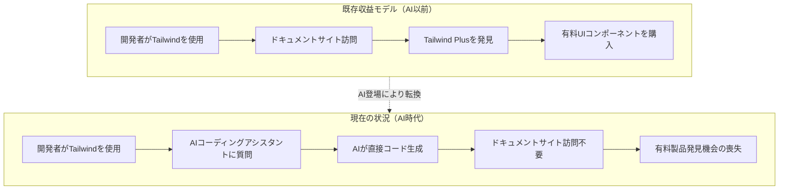
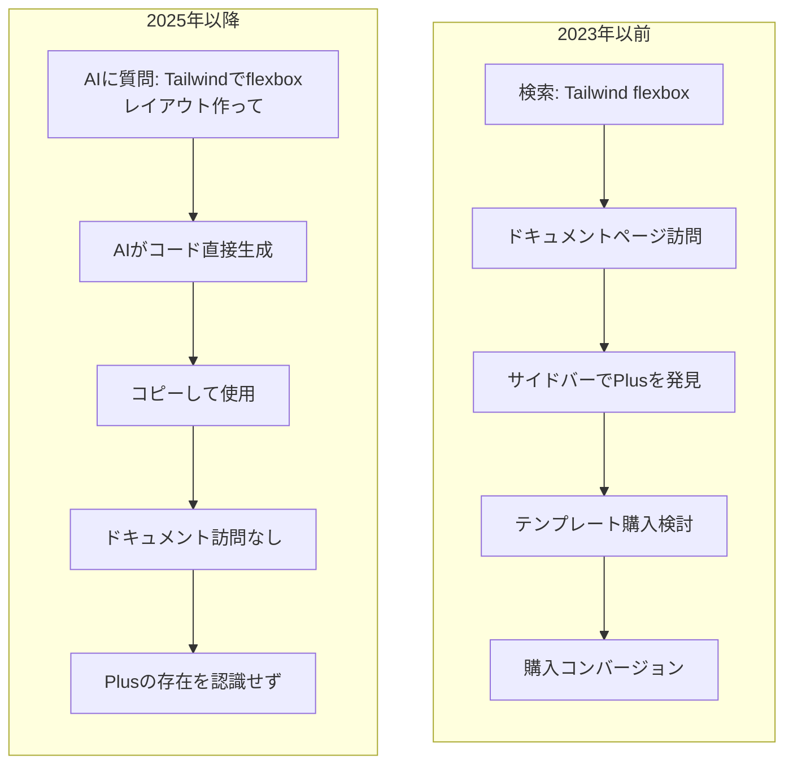
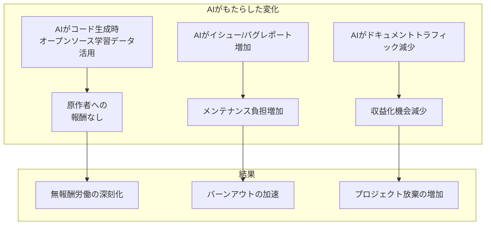
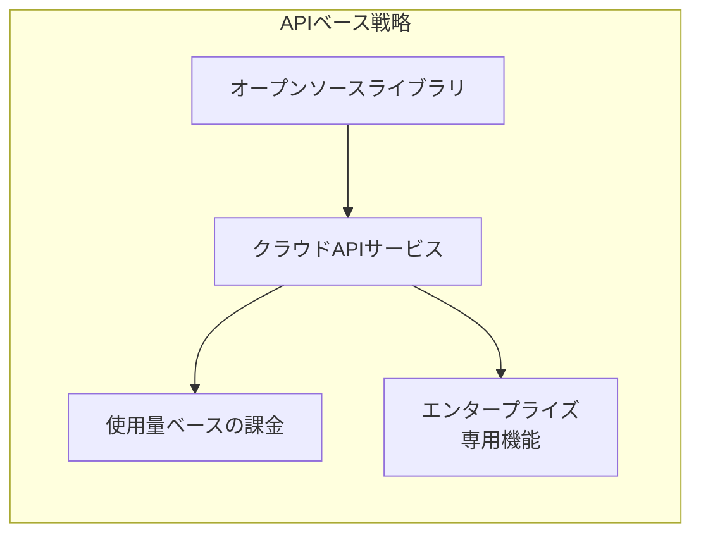
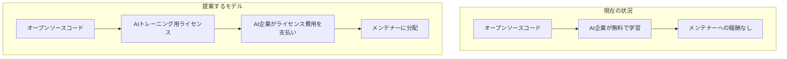

## 概要

2026年1月6日、ウェブ開発者の間で最も人気のあるCSSフレームワークの一つである<strong>Tailwind CSS</strong>を開発したTailwind Labsが、エンジニアリングチームの75%を解雇したというニュースが伝えられました。創設者兼CEOのAdam Wathanは、この決定の原因として「AIが我々のビジネスに与えた残酷な影響」を直接的に言及しました。

この事件は単なるスタートアップの構造調整ではありません。<strong>AI時代にオープンソースプロジェクトがどのように収益を創出し、持続可能性を維持できるか</strong>という根本的な問いを投げかけています。

## Tailwind Labs事態：何が起きたのか

### 数字で見る衝撃

| 指標 | 変化 |
|------|------|
| エンジニアリングチーム | 4名 → 1名（75%削減） |
| 売上 | 約80%減少 |
| ドキュメントトラフィック | 2023年初頭比40%減少 |
| フレームワーク人気度 | 継続上昇（617,000+ウェブサイトで使用） |

最も皮肉な点は、<strong>Tailwind CSS自体はかつてないほど人気がある</strong>ということです。ユーザー数は増えましたが、売上は急落しました。

### ビジネスモデルの崩壊

Tailwind Labsの収益構造は以下の通りでした：



<strong>核心的な問題</strong>：AIコーディングアシスタント（GitHub Copilot、Cursor、Claudeなど）が開発者の質問に直接回答することで、開発者はもはや公式ドキュメントを訪問する必要がなくなりました。ドキュメントトラフィックが有料製品発見の唯一の経路だったため、トラフィック減少は即座に売上減少につながりました。

### LLMフレンドリーなドキュメント要求の拒否

事態が公開されたきっかけは興味深いものでした。あるオープンソース貢献者がTailwindドキュメントを<strong>LLMがより簡単に消費できる形式に統合</strong>するPRを提出しました。Adam Wathanはこのプルリクエストを拒否し、次のように述べました：

> 「この変更は我々のビジネスをさらに持続不可能にするでしょう。」

ドキュメントをAIに優しくすると、AIがより正確な回答を提供するようになり、これがドキュメントサイト訪問をさらに減らす悪循環を生むためです。

## AIが破壊した「ドキュメント → 有料製品」ファネル

### 従来のオープンソース収益化モデル

これまで多くのオープンソースプロジェクトが使用してきた収益化戦略は以下の通りです：

1. <strong>オープンコア（Open Core）</strong>：コアは無料、高度な機能は有料
2. <strong>ドキュメントベースのコンバージョン</strong>：ドキュメントサイトで有料製品/サービスを宣伝
3. <strong>SaaS/ホスティングサービス</strong>：マネージドサービスの提供
4. <strong>コンサルティング/教育</strong>：専門知識に基づくサービス
5. <strong>スポンサーシップ/寄付</strong>：GitHub Sponsors、Open Collectiveなど

Tailwind Labsは主に<strong>2番目のモデル</strong>に依存していました。Tailwind Plusという有料UIコンポーネント/テンプレートを販売し、開発者がドキュメントを見ながら自然にこれを発見する構造でした。

### AI時代のファネル崩壊



<strong>AIが仲介者の役割を奪う</strong>ことで、開発者とドキュメントサイトの間の接点が切断されました。これはTailwindだけの問題ではありません。ドキュメントトラフィックに依存するすべてのビジネスモデルが脅威にさらされています。

## オープンソース貢献者の無報酬労働の深刻化

### 衝撃的な統計

Tailwind事態はより大きな問題の一部です：

- <strong>60%のオープンソースメンテナー</strong>がバーンアウトによりプロジェクトを辞めたか、辞めることを検討中
- ほとんどのメンテナーは<strong>報酬なしで</strong>重要なインフラを管理
- 企業はオープンソースに<strong>数十億ドルの価値</strong>を依存しながら貢献は微々たるもの

### AIが悪化させる無報酬労働

AI時代にオープンソース貢献者の状況はさらに困難になっています：



<strong>問題の核心</strong>：AI企業はオープンソースコードでモデルを訓練して数十億ドルを稼ぎますが、そのコードを書いたメンテナーにはほとんど何も還元されません。

### 持続不可能なエコシステム

現在のオープンソースエコシステムは<strong>少数の献身的なメンテナーの無報酬労働</strong>に依存しています。これは持続可能ではなく、以下のようなリスクを内包しています：

1. <strong>セキュリティ脆弱性</strong>：メンテナー不在によるパッチ遅延
2. <strong>イノベーションの鈍化</strong>：バーンアウトによる開発中断
3. <strong>サプライチェーンリスク</strong>：重要な依存関係の突然の放棄

## AI時代の持続可能な収益化策

### 1. API/サービスベースのモデルへの転換

ドキュメントトラフィックの代わりに<strong>実際の使用量</strong>に基づく収益化：



<strong>例</strong>：
- Vercel（Next.js）- ホスティングおよびデプロイサービス
- Supabase - マネージドPostgreSQL
- PlanetScale - マネージドMySQL

### 2. AIエージェント/プラグインエコシステムへの参入

AIツールと<strong>協力</strong>して新しい収益源を創出：

```typescript
// 仮想のTailwind AIプラグイン例
const tailwindPlugin = {
  name: "tailwind-premium-components",
  capabilities: ["generate_ui", "suggest_design"],
  pricing: {
    free: { components: 10 },
    pro: { components: "unlimited", price: "$19/month" }
  },
  // AIがこのプラグインを通じてプレミアムコンポーネントを提案
  onGenerate: async (context) => {
    if (context.needsComplexUI) {
      return suggestPremiumComponent(context);
    }
  }
};
```

<strong>戦略</strong>：AIコーディングアシスタントの<strong>プラグイン/拡張</strong>として存在し、AIがコードを生成する際に自然にプレミアム製品を推奨するようにする。

### 3. エンタープライズライセンシングの強化

個人開発者は無料、企業は有料：

| ティア | 対象 | 価格 | 含まれる内容 |
|--------|------|------|-------------|
| Community | 個人、スタートアップ | 無料 | 基本機能 |
| Team | 中小企業 | $99/月 | チーム協業、優先サポート |
| Enterprise | 大企業 | カスタム | SLA、専用サポート、セキュリティ監査 |

### 4. AIトレーニングデータライセンス

新しい収益源として<strong>AIトレーニングデータライセンス</strong>：



一部のプロジェクトはすでにライセンスに「AIトレーニング禁止」条項を追加し始めています。これは交渉力を確保するための戦略です。

### 5. コミュニティベースの持続可能性

<strong>GitHub Sponsors</strong>や<strong>Open Collective</strong>を超えたモデル：

- <strong>企業スポンサーシップの義務化</strong>：一定規模以上の企業は依存するオープンソースへの貢献を必須に
- <strong>貢献者組合</strong>：メンテナーが連合して交渉力を確保
- <strong>公的資金</strong>：政府/財団レベルでのオープンソースインフラ支援

## Tailwindが選択できる方向性

Adam Wathanが明らかにした今後の計画とともに、以下のような戦略が可能です：

### 短期戦略

1. <strong>Tailwind v4リリース</strong>：新バージョンで関心を再燃
2. <strong>AIツール統合</strong>：Cursor、Copilotなどとの公式パートナーシップ
3. <strong>プレミアムCLIツール</strong>：開発生産性ツールの有料化

### 長期戦略

1. <strong>デザインシステムプラットフォーム</strong>：単純なCSSを超えて総合デザインツールへ進化
2. <strong>エンタープライズ市場攻略</strong>：B2Bライセンスおよびサポートサービス
3. <strong>教育プラットフォーム</strong>：公認認証教育コース

## 私たちが学ぶべき教訓

### 開発者として

- オープンソースに依存するだけでなく<strong>貢献またはスポンサー</strong>する
- 使用するプロジェクトの<strong>持続可能性</strong>を確認する
- AIツール使用時も<strong>ドキュメントサイト訪問</strong>の習慣を維持

### オープンソースメンテナーとして

- <strong>ドキュメントトラフィック</strong>のみに依存する収益モデルを再検討
- <strong>多角化された収益源</strong>を構築
- AIエコシステムとの<strong>協力方法</strong>を模索

### 企業として

- 依存するオープンソースへの<strong>積極的なスポンサーシップ</strong>
- <strong>長期的なパートナーシップ</strong>の構築
- オープンソースエコシステムの健全性が<strong>自社ビジネスにも重要</strong>だという認識

## 結論

Tailwind Labsの人員削減は、<strong>AI時代のオープンソースエコシステムの構造的変化</strong>を示す象徴的な出来事です。

ドキュメントベースの収益モデルの崩壊、オープンソース貢献者の無報酬労働の深刻化、そしてAI企業のただ乗り問題はすべてつながっています。これらの問題を解決しなければ、私たちが依存するオープンソースエコシステム自体が危険にさらされる可能性があります。

<strong>解決策は存在します。</strong> APIベースのサービス、AIエコシステムとの協力、エンタープライズライセンシング、そしてコミュニティレベルでの支援強化。しかし、これらすべては<strong>エコシステム全体の意識変革</strong>を必要とします。

オープンソースは「無料」ではありません。誰かの時間と努力で作られています。AI時代でもこの事実は変わりません。むしろより重要になりました。

---

## 参考資料

- [Tailwind Labs lays off 75 percent of its engineers - DEVCLASS](https://devclass.com/2026/01/08/tailwind-labs-lays-off-75-percent-of-its-engineers-thanks-to-brutal-impact-of-ai/)
- [Business Insider: Tailwind layoffs](https://www.businessinsider.com/tailwind-engineer-layoffs-ai-github-2026-1)
- [Open Source Trends for 2025 and Beyond - InfoWorld](https://www.infoworld.com/article/3800992/open-source-trends-for-2025-and-beyond.html)
- [The Decoder: Tailwind's shattered business model](https://the-decoder.com/tailwinds-shattered-business-model-is-a-grim-warning-for-every-business-relying-on-site-visits-in-the-ai-era/)
