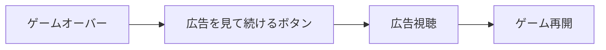
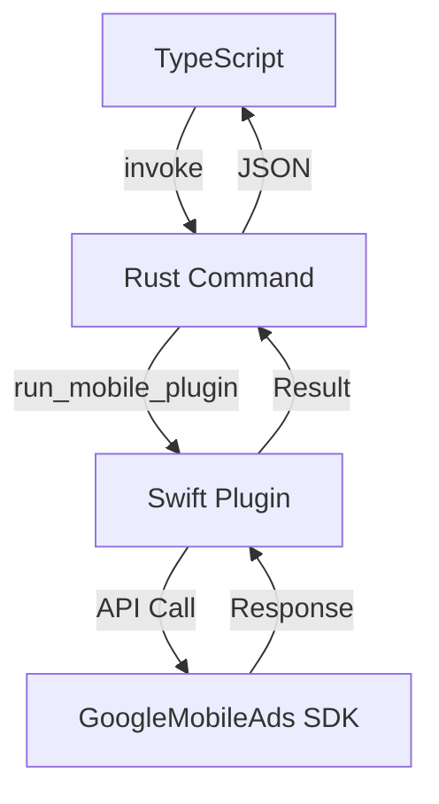
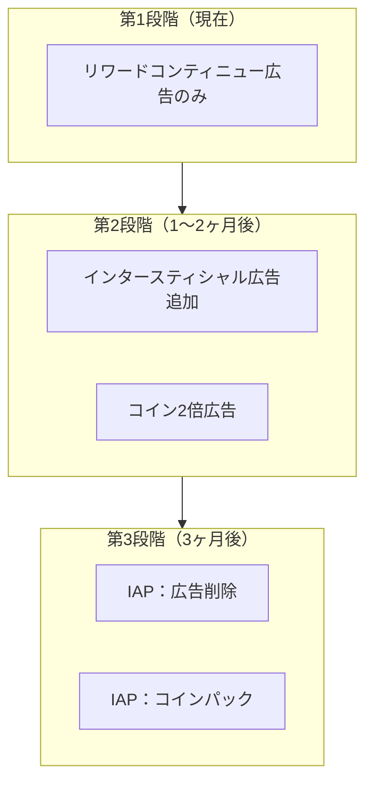

import { Image } from 'astro:assets';
import screenshot01 from '../../../assets/portfolio/shadow-dash/shadow-dash-01_iphone.png';
import screenshot04 from '../../../assets/portfolio/shadow-dash/shadow-dash-04_iphone.png';

## 概要

Tauri 2.xでiOSアプリを開発しましたが、収益化のためにAdMob広告を統合するにはどうすればよいでしょうか？

残念ながら、**Tauriには公式のAdMobプラグインがありません**。この記事では、AdMobリワード広告を統合するためにSwiftプラグインを独自開発した全過程を共有します。

> この記事は[Tauri + PixiJSでiOSゲーム開発](/ja/blog/ja/tauri-pixijs-ios-game-development)の続編です。Shadow Dashゲームに広告を統合した実際の経験に基づいて執筆しました。

<Image src={screenshot04} alt="Shadow Dash ゲームオーバー画面" width={300} class="mx-auto rounded-lg shadow-lg" />

## なぜAdMobか？

### モバイルゲーム収益化オプションの比較

| 方式 | メリット | デメリット |
|------|----------|------------|
| **リワード広告** | UX良好、高いeCPM | 実装が複雑 |
| バナー広告 | 実装が簡単 | 低いeCPM、UX悪化 |
| アプリ内課金 | 高収益 | 実装複雑、決済審査 |

### リワード広告を選んだ理由

Shadow Dashでは**コンティニューシステム**にリワード広告を適用しました：



ユーザーが**自発的に**広告を視聴し、報酬（ゲーム継続）を受け取る構造で、ユーザー体験を損なわいません。

### 広告SDK選定プロセス

Tauriアプリで利用可能な広告SDKを検討しました：

| SDK | メリット | デメリット | 採用 |
|-----|----------|------------|------|
| **AdMob** | 高いeCPM、多様な広告形式 | ネイティブプラグイン必要 | ✅ 採用 |
| AppLixir | JS SDKのみで統合可能 | **DAU 5,000人以上必要** | ❌ 不採用 |
| H5 Game Ads | HTML5ゲーム特化 | **ベータサービス（不安定）** | ❌ 不採用 |

**AppLixirを選ばなかった理由**：
- 最低日間アクティブユーザー（DAU）5,000人以上で申請可能
- 新規アプリでこの条件を満たすのは困難

**H5 Game Adsを選ばなかった理由**：
- まだベータサービス段階
- 安定性と収益性が検証されていない

### AdMob vs AppLixir 詳細比較

AdMobとAppLixirのパフォーマンスを比較すると：

| 項目 | AdMob | AppLixir |
|------|-------|----------|
| eCPM（リワード） | $20〜30 | $15〜25 |
| Fill Rate | 95%+ | 80〜90% |
| 対応形式 | リワード、インタースティシャル、バナー | リワードのみ |
| Mediation | 対応 | 非対応 |
| 統合難易度 | 高い（ネイティブ必要） | 低い（JS SDK） |
| 参入障壁 | なし | DAU 5,000人以上必要 |

**結論**：ネイティブプラグイン開発が必要ですが、AdMobは参入障壁がなく、高いeCPMとFill Rateを提供します。

---

## Tauri CLIのアップグレード

### XCFrameworkサポートが必要

Tauri v2でiOSプラグインを開発するには、Swift Package Manager（SPM）を使用する必要があります。GoogleMobileAds SDKのような外部フレームワーク依存が必要なプラグインを作るには、**XCFrameworkサポート**が必要です。

### Tauri CLI 2.9.6+へのアップグレード

```bash
# CargoでTauri CLIをアップグレード
cargo install tauri-cli --force

# バージョン確認
cargo tauri --version
# 出力: tauri-cli 2.9.6（またはそれ以上）
```

### --ios-frameworkオプション

プラグイン作成時にiOSフレームワークタイプを指定できます：

```bash
# Xcodeプロジェクト方式（SPM依存関係の追加が容易）- 推奨
cargo tauri plugin new admob --ios --ios-framework xcode

# XCFramework方式
cargo tauri plugin new admob --ios --ios-framework xcframework
```

| オプション | 説明 | メリット | デメリット |
|-----------|------|----------|------------|
| `xcode` | Xcodeプロジェクト生成 | SPMで依存関係追加が容易 | プロジェクトファイル管理が必要 |
| `xcframework` | XCFramework生成 | 配布が容易 | 外部依存関係の追加が複雑 |

**AdMobプラグインには`xcode`オプション推奨**：GoogleMobileAds SDKをSPMで簡単に追加できます。

---

## Tauriプラグイン構造の理解

### ディレクトリ構造

```
tauri-plugin-admob/
├── src/                    # Rustコード
│   ├── lib.rs             # プラグインエントリポイント
│   ├── mobile.rs          # iOS/Androidブリッジ
│   ├── desktop.rs         # デスクトップスタブ
│   ├── commands.rs        # Tauriコマンド
│   └── models.rs          # リクエスト/レスポンス型
├── ios/                    # iOSネイティブコード
│   └── tauri-plugin-admob/
│       └── AdmobPlugin.swift
├── guest-js/              # TypeScript API
│   └── index.ts
├── permissions/           # Tauri権限設定
│   └── default.toml
├── build.rs               # ビルドスクリプト
└── Cargo.toml
```

### データフロー



---

## プラグイン開発の開始

### プラグインのスキャフォールディング

```bash
# Xcodeプロジェクト方式で作成
cargo tauri plugin new admob --ios --ios-framework xcode
```

### GoogleMobileAds SDKの追加

XcodeでプラグインプロジェクトをIヒ、Swift Package ManagerでSDKを追加：

1. `tauri-plugin-admob/ios/tauri-plugin-admob.xcodeproj`を開く
2. **File → Add Package Dependencies**
3. URL入力：`https://github.com/googleads/swift-package-manager-google-mobile-ads`
4. **GoogleMobileAds**を選択して追加

---

## Swiftプラグインの実装

### AdmobPlugin.swift

```swift
import SwiftRs
import Tauri
import UIKit
import WebKit
import GoogleMobileAds

// MARK: - Argument Types
class InitializeArgs: Decodable {}

class LoadRewardedArgs: Decodable {
    let adUnitId: String
}

class ShowRewardedArgs: Decodable {}

// MARK: - AdMob Plugin
class AdmobPlugin: Plugin {
    private var rewardedAd: GADRewardedAd?
    private var isInitialized = false
    private var pendingInvoke: Invoke?

    // テスト広告ID（本番では実際のIDを使用）
    private let testAdUnitId = "ca-app-pub-3940256099942544/1712485313"

    @objc public override func load(webview: WKWebView) {
        NSLog("[AdMob Plugin] Loaded")
    }

    // SDK初期化
    @objc public func initialize(_ invoke: Invoke) {
        if isInitialized {
            invoke.resolve(["success": true, "message": "Already initialized"])
            return
        }

        GADMobileAds.sharedInstance().start { status in
            self.isInitialized = true
            NSLog("[AdMob Plugin] SDK Initialized")
            invoke.resolve(["success": true, "message": "SDK initialized"])
        }
    }

    // リワード広告のロード
    @objc public func loadRewardedAd(_ invoke: Invoke) {
        do {
            let args = try invoke.parseArgs(LoadRewardedArgs.self)
            let adUnitId = args.adUnitId.isEmpty ? testAdUnitId : args.adUnitId

            let request = GADRequest()
            GADRewardedAd.load(withAdUnitID: adUnitId, request: request) { [weak self] ad, error in
                if let error = error {
                    invoke.resolve(["success": false, "error": error.localizedDescription])
                    return
                }

                self?.rewardedAd = ad
                self?.rewardedAd?.fullScreenContentDelegate = self
                invoke.resolve(["success": true])
            }
        } catch {
            invoke.reject(error.localizedDescription)
        }
    }

    // 広告準備状態の確認
    @objc public func isRewardedAdReady(_ invoke: Invoke) {
        let isReady = rewardedAd != nil
        invoke.resolve(["ready": isReady])
    }

    // 広告表示
    @objc public func showRewardedAd(_ invoke: Invoke) {
        guard let rewardedAd = rewardedAd else {
            invoke.resolve(["success": false, "rewarded": false, "error": "No ad loaded"])
            return
        }

        guard let rootViewController = getRootViewController() else {
            invoke.resolve(["success": false, "rewarded": false, "error": "No root view controller"])
            return
        }

        pendingInvoke = invoke

        DispatchQueue.main.async {
            rewardedAd.present(fromRootViewController: rootViewController) { [weak self] in
                let reward = rewardedAd.adReward
                if let pending = self?.pendingInvoke {
                    pending.resolve([
                        "success": true,
                        "rewarded": true,
                        "rewardAmount": reward.amount.intValue,
                        "rewardType": reward.type
                    ])
                    self?.pendingInvoke = nil
                }
            }
        }
    }

    // Root View Controllerの取得
    private func getRootViewController() -> UIViewController? {
        if let windowScene = UIApplication.shared.connectedScenes
            .compactMap({ $0 as? UIWindowScene })
            .first(where: { $0.activationState == .foregroundActive }),
           let keyWindow = windowScene.windows.first(where: { $0.isKeyWindow }),
           let rootVC = keyWindow.rootViewController {
            var topController = rootVC
            while let presented = topController.presentedViewController {
                topController = presented
            }
            return topController
        }
        return nil
    }
}

// MARK: - GADFullScreenContentDelegate
extension AdmobPlugin: GADFullScreenContentDelegate {
    func adDidDismissFullScreenContent(_ ad: GADFullScreenPresentingAd) {
        rewardedAd = nil
        if let pending = pendingInvoke {
            pending.resolve(["success": true, "rewarded": false])
            pendingInvoke = nil
        }
    }

    func ad(_ ad: GADFullScreenPresentingAd, didFailToPresentFullScreenContentWithError error: Error) {
        rewardedAd = nil
        if let pending = pendingInvoke {
            pending.resolve(["success": false, "rewarded": false, "error": error.localizedDescription])
            pendingInvoke = nil
        }
    }
}

// MARK: - Plugin Export
@_cdecl("init_plugin_admob")
func initPlugin() -> Plugin {
    return AdmobPlugin()
}
```

### 重要なポイント

1. **`@objc`アノテーション**：Objective-Cランタイム経由でRustから呼び出すために必要
2. **`pendingInvoke`パターン**：非同期広告コールバックをTauriの同期invokeパターンにブリッジ
3. **`GADFullScreenContentDelegate`**：広告の閉じる/エラーイベントを処理
4. **`@_cdecl("init_plugin_admob")`**：Rustプラグインロード用のC関数エクスポート

---

## Rustブリッジの実装

### models.rs

```rust
use serde::{Deserialize, Serialize};

#[derive(Debug, Clone, Default, Deserialize, Serialize)]
#[serde(rename_all = "camelCase")]
pub struct InitializeResponse {
    pub success: bool,
    pub message: Option<String>,
}

#[derive(Debug, Deserialize, Serialize)]
#[serde(rename_all = "camelCase")]
pub struct LoadRewardedAdRequest {
    pub ad_unit_id: String,
}

#[derive(Debug, Clone, Default, Deserialize, Serialize)]
#[serde(rename_all = "camelCase")]
pub struct LoadRewardedAdResponse {
    pub success: bool,
    pub error: Option<String>,
}

#[derive(Debug, Clone, Default, Deserialize, Serialize)]
#[serde(rename_all = "camelCase")]
pub struct IsRewardedAdReadyResponse {
    pub ready: bool,
}

#[derive(Debug, Clone, Default, Deserialize, Serialize)]
#[serde(rename_all = "camelCase")]
pub struct ShowRewardedAdResponse {
    pub success: bool,
    pub rewarded: bool,
    pub reward_amount: Option<i32>,
    pub reward_type: Option<String>,
    pub error: Option<String>,
}
```

### mobile.rs

```rust
use serde::de::DeserializeOwned;
use tauri::{
    plugin::{PluginApi, PluginHandle},
    AppHandle, Runtime,
};
use crate::models::*;

#[cfg(target_os = "ios")]
tauri::ios_plugin_binding!(init_plugin_admob);

pub fn init<R: Runtime, C: DeserializeOwned>(
    _app: &AppHandle<R>,
    api: PluginApi<R, C>,
) -> crate::Result<Admob<R>> {
    #[cfg(target_os = "ios")]
    let handle = api.register_ios_plugin(init_plugin_admob)?;
    Ok(Admob(handle))
}

pub struct Admob<R: Runtime>(PluginHandle<R>);

impl<R: Runtime> Admob<R> {
    pub fn initialize(&self) -> crate::Result<InitializeResponse> {
        self.0.run_mobile_plugin("initialize", ()).map_err(Into::into)
    }

    pub fn load_rewarded_ad(&self, ad_unit_id: String) -> crate::Result<LoadRewardedAdResponse> {
        self.0.run_mobile_plugin("loadRewardedAd",
            LoadRewardedAdRequest { ad_unit_id }).map_err(Into::into)
    }

    pub fn is_rewarded_ad_ready(&self) -> crate::Result<IsRewardedAdReadyResponse> {
        self.0.run_mobile_plugin("isRewardedAdReady", ()).map_err(Into::into)
    }

    pub fn show_rewarded_ad(&self) -> crate::Result<ShowRewardedAdResponse> {
        self.0.run_mobile_plugin("showRewardedAd", ()).map_err(Into::into)
    }
}
```

### build.rs（重要！）

```rust
const COMMANDS: &[&str] = &[
    "initialize",
    "load_rewarded_ad",
    "is_rewarded_ad_ready",
    "show_rewarded_ad"
];

fn main() {
    // iOSビルド時にフレームワークをリンク
    let target = std::env::var("TARGET").unwrap_or_default();
    if target.contains("ios") {
        println!("cargo:rustc-link-lib=framework=GoogleMobileAds");
        println!("cargo:rustc-link-lib=framework=UserMessagingPlatform");
    }

    tauri_plugin::Builder::new(COMMANDS)
        .android_path("android")
        .ios_path("ios")
        .build();
}
```

**注意**：`#[cfg(target_os = "ios")]`はbuild.rsでは機能しません。build.rsは**ホストマシン**（macOS）で実行されるため、`std::env::var("TARGET")`でターゲットを確認する必要があります。

---

## TypeScript APIの実装

### guest-js/index.ts

```typescript
import { invoke } from '@tauri-apps/api/core'

export interface InitializeResponse {
  success: boolean;
  message?: string;
}

export interface LoadRewardedAdResponse {
  success: boolean;
  error?: string;
}

export interface IsRewardedAdReadyResponse {
  ready: boolean;
}

export interface ShowRewardedAdResponse {
  success: boolean;
  rewarded: boolean;
  rewardAmount?: number;
  rewardType?: string;
  error?: string;
}

export async function initialize(): Promise<InitializeResponse> {
  return await invoke<InitializeResponse>('plugin:admob|initialize');
}

export async function loadRewardedAd(adUnitId: string = ''): Promise<LoadRewardedAdResponse> {
  return await invoke<LoadRewardedAdResponse>('plugin:admob|load_rewarded_ad', {
    adUnitId,
  });
}

export async function isRewardedAdReady(): Promise<IsRewardedAdReadyResponse> {
  return await invoke<IsRewardedAdReadyResponse>('plugin:admob|is_rewarded_ad_ready');
}

export async function showRewardedAd(): Promise<ShowRewardedAdResponse> {
  return await invoke<ShowRewardedAdResponse>('plugin:admob|show_rewarded_ad');
}
```

---

## アプリへのプラグイン統合

### Cargo.tomlにプラグインを追加

```toml
[dependencies]
tauri-plugin-admob = { path = "../tauri-plugin-admob" }
```

### lib.rsにプラグインを登録

```rust
pub fn run() {
    tauri::Builder::default()
        .plugin(tauri_plugin_admob::init())
        .run(tauri::generate_context!())
        .expect("error while running tauri application");
}
```

### 権限設定

**src-tauri/capabilities/default.json**:

```json
{
  "permissions": [
    "core:default",
    "admob:default"
  ]
}
```

**tauri-plugin-admob/permissions/default.toml**:

```toml
[default]
description = "Default permissions for the AdMob plugin"
permissions = [
    "allow-initialize",
    "allow-load-rewarded-ad",
    "allow-is-rewarded-ad-ready",
    "allow-show-rewarded-ad"
]
```

### Info.plistにアプリIDを追加

**src-tauri/gen/apple/アプリ名_iOS/Info.plist**:

```xml
<key>GADApplicationIdentifier</key>
<string>ca-app-pub-XXXXXXXXXXXXXXXX~XXXXXXXXXX</string>
<key>SKAdNetworkItems</key>
<array>
    <dict>
        <key>SKAdNetworkIdentifier</key>
        <string>cstr6suwn9.skadnetwork</string>
    </dict>
</array>
```

---

## ゲームでの広告使用

### 広告設定ファイル

**src/lib/config/admob.ts**:

```typescript
// 広告有効化フラグ（承認まではfalse）
export const ADS_ENABLED = false;

const TEST_AD_UNITS = {
  rewardedAd: 'ca-app-pub-3940256099942544/1712485313',
  appId: 'ca-app-pub-3940256099942544~1458002511',
};

const PRODUCTION_AD_UNITS = {
  rewardedAd: 'ca-app-pub-XXXXXXXX/XXXXXXXXXX',  // 実際の広告ユニットID
  appId: 'ca-app-pub-XXXXXXXX~XXXXXXXXXX',       // 実際のアプリID
};

const isDevelopment = import.meta.env.DEV;

export const AD_UNITS = isDevelopment ? TEST_AD_UNITS : PRODUCTION_AD_UNITS;
export const isTestMode = isDevelopment;
```

### ゲームオーバー画面での使用

```typescript
import { AD_UNITS, ADS_ENABLED } from '$lib/config/admob';
import * as admob from 'tauri-plugin-admob-api';

let adLoading = false;
let adError = '';

async function handleWatchAd() {
  if (!ADS_ENABLED) {
    // 広告無効時は直接コンティニュー
    game.startContinue();
    return;
  }

  adLoading = true;
  adError = '';

  try {
    // 広告準備状態を確認
    const readyCheck = await admob.isRewardedAdReady();

    if (!readyCheck.ready) {
      // 広告が準備されていなければロード
      const loadResult = await admob.loadRewardedAd(AD_UNITS.rewardedAd);
      if (!loadResult.success) {
        adError = loadResult.error || 'Failed to load ad';
        adLoading = false;
        return;
      }
    }

    // 広告表示
    const showResult = await admob.showRewardedAd();

    if (showResult.rewarded) {
      // 報酬獲得 - ゲーム継続
      game.startContinue();
    } else if (showResult.error) {
      adError = showResult.error;
    }
  } catch (error) {
    adError = String(error);
  } finally {
    adLoading = false;
  }
}
```

---

## トラブルシューティング

### Swift型エラー：「cannot find type 'RewardedAd' in scope」

**原因**：GoogleMobileAds SDKはObjective-Cベースで、Swiftでは`GAD`プレフィックスが必要です。

```swift
// ❌ 間違い
private var rewardedAd: RewardedAd?

// ✅ 正解
private var rewardedAd: GADRewardedAd?
```

### リンカーエラー：「Undefined symbols for architecture arm64」

**原因**：GoogleMobileAdsフレームワークがリンクされていない

**解決策1**：メインアプリのXcodeプロジェクトにもSDKを追加

1. `src-tauri/gen/apple/アプリ名.xcodeproj`を開く
2. **File → Add Package Dependencies**
3. GoogleMobileAds SDKを追加

**解決策2**：build.rsでフレームワークをリンク

```rust
let target = std::env::var("TARGET").unwrap_or_default();
if target.contains("ios") {
    println!("cargo:rustc-link-lib=framework=GoogleMobileAds");
}
```

### Tauri権限エラー

**エラーメッセージ**：
```
admob.is_rewarded_ad_ready not allowed.
Permissions associated with this command: admob:allow-is-rewarded-ad-ready
```

**解決策**：`permissions/default.toml`と`capabilities/default.json`に権限を追加

### 広告が表示されない

**症状**：ボタンクリックしても広告が表示されない

**確認事項**：
1. テスト広告IDを使用しているか確認
2. `GADMobileAds.sharedInstance().start()`が呼ばれているか確認
3. 実機でテスト（シミュレーターのサポートは限定的）

---

## 収益化戦略の考察

### 段階的導入計画



### 収益化3つの原則

1. **ゲームバランス保護**：見た目のみ課金、能力値販売禁止
2. **無課金ユーザー尊重**：全コンテンツ無料で獲得可能
3. **価値提供優先**：ユーザーが「買う価値がある」と感じる商品

### 予想収益（DAU 10,000人基準）

| 段階 | 広告タイプ | 日間収益 | 月間収益 |
|------|-----------|----------|----------|
| 1 | リワードのみ | 〜$130 | 〜$3,900 |
| 2 | リワード + インタースティシャル | 〜$425 | 〜$12,750 |
| 3 | 広告 + IAP | 〜$600 | 〜$18,000 |

---

## まとめ

### 学んだこと

1. **Tauri CLIを最新に保つ**：XCFrameworkサポートなど重要な機能が継続的に追加
2. **Tauriプラグイン構造の理解**：Rust ↔ Swiftブリッジの理解が必須
3. **クロスコンパイル**：build.rsでのHOST vs TARGET区別が重要
4. **Tauri v2権限システム**：capabilitiesとpermissionsが必須

### チェックリスト

- [ ] 最新のTauri CLIにアップグレード（`cargo install tauri-cli --force`）
- [ ] `--ios-framework xcode`オプションでプラグイン作成
- [ ] GoogleMobileAds SDKを**メインアプリとプラグイン両方**に追加
- [ ] build.rsで`std::env::var("TARGET")`でiOSを検出
- [ ] `permissions/default.toml`に全コマンド権限を定義
- [ ] `capabilities/default.json`に`admob:default`を追加
- [ ] Info.plistに`GADApplicationIdentifier`を追加
- [ ] テスト/本番広告IDの分離管理

### 次のステップ

- Androidサポート追加
- インタースティシャル広告実装
- バナー広告実装
- StoreKit 2連携（IAP）

---

## Shadow Dashをダウンロード

この記事で扱った技術で開発した**Shadow Dash**をぜひプレイしてみてください！

<a href="https://apps.apple.com/app/shadow-dash/id6740092498" target="_blank" rel="noopener noreferrer">
  
</a>

**フィードバック歓迎！** プレイして改善点やバグがあれば、App Storeレビューやメールでお知らせください。

> 📱 **Shadow Dash詳細情報**: [ポートフォリオページ](/ja/portfolio/shadow-dash)でゲームの核心メカニズムとスクリーンショットをご確認ください。

## 参考資料

- [Tauri 2.0公式ドキュメント](https://v2.tauri.app/)
- [Google AdMob iOSドキュメント](https://developers.google.com/admob/ios/quick-start)
- [Swift Package Manager for Google Mobile Ads](https://github.com/googleads/swift-package-manager-google-mobile-ads)
- [Tauriプラグイン開発](https://v2.tauri.app/develop/plugins/)
