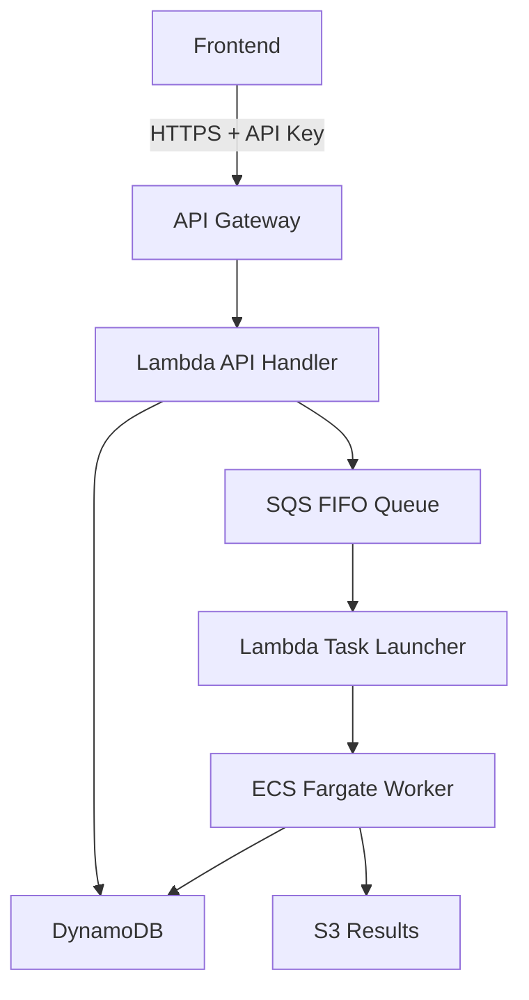

## 概要

AIシステムを本番環境にデプロイする際の最大の課題の一つは<strong>インフラコスト</strong>です。特にバッチ処理特性のAIワークロードは常時稼働サーバーを必要としませんが、タスク実行時には十分なコンピューティングリソースが必要です。

本記事では、実際のプロジェクトで構築した<strong>サーバーレスAIバッチシステム</strong>のアーキテクチャを分析し、Terraformを活用したインフラ管理のメリットを解説します。

## アーキテクチャ設計

### 全体構成



### コアコンポーネント

| コンポーネント | 役割 | コスト特性 |
|---------------|------|-----------|
| API Gateway | REST APIエンドポイント | リクエスト課金 |
| Lambda | タスク作成/実行トリガー | 実行時間課金 |
| SQS FIFO | タスクキュー管理 | ほぼ無料 |
| ECS Fargate | AIワーカー実行 | 実行時間課金 |
| DynamoDB | 状態管理 | オンデマンド課金 |
| S3 | 結果保存 | ストレージ容量課金 |

## Terraformの利点

### 1. LLMとの優れた親和性

TerraformのHCL（HashiCorp Configuration Language）は<strong>宣言的で構造化された構文</strong>を持ち、LLMがコードを生成・理解しやすい特徴があります。

```hcl
# LLMが生成しやすい明確な構造
resource "aws_lambda_function" "api_handler" {
  function_name = "ai-batch-api-handler"
  runtime       = "python3.11"
  handler       = "main.lambda_handler"
  memory_size   = 256
  timeout       = 30

  environment {
    variables = {
      DYNAMODB_TABLE = aws_dynamodb_table.jobs.name
      SQS_QUEUE_URL  = aws_sqs_queue.tasks.url
    }
  }
}
```

2025年現在、ClaudeやGPT-4などのLLMはTerraformコード生成において<strong>ほぼプロダクションレベル</strong>の成果物を作成できます。自然言語で要件を説明すれば、完成度の高いIaC設定を得ることができます。

### 2. インフラ状態管理

TerraformのStateファイルは実際のインフラとコード間の<strong>整合性を保証</strong>します。

```bash
# 現在のインフラ状態確認
terraform show

# 変更のプレビュー
terraform plan

# 安全な適用
terraform apply
```

### 3. 再現可能な環境

同じTerraformコードで<strong>開発/ステージング/本番</strong>環境を一貫して構築できます。

```hcl
# variables.tf
variable "environment" {
  description = "デプロイ環境"
  type        = string
  default     = "dev"
}

variable "allowed_ips" {
  description = "許可IPアドレスリスト"
  type        = list(string)
  default     = []
}
```

## シェルスクリプトベースの運用

### デプロイ自動化

複雑なデプロイプロセスを単一スクリプトで抽象化します。

```bash
#!/bin/bash
# deploy.sh
set -e

echo "=== AI System Deployment ==="

# 環境変数ロード
source .env

# 1. Dockerイメージビルド＆プッシュ
cd workers/image_alt_generator
docker build -t ai-batch-worker:latest .
aws ecr get-login-password --region ${AWS_REGION} | \
    docker login --username AWS --password-stdin ${ECR_REGISTRY}
docker push ${ECR_REGISTRY}/ai-batch-worker:latest

# 2. Terraformインフラデプロイ
cd ../../terraform
terraform apply -auto-approve \
    -var="allowed_ips=${ALLOWED_IPS}" \
    -var="environment=prod"

# 3. 結果出力
echo "API Endpoint: $(terraform output -raw api_endpoint)"
echo "API Key: $(terraform output -raw api_key)"
```

### モニタリングスクリプト

```bash
#!/bin/bash
# monitor.sh

# 実行中のECS Task確認
aws ecs list-tasks --cluster ai-batch-cluster

# CloudWatchログリアルタイム確認
aws logs tail /ecs/ai-batch/worker --follow

# DynamoDBジョブ状態照会
aws dynamodb scan --table-name ai-batch-jobs \
    --filter-expression "#s = :status" \
    --expression-attribute-names '{"#s": "status"}' \
    --expression-attribute-values '{":status": {"S": "RUNNING"}}'
```

## コスト最適化戦略

### サーバーレスアーキテクチャのコストメリット

| シナリオ | EC2常時稼働 | サーバーレス |
|---------|------------|-------------|
| 月10,000タスク | ~$150 | ~$21 |
| 月1,000タスク | ~$150 | ~$5 |
| 月100タスク | ~$150 | ~$1 |

バッチ処理特性上、<strong>使用分のみ課金</strong>されるサーバーレスモデルが圧倒的に有利です。

### Fargate Spot活用

```hcl
resource "aws_ecs_service" "worker" {
  # ...

  capacity_provider_strategy {
    capacity_provider = "FARGATE_SPOT"
    weight           = 1
    base             = 0
  }
}
```

Fargate Spotを使用すると<strong>最大70%コスト削減</strong>が可能です。AIバッチタスクは大部分がリトライ可能なため、Spotインスタンスに適しています。

## 通知とNotion連携

### Slack通知統合

```python
# lambda/notifier/main.py
import boto3
import requests

def notify_job_completion(job_id, status, result_url=None):
    webhook_url = os.environ['SLACK_WEBHOOK_URL']

    message = {
        "blocks": [
            {
                "type": "section",
                "text": {
                    "type": "mrkdwn",
                    "text": f"*タスク完了通知*\n"
                           f"Job ID: `{job_id}`\n"
                           f"Status: {status}"
                }
            }
        ]
    }

    if result_url:
        message["blocks"].append({
            "type": "actions",
            "elements": [{
                "type": "button",
                "text": {"type": "plain_text", "text": "結果ダウンロード"},
                "url": result_url
            }]
        })

    requests.post(webhook_url, json=message)
```

### Notionデータベース連携

タスク結果をNotionデータベースに自動記録し、<strong>プロジェクト管理と統合</strong>します。

```python
from notion_client import Client

def log_to_notion(job_data):
    notion = Client(auth=os.environ["NOTION_TOKEN"])

    notion.pages.create(
        parent={"database_id": os.environ["NOTION_DATABASE_ID"]},
        properties={
            "タスクID": {"title": [{"text": {"content": job_data["job_id"]}}]},
            "状態": {"select": {"name": job_data["status"]}},
            "処理時間": {"number": job_data["duration_seconds"]},
            "完了時刻": {"date": {"start": job_data["completed_at"]}}
        }
    )
```

## 拡張性の考慮

### 新しいAI Worker追加

```
workers/
├── image_alt_generator/    # 画像Alt Text生成
├── meta_desc_generator/    # メタ説明生成
└── content_analyzer/       # コンテンツ分析
```

新しいWorker追加時：

1. Workerディレクトリ作成とコード実装
2. `terraform/ecs.tf`にTask Definition追加
3. `terraform/sqs.tf`に専用キュー追加
4. Lambdaキューマッピング更新
5. `./deploy.sh`実行

Terraformのモジュール化により<strong>新しいサービス追加が非常に簡単</strong>です。

## 実践適用結果

### 運用指標

- <strong>デプロイ時間</strong>: 手動30分 → 自動5分
- <strong>インフラコスト</strong>: EC2基準比85%削減
- <strong>障害復旧</strong>: Stateファイルベースで即座に再構築可能
- <strong>コードレビュー</strong>: IaCでインフラ変更のPRレビュー可能

### 学んだこと

1. <strong>HCLは学習曲線が低い</strong>: JSON/YAML比で可読性が優れている
2. <strong>LLM活用が鍵</strong>: 複雑なリソース設定も自然言語でリクエスト可能
3. <strong>シェルスクリプトで抽象化</strong>: 複雑なコマンドを簡素化
4. <strong>State管理が重要</strong>: S3 + DynamoDB Lock必須

## まとめ

Terraformを活用したサーバーレスAIバッチシステムは以下のメリットを提供します：

- <strong>コスト効率</strong>: 使用量ベース課金でバッチ処理に最適
- <strong>LLMフレンドリー</strong>: AIツールでインフラコード生成・管理が容易
- <strong>運用の利便性</strong>: シェルスクリプトで複雑な作業を自動化
- <strong>拡張性</strong>: モジュール化された構造で新サービス追加が簡単

AIシステム構築時に初期からIaCを導入することで、<strong>長期的な運用効率</strong>を大きく向上させることができます。

## 参考資料

- [AWS Fargate Terraformデプロイガイド](https://aws.amazon.com/blogs/developer/provision-aws-infrastructure-using-terraform-by-hashicorp-an-example-of-running-amazon-ecs-tasks-on-aws-fargate/)
- [HashiCorp - Deploying Serverless AI Agents](https://www.hashicorp.com/en/resources/deploying-serverless-ai-agents-on-aws-with-terraform-and-securing-them-with-hcp-v)
- [LLMを活用したTerraformコード生成](https://terrateam.io/blog/using-llms-to-generate-terraform-code)
