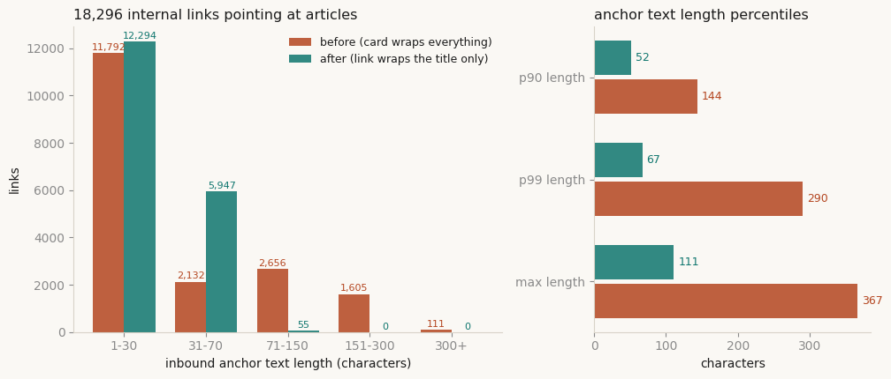
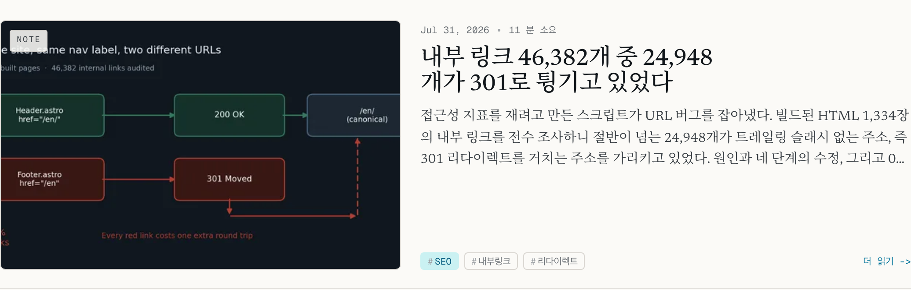

カード全体を`<a>`で包む。日付も、見出しも、説明文も、タグも、まとめて一本のリンクの中に入れる。どこを押しても記事へ飛ぶので、実装としては一番手軽だ。私も長いことそう書いてきた。

そのリンクのテキストが何文字になっているかを、私は数えたことがなかった。ビルド成果物から全部抜き出して測ったら、最長で367文字だった。

## タイトルは一度書いて、七回発行される

土台から整理する。Webにおける「ページのタイトル」は単一の値ではない。読み手の異なる複数のチャネルの束だ。

`<title>`はブラウザのタブとブックマーク、そして検索結果の基本素材になる。W3CのWCAG 2.2 達成基準2.4.2 Page TitledはこれをレベルAで要求している。基準文は "Web pages have titles that describe topic or purpose" で、[解説文書](https://www.w3.org/WAI/WCAG22/Understanding/page-titled.html)はユーザーエージェントがページ識別のためにタイトルを取り出しやすくしていること、認知障害や短期記憶に制約のある利用者がタイトルによる識別から恩恵を受けることを挙げる。SEO以前にアクセシビリティの要件だということだ。

`<h1>`は画面に見える見出しであり、文書構造の頂点であり、スクリーンリーダーの見出しナビゲーションの起点になる。`og:title`はSNSカードやメッセンジャーのプレビューが読む。`twitter:title`はその変種。RSSの`<title>`はフィードリーダーが一覧に描く。JSON-LDの`headline`はArticle構造化データのプロパティだ。

ここで一つ区別しておきたい。Googleがタイトルリンクの参照元として並べた項目に`headline`は入っていない。[Control your title links in search results](https://developers.google.com/search/docs/appearance/title-link)が挙げるのは、`<title>`要素の内容、ページに大きく表示されるタイトル、`<h1>`などの見出し要素、`og:title`メタタグの内容、スタイルによって大きく目立つテキスト、ページ内のその他のテキスト、ページ内のアンカーテキスト、そのページを指すリンク内のテキスト、そして`WebSite`構造化データである。`headline`は[Article構造化データ](https://developers.google.com/search/docs/appearance/structured-data/article)の推奨プロパティにすぎず、同じ文書には "Google does not guarantee that features that consume structured data will show up in search results" とも書かれている。`headline`を`<title>`と揃えるのは一貫性の管理であって、タイトルリンクを操作する手段ではない。この線を曖昧にすると、構造化データで順位を買うという話に滑り落ちる。

そして最後のチャネルがある。他のページからこのページへ張られたリンクのテキスト。これはそのページのファイルの中にない。サイトの別の1,300枚のどこかに散っていて、たいていは人ではなくコンポーネントが書く。

## 六つのチャネルは全数で一致した

私のサイトは一言語あたり324本、四言語で1,296本の記事を出している。ビルド成果物の`dist/`をまるごとパースして、記事ページごとに五つのチャネルを抜き、別途生成されるRSSも突き合わせた。

```js
// dist/ の記事ページごとにタイトルチャネルを抜いて文字列比較する
const $ = cheerio.load(readFileSync(file, 'utf8'));
const rec = {
  title:    norm($('head > title').first().text()),
  h1:       norm($('h1').first().text()),
  ogTitle:  norm($('meta[property="og:title"]').attr('content')),
  twTitle:  norm($('meta[property="twitter:title"]').attr('content')),
  headline: null,
};
$('script[type="application/ld+json"]').each((_, el) => {
  const data = JSON.parse($(el).contents().text());
  const nodes = Array.isArray(data) ? data : (data['@graph'] ?? [data]);
  for (const n of nodes) if (n?.headline && !rec.headline) rec.headline = norm(n.headline);
});
```

結果は拍子抜けするほど平坦だった。1,296本すべてが五つのチャネルを持ち、`title == og:title`、`title == h1`、`title == headline`、`h1 == RSSのタイトル`がいずれも100%一致した。長さも安定している。最短13文字、中央値46文字、p90が59文字、最長70文字。60文字を超えるものが97本あるが、60という数字は業界の目安であってGoogleが文書で定めた上限ではない。公式文書は文字数を示していない。参考値として扱う。

一致率が100%なのは設計が優れているからではなく、単純だからだ。五つのチャネルすべてがfrontmatterの`title`フィールド一つから生成される。ソースが一つならドリフトの生じる余地がない。裏を返せば、CMSやSSRテンプレートでチャネルごとに別のフィールドを参照している構成なら、この100%はまず出ない。そういうサイトでは、このスクリプトは初日から何かを拾う。

## 七つ目のチャネルは誰も手で書いていなかった

問題はここからだった。記事ページを指す内部リンク18,296本のアンカーテキストを抜き出し、リンク先の`<h1>`と比べた。

| 項目 | 修正前 |
|---|---|
| 記事を指す内部リンク | 18,296本 |
| アンカーテキストがリンク先の`<h1>`と完全一致 | 121本（0.7%） |
| `<h1>`を含むがより長い | 5,185本（28.3%） |
| どちらでもない | 12,990本（71%） |
| アンカーテキスト長 p90 / p99 / 最長 | 144 / 290 / 367文字 |
| 151文字以上のアンカー | 1,716本 |

367文字のリンクテキストを開いてみた。日付、読了時間、タイトル、説明、タグ三つ、そして「続きを読む」。ブログカード一枚の中身がそのまま入っていた。

原因はマークアップ一行だ。

```astro
<!-- 修正前: カード全体がリンク一つ -->
<article class="post-card">
  <a href={href} class="post-card__link">
    <div class="post-card__media">
      <Image src={heroImage} alt={title} ... />
    </div>
    <div class="post-card__body">
      <time>{date}</time> · <span>{readingTime}分</span>
      <h3>{title}</h3>
      <p>{description}</p>
      <div class="post-card__tags">...</div>
      <span>{readMoreLabel}</span>
    </div>
  </a>
</article>
```

代償は三か所で同時に来る。

一つ目はアクセシビリティ。リンクのアクセシブルネームは、その中に含まれるテキストを連結して計算される。画像の`alt`にもタイトルを入れていたので、タイトルが二度読まれる。スクリーンリーダーの利用者がリンク一覧を辿ると、項目一つが367文字の段落として読み上げられる。この計算規則そのものは[アクセシブルネームの決まり方を扱った記事](/ja/blog/ja/accessible-name-agents-2026/)で整理したことがある。あのときはボタン名を見ていた。今回は同じ規則が逆向きに刺さった。

二つ目。Googleがタイトルリンク生成時に参照すると明記しているのがこのテキストだ。文書は、ページに問題を検出した場合、アンカーやページ内のテキストなどからより良いタイトルリンクを生成しようとすると述べている。私のサイトの記事は全部「日付＋タイトル＋説明＋タグ＋続きを読む」という塊で互いを指し合っていた。

三つ目はリンクグラフを読む側すべて。JavaScriptを実行せずHTMLだけを読むクローラーにとって、アンカーテキストは文書間の関係を説明するほぼ唯一の手がかりになる。[AIクローラーがレンダリングをしないという実測](/ja/blog/ja/ai-crawlers-dont-render-javascript-csr-2026/)をまとめて以来この経路は気にしていたのに、当のカードがその手がかりを潰していた。

## リンクは見出しだけを包み、クリック領域は取り戻す

直し方は決まっている。アンカーは見出しのテキストだけを包む。失ったクリック領域は擬似要素で戻す。

```astro
<article class="post-card">
  <div class="post-card__media" aria-hidden="true">
    <Image src={heroImage} alt="" ... />
  </div>
  <div class="post-card__body">
    <time>{date}</time> · <span>{readingTime}分</span>
    <h3><a href={href} class="post-card__link">{title}</a></h3>
    <p>{description}</p>
    <div class="post-card__tags">...</div>
    <span class="post-card__read" aria-hidden="true">{readMoreLabel}</span>
  </div>
</article>

<style>
  .post-card { position: relative; }

  /* リンクは見出しだけを包む。カード全体のクリック領域はオーバーレイが担う */
  .post-card__link::after {
    content: '';
    position: absolute;
    inset: 0;
  }

  .post-card__link:focus-visible {
    outline: 2px solid var(--flow-deep);
    outline-offset: 3px;
  }
</style>
```

同時に触るべき点が三つある。サムネイルの`alt`は空文字にする。見出しリンクが行き先をすでに述べているのだから、同じ文を二度読ませる理由はない。「続きを読む」のような装飾テキストには`aria-hidden="true"`を付ける。そしてホバースタイルのセレクタを`.post-card__link:hover`から`.post-card:hover`へ移す。これを忘れるとカードの上でマウスを動かしても何も起きない。

フォーカスリングの明示も必須だ。リンクが見出しの文字サイズまで縮むぶん、既定のフォーカス表示はカードの中で目立ちにくくなる。

オーバーレイ方式には正直に書いておくべき代償がある。`inset: 0`で覆われた範囲の本文テキストは、マウスでのドラッグ選択が難しくなる。カード内の説明文を利用者がコピーする場面があるUIなら、このパターンは考え直したほうがいい。ブログの一覧カードではその機会は少ないと判断して受け入れた。

同じ修正を三か所に当てた。ブログ一覧のカードコンポーネント、記事下部の関連記事リスト、そして多言語ランディングページの最新記事カードだ。関連記事リストは見出しの下に推薦理由の一文が付くため、アンカーがその文まで飲み込んでいた。

## 直して測り直した

同じスクリプトをもう一度走らせた。リンクの本数は18,296本で変わらない。変わったのは中身の文字だ。

| アンカーテキスト長 | 修正前 | 修正後 |
|---|---|---|
| 1〜30文字 | 11,792 | 12,294 |
| 31〜70文字 | 2,132 | 5,947 |
| 71〜150文字 | 2,656 | 55 |
| 151〜300文字 | 1,605 | 0 |
| 300文字超 | 111 | 0 |
| p90 / p99 / 最長 | 144 / 290 / 367文字 | 52 / 67 / 111文字 |
| リンク先`<h1>`と完全一致 | 121（0.7%） | 5,285（28.9%） |



ブラウザでも確認した。Playwrightのヘッドレス版Chromiumで一覧ページを開き、最初のカードを測ると1036×329ピクセル、カード内のアンカーはちょうど一本。カードのボックスの横75%・縦80%の位置、つまりタグが並ぶ下側の余白で`document.elementFromPoint`を呼ぶとリンクが返る。オーバーレイがクリック領域を維持しているということだ。レイアウトも崩れていなかった。



ここで誤読しやすい数字がある。「リンク先`<h1>`と一致」が28.9%どまりだという点だ。残りの71%は依然としてタイトルと違う。これはバグではない。コンポーネントのクラス別に割ると正体がはっきりする。

| タイトルと異なるアンカー12,990本 | 本数 | 判断 |
|---|---|---|
| ヘッダーの言語スイッチャー | 5,184 | 正常。「KO 한국어」が行き先を述べている |
| 記事ページの言語スイッチャー | 3,888 | 正常。同じ記事の別言語版を指す |
| 本文中の文脈リンク | 3,846 | 正常。文の中で対象を説明する表現であるべき |
| その他 | 72 | 一覧・ナビゲーション |

本文の文脈リンクをリンク先のタイトルで画一化すると、むしろ悪くなる。文の流れの中では「AIクローラーがレンダリングをしないという実測」のように、読み手に合わせた表現のほうがいい。言語スイッチャーも同様だ。これは[トレイリングスラッシュの監査で構造的な偽陽性として切り分けたもの](/ja/blog/ja/internal-link-trailing-slash-redirect-audit-2026/)と同じ種類にあたる。目指すのは「すべてのアンカーがタイトルであること」ではなく、「タイトルを述べるべき場所でタイトル以外を述べないこと」だ。

修正後も70文字を超えるアンカーが55本残っている。すべて本文中の文脈リンクだ。コンポーネントが生成したものは一本も残っていない。

## チャネルごとに何を気にするか

七つのチャネルを、読む側と書く側で整理すると判断が楽になる。

| チャネル | 主に読む側 | 誰が書くか | ありがちな失敗 | やること |
|---|---|---|---|---|
| `<title>` | ブラウザ・検索・支援技術 | 人（テンプレート） | 空、重複、サイト名の反復 | WCAG 2.4.2 レベルA。ページごとに固有に |
| `<h1>` | 画面・見出しナビ | 人 | 存在しない、複数ある | 一つだけ。画面の見出しと一致させる |
| `og:title` | SNS・メッセンジャーのプレビュー | テンプレート | titleと別物になる | 同じソースから生成 |
| `twitter:title` | 一部クライアント | テンプレート | 更新漏れ | og:titleと同一にするか省略 |
| JSON-LD `headline` | 構造化データの消費者 | テンプレート | 順位を動かす道具と誤解 | 推奨プロパティ。簡潔に、一貫して |
| RSS `<title>` | フィードリーダー | フィード生成器 | 本文の見出しとずれる | 同じフィールドから生成 |
| インバウンドのアンカーテキスト | 検索・クローラー・スクリーンリーダー | <strong>コンポーネント</strong> | カードごと飲み込む、長文化 | リンクは見出しだけ、クリック領域はオーバーレイ |

この表で実質的に危険なのは最後の一行だけだ。上の六つは一つのファイルの中で目視でき、値が違えば目につく。最後の一行はどのファイルにも書かれていない。コンポーネントを直すまで、存在すら数えられない。

組織の観点で言えば、これは技術的負債の典型的な形をしている。宣言箇所が七つあるのにレビュー対象は六つで、残る一つはUI変更の副産物としてだけ変わる。「カード全体をクリックできるようにしてほしい」という要望がSEOやアクセシビリティのレビューを通る理由は普通ない。だからこの種は、人の注意力ではなくゲートで止めるしかない。

## タイトルの文字体系が本文と違えばGoogleは書き換える

同じスイープでWCAG 2.4.2も全数点検した。1,336枚のうち`<title>`が空のページが一枚出た。確認すると`public/`に置いた広告ネットワークの所有権確認用スタブHTMLだった。コンテンツページではないのでアクセシビリティ違反として数えるのは難しいが、空タイトルのHTMLが配布物に混ざっている事実自体は記録しておく。

より意味があるのは重複タイトルのほうだった。別々のページがまったく同じ`<title>`を持つグループが二つ、ページ数では四枚。

- `en/iterative-review-cycle-methodology` は本文が英語なのに`<title>`と`description`が韓国語だった
- `ko/barracuda-cuda-amd-compiler` は本文が韓国語なのに`<title>`が日本語だった

Googleのタイトルリンク文書は、タイトルを書き換える理由の一つとして、ページの主要言語や文字体系とタイトルが一致しない場合を明示している。文書が名前を付けた状況に、私のページがそのまま入っていたことになる。四つの言語版を一組で回すサイトでこの種のドリフトは驚くことではない。ある言語版のfrontmatterを写したまま、タイトルだけ差し替え忘れれば残る。両方とも直し、重複タイトルのグループは0になった。

抽出器側も確認した。Readability 0.6.0に記事ページを入れると`<h1>`と同じタイトルが返る。一方、`<head>`を無視して`<body>`だけをテキストに変換すると、最初の行は「本文へスキップ」、次はヘッダーのナビゲーションだ。タイトルは`<h1>`に到達するまで出てこない。本文だけを掬うパイプラインでは、`<h1>`が事実上唯一のタイトル信号になる。

## 確認できたのはここまでだ

線を引いておく。

測ったのは<strong>自分のサイトが何を出力しているか</strong>であって、Googleがそれをどう扱うかではない。自分の記事のタイトルリンクが検索結果で書き換えられたかどうかは確認していないし、修正前後の表示データも持っていない。アンカーテキストをタイトルに揃えたから順位が上がる、という主張はしない。公式文書はタイトルリンクを順位と結びつけていないし、構造化データについても機能が検索結果に現れることを保証しないと明記している。

60文字というタイトル長の基準も慣行であって公式の数値ではない。私の記事97本がその線を越えているが、それ自体が直す理由になるとは考えていない。

確実なのはアクセシビリティのほうだ。367文字のリンク名は、どう解釈しても良い設計ではない。タイトルを述べるべき場所でカード全体を読み上げるリンクは、検索エンジンがどう処理するかに関わらず、まず人にとって不便だ。その理由だけで十分だと判断した。

## 点検リスト：今日走らせられる四行

ビルド成果物を対象に次の四つを数えればいい。開発サーバーではなく`dist/`を見ること。問題の半分はソースになく、コンポーネントが作り出す。

1. <strong>チャネル突き合わせ</strong>。ページごとに`title` / `h1` / `og:title` / JSON-LD `headline` / RSSタイトルを抜いて文字列比較する。一つでもずれたら失敗。
2. <strong>アンカー長の上限</strong>。コンテンツページを指すアンカーテキストのうち、閾値（私の基準は70文字）を超えるものを数える。超えたものがコンポーネント出力なら失敗、本文の文脈リンクなら通過。
3. <strong>タイトルの一意性</strong>。`<title>`が空、または二ページ以上で重複したら失敗。WCAG 2.4.2 レベルAがここに掛かる。
4. <strong>タイトル言語の一致</strong>。`<title>`の文字体系が`html[lang]`と合っているかを見る。多言語サイトならこれが一番よく引っかかる。

ゲートにするときの骨格は短い。

```js
const fails = [];
for (const page of articles) {
  if (page.title !== page.h1) fails.push(`h1 drift: ${page.path}`);
  if (page.title !== page.ogTitle) fails.push(`og:title drift: ${page.path}`);
  if (page.title !== page.headline) fails.push(`headline drift: ${page.path}`);
}
for (const a of componentAnchors) {
  if (a.len > 70) fails.push(`anchor ${a.len} chars: ${a.from} -> ${a.to}`);
}
if (fails.length) { console.error(fails.join('\n')); process.exit(1); }
```

カード一枚をどう包むかが、サイト全体のリンクテキストを決める。私は1,296本を数えて初めてそれを知った。コンポーネントが生成するテキストを一度も数えていないサイトを運用しているなら、おそらく似た数字が出る。一緒に開けてみたい方は[プロフィール](/ja/about/)の連絡先から声をかけてほしい。

---

*出典: Google Search Centralの [Control your title links in search results](https://developers.google.com/search/docs/appearance/title-link)、[Article (Article, NewsArticle, BlogPosting) structured data](https://developers.google.com/search/docs/appearance/structured-data/article)、W3C WAIの [Understanding SC 2.4.2: Page Titled](https://www.w3.org/WAI/WCAG22/Understanding/page-titled.html)。測定環境: 自サイトのAstroビルド成果物HTML 1,336〜1,338枚、記事ページ1,296本、Node 22.22 + cheerio 1.2.0で全数パース。ブラウザ確認はPlaywright Chromium（headless、ビューポート1100px）、抽出器の確認は@mozilla/readability 0.6.0とhtml-to-text 10.0.0。すべての数値はこのサイトのこのビルドで得た値であり、Googleの処理方式についての言明ではない。*
