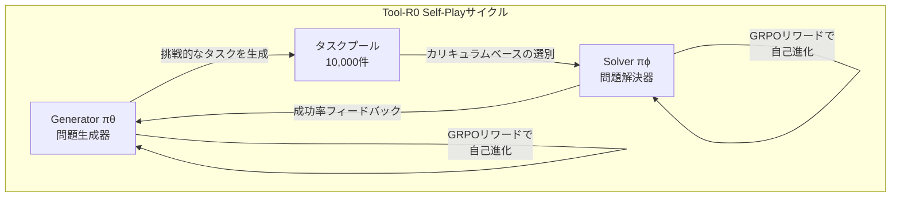
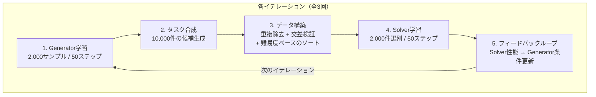
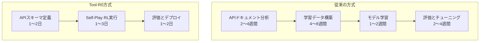

AIエージェントの核心的な能力は<strong>「外部ツールを正確に呼び出す力」</strong>です。APIを呼び出し、データベースを検索し、コードを実行するこの能力がなければ、エージェントは単なるチャットボットに留まります。しかし、このツール呼び出し能力を学習させるためには、これまで数万〜数十万件のラベリングされたデータが必要でした。

2026年2月にarXivで公開された<strong>Tool-R0</strong>（Acikgoz et al., arXiv 2602.21320）は、この常識を覆します。<strong>学習データゼロ（zero-data）</strong>の状態からSelf-Play強化学習だけでツール呼び出しエージェントをゼロから訓練し、既存の教師あり学習方式を上回る性能を達成しました。

## なぜ今この論文が重要なのか

現在、AIエージェント市場はツール呼び出し（Function Calling / Tool Use）の能力を中心に急成長しています。OpenAIのFunction Calling、AnthropicのTool Use、GoogleのGemini Function Calling — フロンティアモデルはすべてこの能力をコア機能として搭載しています。

しかし、オープンソースモデルやドメイン特化モデルでこの能力を確保するには、<strong>高コストの学習データ構築</strong>が不可避でした：

- xLAMデータセット: 60,000件のツール呼び出し例
- Hammerデータセット: 210,000件
- ToolACEデータセット: 12,000件

これらのデータはドメインが変わるたびに新たに構築する必要があり、企業内部APIへのカスタマイズはさらに困難です。Tool-R0はこのボトルネックをSelf-Play RLで完全に解消します。

## Tool-R0の核心アイデア: Generator-Solver共進化

Tool-R0のアーキテクチャは驚くほどエレガントです。一つのベースLLMから二つの独立したエージェントを初期化します：

<strong>Generator（πθ）</strong>はツール呼び出しタスクを生成します。具体的には（ユーザークエリ、ツールメニュー、正解ツール呼び出し）の三つ組を生成します。

<strong>Solver（πϕ）</strong>は与えられたクエリとツールリストから正しいツール呼び出しを予測する方法を学習します。

核心は<strong>補完的リワードシグナル（complementary rewards）</strong>で連結されている点です：

- Generatorは、Solverが<strong>適度に苦戦する</strong>レベルの問題を生成した時に高いリワードを受け取ります
- Solverは、正確なツール呼び出しを実行した時に高いリワードを受け取ります

この相互作用が繰り返されることで、Generatorはますます精巧な問題を生成し、Solverはますます難しい問題を解けるようになります — データなしで。

## リワード設計の精巧さ

Tool-R0の性能が優れている理由はリワード関数の設計にあります。

### Generatorリワード: 3段階の品質管理

| リワード構成要素 | 役割 | 説明 |
|:---|:---|:---|
| Format Reward (r_fmt) | 構造的準拠 | XMLタグ、JSONパーシングの有効性検査 |
| Validity Reward (r_valid) | 内部一貫性 | 正解ツールがメニューに存在、必須パラメータを含む、引数値が質問に基づく |
| Curriculum Reward (r_curr) | 難易度調整 | Solver成功率 p̂_succ ∈ [0.25, 0.75] 範囲を目標 |

特に<strong>Curriculum Reward</strong>が核心です。Solverの成功率が25%〜75%の間にある問題を生成する時に最も高いリワードを付与します。簡単すぎる問題（成功率 > 75%）や難しすぎる問題（成功率 < 25%）は学習に役立たないためです。これは教育学の<strong>「最近接発達領域（Zone of Proximal Development）」</strong>の概念と正確に一致します。

### Solverリワード: 細分化された精度測定

Solverの精度リワードは単純な正解/不正解の二値判定ではなく、三つの次元に分解されます：

1. <strong>ツール名マッチング</strong>（二値）: 正しいツールを選択したか？
2. <strong>キーオーバーラップ</strong>（F1スコア）: 必須パラメータを漏らしていないか？
3. <strong>値マッチング</strong>（柔軟な比較）: 引数の値は正確か？

追加のツール呼び出しを生成した場合には乗算的ペナルティ（multiplicative penalty）を適用します。このような細分化されたリワードが部分点を可能にし、学習の初期段階でも有意義なグラディエントを提供します。

## 学習パイプライン: 3回反復の威力

全体の学習は3回のイテレーション（iteration）で構成されます：

注目すべき点は、各イテレーションでわずか<strong>2,000件の自己生成データ</strong>のみを使用することです。既存の教師あり学習方式が数万〜数十万件を要求するのと鮮明な対比をなします。

## ベンチマーク結果: 教師あり学習を超える

### Qwen2.5-1.5Bベースの主要結果

| ベンチマーク | ベースライン | Tool-R0 | 相対向上 |
|:---|---:|---:|---:|
| ToolAlpaca | 35.96% | 47.36% | +31.7% |
| SealTools | 47.27% | 83.00% | +75.6% |
| NexusRaven | 17.61% | 34.59% | +86.4% |
| API-Bank | 19.13% | 50.62% | +164.6% |
| SNIPS | 4.29% | 20.86% | +386.3% |
| <strong>平均</strong> | <strong>24.85%</strong> | <strong>47.84%</strong> | <strong>+92.5%</strong> |

特にAPI-BankとSNIPSでの劇的な向上が目を引きます。これらのベンチマークは実際のAPI呼び出しシナリオをシミュレーションしており、ゼロデータアプローチがこの水準の性能を示すことは驚くべき結果です。

### 教師あり学習データセットとの比較

最も印象的な結果は、<strong>実際の学習データで訓練されたモデルを上回っている</strong>点です：

| 学習方法 | データ規模 | 平均精度 |
|:---|---:|---:|
| xLAMデータセット | 60,000件 | 43.60% |
| Hammerデータセット | 210,000件 | 43.74% |
| ToolACEデータセット | 12,000件 | 44.71% |
| ToolRLデータセット | 4,000件 | 46.06% |
| <strong>Tool-R0（ゼロデータ）</strong> | <strong>0件</strong> | <strong>47.84%</strong> |

21万件の学習データを使用したHammerよりも、データなしで学習したTool-R0が4%p以上高い性能を記録しました。

### 多様なモデルでの検証

Tool-R0は特定のモデルに依存しません：

| モデル | ベースライン | Tool-R0 | 向上 |
|:---|---:|---:|---:|
| Qwen2.5-0.5B | 15.47% | 30.57% | +101.0% |
| Qwen2.5-1.5B | 24.85% | 47.84% | +92.5% |
| Qwen2.5-3B | 43.97% | 48.50% | +10.3% |
| Llama-3.2-3B | 36.12% | 40.47% | +12.0% |

小型モデル（0.5B）で2倍以上の向上を、大型モデル（3B）でも10%以上の向上を達成しました。すでにツール呼び出し能力が一定水準にある大型モデルでは向上幅が縮小しますが、一貫して改善が見られます。

## 核心的発見: なぜパラメータ分離が重要なのか

アブレーション実験で最も重要な発見は、<strong>GeneratorとSolverのパラメータを必ず分離する</strong>必要があるということです：

| 設定 | 精度 | 性能低下 |
|:---|---:|---:|
| Full Tool-R0（分離） | 47.84% | — |
| 共有ウェイト | 30.42% | -36.4% |
| Generator固定 | 41.65% | -12.9% |
| 難易度リワード除去 | 43.54% | -9.0% |

共有ウェイトを使用すると性能が36.4%も低下します。研究チームはこれを<strong>「グラディエント干渉（gradient interference）」</strong>と説明しています — 探索（Generator）と実行（Solver）という相反する目標を一つのパラメータ空間で最適化すると、二つの目標が互いを妨害するのです。

これは組織論的にも示唆するところが大きいです。<strong>問題を定義するチームと問題を解決するチームを分離</strong>しつつ、フィードバックループで接続する構造が最適であるという研究的根拠を提供しています。

## EM/CTO視点の実務示唆

### 1. 企業内部APIツール呼び出しエージェント構築コストの削減

従来のアプローチで最大のコストは学習データの構築でした。企業内部APIに合わせたツール呼び出し例を数万件作成するには数ヶ月の作業が必要です。Tool-R0はこの段階を完全に排除します。

### 2. 小型モデルの再評価

Tool-R0は0.5Bモデルでも2倍の性能向上を達成しました。これは<strong>エッジデバイスやコスト敏感な環境でも有効なツール呼び出しエージェントを構築</strong>できることを意味します。GPU費用が限られたスタートアップやプライベートクラウド環境で特に有意義です。

### 3. カリキュラムラーニングの自動化

最も印象的な側面は、<strong>学習カリキュラムが自動的に生成される</strong>点です。従来は人間が「簡単な例から難しい例の順」にデータをソートする必要がありましたが、Tool-R0のGeneratorはSolverの現在の能力水準を自動的に検知し、適切な難易度の問題を生成します。

これは<strong>AIシステムの学習パイプラインを自律的に運用</strong>できる可能性を開きます。

## ICLR 2026 エージェント研究動向との文脈

Tool-R0は2026年のAIエージェント研究の大きな潮流である<strong>「自己進化（Self-Evolving）エージェント」</strong>パラダイムの一部です：

- <strong>EvolveR</strong>（ICLR 2026 under review）: 経験ベースのライフサイクルでエージェントの自己改善
- <strong>Agent0</strong>: ツール統合推論でゼロデータからエージェントを構築
- <strong>EvoAgentX</strong>（GitHubオープンソース）: 自己進化エージェントエコシステム
- <strong>ICLR 2026 Workshop</strong>: "Lifelong Agents: Learning, Aligning, Evolving"

これらの研究の共通メッセージは明確です：<strong>人間が作成したデータに依存せず、エージェントが自ら学習データを生成し自ら進化する時代</strong>が到来しています。

## 結論

Tool-R0は「データなしでも強力なAIエージェントを構築できる」ことを実証した重要な研究です。核心的な教訓をまとめると：

1. <strong>Self-Play RLだけで教師あり学習を上回る</strong>ことが可能です（92.5%向上、21万件データセット対比で優位）
2. <strong>Generator-Solver分離</strong>が必須です（共有時に36.4%の性能低下）
3. <strong>カリキュラムの自動生成</strong>が学習効率の鍵です（ZPD範囲 [0.25, 0.75]）
4. <strong>小型モデルでも有効</strong>です（0.5Bで2倍の向上）

EMとCTOにとって最も重要な示唆は、企業内部API用AIエージェントを構築する際に<strong>学習データ構築という最大のボトルネックを回避</strong>できる方法論が登場したということです。まだプロダクションレベルの検証が必要ですが、この方向性は2026年のAIエージェント開発における重要な転換点になるでしょう。

## 参考資料

- [Tool-R0 論文 (arXiv 2602.21320)](https://arxiv.org/abs/2602.21320)
- [EvolveR: Self-Evolving LLM Agents (ICLR 2026)](https://openreview.net/forum?id=sooLoD9VSf)
- [EvoAgentX GitHub](https://github.com/EvoAgentX/EvoAgentX)
- [ICLR 2026 Lifelong Agents Workshop](https://lifelongagent.github.io/)
