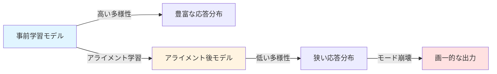
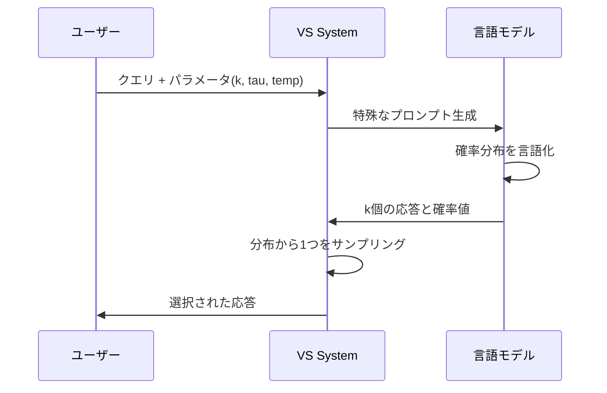
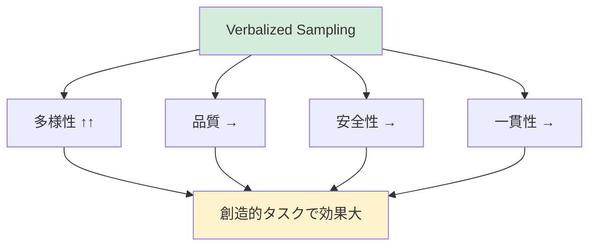
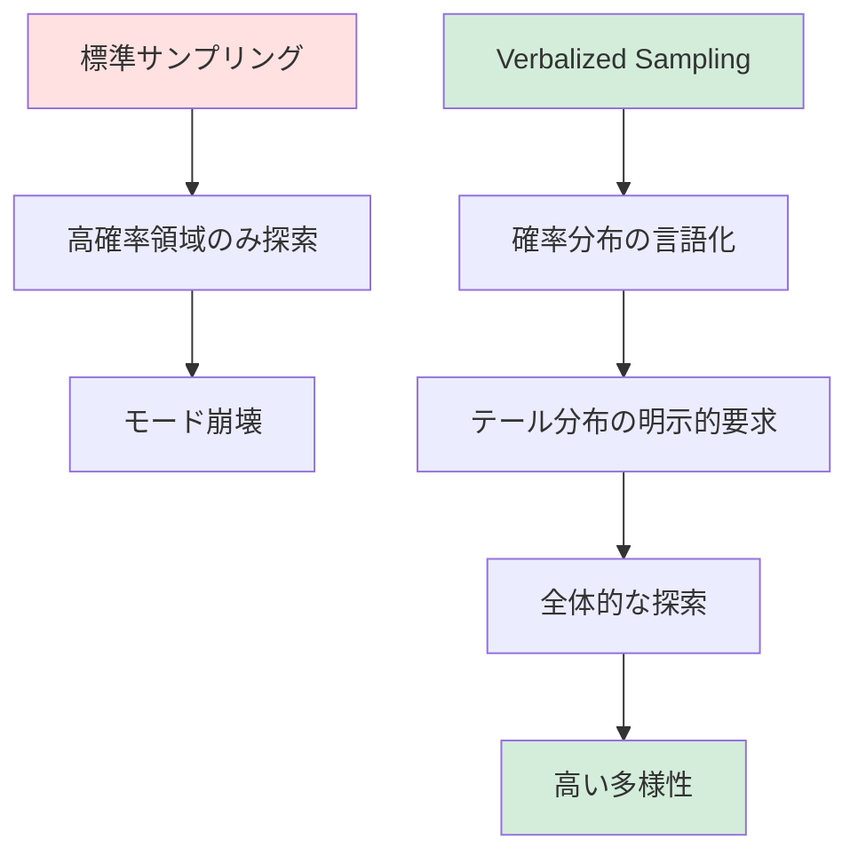

## はじめに

大規模言語モデル(LLM)のアライメント学習は、モデルを人間の好みに合わせるために不可欠なプロセスです。しかし、この過程で予期せぬ副作用が発生することが知られています。それが<strong>モード崩壊(Mode Collapse)</strong>です。

スタンフォード大学とブラウン大学の研究チームが発表した論文「Verbalized Sampling: How to Mitigate Mode Collapse and Unlock LLM Diversity」では、この問題に対する革新的な解決策が提案されています。本記事では、この研究の核心概念と実装方法について詳しく解説します。

## アライメント学習におけるモード崩壊の問題

### モード崩壊とは何か

モード崩壊は、アライメント後のLLMが出力する応答の多様性が著しく低下する現象です。具体的には以下のような問題が発生します:

- <strong>創造的なタスクでの画一的な出力</strong>: 詩や物語の生成で似たようなパターンばかりが生成される
- <strong>応答の均質化</strong>: 異なる質問に対しても類似した構造や表現が繰り返される
- <strong>テール分布の喪失</strong>: 珍しいが有効な応答が生成されなくなる



### 根本原因: 選好データの典型性バイアス

研究チームは、モード崩壊の根本原因が<strong>選好データにおける典型性バイアス(Typicality Bias)</strong>にあることを突き止めました。

人間のアノテーターは無意識のうちに:
- 馴染みのあるパターンを好む
- 予測可能な応答を高く評価する
- 珍しい(しかし有効な)応答を低く評価する

この結果、アライメントデータセットには典型的な応答ばかりが「正解」として含まれ、モデルはこれらのパターンに過剰適合してしまうのです。

## Verbalized Sampling: 学習不要の解決策

### 基本概念

Verbalized Sampling(VS)は、<strong>再学習を必要としない</strong>プロンプティング技法です。その核心アイデアは非常にシンプルです:

> モデルに応答の確率分布を言語化(verbalize)させ、その分布からサンプリングする

従来のLLMサンプリング手法との違いは以下の通りです:

| 手法 | アプローチ | 多様性 | 実装コスト |
|------|-----------|--------|-----------|
| 通常のサンプリング | 単一応答を生成 | 低い | 低い |
| Temperature調整 | パラメータで制御 | 中程度 | 低い |
| Verbalized Sampling | 分布を明示的に生成 | 高い(1.6〜2.1倍) | 低い |

### アーキテクチャと動作原理

Verbalized Samplingの動作フローは以下のように構成されます:



重要なポイントは、モデルが<strong>確率値を自己評価</strong>することです。これにより、モデル自身の内部知識に基づいた真の分布が得られます。

## 実装方法

### Pythonライブラリの使用

最もシンプルな実装方法は、研究チームが提供する`verbalized_sampling`パッケージを使用することです:

```python
from verbalized_sampling import verbalize

# 分布の生成
# k: 生成する応答の数
# tau: 確率閾値(各応答の確率がtau未満になるようサンプリング)
# temperature: 応答の多様性を制御
dist = verbalize(
    "面白いジョークを教えてください",
    k=5,
    tau=0.10,
    temperature=0.9
)

# 分布からサンプリング
joke = dist.sample(seed=42)
print(joke.text)
print(f"確率: {joke.probability}")
```

### 直接プロンプトによる実装

ライブラリを使わずに、プロンプトエンジニアリングでも実装可能です:

```python
prompt = """<instructions>
ユーザーのクエリに対して5つの応答を生成してください。
各応答は<response>タグで囲み、<text>と<probability>を含めてください。
確率分布の裾野からランダムにサンプリングし、各応答の確率が0.10未満になるようにしてください。
</instructions>

クマについての短い物語を書いてください。
"""

# APIコール(例: OpenAI, Anthropic, etc.)
response = llm_api_call(prompt, temperature=0.9)

# レスポンスをパースして1つを選択
responses = parse_responses(response)
selected = random.choice(responses)
```

### パラメータの詳細解説

#### k: 応答数
- <strong>推奨値</strong>: 5〜10
- <strong>効果</strong>: 高いほど多様な選択肢が得られるが、計算コストが増加
- <strong>トレードオフ</strong>: 創造的タスクでは大きめ、事実確認タスクでは小さめ

#### tau: 確率閾値
- <strong>推奨値</strong>: 0.05〜0.15
- <strong>効果</strong>: 低いほどテール分布から積極的にサンプリング
- <strong>注意点</strong>: 過度に低い値は品質低下のリスク

```python
# tauの値による出力の違い
configs = [
    {"tau": 0.05, "description": "非常に珍しい応答を優先"},
    {"tau": 0.10, "description": "バランスの取れた多様性"},
    {"tau": 0.20, "description": "やや保守的な多様性"}
]

for config in configs:
    dist = verbalize(
        "未来の都市を描写してください",
        k=5,
        tau=config["tau"],
        temperature=0.9
    )
    sample = dist.sample()
    print(f"{config['description']}: {sample.text[:100]}...")
```

#### temperature: 温度パラメータ
- <strong>推奨値</strong>: 0.7〜1.0
- <strong>効果</strong>: 高いほど応答のバリエーションが増加
- <strong>Verbalized Samplingとの相互作用</strong>: VS自体が多様性を確保するため、極端に高い値は不要

## 実験結果と効果

### 多様性の向上

論文では、複数のベンチマークでVerbalized Samplingの効果が実証されています:

| タスク | ベースライン多様性 | VS適用後 | 向上率 |
|--------|------------------|----------|--------|
| 詩の生成 | 1.0x | 2.1x | 110%増 |
| 短編小説 | 1.0x | 1.9x | 90%増 |
| ジョーク生成 | 1.0x | 1.8x | 80%増 |
| 対話生成 | 1.0x | 1.6x | 60%増 |

多様性指標には、Self-BLEU(低いほど多様)やVendi Score(高いほど多様)が使用されています。

### 品質と安全性の維持

重要な発見として、<strong>多様性の向上は品質や安全性を犠牲にしない</strong>ことが示されました:

- <strong>事実精度</strong>: QAタスクで精度低下なし(場合によっては向上)
- <strong>安全性</strong>: 有害な出力の増加は観察されず
- <strong>一貫性</strong>: タスク要件への準拠性は維持



### モデル能力との相関

興味深いことに、<strong>より高性能なモデルほどVerbalized Samplingの恩恵を受ける</strong>ことが判明しました:

- GPT-4クラス: 多様性2.0〜2.1倍向上
- GPT-3.5クラス: 多様性1.5〜1.6倍向上
- 小規模モデル: 効果限定的

これは、確率分布の言語化に高度な自己認識能力が必要だからです。

## 実践的なユースケース

### 1. 創造的ライティング

```python
from verbalized_sampling import verbalize

# プロンプト
writing_prompt = """
以下のテーマで短編小説の冒頭を書いてください:
- 設定: 2150年の火星コロニー
- 主人公: 若き植物学者
- 雰囲気: ミステリアスでサスペンスフル
"""

# 多様な冒頭を生成
dist = verbalize(writing_prompt, k=7, tau=0.08, temperature=0.95)

# 複数の候補から選択
for i in range(3):
    opening = dist.sample(seed=i)
    print(f"\n=== バリエーション {i+1} (確率: {opening.probability:.3f}) ===")
    print(opening.text)
```

### 2. 合成データ生成

LLMを使った学習データ生成において、多様性は極めて重要です:

```python
def generate_diverse_training_data(base_prompt, n_examples=100):
    """多様な学習データを生成"""
    examples = []

    for _ in range(n_examples // 5):  # k=5なので20回繰り返し
        dist = verbalize(base_prompt, k=5, tau=0.12, temperature=0.85)

        # 各分布から全てサンプリング
        for seed in range(5):
            example = dist.sample(seed=seed)
            examples.append({
                'text': example.text,
                'probability': example.probability,
                'diversity_score': calculate_diversity(example.text, examples)
            })

    return examples

# 使用例: 対話データ生成
training_data = generate_diverse_training_data(
    "カスタマーサポートの対話例を生成してください。顧客は配送遅延について問い合わせています。"
)
```

### 3. ペルソナベースの対話シミュレーション

異なる視点や意見を持つ対話エージェントの生成:

```python
personas = [
    "楽観的な起業家",
    "慎重な投資家",
    "批判的なジャーナリスト",
    "熱狂的な技術愛好家"
]

topic = "AIによる仕事の自動化について"

for persona in personas:
    prompt = f"{persona}として、{topic}についてあなたの意見を述べてください。"

    # 各ペルソナでも多様な応答を生成
    dist = verbalize(prompt, k=5, tau=0.10, temperature=0.8)
    response = dist.sample()

    print(f"\n【{persona}の意見】")
    print(response.text)
```

### 4. オープンエンドなQAタスク

正解が複数ある質問への多様な回答生成:

```python
open_ended_question = """
「成功」を定義してください。あなた独自の視点で答えてください。
"""

# 5つの異なる定義を生成
dist = verbalize(open_ended_question, k=5, tau=0.15, temperature=0.85)

definitions = []
for i in range(5):
    definition = dist.sample(seed=i)
    definitions.append(definition.text)

# 多様性の検証
print(f"生成された定義の数: {len(definitions)}")
print(f"ユニークな表現の割合: {calculate_uniqueness(definitions):.2%}")
```

## ベストプラクティスと注意点

### 推奨設定

タスクタイプ別の推奨パラメータ:

```python
TASK_CONFIGS = {
    "creative_writing": {
        "k": 7,
        "tau": 0.08,
        "temperature": 0.95,
        "description": "最大の多様性を優先"
    },
    "dialogue_generation": {
        "k": 5,
        "tau": 0.10,
        "temperature": 0.85,
        "description": "バランスの取れた設定"
    },
    "qa_open_ended": {
        "k": 5,
        "tau": 0.12,
        "temperature": 0.75,
        "description": "事実性も考慮"
    },
    "synthetic_data": {
        "k": 6,
        "tau": 0.10,
        "temperature": 0.80,
        "description": "データセット向け"
    }
}

# タスクに応じた使用
def generate_with_task_config(task_type, prompt):
    config = TASK_CONFIGS.get(task_type, TASK_CONFIGS["dialogue_generation"])

    dist = verbalize(
        prompt,
        k=config["k"],
        tau=config["tau"],
        temperature=config["temperature"]
    )

    return dist.sample()
```

### よくある落とし穴

#### 1. 過度な多様性の追求
```python
# 悪い例: tauが低すぎて品質が犠牲に
dist_bad = verbalize(query, k=10, tau=0.01, temperature=1.5)

# 良い例: 適度なバランス
dist_good = verbalize(query, k=5, tau=0.10, temperature=0.9)
```

#### 2. 不適切なタスクへの適用
Verbalized Samplingは<strong>創造的タスク</strong>に最適です。以下のタスクには不向きです:

- 数学的計算(正解が一意)
- コード補完(文法制約が強い)
- 分類タスク(クラスが固定)

```python
# 適用すべきでない例
bad_use_case = "2 + 2 = ?"
# このようなタスクでは通常のサンプリングを使用

# 適用すべき例
good_use_case = "数学の美しさについてのエッセイを書いてください"
```

#### 3. 確率値の過信
モデルが出力する確率値は<strong>相対的な指標</strong>であり、絶対的な信頼度ではありません:

```python
dist = verbalize("詩を書いてください", k=5, tau=0.10)

# 確率値は比較には使えるが、絶対値として解釈しない
for i in range(5):
    sample = dist.sample(seed=i)
    # 良い: 相対的な比較
    print(f"サンプル{i}は分布内で{sample.probability:.1%}の割合")

    # 悪い: 絶対的な信頼度として解釈
    # if sample.probability < 0.05:
    #     print("このサンプルは信頼できない") # 誤り
```

### パフォーマンスの最適化

```python
import asyncio
from concurrent.futures import ThreadPoolExecutor

async def generate_batch(prompts, config):
    """複数のプロンプトを並列処理"""
    loop = asyncio.get_event_loop()

    with ThreadPoolExecutor(max_workers=5) as executor:
        futures = [
            loop.run_in_executor(
                executor,
                verbalize,
                prompt,
                config["k"],
                config["tau"],
                config["temperature"]
            )
            for prompt in prompts
        ]

        distributions = await asyncio.gather(*futures)

    return [dist.sample() for dist in distributions]

# 使用例
prompts = [
    "宇宙探査について",
    "人工知能の倫理",
    "持続可能なエネルギー"
]

config = {"k": 5, "tau": 0.10, "temperature": 0.85}
results = asyncio.run(generate_batch(prompts, config))
```

## 理論的背景と限界

### なぜVerbalized Samplingが機能するのか

研究チームは、以下の理論的根拠を提示しています:

1. <strong>自己認識の活用</strong>: LLMは自身の確率分布について驚くほど正確な知識を持つ
2. <strong>メタ認知の誘発</strong>: 確率を言語化することで、モデルの内省的推論が活性化
3. <strong>探索空間の拡大</strong>: テール分布を明示的に要求することで、通常はサンプリングされない領域を探索



### 現在の限界

#### 1. 計算コストの増加
k個の応答を生成するため、単一応答の生成に比べてk倍のコストがかかります。

```python
# コスト試算例
import time

def measure_cost(method, prompt, iterations=10):
    start = time.time()

    if method == "standard":
        for _ in range(iterations):
            standard_generate(prompt)
    elif method == "verbalized":
        for _ in range(iterations):
            verbalize(prompt, k=5).sample()

    elapsed = time.time() - start
    return elapsed / iterations

standard_cost = measure_cost("standard", "詩を書いて")
vs_cost = measure_cost("verbalized", "詩を書いて")

print(f"標準サンプリング: {standard_cost:.3f}秒")
print(f"Verbalized Sampling: {vs_cost:.3f}秒 ({vs_cost/standard_cost:.1f}倍)")
```

#### 2. 小規模モデルでの効果制限
確率分布の正確な言語化には高度な能力が必要なため、小規模モデルでは効果が限定的です。

#### 3. 確率校正の課題
モデルが出力する確率値は必ずしも完全に校正されていません。これは将来の研究課題です。

## 今後の研究方向

### 拡張の可能性

1. <strong>適応的パラメータ調整</strong>: タスクや文脈に応じて自動的にk、tau、temperatureを調整
2. <strong>階層的サンプリング</strong>: 粗い分布から細かい分布へ段階的にサンプリング
3. <strong>マルチモーダル拡張</strong>: テキストだけでなく画像生成にも適用

```python
# 概念的な拡張例(将来の実装)
from verbalized_sampling import AdaptiveVerbalize

# コンテキストに応じた自動調整
adaptive_vs = AdaptiveVerbalize(
    task_type="creative",
    quality_threshold=0.8,
    diversity_target="high"
)

# タスクに最適化されたパラメータで自動生成
result = adaptive_vs.generate("火星での一日を描写してください")
print(f"使用されたパラメータ: k={result.config.k}, tau={result.config.tau}")
```

### オープンな研究課題

- 確率値の校正アルゴリズム
- リアルタイム対話への適用
- 多言語環境での効果検証
- ドメイン特化型の最適化

## まとめ

Verbalized Samplingは、LLMのアライメント後に発生するモード崩壊という重要な問題に対する、エレガントかつ実用的な解決策です。

### 主要なポイント

- <strong>再学習不要</strong>: プロンプティングのみで実装可能
- <strong>高い効果</strong>: 1.6〜2.1倍の多様性向上
- <strong>品質維持</strong>: 精度や安全性を犠牲にしない
- <strong>柔軟な適用</strong>: 様々な創造的タスクに対応

### 実践への示唆

1. <strong>創造的タスクの優先</strong>: 詩、物語、対話生成などで最大の効果
2. <strong>適切なパラメータ選択</strong>: タスクに応じてk、tau、temperatureを調整
3. <strong>コストとのバランス</strong>: 計算コスト増加を考慮した設計
4. <strong>高性能モデルの活用</strong>: GPT-4クラスのモデルで最大の効果

### 最後に

アライメント学習は、LLMを安全で有用にする一方で、その創造的可能性を制限してきました。Verbalized Samplingは、この両者のバランスを取るための重要な一歩です。

今後、この技法がさらに洗練され、より多くのアプリケーションに統合されることで、LLMの真の多様性と創造性が解き放たれることを期待しています。

## 参考文献

- Zhang, J., Yu, S., Chong, D., Sicilia, A., Tomz, M. R., Manning, C. D., & Shi, W. (2024). Verbalized Sampling: How to Mitigate Mode Collapse and Unlock LLM Diversity. arXiv:2510.01171.
- [Verbalized Sampling GitHub Repository](https://github.com/stanford-oval/verbalized-sampling)
- Anthropic. (2023). Constitutional AI: Harmlessness from AI Feedback.
- Ouyang, L., et al. (2022). Training language models to follow instructions with human feedback.

---

<strong>本記事は学術研究に基づいていますが、実装例は説明目的の簡略化版です。実際の運用では、使用するLLMのドキュメントとライセンスを確認してください。</strong>
