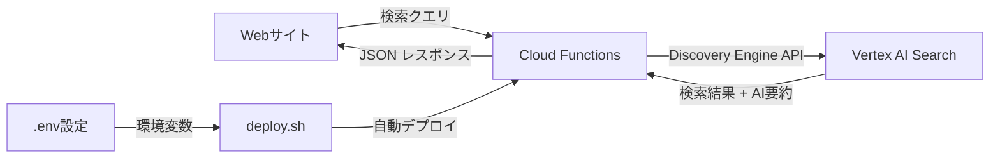

## 概要

Webサイトに高度な検索機能を実装したいと考えたことはありませんか？Google Vertex AI Searchは、従来のキーワードマッチングを超えた、セマンティック検索とAI要約機能を提供する強力なソリューションです。

この記事では、Vertex AI Searchを活用して実際のWebサイトにAI検索機能を実装する方法を、実践的なコード例とともに詳しく解説します。

### 既存の検索ソリューションとの違い

Vertex AI Searchの主な特徴：

- <strong>セマンティック検索</strong>：単純なキーワードマッチングではなく、意味を理解した検索
- <strong>AI要約機能</strong>：検索結果を自動的に要約して表示
- <strong>マルチモーダル対応</strong>：テキスト、画像、動画など多様なコンテンツに対応
- <strong>スケーラビリティ</strong>：Google Cloudの基盤上で自動スケーリング
- <strong>簡単な統合</strong>：REST APIで既存システムと容易に連携

### アーキテクチャ概要

本記事で実装するシステムのアーキテクチャは以下の通りです：



1. <strong>Webサイト</strong>：ユーザーインターフェース（検索フォーム）
2. <strong>Cloud Functions</strong>：APIサーバー（検索リクエストの処理）
3. <strong>Vertex AI Search</strong>：検索エンジン（セマンティック検索 + AI要約）
4. <strong>deploy.sh</strong>：自動化デプロイスクリプト

## 事前準備

### Google Cloudプロジェクト設定

まず、Google Cloudプロジェクトを準備します。

```bash
# gcloud CLIがインストールされていることを確認
gcloud --version

# 新しいプロジェクトを作成（または既存のプロジェクトを使用）
gcloud projects create my-search-project --name="My Search Project"

# プロジェクトを設定
gcloud config set project my-search-project
```

### Vertex AI Searchエンジンの作成

Google Cloud ConsoleでVertex AI Searchエンジンを作成します：

1. <strong>Agent Builder</strong>にアクセス（Cloud Console → Vertex AI → Agent Builder）
2. <strong>新しいアプリを作成</strong>をクリック
3. アプリタイプとして<strong>検索</strong>を選択
4. データソースを設定：
   - Webサイトをクローリング（URLを指定）
   - またはドキュメントをアップロード
5. エンジンIDをメモ（後で使用します）

### 必要なAPIの有効化

以下のAPIを有効にします（deploy.shスクリプトが自動で有効化しますが、手動でも可能）：

```bash
gcloud services enable discoveryengine.googleapis.com
gcloud services enable cloudfunctions.googleapis.com
gcloud services enable cloudbuild.googleapis.com
```

プロジェクト番号を確認：

```bash
gcloud projects describe my-search-project --format="value(projectNumber)"
```

この番号も後で使用するため、メモしておきます。

## Cloud Functions APIサーバー実装

Cloud Functionsを使ってVertex AI Search用のAPIサーバーを実装します。

### プロジェクト構造

```
vertex-ai-search-api/
├── index.js           # メインのCloud Function
├── package.json       # 依存関係
├── .env              # 環境変数（ローカル開発用）
├── .env.example      # 環境変数のテンプレート
└── deploy.sh         # 自動デプロイスクリプト
```

### index.jsのコア実装

```javascript
const functions = require('@google-cloud/functions-framework');
const { SearchServiceClient } = require('@google-cloud/discoveryengine').v1;

// 環境変数の読み込み
const PROJECT_ID = process.env.PROJECT_ID;
const ENGINE_ID = process.env.ENGINE_ID;
const LOCATION = process.env.LOCATION || 'global';
const ALLOWED_DOMAINS = process.env.ALLOWED_DOMAINS?.split(',') || [];

// Discovery Engine クライアントの初期化
const client = new SearchServiceClient();

// CORS設定
const setCorsHeaders = (req, res) => {
  const origin = req.get('origin');

  if (ALLOWED_DOMAINS.length === 0 || ALLOWED_DOMAINS.includes(origin)) {
    res.set('Access-Control-Allow-Origin', origin || '*');
  }

  res.set('Access-Control-Allow-Methods', 'GET, POST, OPTIONS');
  res.set('Access-Control-Allow-Headers', 'Content-Type');
  res.set('Access-Control-Max-Age', '3600');
};

// メインの検索関数
functions.http('search', async (req, res) => {
  setCorsHeaders(req, res);

  // OPTIONSリクエスト（プリフライト）の処理
  if (req.method === 'OPTIONS') {
    return res.status(204).send('');
  }

  try {
    // 検索クエリの取得
    const query = req.query.q || req.body?.query;

    if (!query) {
      return res.status(400).json({ error: 'Query parameter is required' });
    }

    // ページネーション設定
    const pageSize = parseInt(req.query.pageSize || '10', 10);
    const pageToken = req.query.pageToken || '';

    // AI要約の有効化（デフォルト: true）
    const enableSummary = req.query.summary !== 'false';

    // Discovery Engine API リクエストの構築
    const servingConfig = `projects/${PROJECT_ID}/locations/${LOCATION}/collections/default_collection/engines/${ENGINE_ID}/servingConfigs/default_config`;

    const request = {
      servingConfig,
      query,
      pageSize,
      pageToken,
      // AI要約の設定
      contentSearchSpec: {
        summarySpec: enableSummary ? {
          summaryResultCount: 5,
          includeCitations: true,
          ignoreAdversarialQuery: true,
          ignoreNonSummarySeekingQuery: true,
        } : undefined,
        snippetSpec: {
          returnSnippet: true,
        },
      },
    };

    // 検索の実行
    const [response] = await client.search(request);

    // レスポンスの整形
    const results = {
      summary: response.summary?.summaryText || null,
      totalSize: response.totalSize || 0,
      results: (response.results || []).map(result => ({
        id: result.id,
        title: result.document?.structData?.fields?.title?.stringValue ||
               result.document?.structData?.fields?.name?.stringValue ||
               'Untitled',
        snippet: result.document?.derivedStructData?.snippets?.[0]?.snippet ||
                result.document?.structData?.fields?.description?.stringValue ||
                '',
        link: result.document?.structData?.fields?.link?.stringValue ||
              result.document?.structData?.fields?.url?.stringValue ||
              '#',
        thumbnail: result.document?.structData?.fields?.image?.stringValue ||
                  result.document?.structData?.fields?.thumbnail?.stringValue ||
                  null,
      })),
      nextPageToken: response.nextPageToken || null,
    };

    res.status(200).json(results);

  } catch (error) {
    console.error('Search error:', error);

    // クォータ超過時のフォールバック
    if (error.code === 8 || error.message?.includes('RESOURCE_EXHAUSTED')) {
      return res.status(429).json({
        error: 'Search quota exceeded. Please try again later.',
        retryAfter: 60,
      });
    }

    res.status(500).json({
      error: 'Internal server error',
      message: error.message,
    });
  }
});
```

### 主要機能の説明

1. <strong>環境変数ベースの設定</strong>
   - `PROJECT_ID`：Google CloudプロジェクトID
   - `ENGINE_ID`：Vertex AI SearchエンジンID
   - `LOCATION`：デプロイリージョン（デフォルト: global）
   - `ALLOWED_DOMAINS`：CORS許可ドメイン（カンマ区切り）

2. <strong>CORS設定とドメイン制限</strong>
   - 許可されたドメインのみAPIにアクセス可能
   - OPTIONSリクエスト（プリフライト）の適切な処理

3. <strong>AI要約機能</strong>
   - `summary`パラメータでON/OFF切り替え可能
   - 最大5つの検索結果から要約を生成
   - 引用（citations）を含む

4. <strong>検索結果の整形</strong>
   - タイトル、スニペット、リンク、サムネイルを抽出
   - フロントエンドで使いやすい形式に変換

5. <strong>クォータ超過時のフォールバック</strong>
   - HTTP 429エラーで適切に応答
   - `retryAfter`で再試行時間を提示

### package.json

```json
{
  "name": "vertex-ai-search-api",
  "version": "1.0.0",
  "description": "Cloud Functions API for Vertex AI Search",
  "main": "index.js",
  "engines": {
    "node": "20"
  },
  "dependencies": {
    "@google-cloud/discoveryengine": "^1.8.0",
    "@google-cloud/functions-framework": "^3.4.0"
  },
  "scripts": {
    "start": "npx @google-cloud/functions-framework --target=search"
  }
}
```

<strong>依存関係の説明</strong>：
- `@google-cloud/discoveryengine`：Vertex AI Search（Discovery Engine）のNode.js クライアント
- `@google-cloud/functions-framework`：Cloud Functionsのローカル開発とデプロイ用フレームワーク

## 環境変数設定

`.env.example`ファイルを作成して、必要な設定をテンプレート化します：

```bash
# Google Cloud プロジェクト設定
PROJECT_ID=my-search-project
PROJECT_NUMBER=123456789012
ENGINE_ID=my-search-engine_1234567890123

# Vertex AI Search 設定
LOCATION=global

# CORS設定（カンマ区切りで複数ドメイン指定可能）
ALLOWED_DOMAINS=https://example.com,https://www.example.com

# Cloud Functions デプロイ設定
REGION=asia-northeast1
MEMORY=256MB
TIMEOUT=60s
MIN_INSTANCES=0
MAX_INSTANCES=10

# Cloud Functions 関数名
FUNCTION_NAME=vertex-ai-search
```

実際に使用する際は、`.env.example`を`.env`にコピーして値を設定します：

```bash
cp .env.example .env
# .envファイルを編集して実際の値を入力
```

<strong>重要な設定項目</strong>：

- `PROJECT_ID`：Google CloudコンソールのプロジェクトID
- `PROJECT_NUMBER`：プロジェクト番号（`gcloud projects describe`で取得）
- `ENGINE_ID`：Agent Builderで作成したエンジンのID
- `ALLOWED_DOMAINS`：APIアクセスを許可するドメイン（本番環境では必ず設定）
- `REGION`：Cloud Functionsのデプロイリージョン（最も近いリージョンを選択）

## 自動化デプロイスクリプト（deploy.sh）

ここが本記事の重要なポイントです。手動デプロイの煩雑さを解消するため、シェルスクリプトで自動化します。

### deploy.shの完全実装

```bash
#!/bin/bash

# deploy.sh - Vertex AI Search Cloud Functions自動デプロイスクリプト
# 使用法: ./deploy.sh [--env-file <path>] [--dry-run]

set -e  # エラー時に即座に終了

# カラー出力設定
RED='\033[0;31m'
GREEN='\033[0;32m'
YELLOW='\033[1;33m'
NC='\033[0m' # No Color

# デフォルト設定
ENV_FILE=".env"
DRY_RUN=false
SCRIPT_DIR="$(cd "$(dirname "${BASH_SOURCE[0]}")" && pwd)"

# ヘルプメッセージ
show_help() {
    cat << EOF
Vertex AI Search Cloud Functions デプロイスクリプト

使用法:
    ./deploy.sh [オプション]

オプション:
    --env-file <path>   環境変数ファイルのパス（デフォルト: .env）
    --dry-run          実際のデプロイを行わず、設定のみ確認
    -h, --help         このヘルプメッセージを表示

例:
    # 通常のデプロイ
    ./deploy.sh

    # 本番環境用の設定ファイルを使用
    ./deploy.sh --env-file .env.production

    # 設定の確認のみ（デプロイは実行しない）
    ./deploy.sh --dry-run

EOF
}

# 引数のパース
while [[ $# -gt 0 ]]; do
    case $1 in
        --env-file)
            ENV_FILE="$2"
            shift 2
            ;;
        --dry-run)
            DRY_RUN=true
            shift
            ;;
        -h|--help)
            show_help
            exit 0
            ;;
        *)
            echo -e "${RED}エラー: 不明なオプション: $1${NC}"
            show_help
            exit 1
            ;;
    esac
done

# .envファイルの読み込み
if [ ! -f "$ENV_FILE" ]; then
    echo -e "${RED}エラー: 環境変数ファイルが見つかりません: $ENV_FILE${NC}"
    echo "ヒント: .env.example をコピーして .env を作成してください"
    exit 1
fi

echo -e "${GREEN}環境変数ファイルを読み込んでいます: $ENV_FILE${NC}"

# .envファイルから環境変数を読み込む（コメントと空行を除外）
set -a
source <(grep -v '^#' "$ENV_FILE" | grep -v '^$' | sed 's/\r$//')
set +a

# 必須変数のチェック
REQUIRED_VARS=("PROJECT_ID" "PROJECT_NUMBER" "ENGINE_ID" "FUNCTION_NAME")
MISSING_VARS=()

for var in "${REQUIRED_VARS[@]}"; do
    if [ -z "${!var}" ]; then
        MISSING_VARS+=("$var")
    fi
done

if [ ${#MISSING_VARS[@]} -gt 0 ]; then
    echo -e "${RED}エラー: 以下の必須変数が設定されていません:${NC}"
    printf '%s\n' "${MISSING_VARS[@]}"
    exit 1
fi

# 現在の設定を表示
echo -e "${YELLOW}デプロイ設定:${NC}"
echo "  プロジェクトID: $PROJECT_ID"
echo "  プロジェクト番号: $PROJECT_NUMBER"
echo "  エンジンID: $ENGINE_ID"
echo "  関数名: $FUNCTION_NAME"
echo "  リージョン: ${REGION:-asia-northeast1}"
echo "  メモリ: ${MEMORY:-256MB}"
echo "  タイムアウト: ${TIMEOUT:-60s}"
echo "  最小インスタンス数: ${MIN_INSTANCES:-0}"
echo "  最大インスタンス数: ${MAX_INSTANCES:-10}"

if [ "$DRY_RUN" = true ]; then
    echo -e "${YELLOW}dry-runモード: デプロイは実行されません${NC}"
    exit 0
fi

# プロジェクトの確認と切り替え
CURRENT_PROJECT=$(gcloud config get-value project 2>/dev/null || echo "")

if [ "$CURRENT_PROJECT" != "$PROJECT_ID" ]; then
    echo -e "${YELLOW}プロジェクトを切り替えています: $CURRENT_PROJECT → $PROJECT_ID${NC}"
    gcloud config set project "$PROJECT_ID"
fi

# 必要なAPIの有効化
echo -e "${GREEN}必要なAPIを有効化しています...${NC}"
gcloud services enable \
    discoveryengine.googleapis.com \
    cloudfunctions.googleapis.com \
    cloudbuild.googleapis.com \
    --project="$PROJECT_ID"

# Cloud Functionsのデプロイ
echo -e "${GREEN}Cloud Functionsをデプロイしています...${NC}"

gcloud functions deploy "$FUNCTION_NAME" \
    --gen2 \
    --runtime=nodejs20 \
    --region="${REGION:-asia-northeast1}" \
    --source=. \
    --entry-point=search \
    --trigger-http \
    --allow-unauthenticated \
    --memory="${MEMORY:-256MB}" \
    --timeout="${TIMEOUT:-60s}" \
    --min-instances="${MIN_INSTANCES:-0}" \
    --max-instances="${MAX_INSTANCES:-10}" \
    --set-env-vars="PROJECT_ID=$PROJECT_ID,ENGINE_ID=$ENGINE_ID,LOCATION=${LOCATION:-global},ALLOWED_DOMAINS=${ALLOWED_DOMAINS:-}" \
    --project="$PROJECT_ID"

# デプロイ後のエンドポイントURL取得
ENDPOINT_URL=$(gcloud functions describe "$FUNCTION_NAME" \
    --region="${REGION:-asia-northeast1}" \
    --gen2 \
    --format="value(serviceConfig.uri)" \
    --project="$PROJECT_ID")

echo -e "${GREEN}デプロイが完了しました！${NC}"
echo -e "エンドポイントURL: ${YELLOW}$ENDPOINT_URL${NC}"

# エンドポイントURLをファイルに保存
echo "$ENDPOINT_URL" > "${SCRIPT_DIR}/endpoint.txt"
echo -e "${GREEN}エンドポイントURLをファイルに保存しました: endpoint.txt${NC}"

# テストHTMLの生成
cat > "${SCRIPT_DIR}/test.html" << EOF
<!DOCTYPE html>
<html lang="ja">
<head>
    <meta charset="UTF-8">
    <meta name="viewport" content="width=device-width, initial-scale=1.0">
    <title>Vertex AI Search テスト</title>
    <style>
        body { font-family: Arial, sans-serif; max-width: 800px; margin: 50px auto; padding: 20px; }
        input { width: 100%; padding: 10px; font-size: 16px; }
        button { padding: 10px 20px; font-size: 16px; margin-top: 10px; cursor: pointer; }
        #results { margin-top: 20px; }
        .result { padding: 15px; border: 1px solid #ddd; margin-bottom: 10px; }
        .summary { background: #f0f7ff; padding: 15px; border-left: 4px solid #4285f4; margin-bottom: 20px; }
    </style>
</head>
<body>
    <h1>Vertex AI Search テスト</h1>
    <input type="text" id="query" placeholder="検索キーワードを入力...">
    <button onclick="search()">検索</button>
    <div id="results"></div>

    <script>
        const API_ENDPOINT = '$ENDPOINT_URL';

        async function search() {
            const query = document.getElementById('query').value;
            if (!query) return;

            const resultsDiv = document.getElementById('results');
            resultsDiv.innerHTML = '<p>検索中...</p>';

            try {
                const response = await fetch(\`\${API_ENDPOINT}?q=\${encodeURIComponent(query)}&summary=true\`);
                const data = await response.json();

                let html = '';

                if (data.summary) {
                    html += \`<div class="summary"><strong>AI要約:</strong><br>\${data.summary}</div>\`;
                }

                html += \`<p>検索結果: \${data.totalSize}件</p>\`;

                data.results.forEach(result => {
                    html += \`
                        <div class="result">
                            <h3><a href="\${result.link}" target="_blank">\${result.title}</a></h3>
                            <p>\${result.snippet}</p>
                        </div>
                    \`;
                });

                resultsDiv.innerHTML = html;
            } catch (error) {
                resultsDiv.innerHTML = \`<p style="color: red;">エラー: \${error.message}</p>\`;
            }
        }

        // Enterキーで検索
        document.getElementById('query').addEventListener('keypress', (e) => {
            if (e.key === 'Enter') search();
        });
    </script>
</body>
</html>
EOF

echo -e "${GREEN}テストHTMLを生成しました: test.html${NC}"
echo -e "ブラウザで test.html を開いて検索をテストできます"

# デプロイ完了メッセージ
echo ""
echo -e "${GREEN}━━━━━━━━━━━━━━━━━━━━━━━━━━━━━━━━━━━━━━━━${NC}"
echo -e "${GREEN}  デプロイが正常に完了しました！${NC}"
echo -e "${GREEN}━━━━━━━━━━━━━━━━━━━━━━━━━━━━━━━━━━━━━━━━${NC}"
echo ""
echo "次のステップ:"
echo "  1. test.html をブラウザで開いてAPIをテスト"
echo "  2. エンドポイントURL ($ENDPOINT_URL) をWebサイトに統合"
echo "  3. ALLOWED_DOMAINSに本番ドメインを追加（セキュリティ強化）"
echo ""
```

### deploy.shの主要機能

1. <strong>.envファイルの読み込みとパース</strong>
   - コメントと空行を除外
   - 必須変数の存在チェック
   - 複数の環境設定ファイル対応（`--env-file`オプション）

2. <strong>gcloudプロジェクトの自動確認/切り替え</strong>
   - 現在のプロジェクトが異なる場合、自動で切り替え
   - デプロイミスを防止

3. <strong>必要なAPIの自動有効化</strong>
   - Discovery Engine API
   - Cloud Functions API
   - Cloud Build API

4. <strong>Cloud Functionsデプロイ</strong>
   - 第2世代（gen2）を使用
   - 環境変数の自動注入
   - リソース設定（メモリ、タイムアウト、インスタンス数）

5. <strong>エンドポイントURLの自動保存</strong>
   - デプロイ後にURLを取得
   - `endpoint.txt`に保存して再利用可能

6. <strong>テストHTMLの自動生成</strong>
   - エンドポイントURLが埋め込まれたテストページ
   - ブラウザでそのまま動作確認可能

### 使用方法

```bash
# 実行権限の付与
chmod +x deploy.sh

# 通常のデプロイ
./deploy.sh

# 本番環境用の設定ファイルを使用
./deploy.sh --env-file .env.production

# 設定の確認のみ（実際にはデプロイしない）
./deploy.sh --dry-run
```

### 複数環境の管理

本番環境とステージング環境を分けて管理する場合：

```bash
# ステージング環境用
.env.staging

# 本番環境用
.env.production

# それぞれデプロイ
./deploy.sh --env-file .env.staging
./deploy.sh --env-file .env.production
```

各環境で`FUNCTION_NAME`を変えることで、同じプロジェクト内に複数の環境を構築できます：

```bash
# .env.staging
FUNCTION_NAME=vertex-ai-search-staging

# .env.production
FUNCTION_NAME=vertex-ai-search-production
```

## フロントエンド連携

デプロイしたAPIをWebサイトから呼び出す実装例です。

### 基本的な検索実装

```html
<!DOCTYPE html>
<html lang="ja">
<head>
    <meta charset="UTF-8">
    <title>サイト内検索</title>
    <style>
        .search-container {
            max-width: 800px;
            margin: 0 auto;
            padding: 20px;
        }

        .search-box {
            width: 100%;
            padding: 12px;
            font-size: 16px;
            border: 2px solid #ddd;
            border-radius: 4px;
        }

        .summary-box {
            background: linear-gradient(135deg, #667eea 0%, #764ba2 100%);
            color: white;
            padding: 20px;
            border-radius: 8px;
            margin: 20px 0;
        }

        .result-item {
            padding: 15px;
            border-bottom: 1px solid #eee;
        }

        .result-item:hover {
            background: #f9f9f9;
        }

        .result-title {
            font-size: 18px;
            color: #1a0dab;
            text-decoration: none;
        }

        .result-snippet {
            color: #545454;
            margin-top: 5px;
        }
    </style>
</head>
<body>
    <div class="search-container">
        <h1>サイト内検索</h1>
        <input type="text"
               class="search-box"
               id="searchInput"
               placeholder="キーワードを入力..."
               autocomplete="off">

        <div id="summaryContainer"></div>
        <div id="resultsContainer"></div>
    </div>

    <script>
        // Cloud FunctionsエンドポイントURL（deploy.shで取得したURL）
        const API_ENDPOINT = 'https://your-function-url.cloudfunctions.net/vertex-ai-search';

        let searchTimeout;

        // 検索入力のイベントリスナー
        document.getElementById('searchInput').addEventListener('input', (e) => {
            const query = e.target.value.trim();

            // デバウンス処理（500ms待機）
            clearTimeout(searchTimeout);

            if (query.length < 2) {
                clearResults();
                return;
            }

            searchTimeout = setTimeout(() => performSearch(query), 500);
        });

        // 検索実行
        async function performSearch(query) {
            const summaryContainer = document.getElementById('summaryContainer');
            const resultsContainer = document.getElementById('resultsContainer');

            resultsContainer.innerHTML = '<p>検索中...</p>';

            try {
                const response = await fetch(
                    `${API_ENDPOINT}?q=${encodeURIComponent(query)}&summary=true&pageSize=10`
                );

                if (!response.ok) {
                    throw new Error(`HTTP ${response.status}: ${response.statusText}`);
                }

                const data = await response.json();

                // AI要約の表示
                if (data.summary) {
                    summaryContainer.innerHTML = `
                        <div class="summary-box">
                            <h3>AI要約</h3>
                            <p>${escapeHtml(data.summary)}</p>
                        </div>
                    `;
                } else {
                    summaryContainer.innerHTML = '';
                }

                // 検索結果の表示
                if (data.results.length === 0) {
                    resultsContainer.innerHTML = '<p>検索結果が見つかりませんでした。</p>';
                    return;
                }

                resultsContainer.innerHTML = `
                    <p><strong>${data.totalSize}件</strong>の検索結果</p>
                    ${data.results.map(result => `
                        <div class="result-item">
                            <a href="${escapeHtml(result.link)}"
                               class="result-title"
                               target="_blank">
                                ${escapeHtml(result.title)}
                            </a>
                            <div class="result-snippet">
                                ${escapeHtml(result.snippet)}
                            </div>
                        </div>
                    `).join('')}
                `;

            } catch (error) {
                console.error('検索エラー:', error);
                resultsContainer.innerHTML = `
                    <p style="color: red;">
                        エラーが発生しました: ${escapeHtml(error.message)}
                    </p>
                `;
            }
        }

        // 結果のクリア
        function clearResults() {
            document.getElementById('summaryContainer').innerHTML = '';
            document.getElementById('resultsContainer').innerHTML = '';
        }

        // HTMLエスケープ（XSS対策）
        function escapeHtml(text) {
            const div = document.createElement('div');
            div.textContent = text;
            return div.innerHTML;
        }
    </script>
</body>
</html>
```

### React/Next.jsでの実装例

```typescript
// components/VertexAISearch.tsx
import { useState, useCallback } from 'react';
import debounce from 'lodash/debounce';

interface SearchResult {
  id: string;
  title: string;
  snippet: string;
  link: string;
  thumbnail?: string;
}

interface SearchResponse {
  summary: string | null;
  totalSize: number;
  results: SearchResult[];
  nextPageToken: string | null;
}

const API_ENDPOINT = process.env.NEXT_PUBLIC_VERTEX_AI_SEARCH_ENDPOINT;

export default function VertexAISearch() {
  const [query, setQuery] = useState('');
  const [results, setResults] = useState<SearchResponse | null>(null);
  const [loading, setLoading] = useState(false);
  const [error, setError] = useState<string | null>(null);

  // デバウンス付き検索
  const debouncedSearch = useCallback(
    debounce(async (searchQuery: string) => {
      if (searchQuery.length < 2) {
        setResults(null);
        return;
      }

      setLoading(true);
      setError(null);

      try {
        const response = await fetch(
          `${API_ENDPOINT}?q=${encodeURIComponent(searchQuery)}&summary=true&pageSize=10`
        );

        if (!response.ok) {
          throw new Error(`HTTP ${response.status}: ${response.statusText}`);
        }

        const data: SearchResponse = await response.json();
        setResults(data);
      } catch (err) {
        setError(err instanceof Error ? err.message : '検索エラーが発生しました');
        setResults(null);
      } finally {
        setLoading(false);
      }
    }, 500),
    []
  );

  const handleInputChange = (e: React.ChangeEvent<HTMLInputElement>) => {
    const value = e.target.value;
    setQuery(value);
    debouncedSearch(value);
  };

  return (
    <div className="search-container">
      <input
        type="text"
        value={query}
        onChange={handleInputChange}
        placeholder="サイト内を検索..."
        className="search-input"
      />

      {loading && <p>検索中...</p>}
      {error && <p className="error">{error}</p>}

      {results && (
        <>
          {results.summary && (
            <div className="ai-summary">
              <h3>AI要約</h3>
              <p>{results.summary}</p>
            </div>
          )}

          <div className="results">
            <p className="results-count">{results.totalSize}件の検索結果</p>
            {results.results.map((result) => (
              <div key={result.id} className="result-item">
                <a href={result.link} target="_blank" rel="noopener noreferrer">
                  <h4>{result.title}</h4>
                </a>
                <p>{result.snippet}</p>
              </div>
            ))}
          </div>
        </>
      )}
    </div>
  );
}
```

### Astroでの実装例

```astro
---
// components/Search.astro
const apiEndpoint = import.meta.env.PUBLIC_VERTEX_AI_SEARCH_ENDPOINT;
---

<div class="search-wrapper">
  <input
    type="text"
    id="vertexSearch"
    placeholder="サイト内を検索..."
    class="search-input"
  />
  <div id="searchResults"></div>
</div>

<script define:vars={{ apiEndpoint }}>
  const searchInput = document.getElementById('vertexSearch');
  const resultsDiv = document.getElementById('searchResults');
  let timeout;

  searchInput?.addEventListener('input', (e) => {
    const query = e.target.value.trim();

    clearTimeout(timeout);

    if (query.length < 2) {
      resultsDiv.innerHTML = '';
      return;
    }

    timeout = setTimeout(() => performSearch(query), 500);
  });

  async function performSearch(query) {
    resultsDiv.innerHTML = '<p>検索中...</p>';

    try {
      const response = await fetch(
        `${apiEndpoint}?q=${encodeURIComponent(query)}&summary=true`
      );

      const data = await response.json();

      let html = '';

      if (data.summary) {
        html += `<div class="summary">${data.summary}</div>`;
      }

      html += `<p>${data.totalSize}件の結果</p>`;

      data.results.forEach(result => {
        html += `
          <div class="result">
            <a href="${result.link}">${result.title}</a>
            <p>${result.snippet}</p>
          </div>
        `;
      });

      resultsDiv.innerHTML = html;
    } catch (error) {
      resultsDiv.innerHTML = `<p class="error">エラー: ${error.message}</p>`;
    }
  }
</script>

<style>
  .search-wrapper {
    max-width: 800px;
    margin: 0 auto;
  }

  .search-input {
    width: 100%;
    padding: 12px;
    font-size: 16px;
    border: 2px solid #ddd;
    border-radius: 8px;
  }

  .summary {
    background: linear-gradient(135deg, #667eea 0%, #764ba2 100%);
    color: white;
    padding: 20px;
    border-radius: 8px;
    margin: 20px 0;
  }

  .result {
    padding: 15px;
    border-bottom: 1px solid #eee;
  }

  .error {
    color: #dc2626;
  }
</style>
```

## まとめと次のステップ

この記事では、Vertex AI Searchを活用してWebサイトにAI検索機能を実装する方法を、実践的なコード例とともに解説しました。

### 実装のポイント

1. <strong>Cloud Functions APIサーバー</strong>：Discovery Engine APIをラップして、フロントエンドから簡単に呼び出せるREST APIを提供
2. <strong>環境変数ベースの設定</strong>：複数環境の管理が容易
3. <strong>deploy.sh自動化スクリプト</strong>：手動作業を削減し、デプロイミスを防止
4. <strong>AI要約機能</strong>：検索結果を自動的に要約して、ユーザー体験を向上
5. <strong>セキュリティ</strong>：CORS設定でドメイン制限、クォータ超過時のフォールバック

### 次のステップ

ここから更に発展させるアイデア：

1. <strong>検索ログの分析</strong>
   - Cloud LoggingとBigQueryを連携
   - ユーザーの検索行動を分析
   - 検索品質の改善

2. <strong>パーソナライゼーション</strong>
   - ユーザー属性に基づく検索結果のカスタマイズ
   - 検索履歴を活用したレコメンデーション

3. <strong>マルチモーダル検索</strong>
   - 画像検索の追加
   - 音声検索の統合

4. <strong>A/Bテスト</strong>
   - 複数のエンジン設定を比較
   - 最適な検索パラメータの発見

5. <strong>キャッシング戦略</strong>
   - Cloud CDNで頻繁な検索クエリをキャッシュ
   - レスポンス時間の短縮とコスト削減

6. <strong>モニタリングとアラート</strong>
   - Cloud Monitoringでパフォーマンス監視
   - エラー率の閾値アラート設定

### リソース

- [Vertex AI Search 公式ドキュメント](https://cloud.google.com/generative-ai-app-builder/docs/introduction)
- [Discovery Engine API リファレンス](https://cloud.google.com/generative-ai-app-builder/docs/reference/rest)
- [Cloud Functions 第2世代](https://cloud.google.com/functions/docs/2nd-gen/overview)
- [Agent Builder](https://cloud.google.com/generative-ai-app-builder)

Vertex AI Searchを活用すれば、高度なAI検索機能を迅速にWebサイトに統合できます。deploy.shスクリプトによる自動化デプロイで、運用負荷も大幅に削減されます。

ぜひこの記事を参考に、あなたのWebサイトに最先端の検索機能を実装してみてください！
