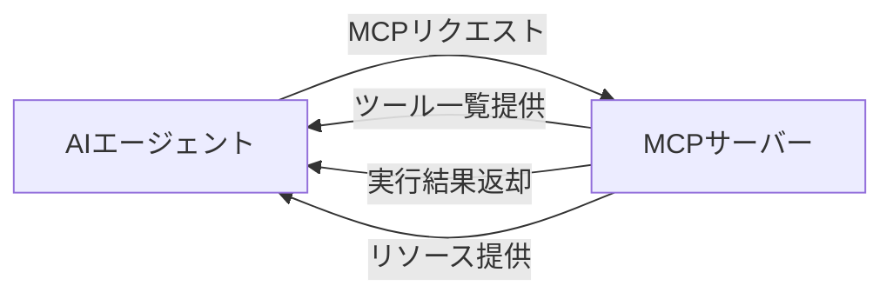
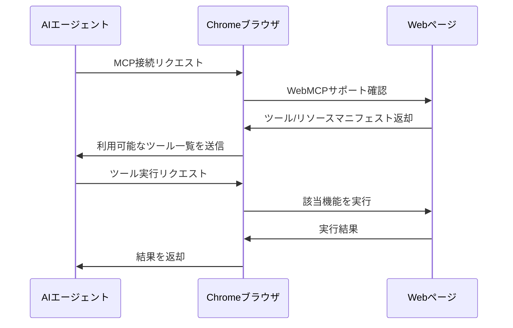
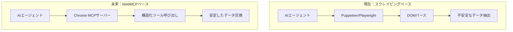

## 概要

Google Chrome 146で<strong>WebMCP</strong>が導入されます。これはブラウザ自体がMCP（Model Context Protocol）サーバーとして動作し、AIエージェントがブラウザを直接ツールサーバーとして活用できるようにする革新的な機能です。

従来、AIエージェントがWebページとやり取りするには、PuppeteerやPlaywrightなどの別途自動化ツールが必要でした。WebMCPはこのパラダイムを根本的に変えます。ブラウザ自体が<strong>MCPサーバー</strong>となり、AIエージェントに構造化されたツールとデータを直接提供するのです。

## MCP（Model Context Protocol）とは？

MCPはAnthropicが提案したオープンプロトコルで、AIモデルと外部ツール・データソース間の標準化された通信規格です。



MCPの主要コンポーネントは以下の通りです：

- <strong>Tools</strong>：AIが呼び出せる関数（検索、フォーム入力、ページ操作など）
- <strong>Resources</strong>：AIが読み取れる構造化データ
- <strong>Prompts</strong>：事前定義されたプロンプトテンプレート

## WebMCPの仕組み

WebMCPにより、Webページが自身の機能をMCPサーバーとして公開できるようになります。Web開発者は、AIエージェントが利用できるツールとデータを宣言的に定義します。

### アーキテクチャ



### 主な変化

| 項目 | 従来の方式 | WebMCP |
|------|-----------|--------|
| ブラウザ制御 | Puppeteer/Playwright | ネイティブMCP |
| ページ理解 | DOMパース/スクレイピング | 構造化リソース |
| インタラクション | CSSセレクタベース | 宣言的ツール呼び出し |
| 認証/権限 | 手動設定 | ブラウザ内蔵 |
| 安定性 | UI変更で破綻 | APIレベルの安定性 |

## Web開発者向けWebMCP実装

Web開発者は自サイトにWebMCPを実装し、AIエージェントが活用できる機能を公開できます。

### 例：ECサイト

```javascript
// WebMCPツール定義の例
navigator.mcp.registerTool({
  name: "search_products",
  description: "商品を検索します",
  inputSchema: {
    type: "object",
    properties: {
      query: { type: "string", description: "検索キーワード" },
      category: { type: "string", description: "カテゴリフィルタ" },
      maxPrice: { type: "number", description: "最大価格" }
    },
    required: ["query"]
  },
  handler: async (params) => {
    const results = await searchAPI(params);
    return { products: results };
  }
});

// リソース登録
navigator.mcp.registerResource({
  uri: "cart://current",
  name: "現在のカート",
  description: "現在のユーザーのカート内容",
  handler: async () => {
    return { items: await getCartItems() };
  }
});
```

### 例：SaaSダッシュボード

```javascript
// ダッシュボードデータをAIエージェントに提供
navigator.mcp.registerTool({
  name: "generate_report",
  description: "指定期間の分析レポートを生成します",
  inputSchema: {
    type: "object",
    properties: {
      startDate: { type: "string", format: "date" },
      endDate: { type: "string", format: "date" },
      metrics: {
        type: "array",
        items: { type: "string" }
      }
    }
  },
  handler: async (params) => {
    return await dashboardAPI.generateReport(params);
  }
});
```

## AIエージェントエコシステムへの影響

WebMCPはAIエージェントのWeb活用方式を根本的に変革します。



### 1. スクレイピングの終焉

Webサイトが直接構造化されたインターフェースを提供するため、不安定なDOMスクレイピングが不要になります。サイトのUIが変更されてもMCPインターフェースは維持されます。

### 2. エージェント開発の簡素化

AIエージェント開発者は各サイト向けのカスタムスクレイピングロジックを書く必要がなくなり、標準化されたMCPプロトコルですべてのWebMCP対応サイトと通信できます。

### 3. セキュリティと権限管理

ブラウザが中間レイヤーとして動作するため、ユーザーの同意のもとで安全にAIエージェントのアクセスを制御できます。既存のブラウザセキュリティモデル（CORS、CSPなど）がそのまま適用されます。

### 4. 新たなビジネスモデル

WebサービスがAIエージェント向けの<strong>MCPエンドポイント</strong>を提供することが、SEOと同じくらい重要な戦略となり得ます。「AIエージェント最適化（AEO）」という新しい分野が登場するでしょう。

## 他ブラウザと標準化の展望

現在WebMCPはChrome 146で先行導入されますが、Web標準化を通じて他ブラウザへの普及が見込まれます。

- <strong>Firefox</strong>：MozillaのAI戦略と連動した導入検討の可能性
- <strong>Safari</strong>：Apple Intelligenceとの統合観点で注目
- <strong>Edge</strong>：Copilotとの自然な連携が予想される

MCPがすでにオープンプロトコルとして設計されているため、ブラウザ間の互換性確保は比較的容易と見られます。

## 開発者が準備すべきこと

### 短期（3〜6ヶ月）

1. MCPプロトコル仕様の学習
2. 自社サービスのAIエージェント活用シナリオ策定
3. Chrome 146ベータでのWebMCP実験

### 中期（6〜12ヶ月）

1. WebMCPインターフェースの設計・実装
2. AIエージェント互換テスト
3. セキュリティ・権限モデルの策定

### 長期（1年以上）

1. AEO（AI Engine Optimization）戦略の策定
2. エージェント専用の分析・モニタリング導入
3. マルチエージェントシナリオへの対応

## 結論

WebMCPはWebの次なる進化段階です。Webページが単に人間が見るUIから、<strong>AIエージェントが活用する構造化されたサービス</strong>へと変貌します。

Chrome 146でのWebMCP導入は始まりに過ぎません。今後すべてのWebサービスが「人間向けのUI」と「AI向けのMCPインターフェース」を同時に提供する時代が来るでしょう。

Web開発者にとってこれは単なる新機能ではなく、<strong>Webの存在目的そのものを再定義する転換点</strong>です。

## 参考資料

- [MCP公式サイト](https://modelcontextprotocol.io/)
- [Chrome 146リリースノート](https://developer.chrome.com/blog)
- [@firtによるWebMCP紹介ツイート](https://x.com/firt/status/2020903127428313461)
- [Anthropic MCP発表](https://www.anthropic.com/news/model-context-protocol)
