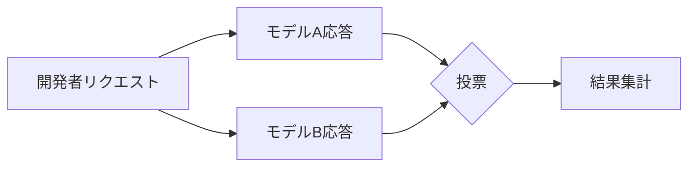
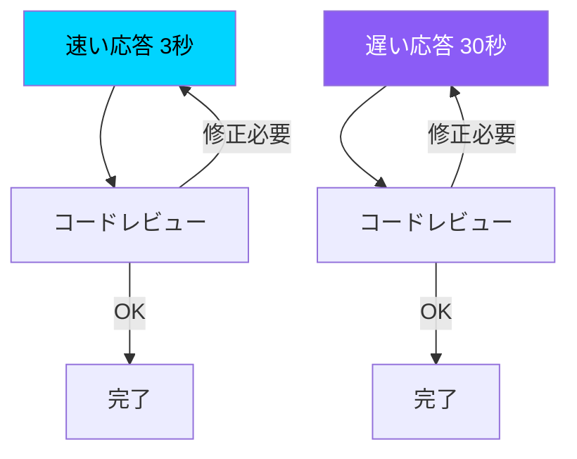

## 概要

WindsurfがAIコーディングアシスタントに導入した<strong>Arena Mode</strong>で、興味深い投票結果が出ました。4万票以上が集まったこの大規模実験で、開発者たちは<strong>精度よりも速度を圧倒的に優先する</strong>という結論が導き出されました。

この結果はAIコーディングツール市場の方向性に重要な示唆を与えます。完璧なコードをゆっくり生成するよりも、素早く生成して素早く修正するワークフローを開発者たちが好むということです。

## Arena Modeとは？

WindsurfのArena Modeは、2つのAIモデルの応答を並べて表示し、開発者がより良い応答に投票する<strong>ブラインドテスト</strong>方式です。

この方式はChatbot Arena（LMSYS）と似ていますが、<strong>実際のコーディング作業</strong>に特化している点が差別化ポイントです。開発者たちはコード補完、リファクタリング、デバッグなどの実戦的な作業で2つのモデルを比較評価します。

## 核心的発見：速度が精度に勝つ

4万票以上の投票データから導き出された核心的インサイトは明確です：

- <strong>速い応答を提供するモデルが一貫して高い好感度</strong>を得ました
- わずかな精度の差は、速度の優位性の前では無視される傾向が見られました
- 特に<strong>反復的なコード作成と修正作業</strong>でこの傾向が顕著でした

### なぜ速度なのか？

開発者の実際のワークフローを考えると、この結果は自然なものです：

1. <strong>速いフィードバックループ</strong>：コードを素早く受け取って実行し、問題があればすぐに修正依頼
2. <strong>コンテキスト維持</strong>：応答が遅いと開発者の思考フローが途切れる
3. <strong>反復可能性</strong>：最初の応答が完璧でなくても、素早く2〜3回反復すれば望む結果に到達
4. <strong>完璧より十分</strong>：80%正確なコードを素早く受け取る方が、100%正確なコードを長く待つより効率的

速いモデルは3秒×3回＝9秒で完了できる一方、遅いモデルは30秒×1回でも絶対時間では不利です。

## AIコーディングツール市場への示唆

### 1. モデル選択戦略の変化

この結果はAIコーディングツール提供企業のモデル選択戦略に直接的な影響を与えます。最も正確な最新モデルよりも、<strong>速度と精度のバランスが良いモデル</strong>がユーザー満足度で優位に立てる可能性があります。

### 2. ストリーミングと段階的生成の重要性

体感速度を高める技術が核心的な競争力となります：

- <strong>トークンストリーミング</strong>：全体の応答完了前に部分的な結果を先に表示
- <strong>推論型生成</strong>：まずスケルトンを生成し、詳細を段階的に補填
- <strong>キャッシング戦略</strong>：類似リクエストへの応答時間短縮

### 3. 「良いコード」の再定義

開発者にとって「良いAIコード」とは、<strong>完璧なコードではなく、素早く作業できる出発点</strong>です。これはAIコーディングツールの評価基準そのものを変化させます：

| 従来の評価基準 | Arena Modeが示した現実 |
|---|---|
| コード精度 | 応答速度 |
| 初回成功率 | 反復修正効率 |
| ベンチマークスコア | 体感生産性 |

## 他のベンチマークとの比較

SWE-benchやHumanEvalのような既存のベンチマークは<strong>精度中心</strong>でモデルを評価します。Arena Modeの結果は、これらのベンチマークが実際の開発者の好みと乖離している可能性を示唆しています。

実際の開発環境では：

- ベンチマーク1位のモデルが必ずしも最も好まれるモデルではない
- <strong>体感速度（perceived speed）</strong>が実際の精度より満足度に大きく影響
- 開発者たちは「遅いが正確」よりも「速くてだいたい合っている」を選択

## 結論

Windsurf Arena Modeの4万票投票結果は、AIコーディングツール業界に明確なメッセージを伝えます：<strong>開発者が求めるのは完璧さではなく速度です。</strong>

これは単に「速ければ良い」という話ではありません。現代のソフトウェア開発が<strong>反復的で段階的なプロセス</strong>に進化したからです。AIコーディングツールは完璧な一撃ではなく、速いフィードバックループを可能にするツールとして位置づけるべきです。

AIコーディングツールを評価する際は、ベンチマークスコアだけでなく<strong>実際の作業での体感速度</strong>も合わせて考慮してみてください。

## 参考資料

- [Windsurf Arena Mode投票結果（X/Twitter）](https://x.com/windsurf/status/2021693447099273530)
- [Windsurf公式サイト](https://windsurf.com)
- [Chatbot Arena（LMSYS）](https://chat.lmsys.org/)
