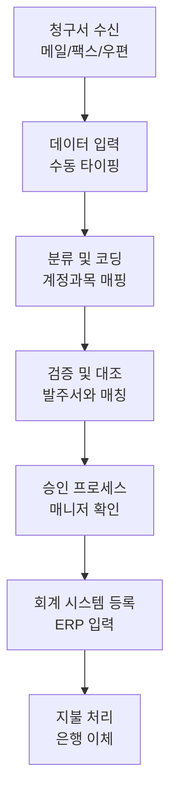
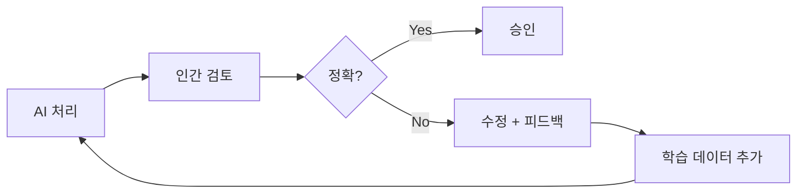
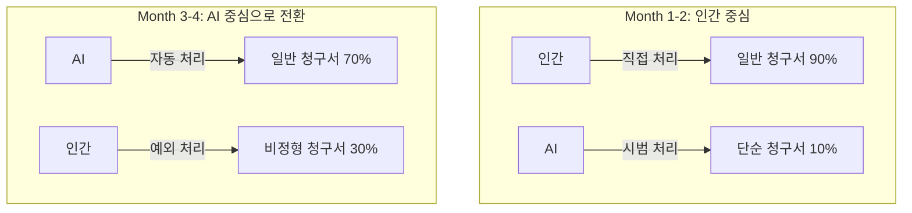
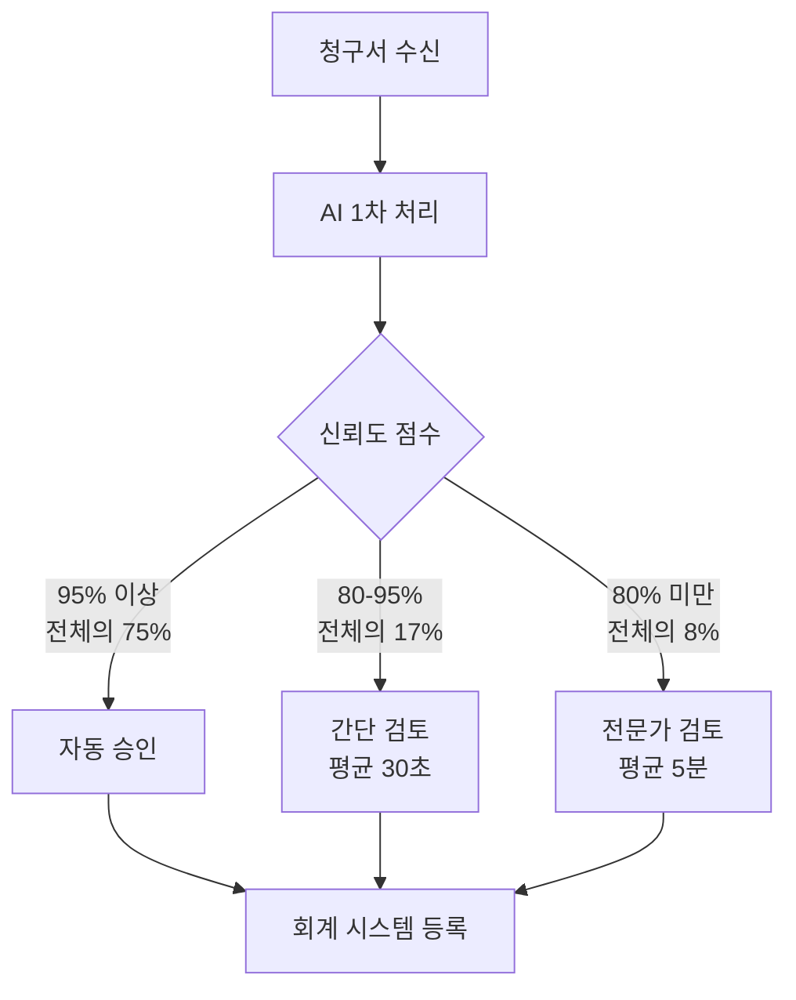

## 개요

"AI를 도입하면 비용이 97% 절감됩니다."

이런 헤드라인을 보면 대부분의 엔지니어링 매니저는 의심부터 합니다. 저도 그랬습니다. 하지만 실제 회계사무소에서 6개월간 AI 에이전트를 운영한 데이터를 분석해보니, 숫자 자체는 거짓이 아니었습니다. 다만 그 숫자에 도달하기까지의 과정은 어떤 벤더의 데모에서도 보여주지 않는 것이었습니다.

이 글에서는 중규모 회계사무소(직원 약 50명)가 청구서 처리 업무에 AI 에이전트를 도입한 6개월간의 실제 데이터를 바탕으로, 비용 절감뿐만 아니라 정확도 변화, 인간 역할의 전환, 그리고 도입 프로세스에서 마주한 현실적인 문제들을 분석합니다.

## 도입 전 상태 — 수작업 청구서 처리의 비용 구조

### 기존 프로세스

회계사무소의 청구서 처리는 생각보다 복잡합니다. 단순히 숫자를 입력하는 것이 아니라, 다음과 같은 단계를 거칩니다.



### 기존 비용 데이터

| 항목 | 수치 |
|------|------|
| 월 처리 청구서 수 | 약 3,000건 |
| 건당 평균 처리 시간 | 12분 |
| 건당 평균 비용 | $7.00 |
| 월간 총 처리 비용 | $21,000 |
| 오류율 | 약 20% (재작업 필요) |
| 재작업 비용 | 건당 추가 $15 |

여기서 주목할 점은 **오류율 20%**입니다. 이는 업계 평균과 크게 다르지 않은 수치입니다. 단순 타이핑 오류부터 계정과목 분류 실수, 발주서 매칭 누락까지 다양한 유형의 오류가 포함됩니다.

## 6개월간의 도입 과정 — 월별 데이터 분석

### Month 1: 파일럿 도입과 첫 번째 충격

AI 에이전트를 전체 청구서의 10%에 해당하는 약 300건에 시범 적용했습니다.

| 지표 | 수동 처리 | AI 처리 | 차이 |
|------|-----------|---------|------|
| 건당 비용 | $7.00 | $2.50 | -64% |
| 정확도 | 80% | 72% | **-8%** |
| 처리 시간 | 12분 | 3분 | -75% |

**첫 달의 정확도는 오히려 떨어졌습니다.** 이것이 대부분의 AI 도입 사례에서 숨기는 부분입니다. AI 모델이 해당 회계사무소의 고유한 청구서 양식, 거래처별 패턴, 내부 계정과목 체계에 적응하지 못했기 때문입니다.

### Month 2: 학습 데이터 정제와 피드백 루프 구축



2개월 차에는 인간 검토자의 수정 데이터를 AI 모델에 피드백하는 루프를 구축했습니다.

| 지표 | Month 1 | Month 2 | 변화 |
|------|---------|---------|------|
| AI 처리 비율 | 10% | 25% | +15% |
| 건당 비용 | $2.50 | $1.80 | -28% |
| 정확도 | 72% | 81% | **+9%** |
| 인간 검토 시간 | 8분/건 | 5분/건 | -37% |

### Month 3-4: 분기점 — 인간과 AI의 역할 재정의

3개월 차에 중요한 전환이 일어났습니다. AI의 정확도가 **인간 단독 처리의 정확도(80%)를 넘어선 것**입니다.

| 지표 | Month 3 | Month 4 |
|------|---------|---------|
| AI 처리 비율 | 50% | 70% |
| 건당 비용 | $0.90 | $0.55 |
| 정확도 | 88% | 93% |
| 예외 처리 건수 | 450건 | 210건 |

이 시점에서 인간의 역할이 근본적으로 바뀌었습니다.

**Before**: 데이터 입력자 → 모든 청구서를 직접 처리
**After**: 예외 처리 전문가 → AI가 처리하지 못하는 비정형 케이스만 담당



### Month 5-6: 안정화와 최종 수치

| 지표 | Month 5 | Month 6 | 도입 전 대비 |
|------|---------|---------|-------------|
| AI 처리 비율 | 85% | 92% | — |
| 건당 비용 | $0.30 | **$0.20** | **-97%** |
| 정확도 | 96% | **98%** | **+18%p** |
| 월간 총 비용 | $900 | $600 | -97% |
| 처리 시간 | 45초 | 30초 | -96% |

## 숫자 이면의 진실 — 숨겨진 비용과 고려사항

### 도입 비용 분석

헤드라인 숫자인 "건당 $7→$0.20"에는 포함되지 않는 비용들이 있습니다.

| 항목 | 비용 |
|------|------|
| AI 플랫폼 라이선스 (연간) | $24,000 |
| 초기 통합 개발 (3개월) | $45,000 |
| 학습 데이터 정제 인건비 | $18,000 |
| 직원 재교육 비용 | $8,000 |
| **총 초기 투자** | **$95,000** |

### ROI 계산

```
월간 절감액: $21,000 - $600 - $2,000(라이선스) = $18,400
초기 투자 회수 기간: $95,000 / $18,400 ≈ 5.2개월
연간 순절감액: $18,400 × 12 - $95,000 = $125,800 (첫해)
2년차 이후 연간 절감액: $18,400 × 12 = $220,800
```

**5개월 만에 투자가 회수**됩니다. 이것은 상당히 매력적인 수치이지만, 한 가지 전제가 있습니다. 도입 과정에서 기존 직원의 이탈 없이 역할 전환이 성공적으로 이루어져야 한다는 것입니다.

## 정확도 향상의 메커니즘 — 왜 AI가 인간보다 정확해졌나

### 인간 오류 vs AI 오류의 차이

인간과 AI의 오류 패턴은 근본적으로 다릅니다.

| 오류 유형 | 인간 빈도 | AI 빈도 |
|-----------|-----------|---------|
| 단순 타이핑 실수 | 높음 | 거의 없음 |
| 계정과목 분류 실수 | 중간 | 낮음 (학습 후) |
| 발주서 매칭 누락 | 높음 | 매우 낮음 |
| 비정형 양식 처리 | 낮음 | **높음** |
| 금액 계산 오류 | 중간 | 거의 없음 |
| 문맥 판단 실수 | 매우 낮음 | **중간** |

AI는 **반복적이고 패턴화된 작업**에서 압도적으로 우수하지만, **문맥 이해가 필요한 비정형 케이스**에서는 여전히 인간이 필요합니다.

### 98% 정확도의 구성

최종 98% 정확도는 "AI 단독"이 아닌 **AI + 인간 하이브리드 시스템**의 결과입니다.



## 인간 역할의 변화 — 가장 어려웠던 부분

### 직원 구성 변화

| 역할 | 도입 전 | 도입 후 | 변화 |
|------|---------|---------|------|
| 데이터 입력 담당 | 8명 | 0명 | -100% |
| 검증/대조 담당 | 4명 | 2명 | -50% |
| AI 운영/모니터링 | 0명 | 2명 | 신규 |
| 예외 처리 전문가 | 0명 | 3명 | 신규 |
| 클라이언트 컨설팅 | 3명 | 8명 | +167% |

총 인원은 15명에서 15명으로 변화가 없었습니다. 하지만 **역할 구성이 완전히 바뀌었습니다**. 단순 입력 업무를 하던 직원들이 클라이언트와 직접 소통하며 부가가치가 높은 컨설팅 업무로 전환한 것입니다.

### 전환 과정에서의 저항과 해결

솔직히 말하면, 이 과정은 순탄하지 않았습니다.

1. **1단계 — 부정 (Month 1)**: "AI가 우리 일을 뺏으려 한다"는 인식이 팽배했습니다.
2. **2단계 — 실험 (Month 2-3)**: AI의 오류를 인간이 수정하는 과정에서, 직원들이 AI의 한계를 이해하기 시작했습니다.
3. **3단계 — 협력 (Month 4-5)**: AI가 단순 업무를 처리해주면서 직원들이 더 의미 있는 업무에 집중할 수 있다는 것을 체감했습니다.
4. **4단계 — 주도 (Month 6)**: 직원들이 스스로 AI 개선 아이디어를 제안하기 시작했습니다.

## 엔지니어링 매니저로서의 교훈

### 1. 정확도는 처음에 반드시 떨어진다

어떤 AI 시스템이든 도입 초기에는 기존 시스템보다 성능이 낮을 수 있습니다. 이것을 **"J커브 효과"**라고 부릅니다. 경영진에게 이 J커브를 사전에 설명하고, 3개월의 학습 기간에 대한 합의를 얻는 것이 중요합니다.

### 2. 피드백 루프가 핵심이다

AI 모델의 성능을 올리는 것은 모델 자체가 아니라 **피드백 루프의 품질**입니다. 인간 검토자가 AI의 오류를 정확하게 분류하고 피드백하는 체계를 구축하는 데 가장 많은 시간을 투자해야 합니다.

### 3. 사람 문제가 기술 문제보다 어렵다

기술적 구현은 3개월이면 충분했지만, 조직 문화의 전환은 6개월이 지나도 완전히 끝나지 않았습니다. 엔지니어링 매니저로서 가장 중요한 역할은 코드를 작성하는 것이 아니라, 팀원들의 불안을 해소하고 새로운 역할에 대한 비전을 제시하는 것이었습니다.

### 4. 단계적 도입이 유일한 정답이다

10% → 25% → 50% → 70% → 92%로 점진적으로 AI 처리 비율을 높인 것이 성공의 핵심이었습니다. 한 번에 100% 전환을 시도했다면, 초기 정확도 하락으로 인해 프로젝트가 중단되었을 것입니다.

## 다른 업무 영역으로의 확장 가능성

청구서 처리에서 성공을 거둔 후, 다른 회계 업무에도 AI 도입을 검토하고 있습니다.

| 업무 영역 | 자동화 가능성 | 예상 비용 절감 | 난이도 |
|-----------|-------------|-------------|--------|
| 경비 정산 | 높음 | 85-90% | 낮음 |
| 급여 처리 | 중간 | 60-70% | 중간 |
| 세무 신고 | 낮음-중간 | 30-40% | 높음 |
| 감사 준비 | 중간 | 50-60% | 높음 |
| 재무 보고서 | 중간-높음 | 70-80% | 중간 |

## 결론

회계사무소의 AI 전환은 "마법의 버튼"이 아닙니다. $7에서 $0.20으로의 비용 절감은 실제로 달성 가능하지만, 그 과정에는 초기 정확도 하락, 직원 저항, 피드백 시스템 구축, 역할 재정의라는 현실적인 과제가 있습니다.

엔지니어링 매니저로서 제가 강조하고 싶은 것은 세 가지입니다.

1. **J커브를 각오하라**: 초기 3개월은 투자 기간이다.
2. **사람에 투자하라**: 기술보다 조직 변화 관리가 더 중요하다.
3. **데이터로 말하라**: 월별 지표를 투명하게 공유하는 것이 신뢰의 기반이다.

AI 도입의 "이상"과 "현실" 사이의 간격은 분명히 존재합니다. 하지만 그 간격을 메우는 것은 더 좋은 AI 모델이 아니라, **더 좋은 프로세스와 더 좋은 팀**입니다.

## 참고 자료

- [Gartner - AI in Finance and Accounting 2025](https://www.gartner.com/en/finance/topics/artificial-intelligence-in-finance)
- [McKinsey - The State of AI in 2025](https://www.mckinsey.com/capabilities/quantumblack/our-insights/the-state-of-ai)
- [ACCA - Digital Transformation in Accounting](https://www.accaglobal.com/gb/en/professional-insights/technology/digital-transformation.html)
- [IEEE - Intelligent Document Processing](https://ieeexplore.ieee.org/document/9782342)
