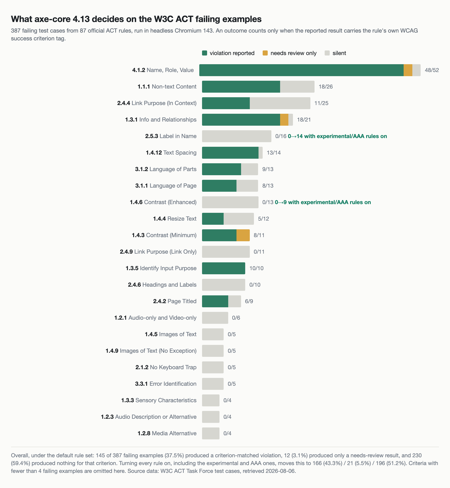

```
  axe-core 4.13.0
  0 violations found
```

CI 로그에서 이 두 줄을 몇백 번은 봤다. 초록불이고, 다음 단계로 넘어간다. 그런데 이 줄이 뜻하는 것은 "이 페이지에 접근성 문제가 없다"가 아니다. "내가 판정할 수 있는 항목 중에는 걸린 것이 없다"다. 두 문장 사이의 거리를 나는 말로만 알고 있었지 숫자로는 몰랐다.

마침 그 거리를 잴 재료가 공개돼 있다. W3C가 <strong>정답이 붙은 접근성 테스트 케이스</strong>를 배포한다. 어떤 HTML 조각이 어떤 규칙을 통과하는지, 위반하는지, 아예 해당 없는지가 사람 손으로 하나하나 표시돼 있다. 1,213장이다. 여기에 검사기를 물리면 "검사기가 무엇을 못 잡는가"를 추측이 아니라 숫자로 말할 수 있다.

그래서 물려 봤다. 실패해야 하는 예제 387장 중 해당 성공기준으로 위반이 나온 것은 145장이었다.

## "위반 0"과 "판정 못 함"이 같은 줄로 출력된다

자동 접근성 검사기는 규칙의 모음이다. 규칙 하나는 문서에서 자기 대상을 찾고, 찾은 각각에 대해 통과·위반·판정 보류 중 하나를 매긴다. axe-core를 예로 들면 결과는 네 무더기로 나온다. `violations`(위반), `passes`(통과), `incomplete`(사람이 봐야 함), `inapplicable`(해당 대상 없음)이다.

CI에 붙일 때 우리가 보는 것은 보통 첫 번째 무더기 하나다. `violations.length === 0`이면 통과시킨다. 이 설계에는 조용한 가정이 하나 들어 있다. <strong>규칙이 다루지 않는 문제는 애초에 세지 않는다</strong>는 가정이다. 링크 텍스트가 목적지를 설명하는지, 오류 메시지가 무엇이 틀렸는지 알려주는지 같은 항목은 규칙이 판정을 포기하거나 아예 규칙이 없고, 그 결과는 `violations`에 들어오지 않는다. 그래서 화면에는 위반 0으로 찍힌다.

문제는 이 0이 두 가지를 한 글자로 덮는다는 것이다. 하나는 "봤는데 괜찮다"이고 다른 하나는 "안 봤다"인데, 로그에서는 구분되지 않는다. 접근성 감사를 외부에 맡겨 본 사람이라면 이 간극을 이미 겪었을 것이다. CI는 몇 달째 초록불인데 감사 보고서에는 지적이 수십 건 실려 온다.

이 간극의 크기를 재려면 정답이 있어야 한다. 우리 사이트에는 정답이 없다. 위반이 몇 건인지 알려면 사람이 전수로 봐야 하고, 그걸 할 수 있으면 애초에 검사기가 필요 없다.

## W3C가 정답지를 공개하고 있다

접근성 도구들끼리 결과가 어긋나는 문제는 오래된 것이다. 같은 페이지를 두 도구에 넣으면 위반 개수가 다르게 나오고, 어느 쪽이 맞는지 판단할 기준이 없었다. W3C의 ACT(Accessibility Conformance Testing)는 여기에 대응해 만들어진 틀이다. 규칙을 서술하는 형식을 표준화하고, 각 규칙마다 <strong>통과 예제·실패 예제·해당 없음 예제</strong>를 붙여 공개한다. 도구를 그 예제에 걸어 보면 도구끼리 비교가 된다.

[ACT Rules Format 1.1](https://www.w3.org/TR/act-rules-format-1.1/)은 2026년 2월 5일 W3C 권고안이 됐다. 규칙 목록과 테스트 케이스는 [ACT Rules 페이지](https://www.w3.org/WAI/standards-guidelines/act/rules/)에서 볼 수 있고, 기계가 읽을 수 있는 형태로도 나온다. `testcases.json` 한 파일에 전부 들어 있다.

```json
{
  "ruleId": "674b10",
  "ruleName": "Role attribute has valid value",
  "ruleAccessibilityRequirements": {
    "wcag-technique:ARIA4": { "failed": "not satisfied" },
    "wcag20:4.1.2": { "secondary": "This success criterion is less strict than this rule..." }
  },
  "expected": "passed",
  "testcaseId": "c181f7267bf9f4fc0f9ad9e2a69c1ad7da504f4d",
  "relativePath": "testcases/674b10/c181f7267bf9f4fc0f9ad9e2a69c1ad7da504f4d.html"
}
```

받아 보니 1,213장이었다. 87개 ACT 규칙에서 나온 것이고, 라벨은 통과 472장, 실패 393장, 해당 없음 348장으로 갈린다. 규칙 87개 중 63개는 WCAG 성공기준을 1차 요구사항으로 가리키고, 나머지 24개는 성공기준이 아니라 WCAG 기법(technique)만 가리킨다. 1차 요구사항으로 등장하는 성공기준을 세면 37개다.

작은 함정이 하나 있었다. w3.org에 Node의 `fetch`로 요청하면 HTTP 429가 돌아온다. `curl` 한 번은 통과하는데 스크립트로 돌리면 전부 막힌다. 40분을 여기서 버렸다. 결국 같은 파일이 [w3c/wcag-act-rules 저장소](https://github.com/w3c/wcag-act-rules)에 그대로 있는 것을 확인하고 그쪽에서 받았다. 두 경로의 파일이 같은지는 SHA-256으로 대조했다. 같았다.

테스트 케이스 1,213장 중 453장은 `/WAI/content-assets/wcag-act-rules/test-assets/` 아래의 이미지·영상·하위 페이지를 절대 경로로 참조한다. 그래서 로컬 HTTP 서버를 같은 경로 구조로 띄워 붙였다. 자산 96개를 함께 내려받았고, 2MB가 넘는 샘플 영상 6개(가장 큰 것 35.5MB)는 건너뛰었다. 검사기가 영상의 픽셀을 보고 판정하는 규칙은 없다.

## '위반이 하나라도 나왔다'는 쓸모없는 신호였다

처음에는 단순하게 셌다. 실패 예제에서 axe가 위반을 하나라도 뱉으면 잡은 것으로 치는 방식이다. 387장 중 386장이었다. 99.7%. 잠깐 기뻐할 뻔했다.

같은 계산을 통과 예제에 돌려 보니 461장 중 458장이 위반으로 찍혀 있었다. 99.3%다. 원인은 금방 나왔다. ACT 테스트 케이스는 규칙 하나를 보여주기 위한 최소 문서다. `<main>`도 없고 `<h1>`도 없다. 그래서 페이지 구조를 보는 규칙이 거의 전부에서 발동한다.

실패가 아닌 예제 799장에 대해 axe가 낸 위반을 규칙별로 세면 이렇다.

| axe 규칙 | 발동 | 비율 | 태그 |
|---|---|---|---|
| `landmark-one-main` | 784 | 98% | best-practice |
| `page-has-heading-one` | 754 | 94% | best-practice |
| `region` | 572 | 72% | best-practice |
| `document-title` | 192 | 24% | wcag2a |
| `html-has-lang` | 74 | 9% | wcag2a |

상위 셋은 전부 `best-practice` 태그다. WCAG 적합성 항목이 아니라 Deque가 권장하는 관행이다. 게이트를 짤 때 태그로 거르지 않으면 이 셋이 신호를 다 덮는다. 아래 둘은 WCAG 태그가 붙어 있지만, 여기서는 조각 문서를 검사한 데서 온 산물이다.

그래서 판정 기준을 바꿨다. <strong>실패 예제에서 axe가 낸 결과의 태그에, 그 ACT 규칙이 가리키는 성공기준이 들어 있을 때만 잡은 것으로 센다.</strong> ACT 규칙 `674b10`이 4.1.2를 가리키면 axe 결과에 `wcag412` 태그가 있어야 한다. 그리고 결과를 세 갈래로 나눴다. 위반으로 단정한 경우, `incomplete`로 사람에게 넘긴 경우, 아무 말도 하지 않은 경우다.

이 세 번째 갈래가 이 측정의 핵심이다. 사람에게 넘기는 것과 침묵하는 것은 CI에서 전혀 다른 사건인데, 기본 리포터는 둘 다 조용히 지나간다.

## 37.5%라는 총계는 의사결정에 쓸 수 없다

axe-core 4.13.0을 헤드리스 Chromium 143에 띄워 전수로 돌렸다. 1분이 안 걸린다.

```
failing examples evaluated: 387 (unevaluable 6, page errors 27)
  criterion-matched violation : 145 (37.5%)
  needs-review only           :  12 ( 3.1%)
  silent                      : 230 (59.4%)
```

37.5%. 업계에서 흔히 오가는 "자동 도구는 3분의 1 정도 잡는다"는 어림과 크게 다르지 않다. 그런데 이 숫자 하나로는 아무 결정도 못 한다. 내일 무엇을 고칠지, 수동 검사 시간을 어디에 쓸지가 이 총계에서는 나오지 않는다.

성공기준별로 쪼개면 이야기가 완전히 달라진다.



| 성공기준 | 실패 예제 | 위반 | 검토 필요 | 침묵 |
|---|---|---|---|---|
| 4.1.2 Name, Role, Value | 52 | 48 | 2 | 2 |
| 1.1.1 Non-text Content | 26 | 18 | 0 | 8 |
| 2.4.4 Link Purpose (In Context) | 25 | 11 | 0 | 14 |
| 1.3.1 Info and Relationships | 21 | 18 | 2 | 1 |
| 2.5.3 Label in Name | 16 | 0 | 0 | 16 |
| 1.4.12 Text Spacing | 14 | 13 | 0 | 1 |
| 1.4.6 Contrast (Enhanced) | 13 | 0 | 0 | 13 |
| 2.4.9 Link Purpose (Link Only) | 11 | 0 | 0 | 11 |
| 1.3.5 Identify Input Purpose | 10 | 10 | 0 | 0 |
| 2.4.6 Headings and Labels | 10 | 0 | 0 | 10 |

4.1.2는 52건 중 48건이다. 이름·역할·값은 DOM과 접근성 트리만 보면 판정되는 영역이라 검사기가 강하다. 1.3.5와 1.4.12도 마찬가지다. 반대편에는 0이 줄줄이 있다. 2.5.3(보이는 라벨이 접근 가능한 이름에 포함되는가)은 16건 중 0건, 2.4.6(제목과 라벨이 내용을 설명하는가)은 10건 중 0건, 2.4.9(링크 텍스트만으로 목적을 알 수 있는가)는 11건 중 0건이다.

전체로 보면 <strong>등장한 성공기준 36개 중 22개에서 위반이 한 건도 나오지 않았다.</strong> ACT 규칙 87개 중 54개는 자기 실패 예제 전부에 대해 위반도 검토 요청도 내지 않았다.

여기서 오해하면 안 되는 게 있다. 이 0들은 대부분 axe의 결함이 아니다. "링크 텍스트가 목적을 설명하는가"는 의미를 읽어야 하는 판단이고, 검사기가 확신 없이 위반을 뱉으면 오탐이 쌓여 아무도 결과를 안 보게 된다. W3C도 [평가 도구 개요](https://www.w3.org/WAI/test-evaluate/tools/)에서 선을 그어 둔다. "However, tools can't do it all. Some accessibility checks just cannot be automated and require manual intervention."

여기에 한 가지를 덧붙이고 싶다. 의미를 읽어야 해서 남는 기준 말고, 뷰포트를 실제로 움직여봐야 판정되는 기준도 이 목록에 섞여 있다. 1.4.10 리플로우가 그렇다. 고정 뷰포트에서 DOM만 훑는 이 측정으로는 애초에 나올 수 없는 항목이고, [세 가지 높이로 같이 재보니 판정이 갈린 쪽은 가로가 아니라 세로였다](/ko/blog/ko/reflow-1410-400-zoom-viewport-height-2026/). 침묵의 목록을 적을 때는 "사람이 읽어야 하는 것"과 "다른 조건에서 다시 재야 하는 것"을 구분해 두는 편이 낫다.

내 판단은 이렇다. 문제는 도구가 침묵하는 것이 아니라, <strong>그 침묵이 파이프라인 어디에도 기록되지 않는 것</strong>이다. 자동으로 결정되지 않는 22개 기준의 목록은 도구를 고르는 순간 이미 정해진다. 그런데 그 목록을 가진 팀을 나는 거의 못 봤다.

## 침묵의 일부는 능력이 아니라 설정이었다

표를 보다가 2.5.3이 걸렸다. axe에는 `label-content-name-mismatch`라는 규칙이 있고 태그에 `wcag253`이 붙어 있다. 규칙이 있는데 16건 전부 침묵이라는 게 앞뒤가 안 맞았다.

규칙 메타데이터를 열어 보니 이 규칙에는 `experimental` 태그가 있다. 그리고 [axe-core API 문서](https://github.com/dequelabs/axe-core/blob/develop/doc/API.md)에 그대로 적혀 있다.

> The default operation for axe.run is to run all rules except for rules with the "experimental" tag.

같은 문서의 태그 표에는 이렇게 돼 있다. "`experimental` | Cutting-edge rules, disabled by default". 즉 `axe.run(document)`을 인자 없이 호출하면 이 규칙은 실행되지 않는다.

axe-core 4.13.0의 규칙을 세어 보면 전체 105개다. WCAG 태그가 붙은 것이 75개, `best-practice`가 30개다. 이 중 `enabled: false`로 배포되는 규칙이 9개, `experimental` 태그가 붙은 규칙이 7개다. 합쳐서 <strong>16개 규칙이 기본 실행 대상에서 빠져 있다.</strong>

| 규칙 | 태그 | 왜 걸리는가 |
|---|---|---|
| `color-contrast-enhanced` | wcag2aaa, wcag146 | 1.4.6 실패 예제 13건 전부 침묵의 원인 |
| `identical-links-same-purpose` | wcag2aaa, wcag249 | 2.4.9의 0건 |
| `label-content-name-mismatch` | wcag21a, wcag253, experimental | 2.5.3의 0건 |
| `meta-refresh-no-exceptions` | wcag2aaa, wcag224, wcag325 | 2.2.4·3.2.5의 0건 |
| `target-size` | <strong>wcag22aa</strong>, wcag258 | WCAG 2.2 AA인데 기본 비활성 |

마지막 줄에서 잠깐 멈췄다. `target-size`는 AAA도 experimental도 아니다. WCAG 2.2에서 AA로 신설된 기준이고, 나는 [이 기준을 직접 재서 고친 적도 있다](/ko/blog/ko/wcag22-target-size-audit-2026). 그런데 아무 설정 없이 axe를 돌리면 이 규칙은 실행되지 않는다. "WCAG 2.2 AA 준수를 CI에서 확인하고 있다"고 말해 온 파이프라인이 실제로는 그 기준 하나를 통째로 건너뛰고 있었다는 뜻이다.

그래서 전 규칙을 켜고 다시 돌렸다.

```
failing examples evaluated: 383 (unevaluable 10, page errors 38)
  criterion-matched violation : 166 (43.3%)
  needs-review only           :  21 ( 5.5%)
  silent                      : 196 (51.2%)
```

37.5%에서 43.3%로 올랐다. 위반 0건이던 성공기준은 22개에서 18개로 줄었다. 회복된 것은 2.5.3(0→14건), 1.4.6(0→9건), 2.2.4와 3.2.5(각 0→2건)다. 2.4.9는 위반으로는 여전히 0이지만 `incomplete`가 6건 생겨, 최소한 "사람이 봐야 한다"는 신호는 나오게 됐다.

기본값과 전체 실행에서 실제로 발동한 규칙 수를 세면 45개와 52개다. 규칙 7개 차이가 성공기준 4개를 되살렸다.

## 그래서 게이트를 이렇게 짠다

측정에서 나온 처방은 세 가지다. 순서대로 코드로 옮긴다.

<strong>첫째, 태그로 범위를 명시한다.</strong> `best-practice`를 섞어 두면 앞서 본 `landmark-one-main` 같은 규칙이 신호를 덮는다. 나쁜 규칙이라서가 아니라, 적합성 게이트와 코딩 관행 리포트는 실패 조건이 달라야 하기 때문이다.

<strong>둘째, 꺼져 있는 규칙 중 필요한 것을 명시적으로 켠다.</strong> 특히 `target-size`. 준수 목표가 AAA를 포함한다면 `color-contrast-enhanced`와 `identical-links-same-purpose`도 함께.

<strong>셋째, `incomplete`를 출력한다.</strong> 실패 조건으로 삼자는 게 아니다. 로그에 숫자가 남아야 "게이트가 통과했지만 12건은 사람이 봐야 한다"가 눈에 보인다.

```js
const AXE_OPTIONS = {
  runOnly: {
    type: 'tag',
    values: ['wcag2a', 'wcag2aa', 'wcag21a', 'wcag21aa', 'wcag22aa'],
  },
  rules: {
    // WCAG 2.2 AA인데 기본 비활성이다. 켜지 않으면 2.5.8은 아무도 안 본다.
    'target-size': { enabled: true },
    // experimental. 게이트 실패가 아니라 리포트로 먼저 쌓는다.
    'label-content-name-mismatch': { enabled: true },
  },
  resultTypes: ['violations', 'incomplete'],
};

const result = await new AxePuppeteer(page).options(AXE_OPTIONS).analyze();

const blocking = result.violations.filter((v) => !v.tags.includes('experimental'));
const advisory = result.violations.filter((v) => v.tags.includes('experimental'));

console.log(`violations ${blocking.length} / advisory ${advisory.length} / needs review ${result.incomplete.length}`);
for (const item of result.incomplete) {
  console.log(`  review: ${item.id} (${item.nodes.length} nodes) — ${item.help}`);
}

if (blocking.length > 0) process.exit(1);
```

여기까지가 자동으로 결정되는 쪽이다. 남는 쪽은 목록으로 만들어야 한다. 이번 측정에서 위반 0건이었던 성공기준을 그대로 옮기면 수동 검사 항목이 된다. 2.4.6(제목과 라벨), 2.4.9(링크 텍스트), 3.3.1(오류 식별), 1.3.3(감각 특성), 2.1.2(키보드 함정), 1.4.5와 1.4.9(텍스트 이미지), 1.2.x(미디어 대체 수단) 계열이다. 이 목록은 페이지마다 다시 만들 필요가 없다. 도구와 버전이 고정돼 있으면 목록도 고정된다.

내가 쓰는 순서는 이렇다. 전수 자동 검사로 결정 가능한 기준을 털어내고, 사람의 시간은 위 목록에만 쓴다. [표본을 어떻게 뽑을지 고민하던 문제](/ko/blog/ko/wcag-em-2-sampling-vs-full-sweep-audit-2026)와 짝이 되는 축이다. 그쪽이 "몇 장을 보느냐"였다면 이쪽은 "무엇을 볼 수 있느냐"다. 둘 다 답이 있어야 감사 계획이 선다.

세는 대상이 규칙이 아니라 문서일 때도 같은 편중이 나온다. [Chrome이 에이전트에게 주는 가이드 138개를 카테고리별로 세어 보니 접근성은 2개였다](/ko/blog/ko/modern-web-guidance-agent-skill-coverage-2026/). 검사기가 무엇을 결정하는지 세는 일과, 에이전트가 무엇을 읽고 답하는지 세는 일은 결국 같은 질문이다.

## 이 숫자가 말하지 않는 것

측정 조건을 그대로 적는다.

ACT 테스트 케이스는 규칙 하나를 드러내기 위한 최소 문서다. 실제 페이지가 아니다. 실제 페이지에서는 문맥이 더 풍부해서 검사기가 더 잘 판정하는 경우도, 반대로 요소가 많아 놓치는 경우도 있다. 이 숫자는 실무 사이트의 검출률이 아니라 <strong>규칙 커버리지의 상한선에 가까운 지표</strong>로 읽어야 한다.

로드 자체가 안 되는 케이스가 있다. `meta refresh`가 걸려 있거나 화면 방향을 제한하는 예제들이라 브라우저가 페이지를 넘겨 버린다. 실행마다 27〜38건이 여기 해당했고, 그래서 평가 대상 수가 실행할 때마다 몇 건씩 흔들린다. 백분율은 1포인트 안쪽에서 움직였다.

W3C는 도구별 ACT 구현 보고서를 따로 공개한다. 이 글은 그 보고서가 아니다. 그쪽은 규칙 단위 구현 일치도를 보고, 이쪽은 "설정 없이 CI에 붙였을 때 성공기준별로 무엇이 결정되는가"를 본다. 질문이 다르므로 숫자를 맞대면 안 된다.

그리고 이 숫자는 axe-core 4.13.0 하나에 대한 것이다. 다른 검사기는 다른 목록을 갖는다. 마지막으로, 당연하지만 적어 둔다. <strong>자동 규칙을 전부 통과한 것은 WCAG 적합성이 아니다.</strong> 적합성은 사람이 판정한다. 이 간극이 가장 잘 보이는 기준이 1.4.12 텍스트 간격이다. [자간을 기준치대로 넓히고 570곳이 잘리는 걸 직접 재본 적이 있는데](/ko/blog/ko/text-spacing-1412-clamp-audit-2026/), 그 페이지들은 검사기에서 전부 AA 통과였다.

## 정리: 오늘 뽑아 둘 두 개의 목록

- 지금 쓰는 검사기의 버전을 고정하고, 그 버전에서 <strong>기본 비활성인 규칙 목록</strong>을 뽑는다. axe라면 `enabled: false`와 `experimental`을 합쳐 16개다.
- 그중 준수 목표에 들어가는 규칙을 명시적으로 켠다. `target-size`는 WCAG 2.2 AA를 목표로 한다면 선택이 아니다.
- 게이트의 `runOnly`를 태그로 좁혀 `best-practice`가 적합성 신호를 덮지 않게 한다.
- `incomplete` 개수를 로그에 남긴다. 초록불과 "판정 보류 12건"이 구분돼 보여야 한다.
- 위반 0건으로 나온 성공기준을 그대로 <strong>수동 검사 목록</strong>으로 만든다. 이 목록이 없으면 수동 검사는 매번 즉흥이 된다.
- 도구나 버전을 올릴 때 두 목록을 다시 뽑는다. 규칙 하나가 켜지고 꺼지는 것으로 성공기준 하나가 통째로 움직인다.

스크립트는 저장소에 `scripts/act-coverage-audit.mjs`로 넣어 뒀다. 인자 없이 돌리면 기본 규칙셋, `--all-rules`를 붙이면 전 규칙 기준으로 같은 표가 나온다. 첫 실행은 테스트 케이스를 받느라 조금 걸리고 그다음부터는 1분 안쪽이다.

지금 돌리고 있는 접근성 게이트가 어느 성공기준을 실제로 결정하는지, 목록으로 적어 본 적 있는가. 없다면 그 목록을 만드는 데서 시작하면 된다. 나를 부르려면 [프로필](/ko/about/).

---

*출처: W3C의 [ACT Rules Format 1.1](https://www.w3.org/TR/act-rules-format-1.1/)(W3C 권고안, 2026년 2월 5일), [ACT Rules](https://www.w3.org/WAI/standards-guidelines/act/rules/), [Web Accessibility Evaluation Tools List](https://www.w3.org/WAI/test-evaluate/tools/), Deque의 [axe-core API 문서](https://github.com/dequelabs/axe-core/blob/develop/doc/API.md)(모두 공식). 측정 환경: W3C ACT Task Force 테스트 케이스 1,213장(2026년 8월 6일 취득, 규칙 87개), axe-core 4.13.0, Playwright 1.57 + Chromium 143.0.7499.4 헤드리스, Node 22.22, 뷰포트 1280×800, 로컬 HTTP 서버. 테스트 케이스 파일은 w3c/wcag-act-rules 저장소에서 받아 w3.org 원본과 SHA-256으로 대조했다. 모든 수치는 이 도구·이 버전·이 테스트 스위트에서 나온 값이며, 실제 웹사이트에서의 검출률이나 다른 검사 도구의 성능에 대한 진술이 아니다.*
