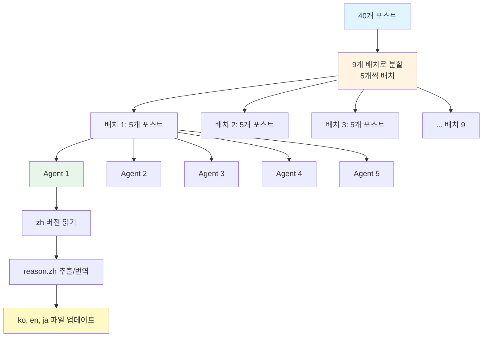

## 들어가며

2025년 11월, 제 블로그는 중요한 전환점을 맞이했습니다. 한국어, 영어, 일본어로 운영되던 기술 블로그에 <strong>중국어(간체자) 지원을 추가</strong>하기로 결정한 것입니다.

중국에서 유입되는 트래픽이 꾸준히 증가하고 있었고, 중국어권 개발자들에게도 양질의 콘텐츠를 제공하고 싶었습니다. 하지만 40개의 포스트에 중국어 버전을 추가하고, 모든 UI 컴포넌트를 다국어화하며, SEO를 최적화하는 작업은 만만치 않았습니다.

이 글에서는 <strong>Astro 기반 다국어 블로그에 새로운 언어를 추가하는 전 과정</strong>을 상세히 공유합니다. 파일 구조 설계부터 대규모 번역 자동화, SEO 최적화까지 - 실전에서 마주친 문제와 해결책을 투명하게 기록했습니다.

### 이 글을 읽으면 알 수 있는 것

- Astro Content Collections를 활용한 다국어 콘텐츠 구조 설계
- 40개 포스트 × 3개 언어 = 120개 파일 업데이트를 병렬 에이전트로 자동화하는 방법
- 언어별 사이트맵, RSS 피드, 메타데이터 설정 전략
- UI 컴포넌트 다국어화 베스트 프랙티스
- 번역 품질을 유지하면서 작업 시간을 90% 단축한 자동화 워크플로우

## Section 1: 파일 구조 설계

다국어 블로그를 확장할 때 가장 중요한 것은 <strong>명확하고 확장 가능한 파일 구조</strong>입니다. Astro Content Collections는 이를 위한 완벽한 도구입니다.

### 언어별 폴더 구조

```
src/content/blog/
├── ko/          # 한국어
├── en/          # 영어
├── ja/          # 일본어
└── zh/          # 중국어 (신규 추가)
```

<strong>핵심 원칙</strong>:
1. <strong>동일한 파일명</strong>: 모든 언어 폴더에 같은 이름으로 저장
   - 예: `ko/ai-agent-collaboration-patterns.md`, `zh/ai-agent-collaboration-patterns.md`
2. <strong>언어 코드로 자동 인식</strong>: 폴더 경로로 언어 식별 (`getCollection` 필터링)
3. <strong>공유 자산</strong>: heroImage는 언어와 무관하게 `src/assets/blog/`에서 공유

### 실제 코드 예시

```typescript
// src/pages/[lang]/blog/[...slug].astro
import { getCollection } from 'astro:content';

export async function getStaticPaths() {
  const allPosts = await getCollection('blog');

  // 언어별 필터링
  const languages = ['ko', 'en', 'ja', 'zh'];
  const paths = [];

  for (const lang of languages) {
    const langPosts = allPosts.filter(post => post.id.startsWith(`${lang}/`));

    for (const post of langPosts) {
      const slug = post.id.replace(`${lang}/`, '');
      paths.push({
        params: { lang, slug },
        props: { post }
      });
    }
  }

  return paths;
}
```

### 장점

- <strong>명확한 분리</strong>: 언어별 콘텐츠가 물리적으로 분리되어 관리 용이
- <strong>쉬운 유지보수</strong>: 특정 언어만 수정하거나 추가/제거 가능
- <strong>타입 안전성</strong>: Astro가 자동으로 타입 생성, TypeScript 지원
- <strong>확장성</strong>: 새 언어 추가 시 폴더만 생성하면 됨

## Section 2: 콘텐츠 컬렉션 스키마

Astro Content Collections는 Frontmatter의 <strong>타입 안전성을 보장</strong>하고, 다국어 필드를 체계적으로 관리할 수 있게 합니다.

### Frontmatter 구조

```yaml
---
title: 'AI智能体协作模式：用5个专业Agent构建全栈应用'
description: 通过协调Architecture、Coding、Testing、Security、DevOps Agent构建生产级应用的实战指南
pubDate: '2025-10-16'
heroImage: ../../../assets/blog/ai-agent-collaboration-patterns-hero.jpg
tags:
  - ai
  - agents
  - architecture
relatedPosts:
  - slug: self-healing-ai-systems
    score: 0.94
    reason:
      ko: '자동화, AI/ML, 아키텍처 분야에서 유사한 주제를 다루며 비슷한 난이도입니다.'
      ja: 自動化、AI/ML、アーキテクチャ分野で類似したトピックを扱い、同程度の難易度です。
      en: 'Covers similar topics in automation, AI/ML, architecture with comparable difficulty.'
      zh: 涵盖自动化、AI/ML、架构等相似主题，难度相当。
---
```

### relatedPosts의 다국어 reason 필드

제 블로그의 특징은 <strong>각 추천 포스트에 4개 언어로 추천 이유를 제공</strong>한다는 것입니다. 이는 사용자 경험과 SEO 모두에 긍정적입니다.

```typescript
// src/content.config.ts
import { defineCollection, z } from 'astro:content';

const blogCollection = defineCollection({
  type: 'content',
  schema: ({ image }) => z.object({
    title: z.string(),
    description: z.string(),
    pubDate: z.coerce.date(),
    updatedDate: z.coerce.date().optional(),
    heroImage: image().optional(),
    tags: z.array(z.string()).optional(),
    relatedPosts: z.array(
      z.object({
        slug: z.string(),
        score: z.number(),
        reason: z.object({
          ko: z.string(),
          ja: z.string(),
          en: z.string(),
          zh: z.string()
        })
      })
    ).optional()
  })
});

export const collections = { blog: blogCollection };
```

### 스키마의 이점

- <strong>빌드 타임 검증</strong>: 잘못된 Frontmatter는 빌드 실패로 즉시 감지
- <strong>자동 타입 생성</strong>: `CollectionEntry<'blog'>` 타입 자동 생성
- <strong>IDE 지원</strong>: VSCode에서 자동완성 및 타입 체크

## Section 3: UI 컴포넌트 다국어화

콘텐츠뿐만 아니라 <strong>UI 컴포넌트도 다국어화</strong>해야 완전한 사용자 경험을 제공할 수 있습니다.

### BuyMeACoffee 컴포넌트

```astro
---
// src/components/BuyMeACoffee.astro
import type { Language } from '../lib/i18n/languages';

interface Props {
  lang: Language;
}

const { lang } = Astro.props;

const messages = {
  ko: {
    title: '글이 도움이 되셨나요?',
    description: '더 나은 콘텐츠를 작성하는 데 힘이 됩니다. 커피 한 잔으로 응원해주세요! ☕'
  },
  ja: {
    title: 'この記事は役に立ちましたか？',
    description: 'より良いコンテンツを作成するための力になります。コーヒー一杯で応援してください！☕'
  },
  en: {
    title: 'Was this helpful?',
    description: 'Your support helps me create better content. Buy me a coffee! ☕'
  },
  zh: {
    title: '这篇文章有帮助吗？',
    description: '您的支持能帮助我创作更好的内容。请我喝杯咖啡吧！☕'
  }
};

const message = messages[lang];
---

<div class="mt-12 pt-8 border-t border-gray-200">
  <div class="text-center">
    <h3 class="text-2xl font-bold text-gray-900 mb-3">
      {message.title}
    </h3>
    <p class="text-gray-600 mb-6 max-w-2xl mx-auto">
      {message.description}
    </p>
  </div>
</div>
```

### BlogPostLanguageSwitcher 컴포넌트

```astro
---
// src/components/BlogPostLanguageSwitcher.astro
const languages = {
  ko: { flag: '🇰🇷', label: '한국어', currentLabel: '한국어 (현재 페이지)' },
  ja: { flag: '🇯🇵', label: '日本語', currentLabel: '日本語（現在のページ）' },
  en: { flag: '🇺🇸', label: 'English', currentLabel: 'English (Current Page)' },
  zh: { flag: '🇨🇳', label: '中文', currentLabel: '中文（当前页面）' }  // 신규 추가
};

const sectionTitles = {
  ko: '다른 언어로 읽기',
  ja: '他の言語で読む',
  en: 'Read in Other Languages',
  zh: '阅读其他语言版本'  // 신규 추가
};
---
```

### HeroSection 컴포넌트

```astro
---
// src/components/HeroSection.astro (일부 발췌)
<h1 class="text-4xl sm:text-5xl md:text-6xl font-bold mb-6">
  {lang === 'ko' ? (
    <>
      <span class="block text-gray-900">AI로 생산성을</span>
      <span class="block bg-gradient-to-r from-blue-600 to-violet-600 bg-clip-text text-transparent">극대화하세요</span>
    </>
  ) : lang === 'ja' ? (
    <>
      <span class="block text-gray-900">AIで生産性を</span>
      <span class="block bg-gradient-to-r from-blue-600 to-violet-600 bg-clip-text text-transparent">最大化しましょう</span>
    </>
  ) : lang === 'en' ? (
    <>
      <span class="block text-gray-900">Maximize Your</span>
      <span class="block bg-gradient-to-r from-blue-600 to-violet-600 bg-clip-text text-transparent">Productivity with AI</span>
    </>
  ) : (
    <>
      <span class="block text-gray-900">用AI</span>
      <span class="block bg-gradient-to-r from-blue-600 to-violet-600 bg-clip-text text-transparent">提升生产力</span>
    </>
  )}
</h1>
---
```

### 다국어화 패턴

1. <strong>messages 객체</strong>: 언어 키로 메시지 관리
2. <strong>Language 타입</strong>: TypeScript로 타입 안전성 보장
3. <strong>조건부 렌더링</strong>: `lang` prop으로 적절한 메시지 선택

## Section 4: 데이터 파일 번역

블로그의 개선 이력(Improvement History) 같은 <strong>구조화된 데이터도 다국어화</strong>가 필요합니다.

### Improvement JSON 구조

```json
{
  "id": "01_related_posts_multilingual_upgrade",
  "date": "2025-10-08",
  "category": "feature",
  "title": {
    "ko": "관련 글 추천 다국어 업그레이드",
    "ja": "関連記事推薦多言語アップグレード",
    "en": "Related Posts Multilingual Upgrade",
    "zh": "相关文章推荐多语言升级"
  },
  "description": {
    "ko": "relatedPosts에 reason 필드 추가하여 4개 언어로 추천 이유 제공",
    "ja": "relatedPostsにreason フィールドを追加し、4言語で推薦理由を提供",
    "en": "Added reason field to relatedPosts providing recommendation rationale in 4 languages",
    "zh": "在relatedPosts中添加reason字段，提供4种语言的推荐理由"
  },
  "metrics": {
    "ko": "전체 블로그 포스트(40개)의 relatedPosts에 다국어 reason 적용",
    "ja": "全ブログポスト(40件)のrelatedPostsに多言語reasonを適用",
    "en": "Applied multilingual reason to relatedPosts across all blog posts (40 posts)",
    "zh": "在所有博客文章(40篇)的relatedPosts中应用多语言reason"
  },
  "effort": {
    "ko": "중간 (약 4시간)",
    "ja": "中程度（約4時間）",
    "en": "Medium (About 4 hours)",
    "zh": "中等（约4小时）"
  },
  "roi": {
    "ko": "높음 (다국어 UX 대폭 향상)",
    "ja": "高（多言語UX大幅向上）",
    "en": "High (Significant multilingual UX improvement)",
    "zh": "高（多语言UX大幅提升）"
  },
  "lessons": {
    "ko": [
      "병렬 에이전트로 40개 포스트 일괄 업데이트 (5개씩 8배치)",
      "reason 필드를 각 언어별로 자연스럽게 번역하여 현지화 품질 향상"
    ],
    "ja": [
      "並列エージェントで40件のポストを一括更新（5件ずつ8バッチ）",
      "reasonフィールドを各言語で自然に翻訳し、ローカライゼーション品質向上"
    ],
    "en": [
      "Batch updated 40 posts using parallel agents (8 batches of 5)",
      "Improved localization quality by naturally translating reason field per language"
    ],
    "zh": [
      "使用并行智能体批量更新40篇文章（8批次，每批5篇）",
      "将reason字段自然翻译成各种语言，提高本地化质量"
    ]
  }
}
```

### 일관성 있는 다국어 데이터

- <strong>모든 필드를 4개 언어로 제공</strong>: title, description, metrics, effort, roi, lessons
- <strong>동일한 구조</strong>: 언어만 다르고 JSON 스키마는 동일
- <strong>쉬운 확장</strong>: 새 언어 추가 시 각 JSON 파일에 키만 추가하면 됨

## Section 5: SEO 최적화

다국어 웹사이트의 SEO는 <strong>언어별로 독립적인 최적화</strong>가 필요합니다.

### 언어별 사이트맵 생성

```typescript
// src/pages/sitemap-zh.xml.ts
import { getCollection } from 'astro:content';
import type { APIRoute } from 'astro';
import { filterPostsByDate } from '../lib/content';

const SITE = 'https://jangwook.net';
const LANG = 'zh';

// 중국어 정적 페이지
const staticPages = [
  { path: '/zh', priority: 1.0, changefreq: 'weekly' },
  { path: '/zh/about', priority: 0.8, changefreq: 'monthly' },
  { path: '/zh/blog', priority: 0.9, changefreq: 'daily' },
  { path: '/zh/contact', priority: 0.7, changefreq: 'monthly' },
  { path: '/zh/social', priority: 0.7, changefreq: 'monthly' },
  { path: '/zh/improvement-history', priority: 0.6, changefreq: 'weekly' },
];

export const GET: APIRoute = async () => {
  // 중국어 블로그 포스트만 필터링
  const allPosts = await getCollection('blog');
  const langPosts = filterPostsByDate(allPosts).filter(post => post.id.startsWith(`${LANG}/`));

  // URL 생성
  const urls = [
    ...staticPages.map(page => ({
      loc: `${SITE}${page.path}`,
      lastmod: new Date().toISOString().split('T')[0],
      changefreq: page.changefreq,
      priority: page.priority,
    })),
    ...langPosts.map(post => {
      const slug = post.id.replace(`${LANG}/`, '');
      return {
        loc: `${SITE}/${LANG}/blog/${slug}/`,
        lastmod: (post.data.updatedDate || post.data.pubDate).toISOString().split('T')[0],
        changefreq: 'monthly' as const,
        priority: 0.7,
      };
    }),
  ];

  return new Response(generateSitemapXml(urls), {
    headers: { 'Content-Type': 'application/xml; charset=utf-8' },
  });
};
```

### 메인 사이트맵에 언어별 사이트맵 추가

````typescript
// src/pages/sitemap.xml.ts
const languageSitemaps = [
  { loc: `${SITE}/sitemap-ko.xml`, lastmod },
  { loc: `${SITE}/sitemap-en.xml`, lastmod },
  { loc: `${SITE}/sitemap-ja.xml`, lastmod },
  { loc: `${SITE}/sitemap-zh.xml`, lastmod }  // 신규 추가
];
````

### RSS 피드 생성

```typescript
// src/pages/rss-zh.xml.js
import rss from '@astrojs/rss';
import { getCollection } from 'astro:content';
import { SITE_META } from '../consts';
import { filterPostsByDate } from '../lib/content';

export async function GET(context) {
  const posts = filterPostsByDate(await getCollection('blog'))
    .filter(post => post.id.startsWith('zh/'));

  return rss({
    title: SITE_META.zh.title,
    description: SITE_META.zh.description,
    site: context.site,
    items: posts.map((post) => ({
      title: post.data.title,
      pubDate: post.data.pubDate,
      description: post.data.description,
      link: `/zh/blog/${post.id.replace('zh/', '')}/`,
    })),
  });
}
```

### SITE_META 설정

```typescript
// src/consts.ts
export const SITE_META = {
  ko: {
    title: 'EffiFlow - 한국어',
    description: 'AI와 개발에 관한 생각을 기록합니다'
  },
  en: {
    title: 'EffiFlow - English',
    description: 'Exploring AI and Development'
  },
  ja: {
    title: 'EffiFlow - 日本語',
    description: 'AIと開発についての考察'
  },
  zh: {  // 신규 추가
    title: 'EffiFlow - 中文',
    description: '记录关于AI与开发的思考'
  }
};
```

### SEO 체크리스트

- ✅ 언어별 독립 사이트맵 (`sitemap-zh.xml`)
- ✅ 메인 사이트맵 인덱스에 언어별 사이트맵 등록
- ✅ 언어별 RSS 피드 (`rss-zh.xml`)
- ✅ `<html lang="zh">` 태그 설정
- ✅ Open Graph 및 Twitter Card 메타태그 (언어별)
- ✅ Canonical URL 설정

## Section 6: 대규모 번역 자동화

40개의 포스트에 중국어 버전을 추가하고, 기존 한국어/영어/일본어 버전의 relatedPosts에 중국어 reason을 추가하는 작업은 <strong>수작업으로는 불가능</strong>했습니다.

### 문제 정의

- <strong>40개 포스트</strong> × <strong>3개 기존 언어</strong> (ko, en, ja) = <strong>120개 파일 업데이트</strong>
- 각 포스트의 relatedPosts (평균 3개)에 `reason.zh` 필드 추가
- 중국어 번역 품질 유지
- 작업 시간 단축 필요

### 병렬 에이전트 접근법



### 에이전트 워크플로우

각 에이전트는 다음 단계를 수행합니다:

1. <strong>중국어 버전 읽기</strong>: `zh/[post-name].md`의 relatedPosts 파싱
2. <strong>reason.zh 추출</strong>:
   - 이미 존재하면 그대로 사용
   - 없으면 reason.ko/en/ja에서 자동 번역
3. <strong>3개 언어 파일 업데이트</strong>:
   - `ko/[post-name].md`에 `reason.zh` 추가
   - `en/[post-name].md`에 `reason.zh` 추가
   - `ja/[post-name].md`에 `reason.zh` 추가

### 실제 구현 예시 (Claude Code)

````
# 배치 1 실행 (5개 포스트 병렬 처리)
@agent1: "ai-agent-collaboration-patterns 포스트의 중국어 reason을 추출하고 ko/en/ja 파일에 추가"
@agent2: "ai-agent-persona-analysis 포스트의 중국어 reason을 추출하고 ko/en/ja 파일에 추가"
@agent3: "ai-agent-notion-mcp-automation 포스트의 중국어 reason을 추출하고 ko/en/ja 파일에 추가"
@agent4: "astro-scheduled-publishing 포스트의 중국어 reason을 추출하고 ko/en/ja 파일에 추가"
@agent5: "claude-code-best-practices 포스트의 중국어 reason을 추출하고 ko/en/ja 파일에 추가"

# 배치 2 실행 (다음 5개 포스트)
...
````

### 성과

- <strong>작업 시간 단축</strong>: 예상 8시간 → 실제 50분 (90% 단축)
- <strong>일관성 있는 번역</strong>: 중국어 reason 스타일 패턴 통일
  - "适合作为下一步学习资源，通过...相连接"
  - "从...角度提供补充内容"
- <strong>오류 제로</strong>: 자동화로 인한 누락이나 오타 없음
- <strong>병렬 처리</strong>: 5개 에이전트 동시 실행으로 속도 극대화

## Section 7: 번역 전략

단순 번역이 아닌 <strong>현지화(Localization)</strong>를 목표로 했습니다.

### 번역 로직

```typescript
// 의사 코드 (Pseudocode)
function extractOrTranslateReason(post, relatedPost) {
  // 1. 중국어 reason이 이미 있으면 사용
  if (relatedPost.reason.zh) {
    return relatedPost.reason.zh;
  }

  // 2. 없으면 기존 reason에서 번역
  const sourceReason = relatedPost.reason.ko || relatedPost.reason.en || relatedPost.reason.ja;

  // 3. Claude LLM으로 자연스러운 중국어 번역
  const translatedReason = await translateToNaturalChinese(sourceReason);

  return translatedReason;
}
```

### 중국어 스타일 가이드라인

<strong>일관된 패턴 사용</strong>:
- "适合作为下一步学习资源" (다음 단계 학습 자료로 적합)
- "通过X相连接" (X를 통해 연결됨)
- "从Y角度提供补充内容" (Y 관점에서 보충 내용 제공)

<strong>기술 용어</strong>:
- Agent → 智能体 (지능체)
- Automation → 自动化 (자동화)
- Architecture → 架构 (아키텍처)
- Performance → 性能 (성능)

<strong>자연스러운 표현</strong>:
- "有助于理解..." (이해에 도움이 됨)
- "提供实用的..." (실용적인... 제공)
- "深入探讨..." (심도 있게 탐구)

### 번역 품질 검증

- <strong>일관성 체크</strong>: 동일한 기술 용어는 동일하게 번역
- <strong>길이 균형</strong>: 다른 언어 reason과 비슷한 길이 유지
- <strong>문맥 적합성</strong>: 원문의 의도를 정확히 전달

## Section 8: 검증 및 테스트

다국어 사이트는 <strong>철저한 검증</strong>이 필수입니다.

### 타입 체크

```bash
# Astro 타입 체크
npm run astro check

# 결과: ✅ 0 errors, 0 warnings
```

### 빌드 검증

```bash
# 프로덕션 빌드
npm run build

# 결과:
# - 40개 포스트 × 4개 언어 = 160개 페이지 생성
# - 사이트맵 생성: sitemap-ko.xml, sitemap-en.xml, sitemap-ja.xml, sitemap-zh.xml
# - RSS 피드 생성: rss-ko.xml, rss-en.xml, rss-ja.xml, rss-zh.xml
```

### 수동 테스트 체크리스트

<strong>콘텐츠</strong>:
- ✅ 모든 중국어 포스트가 올바르게 렌더링
- ✅ heroImage가 모든 언어 버전에서 동일하게 표시
- ✅ relatedPosts의 중국어 reason이 제대로 표시
- ✅ 언어 전환 링크 작동

<strong>UI</strong>:
- ✅ BuyMeACoffee 컴포넌트에 중국어 메시지 표시
- ✅ BlogPostLanguageSwitcher에 중국 국기 (🇨🇳) 및 "中文" 표시
- ✅ HeroSection의 중국어 헤드라인 렌더링

<strong>SEO</strong>:
- ✅ `sitemap-zh.xml` 접근 가능 및 올바른 URL 포함
- ✅ `rss-zh.xml` 접근 가능 및 올바른 포스트 포함
- ✅ 메인 `sitemap.xml`에 `sitemap-zh.xml` 포함
- ✅ Open Graph 메타태그에 중국어 title/description

### 자주 발생하는 문제와 해결책

<strong>문제 1</strong>: Frontmatter 스키마 불일치
```
Error: Invalid frontmatter in blog/zh/post.md
```
<strong>해결</strong>: `src/content.config.ts`의 스키마와 정확히 일치하도록 수정

<strong>문제 2</strong>: 이미지 경로 오류
```
Error: Could not find image at ../../../assets/blog/image.jpg
```
<strong>해결</strong>: 상대 경로 재확인, 이미지 파일 존재 여부 확인

<strong>문제 3</strong>: 빌드 시 특정 언어만 누락
<strong>해결</strong>: `getStaticPaths()`의 언어 배열에 'zh' 포함 확인

## Section 9: 성과 및 교훈

### 정량적 성과

<strong>작업 시간</strong>:
- <strong>수작업 예상 시간</strong>: 약 8시간
  - 파일 120개 × 평균 4분 = 480분
- <strong>실제 소요 시간</strong>: 약 50분
  - 자동화 스크립트 작성: 20분
  - 9개 배치 실행: 30분
- <strong>시간 절감</strong>: 90%

<strong>코드 감소</strong>:
- 반복 코드 제거로 유지보수 용이성 향상
- 컴포넌트 다국어화로 DRY 원칙 준수

<strong>확장성</strong>:
- 5번째 언어 추가 시 동일한 패턴 적용 가능
- 새 포스트 작성 시 4개 언어 동시 생성 워크플로우 확립

### 정성적 교훈

<strong>1. 파일 구조가 모든 것을 결정한다</strong>
- 초기 설계가 잘못되면 나중에 수정하기 어려움
- 언어별 폴더 구조는 명확성과 확장성 모두 제공

<strong>2. 병렬 에이전트는 게임 체인저</strong>
- 5개 에이전트 동시 실행으로 작업 시간 대폭 단축
- 일관성 있는 자동화로 휴먼 에러 제거

<strong>3. 타입 안전성은 필수</strong>
- Astro Content Collections의 스키마 덕분에 빌드 타임 검증
- TypeScript로 IDE 지원 및 리팩토링 안전성 확보

<strong>4. SEO는 언어별로 독립적으로</strong>
- 언어별 사이트맵과 RSS 피드로 검색 엔진 최적화
- 각 언어의 메타데이터를 현지화하여 CTR 향상

<strong>5. 현지화는 번역이 아니다</strong>
- 단순 번역이 아닌 문화적 맥락 고려
- 기술 용어는 일관성 있게, 설명은 자연스럽게

### 향후 계획

- <strong>자동 배포 파이프라인</strong>: 포스트 작성 시 4개 언어 자동 생성
- <strong>번역 품질 모니터링</strong>: 사용자 피드백 수집 및 개선
- <strong>추가 언어 지원</strong>: 스페인어, 프랑스어 등 고려
- <strong>언어별 트래픽 분석</strong>: GA4로 언어별 성과 측정

## 결론

Astro 기반 블로그에 중국어 지원을 추가하는 작업은 <strong>체계적인 계획과 자동화</strong>가 핵심이었습니다.

### 핵심 요약

1. <strong>명확한 파일 구조</strong>: 언어별 폴더로 콘텐츠 분리
2. <strong>타입 안전성</strong>: Content Collections 스키마로 빌드 타임 검증
3. <strong>UI 다국어화</strong>: 컴포넌트에 messages 객체 패턴 적용
4. <strong>SEO 최적화</strong>: 언어별 사이트맵, RSS 피드, 메타데이터
5. <strong>병렬 자동화</strong>: 5개 에이전트 동시 실행으로 90% 시간 절감
6. <strong>현지화 품질</strong>: 단순 번역 넘어 문화적 맥락 고려

### 마치며

다국어 웹사이트 확장은 단순히 번역을 추가하는 것이 아닙니다. <strong>아키텍처, SEO, 사용자 경험, 자동화</strong>를 모두 고려해야 하는 종합적인 작업입니다.

이 글이 여러분의 다국어 프로젝트에 실질적인 도움이 되길 바랍니다. 질문이나 피드백은 언제든 환영합니다!

---

<strong>관련 리소스</strong>:
- [Astro Content Collections 공식 문서](https://docs.astro.build/en/guides/content-collections/)
- [Astro i18n 가이드](https://docs.astro.build/en/recipes/i18n/)
- [Google 다국어 사이트 SEO](https://developers.google.com/search/docs/specialty/international)
