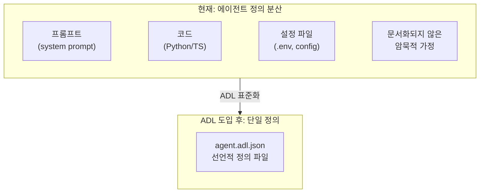
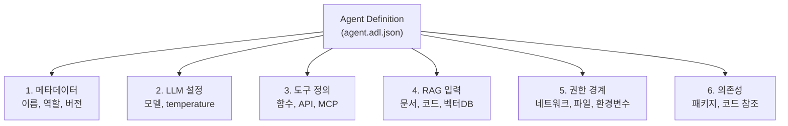
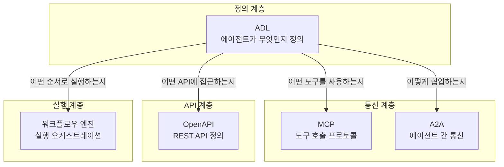
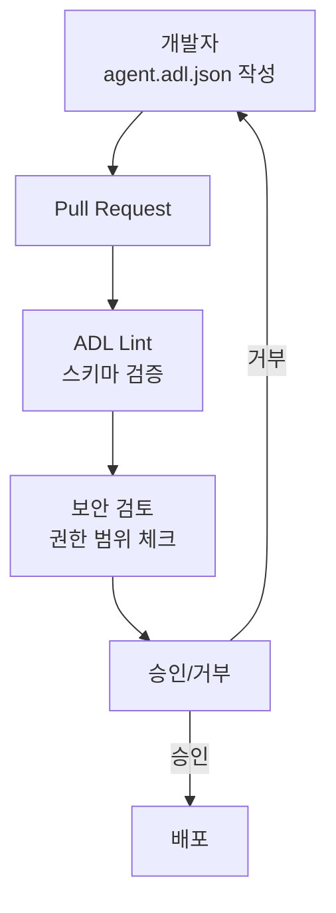
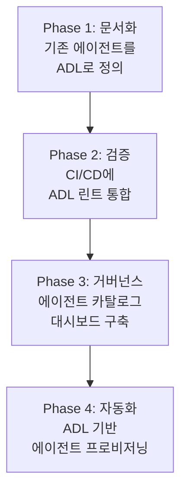

## 개요

2026년 AI 에이전트 생태계는 폭발적으로 성장하고 있지만, 한 가지 심각한 문제가 있습니다. <strong>에이전트의 정의가 코드, 프롬프트, 설정 파일에 흩어져 있어 "이 에이전트가 정확히 무엇을 할 수 있는지" 파악하기가 어렵다</strong>는 것입니다.

Next Moca가 Apache 2.0 라이선스로 공개한 <strong>Agent Definition Language(ADL)</strong>는 이 문제를 정면으로 해결합니다. API 세계에서 OpenAPI(Swagger)가 "API가 무엇을 하는지"를 선언적으로 정의했듯이, ADL은 "AI 에이전트가 무엇을 하는지"를 벤더 중립적으로 정의하는 표준 사양입니다.

이 글에서는 ADL의 핵심 구조, 기존 표준(MCP, OpenAPI, A2A)과의 관계, 그리고 Engineering Manager와 CTO가 주목해야 할 거버넌스 전략을 실무 관점에서 정리합니다.

## ADL이 해결하는 문제

현재 대부분의 조직에서 AI 에이전트는 다음과 같은 상태로 관리됩니다:



구체적으로 ADL이 해결하는 문제를 정리하면:

- <strong>가시성 부재</strong>: 에이전트가 어떤 도구에 접근하고 어떤 데이터를 사용하는지 한눈에 파악 불가
- <strong>거버넌스 공백</strong>: 보안팀이 에이전트의 권한 범위를 사전 심사할 수 없음
- <strong>재현성 부족</strong>: 에이전트 배포 시 "어떤 버전이 어떤 설정으로 배포되었는지" 추적 불가
- <strong>팀 간 커뮤니케이션 단절</strong>: 개발팀, 보안팀, 컴플라이언스팀이 같은 언어로 에이전트를 논의할 수 없음

## ADL의 핵심 구조

ADL 사양은 JSON Schema 기반으로, 에이전트를 6가지 모듈로 선언적으로 정의합니다:



### 1. 에이전트 메타데이터

```json
{
  "name": "code-review-agent",
  "displayName": "Code Review Assistant",
  "description": "PR에 대한 자동 코드 리뷰를 수행하는 에이전트",
  "role": "코드 품질 검사 및 개선 제안",
  "version": "2.1.0",
  "owner": "platform-team@company.com",
  "created": "2026-01-15T09:00:00Z",
  "modified": "2026-02-28T14:30:00Z"
}
```

시맨틱 버저닝과 소유자 정보를 통해 <strong>"누가 이 에이전트를 관리하고 어떤 버전이 운영 중인지"</strong>를 즉시 파악할 수 있습니다.

### 2. LLM 설정

```json
{
  "llm": {
    "provider": "anthropic",
    "model": "claude-opus-4-6",
    "parameters": {
      "temperature": 0.3,
      "maxTokens": 4096
    }
  }
}
```

LLM 프로바이더와 모델을 명시적으로 선언함으로써, 모델 교체 시 변경 이력을 추적하고 성능 회귀를 감지할 수 있습니다.

### 3. 도구(Tool) 정의

```json
{
  "tools": [
    {
      "name": "github_pr_review",
      "description": "GitHub PR의 변경사항을 가져와 리뷰 코멘트를 작성",
      "invocationType": "mcp",
      "category": "Code Review",
      "parameters": [
        {
          "name": "pr_url",
          "type": "string",
          "description": "리뷰할 PR의 URL",
          "required": true
        },
        {
          "name": "review_depth",
          "type": "string",
          "description": "리뷰 깊이 (quick|standard|deep)",
          "required": false
        }
      ],
      "returnType": "ReviewResult"
    }
  ]
}
```

각 도구의 호출 방식(Python 함수, HTTP, MCP 등)과 파라미터를 명시하여, 보안팀이 <strong>에이전트가 접근 가능한 외부 시스템의 전체 목록</strong>을 사전에 검토할 수 있습니다.

### 4. 권한 경계(Permissions)

```json
{
  "permissions": {
    "networkAccess": {
      "allowed": true,
      "domainWhitelist": [
        "api.github.com",
        "api.anthropic.com"
      ]
    },
    "fileAccess": {
      "readPaths": ["/workspace/src/**"],
      "writePaths": ["/workspace/reviews/**"]
    },
    "environmentVariables": {
      "exposed": ["GITHUB_TOKEN", "ANTHROPIC_API_KEY"]
    },
    "sandbox": {
      "enabled": true,
      "constraints": ["no-internet-except-whitelist"]
    }
  }
}
```

이것이 ADL의 가장 강력한 부분입니다. 네트워크 접근, 파일 시스템, 환경 변수 노출 범위를 <strong>코드가 아닌 선언적 사양으로 정의</strong>함으로써 CI/CD 파이프라인에서 자동 검증이 가능해집니다.

## ADL과 기존 표준의 관계

ADL은 기존 표준을 대체하는 것이 아니라, <strong>"정의 계층(Definition Layer)"</strong>으로서 보완합니다:



| 표준 | 역할 | ADL과의 관계 |
|------|------|-------------|
| <strong>OpenAPI</strong> | REST API 정의 | ADL이 참조하는 API 도구의 사양 |
| <strong>MCP</strong> | 도구 호출 프로토콜 | ADL이 "어떤 MCP 서버를 사용하는지" 선언 |
| <strong>A2A</strong> | 에이전트 간 통신 | ADL이 "어떤 에이전트와 협업하는지" 정의 |
| <strong>워크플로우 엔진</strong> | 실행 순서 관리 | ADL은 정적 정의만 담당, 런타임은 별도 |

핵심 차이점은 <strong>ADL은 런타임 프로토콜이 아니라 정적 사양</strong>이라는 것입니다. 에이전트의 "설계도"를 제공하며, 실제 실행은 MCP나 A2A 같은 런타임 프로토콜이 담당합니다.

## EM/CTO 관점: ADL 기반 거버넌스 전략

### 1. CI/CD 파이프라인에 ADL 검증 통합



ADL의 JSON Schema를 활용하면 에이전트 배포 전에 자동으로 다음을 검증할 수 있습니다:

- 네트워크 화이트리스트가 정책에 부합하는지
- 파일 접근 범위가 최소 권한 원칙을 준수하는지
- LLM 모델이 승인된 목록에 포함되어 있는지
- 필수 메타데이터(소유자, 버전)가 모두 기재되었는지

### 2. 에이전트 카탈로그 구축

조직 내 모든 에이전트의 ADL 정의를 중앙 저장소에서 관리하면, <strong>에이전트 카탈로그</strong>를 자동으로 구축할 수 있습니다:

```json
{
  "catalog": [
    {
      "name": "code-review-agent",
      "version": "2.1.0",
      "owner": "platform-team",
      "tools": ["github_pr_review", "jira_comment"],
      "llm": "claude-opus-4-6",
      "riskLevel": "medium"
    },
    {
      "name": "deployment-agent",
      "version": "1.0.3",
      "owner": "devops-team",
      "tools": ["kubectl_apply", "slack_notify"],
      "llm": "gpt-5.3-codex",
      "riskLevel": "high"
    }
  ]
}
```

이를 통해 CTO는 "현재 조직에서 운영 중인 에이전트가 몇 개이고, 각각 어떤 시스템에 접근 권한을 가지고 있는지"를 대시보드로 확인할 수 있습니다.

### 3. 변경 이력과 롤백

ADL 파일은 Git으로 버전 관리되므로:

- <strong>변경 이력</strong>: "이 에이전트의 권한이 언제 확장되었는지" diff로 확인
- <strong>롤백</strong>: 문제 발생 시 이전 버전의 ADL 정의로 즉시 복구
- <strong>감사 추적</strong>: 컴플라이언스 요구사항에 대한 증적 자료 확보

## 실전 적용 시나리오: 코드 리뷰 에이전트 정의

실제 조직에서 ADL로 코드 리뷰 에이전트를 정의하는 전체 예시입니다:

```json
{
  "name": "code-review-agent",
  "displayName": "코드 리뷰 에이전트",
  "description": "PR의 코드 품질, 보안 취약점, 성능 이슈를 자동 검출",
  "role": "senior-code-reviewer",
  "version": "2.1.0",
  "owner": "platform-team@company.com",
  "llm": {
    "provider": "anthropic",
    "model": "claude-opus-4-6",
    "parameters": {
      "temperature": 0.2,
      "maxTokens": 8192
    }
  },
  "tools": [
    {
      "name": "github_pr_diff",
      "invocationType": "mcp",
      "category": "Code Review",
      "parameters": [
        {"name": "pr_number", "type": "integer", "required": true}
      ]
    },
    {
      "name": "sonarqube_scan",
      "invocationType": "http",
      "category": "Code Quality",
      "parameters": [
        {"name": "project_key", "type": "string", "required": true}
      ]
    }
  ],
  "rag": [
    {
      "name": "coding-standards",
      "type": "documents",
      "location": "s3://company-docs/coding-standards/",
      "description": "사내 코딩 표준 문서"
    }
  ],
  "permissions": {
    "networkAccess": {
      "allowed": true,
      "domainWhitelist": [
        "api.github.com",
        "sonarqube.internal.company.com"
      ]
    },
    "fileAccess": {
      "readPaths": ["/workspace/**"],
      "writePaths": []
    },
    "sandbox": {"enabled": true}
  },
  "dependencies": {
    "packages": ["pygithub>=2.0", "requests>=2.31"]
  },
  "governance": {
    "created": "2026-01-15T09:00:00Z",
    "createdBy": "kim.jangwook@company.com",
    "modified": "2026-02-28T14:30:00Z",
    "modifiedBy": "kim.jangwook@company.com",
    "changeLog": "v2.1.0: SonarQube 연동 추가, 보안 스캔 범위 확장"
  }
}
```

## 도입 로드맵

ADL은 아직 초기 단계(Early-Stage Standard)이므로, 단계적 도입이 현실적입니다:



- <strong>Phase 1</strong> (1〜2주): 현재 운영 중인 에이전트를 ADL 형식으로 문서화
- <strong>Phase 2</strong> (2〜4주): JSON Schema 검증을 CI 파이프라인에 추가
- <strong>Phase 3</strong> (1〜2개월): 에이전트 카탈로그와 권한 대시보드 구축
- <strong>Phase 4</strong> (3〜6개월): ADL 정의에서 에이전트 스캐폴딩 자동 생성

## 결론

ADL은 AI 에이전트 개발에서 <strong>"코드와 분리된 선언적 정의"</strong>라는 중요한 계층을 추가합니다. OpenAPI가 REST API 생태계를 표준화했듯이, ADL은 에이전트 생태계의 가시성, 거버넌스, 재현성 문제를 해결할 잠재력을 가지고 있습니다.

특히 Engineering Manager와 CTO에게는:

- <strong>보안 거버넌스</strong>: 에이전트의 권한 범위를 코드 리뷰처럼 사전 심사 가능
- <strong>조직 가시성</strong>: 에이전트 카탈로그로 전사적 AI 자산 파악
- <strong>변경 관리</strong>: Git 기반 버전 관리로 감사 추적과 롤백 지원

아직 초기 단계이지만, Apache 2.0 라이선스의 오픈소스 표준이므로 지금부터 관심을 갖고 시범 도입을 검토하기에 좋은 시점입니다.

## 참고 자료

- [ADL GitHub Repository (Next Moca)](https://github.com/nextmoca/adl)
- [ADL 공식 블로그 — Next Moca](https://www.nextmoca.com/blogs/agent-definition-language-adl-the-open-source-standard-for-defining-ai-agents)
- [InfoQ — Next Moca Releases Agent Definition Language](https://www.infoq.com/news/2026/02/agent-definition-language/)
- [TechCrunch — Guide Labs Debuts Interpretable LLM](https://techcrunch.com/2026/02/23/guide-labs-debuts-a-new-kind-of-interpretable-llm/)
