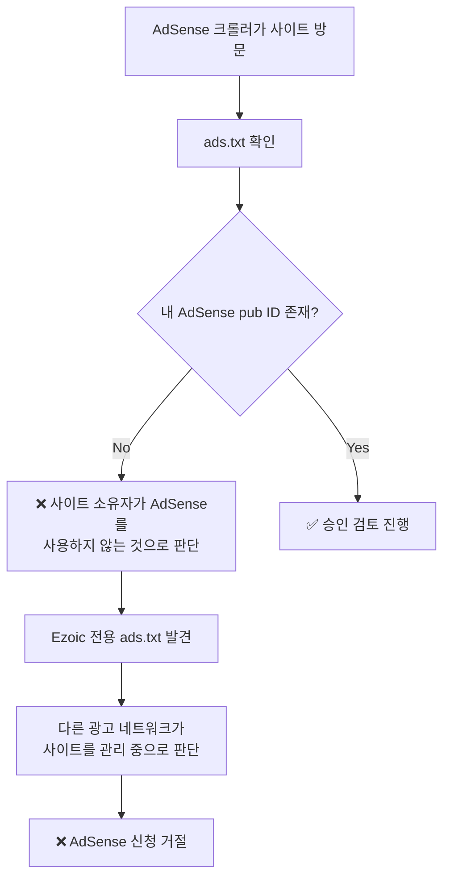
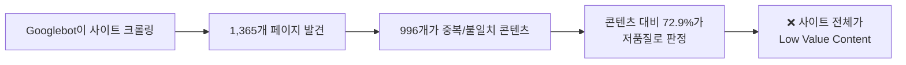
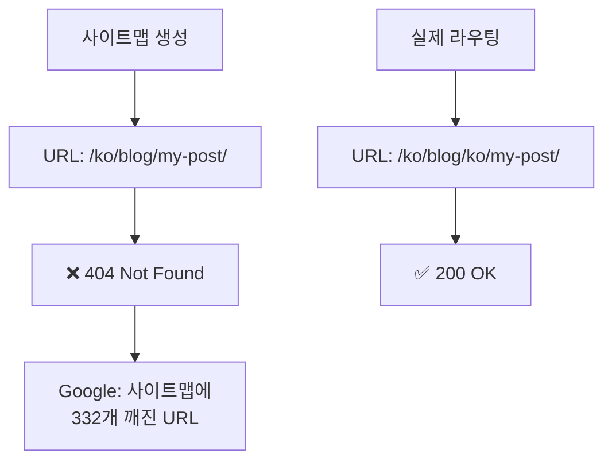
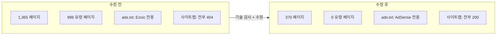

## 개요

Google AdSense에 여러 차례 신청했지만 **"가치가 별로 없는 콘텐츠(Low Value Content)"**라는 이유로 계속 거절당한 경험이 있으신가요? 저도 그랬습니다. 83개 포스트를 4개 국어(한국어·영어·일본어·중국어)로 운영하며 316개 이상의 기술 아티클을 보유한 블로그인데도 말이죠.

콘텐츠 양과 질의 문제가 아니었습니다. **사이트의 기술적 결함이 Google에게 "저품질 사이트"로 보이게 만들고 있었습니다.** 이 글에서는 실제로 발견하고 수정한 8가지 문제를 공유합니다. 같은 고민을 하고 있는 개발자분들께 실질적인 도움이 되기를 바랍니다.

## 배경: 왜 거절당했나

이 블로그는 [Astro](https://astro.build) 프레임워크 기반의 다국어 기술 블로그입니다.

- **콘텐츠**: 83개 포스트 × 4개 언어 = 316+ 기술 아티클
- **필수 페이지**: 개인정보처리방침, 이용약관, 연락처(Contact) 모두 구비
- **기술 스택**: Astro SSG, Cloudflare Pages, Content Collections

겉보기에는 AdSense 승인 조건을 충분히 갖추고 있었습니다. 그런데 수차례 신청할 때마다 돌아오는 답변은 항상 같았습니다:

> **"가치가 별로 없는 콘텐츠"** — 사이트에 유용한 콘텐츠가 충분하지 않습니다.

문제의 원인을 찾기 위해 사이트 전체를 기술적으로 감사(audit)한 결과, **콘텐츠 자체가 아닌 기술적 결함** 3가지가 핵심 원인이었고, 부가적으로 5가지 문제를 추가 발견했습니다.

## 핵심 문제 1: Ezoic ads.txt 충돌 (가장 직접적 원인)

### 발견 과정

라이브 사이트의 `ads.txt`를 직접 확인해보니, 제가 작성한 AdSense 엔트리가 없었습니다. 대신 80개 이상의 Ezoic 관리 광고 네트워크 엔트리만 존재했습니다.

```bash
# 라이브 사이트의 ads.txt 확인
curl https://jangwook.net/ads.txt | head -5
# → Ezoic 관리 엔트리만 80+개 표시
# → 내 AdSense pub ID는 존재하지 않음
```

### 원인 분석

GitHub Actions의 `deploy.yml`에 이런 코드가 있었습니다:

```yaml
# deploy.yml (문제의 코드)
- name: Build
  run: |
    # ... 빌드 명령 ...
    curl -L https://srv.adstxtmanager.com/19390/jangwook.net > public/ads.txt
```

빌드할 때마다 Ezoic의 `adstxtmanager`에서 `ads.txt`를 다운로드해 덮어쓰고 있었습니다. 로컬의 `public/ads.txt`에는 올바른 Google AdSense 엔트리가 있었지만, **배포 시 완전히 대체**되고 있었던 것입니다.

```
# 로컬 public/ads.txt (올바른 내용)
google.com, pub-7556938384772610, DIRECT, f08c47fec0942fa0

# 라이브 사이트 ads.txt (배포 후 - Ezoic이 덮어씀)
# → 80+개 광고 네트워크 엔트리
# → pub-7556938384772610 엔트리는 존재하지 않음!
```

**추가로**, `BaseHead.astro`에 Ezoic의 CMP(동의 관리 플랫폼) 및 광고 스크립트 3개가 모든 페이지에 로드되고 있었습니다:

```astro
<!-- BaseHead.astro (문제의 스크립트) -->
<script src="https://the.gatekeeperconsent.com/cmp.min.js" data-cfasync="false"></script>
<script src="https://cdn.ezoic.net/ezoicplugin.js"></script>
<script src="https://www.ezojs.com/ezoic/sa.min.js"></script>
```

### Google이 이것을 어떻게 보는가

Google AdSense 크롤러의 관점에서 이 상황을 정리하면:



AdSense는 사이트의 `ads.txt`에 자신의 pub ID가 없으면, **해당 사이트가 AdSense를 사용할 의사가 없거나 다른 서비스가 이미 관리 중**이라고 판단합니다.

### 해결 방법

1. `deploy.yml`에서 Ezoic `ads.txt` 다운로드 라인을 제거
2. `BaseHead.astro`에서 Ezoic 스크립트 3개를 모두 제거
3. `public/ads.txt`에 올바른 AdSense 엔트리만 유지

```yaml
# deploy.yml (수정 후)
- name: Build
  run: |
    npm run build
    # curl 라인 완전 삭제 — 로컬 public/ads.txt를 그대로 사용
```

```
# public/ads.txt (수정 후)
google.com, pub-7556938384772610, DIRECT, f08c47fec0942fa0
```

## 핵심 문제 2: URL 라우팅 결함으로 996개 유령 페이지

### 발견 과정

빌드 로그를 분석해보니, **1,365개의 페이지**가 생성되고 있었습니다. 83개 포스트 × 4개 언어 = 332개여야 하는데, 정적 페이지 수가 비정상적으로 많았습니다.

### 원인 분석

`[...slug].astro`의 `getStaticPaths` 함수에 문제가 있었습니다:

```typescript
// [...slug].astro (문제의 코드)
export async function getStaticPaths() {
  const posts = await getCollection("blog");
  const languages = ["ko", "en", "ja", "zh"];

  return languages.flatMap((lang) =>
    posts.map((post) => ({
      params: { slug: post.slug }, // post.slug = "ko/my-post-title"
      props: { post, lang },
    }))
  );
}
```

이 코드의 문제점은 **모든 포스트를 모든 언어 경로에 매핑**한다는 것입니다. `post.slug`에 이미 언어 접두사(`ko/`, `en/` 등)가 포함되어 있는데, 이를 4개 언어 각각의 경로에 넣으면서 **교차 언어 URL**이 대량으로 생성되었습니다.

```
# 정상적인 URL (332개)
/ko/blog/ko/my-post/     ← 한국어 경로에 한국어 콘텐츠 ✅
/en/blog/en/my-post/     ← 영어 경로에 영어 콘텐츠 ✅

# 유령 URL (996개) — 콘텐츠-언어 불일치
/en/blog/ko/my-post/     ← 영어 경로에 한국어 콘텐츠 ❌
/ja/blog/ko/my-post/     ← 일본어 경로에 한국어 콘텐츠 ❌
/zh/blog/en/my-post/     ← 중국어 경로에 영어 콘텐츠 ❌
# ... 996개의 이런 조합이 생성
```

### Google이 이것을 어떻게 보는가



Google은 사이트 전체의 콘텐츠 품질을 평가합니다. 전체 페이지의 **약 73%가 언어 불일치 중복 콘텐츠**라면, 사이트 전체가 "가치가 별로 없는 콘텐츠"로 판정되는 것은 당연합니다.

### 해결 방법

각 포스트를 해당 언어의 경로에만 매핑하도록 수정했습니다:

```typescript
// [...slug].astro (수정 후)
export async function getStaticPaths() {
  const posts = await getCollection("blog");

  return posts.map((post) => ({
    params: { slug: post.slug }, // "ko/my-post-title"을 해당 언어 경로에만 매핑
    props: { post },
  }));
}
```

**결과**: 빌드 페이지 수 **1,365 → 370** (995개 유령 페이지 제거)

## 핵심 문제 3: 사이트맵 전체 404

### 발견 과정

Google Search Console에서 사이트맵을 제출했지만, 인덱싱된 페이지가 극히 적었습니다. 사이트맵의 URL을 실제로 브라우저에서 열어보니 **모두 404**였습니다.

### 원인 분석

사이트맵 생성 로직과 실제 라우팅 간에 URL 형식이 불일치했습니다:

```
# 사이트맵이 생성하는 URL
https://jangwook.net/ko/blog/my-post-title/

# 실제 페이지 URL (이중 언어 접두사)
https://jangwook.net/ko/blog/ko/my-post-title/
```

사이트맵은 `/{lang}/blog/{slug}/` 형식으로 URL을 만들었지만, `slug`에 이미 `ko/` 같은 언어 접두사가 포함되어 있어서 실제 URL은 `/{lang}/blog/{lang}/{slug}/`였습니다. **사이트맵의 블로그 URL 332개 전부가 404**를 반환하고 있었습니다.



### 해결 방법

사이트맵 생성 로직에서 슬러그의 언어 접두사를 고려하도록 수정했습니다:

```typescript
// sitemap 설정 (수정 후)
// slug가 이미 "ko/my-post" 형태이므로 그대로 사용
const url = `/${lang}/blog/${post.slug}/`;
// → /ko/blog/ko/my-post/ (실제 경로와 일치)
```

## 부가 문제 4: 기계번역 구조 동일성

### 문제

83개 포스트의 **39%**(약 32개)가 4개 언어 버전에서 H2, H3 제목 수와 코드 블록 수가 완벽하게 동일했습니다. 이는 Google에게 **기계 번역으로 자동 생성된 콘텐츠**로 인식될 수 있습니다.

### 해결 방법

이 경우 콘텐츠 자체를 전부 다시 쓰는 것보다, Google에게 **"이것은 같은 콘텐츠의 공식 번역본"**이라고 명시적으로 알려주는 것이 효과적입니다.

```html
<!-- hreflang 올바르게 설정 -->
<link rel="alternate" hreflang="ko" href="https://jangwook.net/ko/blog/ko/my-post/" />
<link rel="alternate" hreflang="en" href="https://jangwook.net/en/blog/en/my-post/" />
<link rel="alternate" hreflang="ja" href="https://jangwook.net/ja/blog/ja/my-post/" />
<link rel="alternate" hreflang="zh" href="https://jangwook.net/zh/blog/zh/my-post/" />
<link rel="alternate" hreflang="x-default" href="https://jangwook.net/en/blog/en/my-post/" />
```

hreflang을 올바르게 설정하면 Google이 각 언어 페이지를 **독립적인 번역본으로 인식**하여 중복 콘텐츠 패널티를 피할 수 있습니다.

## 부가 문제 5: Contact 페이지 크롤러 접근 불가

### 문제

연락처 페이지가 Google Form의 `<iframe>`만으로 구성되어 있었습니다. 크롤러는 iframe 내부를 읽지 못하므로, 이 페이지는 **사실상 빈 페이지**였습니다.

```html
<!-- 기존 Contact 페이지 (크롤러에겐 빈 페이지) -->
<iframe
  src="https://docs.google.com/forms/d/e/..."
  width="100%"
  height="800"
></iframe>
```

### 해결 방법

크롤러가 읽을 수 있는 구조화된 콘텐츠를 추가했습니다:

```html
<!-- 수정 후 Contact 페이지 -->
<section>
  <h1>연락처</h1>
  <p>기술 블로그 운영자 김장욱입니다. 아래 방법으로 연락해주세요.</p>

  <h2>이메일</h2>
  <a href="mailto:contact@jangwook.net">contact@jangwook.net</a>

  <h2>소셜</h2>
  <ul>
    <li><a href="https://github.com/...">GitHub</a></li>
    <li><a href="https://twitter.com/...">Twitter</a></li>
  </ul>

  <h2>블로그 소개</h2>
  <p>AI 자동화, 웹 개발, DevOps에 관한 기술 콘텐츠를 공유합니다.</p>
</section>

<!-- Google Form은 하단에 유지 -->
<iframe src="https://docs.google.com/forms/d/e/..." width="100%" height="800"></iframe>
```

## 부가 문제 6: hreflang x-default 오류

### 문제

블로그 포스트의 `x-default`가 잘못된 URL을 가리키고 있었습니다. 영어를 기본 언어로 설정했지만, URL 변환 시 블로그 경로 내의 언어 코드를 변환하지 않아 **영어 URL에 한국어 콘텐츠**가 연결되었습니다.

```html
<!-- 잘못된 x-default -->
<link rel="alternate" hreflang="x-default"
  href="https://jangwook.net/en/blog/ko/my-post/" />
<!-- → 영어 경로이지만 한국어 콘텐츠를 가리킴 ❌ -->
```

### 해결 방법

hreflang 생성 로직에서 블로그 경로 내부의 언어 코드도 함께 변환하도록 수정했습니다:

```typescript
// hreflang URL 생성 (수정 후)
function getAlternateUrl(currentUrl: string, targetLang: string): string {
  // URL 경로의 언어 접두사 변환
  let url = currentUrl.replace(/^\/(ko|en|ja|zh)\//, `/${targetLang}/`);
  // 블로그 슬러그 내의 언어 접두사도 변환
  url = url.replace(/\/blog\/(ko|en|ja|zh)\//, `/blog/${targetLang}/`);
  return url;
}
```

## 부가 문제 7: 자기 참조적 메타 분석 포스트

### 문제

블로그 자체의 운영 리포트 6개(주간 분석, 월간 분석, AdSense 거절 분석 등)가 존재했습니다. 이런 포스트는 **블로그 자기 자신에 대한 분석**이므로, 외부 방문자에게는 가치가 없는 "자기 참조적 저가치 콘텐츠"로 분류될 수 있습니다.

### 해결 방법

이런 포스트에 `noindex` 메타 태그를 적용하여 검색 엔진 인덱싱에서 제외했습니다:

```html
<!-- 메타 분석 포스트에 noindex 적용 -->
<meta name="robots" content="noindex, follow" />
```

이렇게 하면 Google이 이 페이지들을 인덱싱하지 않으므로, 사이트 전체의 콘텐츠 품질 평가에서 제외됩니다. 내부 링크의 `follow`는 유지하여 크롤링 자체는 허용합니다.

## 부가 문제 8: 기타 기술적 수정

나머지 발견한 문제들과 해결 방법을 정리합니다.

### 8-1. 커스텀 404 페이지 미존재

기본 404 페이지가 없어서 사용자가 잘못된 URL에 접근했을 때 빈 페이지나 서버 기본 에러가 표시되었습니다.

```astro
---
// src/pages/404.astro — 다국어 404 페이지 생성
const lang = Astro.currentLocale || "en";
const messages = {
  ko: { title: "페이지를 찾을 수 없습니다", back: "홈으로 돌아가기" },
  en: { title: "Page Not Found", back: "Go back home" },
  ja: { title: "ページが見つかりません", back: "ホームに戻る" },
  zh: { title: "页面未找到", back: "返回首页" },
};
---
<h1>{messages[lang].title}</h1>
<a href={`/${lang}/`}>{messages[lang].back}</a>
```

### 8-2. og:type 미분기

모든 페이지에서 `og:type`이 `"website"`으로 설정되어 있었습니다. 블로그 포스트는 `"article"`이어야 합니다.

```astro
<!-- 수정 후 -->
<meta property="og:type" content={isPost ? "article" : "website"} />
```

### 8-3. sitemap 링크 불일치

`robots.txt`에서 참조하는 사이트맵 파일명이 실제 파일명과 달랐습니다.

```
# robots.txt (수정 전)
Sitemap: https://jangwook.net/sitemap-index.xml

# 실제 파일
/sitemap.xml ← 이 파일이 존재

# robots.txt (수정 후)
Sitemap: https://jangwook.net/sitemap.xml
```

### 8-4. 중국어 RSS hreflang 누락

한국어, 영어, 일본어 RSS 피드에는 hreflang이 올바르게 설정되어 있었지만, 중국어(zh)만 누락되어 있었습니다.

### 8-5. robots.txt에 교차 언어 URL 차단 규칙 추가

유령 페이지가 수정되기 전에 이미 인덱싱된 교차 언어 URL이 있을 수 있으므로, `robots.txt`에 차단 규칙을 추가했습니다:

```
# robots.txt에 추가
Disallow: /en/blog/ko/
Disallow: /en/blog/ja/
Disallow: /en/blog/zh/
Disallow: /ko/blog/en/
Disallow: /ko/blog/ja/
Disallow: /ko/blog/zh/
Disallow: /ja/blog/ko/
Disallow: /ja/blog/en/
Disallow: /ja/blog/zh/
Disallow: /zh/blog/ko/
Disallow: /zh/blog/en/
Disallow: /zh/blog/ja/
```

## 해결 전후 비교


모든 수정 사항을 적용한 후의 결과입니다:

| 항목 | 수정 전 | 수정 후 |
|------|---------|---------|
| 빌드 페이지 수 | 1,365개 | 370개 |
| 유령 페이지 | 996개 | 0개 |
| ads.txt 상태 | Ezoic 80+개 엔트리 | AdSense 1개 엔트리 |
| 사이트맵 404 URL | 332개 | 0개 |
| hreflang x-default 오류 | 전체 포스트 | 0개 |
| 자기 참조 포스트 인덱싱 | 6개 | noindex 적용 |
| 저품질 콘텐츠 비율 | ~73% | ~0% |



## 다국어 블로그 운영자를 위한 체크리스트

이 경험을 바탕으로, AdSense 신청 전에 확인해야 할 기술적 체크리스트를 정리했습니다:

### ads.txt 관련
- [ ] 라이브 사이트의 `ads.txt`를 직접 확인했는가?
- [ ] CI/CD 파이프라인에서 `ads.txt`를 덮어쓰는 스크립트가 없는가?
- [ ] 이전에 사용한 광고 서비스의 스크립트가 남아있지 않은가?

### URL 및 라우팅 관련
- [ ] 빌드된 페이지 수가 예상과 일치하는가?
- [ ] 교차 언어 URL(예: `/en/blog/ko/...`)이 생성되지 않는가?
- [ ] 사이트맵의 모든 URL이 200 OK를 반환하는가?

### hreflang 관련
- [ ] 모든 페이지에 올바른 hreflang이 설정되어 있는가?
- [ ] `x-default`가 올바른 언어 페이지를 가리키는가?
- [ ] 블로그 경로 내의 언어 코드도 올바르게 변환되는가?

### 콘텐츠 품질 관련
- [ ] 자기 참조적 콘텐츠(운영 리포트 등)에 noindex가 적용되어 있는가?
- [ ] `og:type`이 포스트에서는 `"article"`로 설정되어 있는가?
- [ ] Contact 페이지에 크롤러가 읽을 수 있는 텍스트 콘텐츠가 있는가?
- [ ] 커스텀 404 페이지가 존재하는가?

## 결론

AdSense "가치가 별로 없는 콘텐츠" 거절은 **콘텐츠의 문제가 아니라 기술적 결함인 경우**가 많습니다. 특히 다국어 사이트에서는 URL 라우팅, 사이트맵, hreflang 설정의 복잡도가 높아 이런 문제가 발생하기 쉽습니다.

핵심 교훈을 정리하면:

1. **ads.txt는 반드시 라이브 사이트에서 직접 확인하세요.** CI/CD 파이프라인에서 덮어쓰기가 발생할 수 있습니다.
2. **빌드 페이지 수를 정기적으로 모니터링하세요.** 예상보다 많으면 유령 페이지가 생성되고 있을 수 있습니다.
3. **사이트맵의 URL을 실제로 접속해보세요.** 사이트맵과 라우팅 간의 불일치는 흔한 문제입니다.
4. **Google의 관점에서 사이트를 바라보세요.** 개발자에게는 당연한 것도 크롤러에게는 다르게 보일 수 있습니다.

이 글이 같은 문제로 고민하고 있는 개발자분들께 도움이 되기를 바랍니다.

## 참고 자료

- [Google AdSense 프로그램 정책](https://support.google.com/adsense/answer/48182)
- [ads.txt 공식 사양](https://iabtechlab.com/ads-txt/)
- [Google 다국어 사이트 관리 가이드](https://developers.google.com/search/docs/specialty/international)
- [hreflang 구현 가이드](https://developers.google.com/search/docs/specialty/international/localized-versions)
- [Astro 다국어(i18n) 문서](https://docs.astro.build/en/guides/internationalization/)
