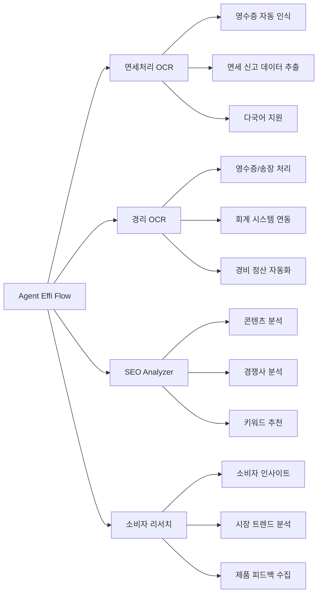
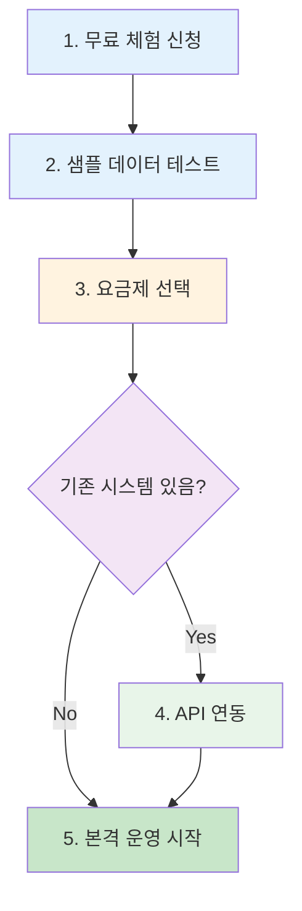
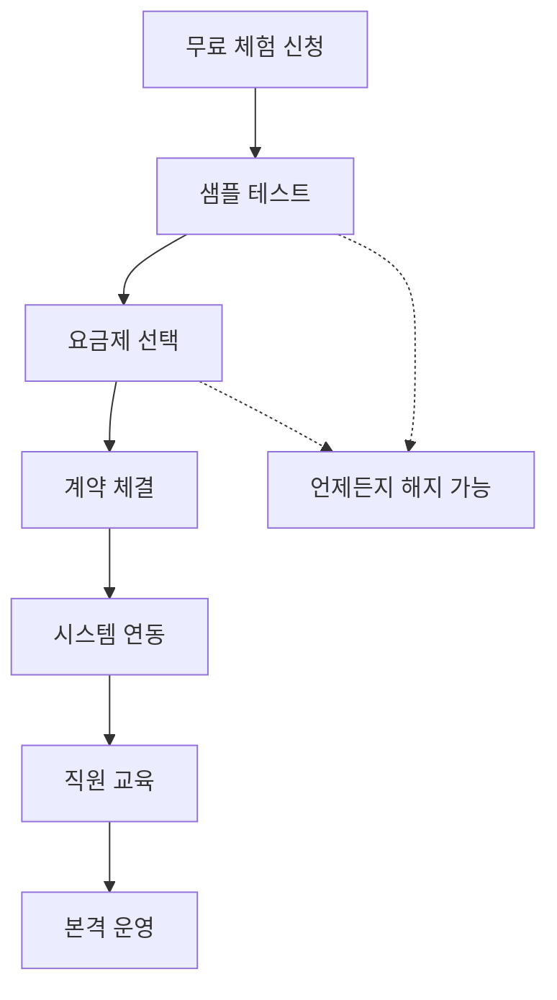
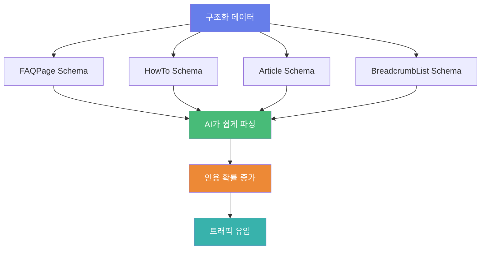

## 개요

### AEO(Answer Engine Optimization)란?

<strong>AEO(Answer Engine Optimization)</strong>는 ChatGPT, Perplexity, Google AI Overview와 같은 AI 검색 엔진에서 콘텐츠가 답변으로 인용되도록 최적화하는 전략입니다. 기존 SEO가 검색 결과 페이지의 상위 노출을 목표로 했다면, AEO는 AI가 직접 답변을 제공할 때 우리의 콘텐츠를 참조하도록 만드는 것이 핵심입니다.

<strong>SEO vs AEO 비교</strong>:

| 항목          | SEO                 | AEO               |
| ------------- | ------------------- | ----------------- |
| 목표          | 검색 결과 상위 노출 | AI 답변에 인용    |
| 최적화 대상   | 검색 엔진 알고리즘  | AI 언어 모델      |
| 콘텐츠 형식   | 키워드 중심         | 질문-답변 중심    |
| 구조화 데이터 | 권장 사항           | 필수 요소         |
| 측정 지표     | 클릭률, 순위        | 인용 횟수, 신뢰도 |

### AI 검색 엔진의 부상

2024년 현재, 검색 환경은 급격하게 변화하고 있습니다:

- <strong>Google 검색의 60%가 제로클릭</strong>: 사용자가 검색 결과 페이지를 벗어나지 않고 답변을 얻음
- <strong>ChatGPT의 일일 활성 사용자 1억 명 돌파</strong> (2024년 11월)
- <strong>Perplexity의 월간 검색 쿼리 3억 건 이상</strong> (2024년 9월)
- <strong>Google AI Overview가 전체 검색의 15%에 표시</strong> (미국 기준)

이러한 변화는 B2B SaaS 서비스에게 큰 도전이자 기회입니다. 잠재 고객이 "면세처리 OCR 추천", "경리 자동화 도구"와 같은 질문을 AI에게 할 때, 우리 서비스가 답변에 포함되지 않는다면 사실상 존재하지 않는 것과 같습니다.

### 왜 지금 AEO가 중요한가?

<strong>선점 효과</strong>: 아직 많은 기업이 AEO의 중요성을 인식하지 못하고 있습니다. 지금 시작하면 경쟁 우위를 확보할 수 있습니다.

<strong>트래픽 품질</strong>: AI 검색을 통해 유입되는 사용자는 명확한 의도를 가지고 있어 전환율이 높습니다.

<strong>브랜드 신뢰도</strong>: AI가 인용하는 출처로 선택된다는 것은 콘텐츠의 신뢰성을 공식적으로 인정받는 것입니다.

## Agent Effi Flow 서비스 소개

### 서비스 개요

[Agent Effi Flow](https://agent-effi-flow.jangwook.net)는 AI 기반 업무 효율화 플랫폼으로, 다음과 같은 서비스를 제공합니다:



### B2B SaaS 서비스로서 AEO가 필요한 이유

<strong>복잡한 의사결정 프로세스</strong>: B2B 구매자는 솔루션 도입 전에 철저한 리서치를 진행합니다. 이 과정에서 AI 검색 엔진을 활용하는 비율이 급증하고 있습니다.

<strong>전문성 입증 필요</strong>: AI가 우리 콘텐츠를 인용한다는 것은 업계 전문가로 인정받는다는 의미입니다.

<strong>긴 구매 여정</strong>: 잠재 고객이 여러 번 검색하고 비교하는 과정에서 반복적으로 노출될 수 있습니다.

## 구현한 AEO 요소들

### FAQ 페이지 구축 (/faq)

Agent Effi Flow의 FAQ 페이지는 AEO의 핵심 요소를 모두 포함하고 있습니다.

<strong>5개 카테고리 구성</strong>:

1. <strong>일반</strong>: 서비스 개요, 주요 기능, 타 서비스와의 차이점
2. <strong>요금</strong>: 요금제, 무료 체험, 결제 방법
3. <strong>계정/보안</strong>: 계정 관리, 데이터 보안, 개인정보 보호
4. <strong>면세처리 OCR</strong>: 기능 상세, 지원 언어, 정확도
5. <strong>경리 OCR</strong>: 회계 시스템 연동, 영수증 포맷, 자동화 범위

<strong>FAQPage Schema 구현</strong>:

```typescript
// src/lib/components/StructuredData.svelte
export interface FAQStructuredData {
  "@context": "https://schema.org";
  "@type": "FAQPage";
  mainEntity: Array<{
    "@type": "Question";
    name: string;
    acceptedAnswer: {
      "@type": "Answer";
      text: string;
    };
  }>;
}

// 사용 예시
const faqSchema: FAQStructuredData = {
  "@context": "https://schema.org",
  "@type": "FAQPage",
  mainEntity: [
    {
      "@type": "Question",
      name: "Agent Effi Flow는 무엇인가요?",
      acceptedAnswer: {
        "@type": "Answer",
        text: "Agent Effi Flow는 AI 기반 업무 효율화 플랫폼으로, 면세처리 OCR, 경리 OCR, SEO 분석, 소비자 리서치 등의 서비스를 제공합니다.",
      },
    },
    {
      "@type": "Question",
      name: "면세처리 OCR의 정확도는 어느 정도인가요?",
      acceptedAnswer: {
        "@type": "Answer",
        text: "면세처리 OCR의 정확도는 평균 95% 이상입니다. AI 모델이 지속적으로 학습하여 정확도가 향상됩니다.",
      },
    },
  ],
};
```

<strong>아코디언 UI 구현</strong>:

Svelte 5의 `$state()`를 활용하여 사용자 친화적인 아코디언 인터페이스를 구현했습니다:

```typescript
// src/routes/faq/+page.svelte
<script lang="ts">
  import { faqData } from '$lib/data/faq';

  let openCategory = $state<string>('general');
  let openQuestion = $state<string | null>(null);

  function toggleCategory(category: string) {
    openCategory = openCategory === category ? '' : category;
    openQuestion = null;
  }

  function toggleQuestion(questionId: string) {
    openQuestion = openQuestion === questionId ? null : questionId;
  }
</script>

<div class="faq-container">
  {#each Object.entries(faqData) as [category, data]}
    <div class="category">
      <button
        class="category-header"
        onclick={() => toggleCategory(category)}
        aria-expanded={openCategory === category}
      >
        <h2>{data.title}</h2>
        <span class="icon">{openCategory === category ? '−' : '+'}</span>
      </button>

      {#if openCategory === category}
        <div class="questions">
          {#each data.questions as question}
            <div class="question-item">
              <button
                class="question-header"
                onclick={() => toggleQuestion(question.id)}
                aria-expanded={openQuestion === question.id}
              >
                <h3>{question.question}</h3>
                <span class="icon">{openQuestion === question.id ? '▲' : '▼'}</span>
              </button>

              {#if openQuestion === question.id}
                <div class="answer">
                  {@html question.answer}
                </div>
              {/if}
            </div>
          {/each}
        </div>
      {/if}
    </div>
  {/each}
</div>
```

<strong>AEO 최적화 서머리 박스</strong>:

각 FAQ 카테고리 상단에 핵심 정보를 요약한 박스를 배치했습니다:

```html
<div class="aeo-summary">
  <h3>📌 핵심 요약</h3>
  <ul>
    <li><strong>면세처리 OCR</strong>: 영수증 입력 작업을 90% 단축</li>
    <li><strong>정확도</strong>: AI-OCR 평균 95% 이상</li>
    <li><strong>지원 언어</strong>: 일본어, 영어, 중국어, 한국어</li>
    <li><strong>요금</strong>: 건당 50엔〜, 회원가입 시 50 무료 크레딧 제공</li>
  </ul>
</div>
```

이 서머리 박스는 AI 검색 엔진이 빠르게 핵심 정보를 추출할 수 있도록 돕습니다.

### 사용 사례 페이지 구축

실제 사용 사례는 E-E-A-T(경험-전문성-권위성-신뢰성)의 "경험" 요소를 강화하는 핵심 콘텐츠입니다.

#### 면세처리 OCR 사용 사례 (/use-cases/receipt-ocr-tax-refund)

<strong>1. 면세처리 대행사업자: 연간 540만엔 비용 절감</strong>

【포인트】AI-OCR 도입으로 수작업 입력 시간을 90% 단축하여 인건비를 대폭 절감했습니다.

【이유】기존에는 1건당 2〜5분이 걸리던 영수증 입력 작업이 AI-OCR로 약 30초로 단축되었습니다.

【구체예】

- <strong>도입 전</strong>: 직원 3명이 하루 8시간 근무, 월 1,500건 처리
- <strong>도입 후</strong>: 직원 1명이 하루 2시간 근무, 월 2,000건 처리
- <strong>절감 효과</strong>: 연간 인건비 540만엔 절감 (직원 2명분)

【결론】인바운드 수요 증가에 대응하면서 비용은 오히려 절감하는 일석이조의 효과를 거두었습니다.

<strong>2. 공항/상업시설 면세 카운터: 대기시간 75% 단축</strong>

【포인트】영수증 처리 속도 향상으로 고객 대기시간을 획기적으로 단축했습니다.

【이유】AI-OCR이 영수증 정보를 즉시 인식하여 시스템에 자동 입력합니다.

【구체예】

- <strong>도입 전</strong>: 1건당 평균 8분 소요 (수작업 입력 + 확인)
- <strong>도입 후</strong>: 1건당 평균 2분 소요 (자동 입력 + 최종 확인만)
- <strong>개선 효과</strong>: 시간당 처리 건수가 7.5건에서 30건으로 4배 증가

【결론】성수기에도 대기 줄이 길어지지 않아 고객 만족도가 크게 향상되었습니다.

<strong>3. 다점포 면세점: 교육비용 80% 절감</strong>

【포인트】복잡한 면세처리 절차를 AI가 자동화하여 신규 직원 교육이 간소화되었습니다.

【이유】AI-OCR이 영수증 정보를 자동으로 분류하고 입력하므로, 직원은 최종 확인만 하면 됩니다.

【구체예】

- <strong>도입 전</strong>: 신규 직원 교육에 2주 소요 (면세처리 절차 + 시스템 입력)
- <strong>도입 후</strong>: 신규 직원 교육에 3일 소요 (최종 확인 방법만)
- <strong>절감 효과</strong>: 교육 기간 80% 단축, 교육 담당자 부담 대폭 감소

【결론】매장 확장 시 인력 배치가 유연해지고, 전체 운영 효율이 향상되었습니다.

#### 경리 OCR 사용 사례 (/use-cases/accounting-ocr)

<strong>1. 중소기업 경리담당자: 처리시간 90% 절감</strong>

【포인트】영수증과 송장의 수작업 입력이 거의 사라져 경리 업무 시간이 획기적으로 단축되었습니다.

【이유】AI-OCR이 영수증, 송장, 명세서를 자동으로 인식하여 회계 시스템에 입력합니다.

【구체예】

- <strong>도입 전</strong>: 월말 결산 준비에 3일 소요 (영수증 100건 수작업 입력)
- <strong>도입 후</strong>: 월말 결산 준비에 반나절 소요 (자동 입력 후 확인만)
- <strong>절감 효과</strong>: 월 2.5일의 시간 절약, 연간 30일분의 업무 시간 확보

【결론】단순 입력 작업에서 해방되어 재무 분석과 같은 고부가가치 업무에 집중할 수 있게 되었습니다.

<strong>2. 회계사무소: 월말결산 50% 단축</strong>

【포인트】고객사의 영수증 데이터 정리 시간이 반으로 줄어 월말결산이 빨라졌습니다.

【이유】고객사에서 영수증을 촬영하여 전송하면 AI-OCR이 자동으로 데이터화합니다.

【구체예】

- <strong>도입 전</strong>: 고객사 5곳의 월말결산에 10일 소요
- <strong>도입 후</strong>: 고객사 5곳의 월말결산에 5일 소요
- <strong>확장 효과</strong>: 절약된 시간으로 신규 고객 2곳 추가 수임

【결론】업무 효율이 향상되어 매출 증대와 직원 만족도 향상을 동시에 달성했습니다.

<strong>3. 경비정산 시스템 개발사: 개발비용 83% 절감</strong>

【포인트】OCR 엔진을 직접 개발하지 않고 API로 연동하여 개발 비용과 기간을 대폭 단축했습니다.

【이유】Agent Effi Flow의 경리 OCR API는 이미 높은 정확도로 학습된 모델을 제공합니다.

【구체예】

- <strong>자체 개발 시</strong>: 엔지니어 3명 × 6개월 = 1,800만엔 예상
- <strong>API 연동 시</strong>: 엔지니어 1명 × 1개월 = 300만엔 실제
- <strong>절감 효과</strong>: 개발비 1,500만엔 절감 (83% 감소)

【결론】핵심 비즈니스 로직 개발에 집중하여 시장 출시 시기를 5개월 앞당겼습니다.

### 구조화 데이터 구현

AEO의 핵심은 AI가 쉽게 이해할 수 있는 형식으로 정보를 제공하는 것입니다. 이를 위해 다음과 같은 Schema.org 마크업을 구현했습니다.

#### FAQPage Schema

```typescript
// src/lib/types/structured-data.ts
export interface FAQPageSchema {
  '@context': 'https://schema.org';
  '@type': 'FAQPage';
  mainEntity: QuestionSchema[];
}

export interface QuestionSchema {
  '@type': 'Question';
  name: string;
  acceptedAnswer: {
    '@type': 'Answer';
    text: string;
  };
}

// src/lib/components/StructuredData.svelte
<script lang="ts">
  import type { FAQPageSchema } from '$lib/types/structured-data';

  export let schema: FAQPageSchema;
</script>

<svelte:head>
  {@html `<script type="application/ld+json">${JSON.stringify(schema)}</script>`}
</svelte:head>
```

#### HowTo Schema: 도입 절차

Agent Effi Flow의 도입 절차를 5단계로 명확하게 구조화했습니다:

```typescript
// src/routes/how-to-start/+page.svelte
const howToSchema = {
  "@context": "https://schema.org",
  "@type": "HowTo",
  name: "Agent Effi Flow 도입 절차",
  description:
    "AI 기반 업무 효율화 플랫폼 Agent Effi Flow를 도입하는 5단계 가이드",
  totalTime: "P7D", // 7일
  step: [
    {
      "@type": "HowToStep",
      position: 1,
      name: "무료 체험 신청",
      text: "공식 웹사이트에서 회원가입하면 50 무료 크레딧을 즉시 제공받습니다. 이메일 주소만으로 시작 가능합니다.",
      url: "https://agent-effi-flow.jangwook.net/trial",
    },
    {
      "@type": "HowToStep",
      position: 2,
      name: "샘플 데이터로 테스트",
      text: "면세처리 OCR 또는 경리 OCR에 샘플 영수증을 업로드하여 기능을 체험합니다.",
      url: "https://agent-effi-flow.jangwook.net/demo",
    },
    {
      "@type": "HowToStep",
      position: 3,
      name: "요금제 선택",
      text: "업무량에 맞는 요금제를 선택합니다. 종량제와 정액제 중 선택 가능합니다.",
      url: "https://agent-effi-flow.jangwook.net/pricing",
    },
    {
      "@type": "HowToStep",
      position: 4,
      name: "API 연동 (옵션)",
      text: "기존 시스템과 연동이 필요한 경우, API 문서를 참고하여 연동합니다.",
      url: "https://agent-effi-flow.jangwook.net/docs/api",
    },
    {
      "@type": "HowToStep",
      position: 5,
      name: "본격 운영 시작",
      text: "직원 교육을 완료하고 실제 업무에 적용합니다. 지속적인 기술 지원이 제공됩니다.",
      url: "https://agent-effi-flow.jangwook.net/support",
    },
  ],
};
```



#### Article Schema: 콘텐츠 신뢰성

사용 사례 페이지에 Article Schema를 추가하여 콘텐츠의 신뢰성을 높였습니다:

```typescript
const articleSchema = {
  "@context": "https://schema.org",
  "@type": "Article",
  headline: "면세처리 OCR 사용 사례: 연간 540만엔 비용 절감",
  description:
    "면세처리 대행사업자가 AI-OCR 도입으로 인건비를 90% 절감한 실제 사례",
  author: {
    "@type": "Organization",
    name: "Agent Effi Flow",
    url: "https://agent-effi-flow.jangwook.net",
  },
  publisher: {
    "@type": "Organization",
    name: "Agent Effi Flow",
    logo: {
      "@type": "ImageObject",
      url: "https://agent-effi-flow.jangwook.net/logo.png",
    },
  },
  datePublished: "2025-12-01",
  dateModified: "2025-12-04",
};
```

#### BreadcrumbList Schema: 사이트 구조

사이트의 계층 구조를 명확하게 전달하기 위해 BreadcrumbList Schema를 구현했습니다:

```typescript
const breadcrumbSchema = {
  "@context": "https://schema.org",
  "@type": "BreadcrumbList",
  itemListElement: [
    {
      "@type": "ListItem",
      position: 1,
      name: "홈",
      item: "https://agent-effi-flow.jangwook.net",
    },
    {
      "@type": "ListItem",
      position: 2,
      name: "사용 사례",
      item: "https://agent-effi-flow.jangwook.net/use-cases",
    },
    {
      "@type": "ListItem",
      position: 3,
      name: "면세처리 OCR",
      item: "https://agent-effi-flow.jangwook.net/use-cases/receipt-ocr-tax-refund",
    },
  ],
};
```

## AEO 최적화 핵심 전략

### PREP 구조 (Point-Reason-Example-Point)

AI 검색 엔진이 가장 선호하는 콘텐츠 구조는 <strong>PREP 형식</strong>입니다. 이는 논리적이고 간결하며 명확한 답변을 제공하기 때문입니다.

<strong>PREP 구조의 4요소</strong>:

1. <strong>Point (포인트)</strong>: 핵심 메시지를 한 문장으로
2. <strong>Reason (이유)</strong>: 왜 그런지 설명
3. <strong>Example (구체예)</strong>: 실제 사례나 데이터 제시
4. <strong>Point (결론)</strong>: 핵심 메시지 재강조

<strong>실제 적용 예시</strong>:

```
【포인트】면세처리 OCR은 입력 작업을 최대 90% 줄입니다.

【이유】AI-OCR로 1장당 2〜5분의 수작업이 약 30초로 단축됩니다.

【구체예】하루 100건 처리 시:
• 수작업: 3〜8시간 소요
• AI-OCR: 50분 소요
• 절감 시간: 하루 2〜7시간

【결론】인바운드 수요 증가에 대응하여 면세처리 효율화를 실현합니다.
```

<strong>PREP 구조의 장점</strong>:

- AI가 핵심 정보를 빠르게 추출 가능
- 사용자가 스캔하기 쉬운 형식
- 검색 의도에 직접적으로 대응
- 인용하기 좋은 구조 (출처 명시 용이)

### 질문 형식 콘텐츠

사용자의 자연스러운 검색 쿼리에 대응하기 위해 콘텐츠를 질문 형식으로 구성했습니다.

<strong>효과적인 질문 형식</strong>:

| 질문 유형 | 예시                           | AEO 효과                       |
| --------- | ------------------------------ | ------------------------------ |
| 정의      | "〇〇란 무엇인가요?"           | 기본 정보 제공, 높은 인용 확률 |
| 이유      | "왜 〇〇를 사용하나요?"        | 가치 제안 명확화               |
| 방법      | "〇〇를 어떻게 사용하나요?"    | HowTo Schema 연계              |
| 비교      | "〇〇와 △△의 차이는?"          | 경쟁 우위 표현                 |
| 선택      | "어떤 〇〇를 선택해야 하나요?" | 의사결정 지원                  |

<strong>Agent Effi Flow FAQ 실제 질문</strong>:

```
✓ "Agent Effi Flow는 무엇인가요?"
✓ "면세처리 OCR의 정확도는 어느 정도인가요?"
✓ "어떤 회계 시스템과 연동 가능한가요?"
✓ "무료 체험은 어떻게 신청하나요?"
✓ "데이터 보안은 어떻게 보장되나요?"
```

<strong>질문 형식 콘텐츠 작성 팁</strong>:

1. <strong>롱테일 키워드 활용</strong>: "면세처리 OCR 추천" → "일본에서 면세처리 OCR을 도입할 때 주의할 점은?"
2. <strong>음성 검색 고려</strong>: "면세처리 자동화 방법" → "면세처리를 자동화하려면 어떻게 해야 하나요?"
3. <strong>의도별 질문 준비</strong>:
   - 정보 수집 단계: "〇〇란?", "〇〇의 장점은?"
   - 비교 검토 단계: "〇〇와 △△ 중 어느 것?", "〇〇의 요금은?"
   - 구매 결정 단계: "〇〇 도입 절차", "〇〇 지원 방법"

### E-E-A-T 요소 강화

Google이 제시한 <strong>E-E-A-T (Experience, Expertise, Authoritativeness, Trustworthiness)</strong>는 AEO에서도 핵심 평가 기준입니다.

#### Experience (경험)

<strong>실제 도입 효과 명시</strong>:

```
❌ "면세처리 효율이 향상됩니다"
✓ "면세처리 대행사업자 A사는 AI-OCR 도입 후 연간 540만엔을 절감했습니다"
```

<strong>구체적 수치 제공</strong>:

- 도입 전 vs 도입 후 비교
- 절감 시간, 절감 비용, 정확도 향상률
- 고객 만족도, ROI 등

#### Expertise (전문성)

<strong>업계 통계 인용</strong>:

```
"일본상공회의소 조사에 따르면 중소기업의 67%가 경리 업무 부담을 느끼고 있습니다."
```

<strong>기술적 상세 정보</strong>:

- AI 모델 정확도: 95% 이상
- 처리 속도: 1건당 30초
- 지원 언어: 일본어, 영어, 중국어, 한국어
- API 응답 시간: 평균 2초 이하

#### Authoritativeness (권위성)

<strong>출처 명시</strong>:

```
• 일본상공회의소 (2024년 중소기업 실태 조사)
• Sansan株式会社 (2023년 경리 업무 디지털화 조사)
• 관광청 (2024년 인바운드 통계)
```

<strong>공식 인증/파트너십</strong>:

- ISO 27001 (정보 보안) 취득 여부
- 클라우드 서비스 인증
- 주요 회계 소프트웨어와의 공식 연동

#### Trustworthiness (신뢰성)

<strong>요금 투명성</strong>:

| 요금제       | 월액      | 처리 건수 | 건당 단가 |
| ------------ | --------- | --------- | --------- |
| 스타터       | 10,000엔  | 200건     | 50엔      |
| 비즈니스     | 30,000엔  | 1,000건   | 30엔      |
| 엔터프라이즈 | 100,000엔 | 5,000건   | 20엔      |

<strong>도입 절차 명확화</strong>:



<strong>개인정보 보호</strong>:

- SSL/TLS 암호화 통신
- 데이터 센터 위치 명시 (일본 국내)
- 정기적인 보안 감사
- GDPR, 개인정보보호법 준수

## 기술적 구현 상세

### Svelte 5 + SvelteKit 구현

Agent Effi Flow는 <strong>Svelte 5</strong>와 <strong>SvelteKit</strong>으로 구축되어 있습니다. 이를 통해 빠른 페이지 로딩과 뛰어난 SEO 성능을 동시에 달성했습니다.

#### SEO.svelte: 메타태그, OGP, Twitter Card

```typescript
// src/lib/components/SEO.svelte
<script lang="ts">
  export let title: string;
  export let description: string;
  export let ogImage: string = '/og-image.png';
  export let canonicalUrl: string;

  const siteName = 'Agent Effi Flow';
  const fullTitle = `${title} | ${siteName}`;
</script>

<svelte:head>
  <!-- Basic Meta Tags -->
  <title>{fullTitle}</title>
  <meta name="description" content={description} />
  <link rel="canonical" href={canonicalUrl} />

  <!-- Open Graph (Facebook, LinkedIn) -->
  <meta property="og:type" content="website" />
  <meta property="og:title" content={fullTitle} />
  <meta property="og:description" content={description} />
  <meta property="og:image" content={ogImage} />
  <meta property="og:url" content={canonicalUrl} />
  <meta property="og:site_name" content={siteName} />

  <!-- Twitter Card -->
  <meta name="twitter:card" content="summary_large_image" />
  <meta name="twitter:title" content={fullTitle} />
  <meta name="twitter:description" content={description} />
  <meta name="twitter:image" content={ogImage} />

  <!-- Additional SEO -->
  <meta name="robots" content="index, follow" />
  <meta name="googlebot" content="index, follow" />
</svelte:head>
```

#### StructuredData.svelte: JSON-LD 구조화 데이터

```typescript
// src/lib/components/StructuredData.svelte
<script lang="ts">
  import type { FAQPageSchema, HowToSchema, ArticleSchema } from '$lib/types/structured-data';

  export let schema: FAQPageSchema | HowToSchema | ArticleSchema;

  const jsonLd = JSON.stringify(schema, null, 2);
</script>

<svelte:head>
  {@html `<script type="application/ld+json">${jsonLd}</script>`}
</svelte:head>
```

#### $state()를 활용한 아코디언 상태 관리

Svelte 5의 새로운 반응성 시스템인 `$state()`를 활용하면 더 간결하고 직관적인 코드를 작성할 수 있습니다:

```typescript
// src/routes/faq/+page.svelte
<script lang="ts">
  import { faqData } from '$lib/data/faq';
  import type { FAQCategory } from '$lib/types/faq';

  // Svelte 5의 $state() 사용
  let openCategory = $state<string>('general');
  let openQuestion = $state<string | null>(null);

  // 카테고리 토글
  function toggleCategory(category: string) {
    if (openCategory === category) {
      openCategory = '';
      openQuestion = null;
    } else {
      openCategory = category;
      openQuestion = null; // 카테고리 변경 시 열린 질문 초기화
    }
  }

  // 질문 토글
  function toggleQuestion(questionId: string) {
    openQuestion = openQuestion === questionId ? null : questionId;
  }

  // 키보드 접근성
  function handleKeydown(event: KeyboardEvent, category: string) {
    if (event.key === 'Enter' || event.key === ' ') {
      event.preventDefault();
      toggleCategory(category);
    }
  }
</script>

<div class="faq-page">
  <h1>자주 묻는 질문 (FAQ)</h1>

  <div class="aeo-summary">
    <h2>📌 핵심 서비스 요약</h2>
    <ul>
      <li><strong>면세처리 OCR</strong>: 영수증 입력 90% 단축, 정확도 95% 이상</li>
      <li><strong>경리 OCR</strong>: 회계 시스템 자동 연동, 경비 정산 자동화</li>
      <li><strong>요금</strong>: 건당 20〜50엔, 회원가입 시 50 무료 크레딧 제공</li>
      <li><strong>지원</strong>: 24/7 기술 지원, API 문서 제공</li>
    </ul>
  </div>

  <div class="faq-categories">
    {#each Object.entries(faqData) as [categoryId, category]}
      <div class="category" data-category={categoryId}>
        <button
          class="category-header"
          class:active={openCategory === categoryId}
          onclick={() => toggleCategory(categoryId)}
          onkeydown={(e) => handleKeydown(e, categoryId)}
          aria-expanded={openCategory === categoryId}
          aria-controls={`category-${categoryId}`}
        >
          <span class="category-icon">{category.icon}</span>
          <h2>{category.title}</h2>
          <span class="toggle-icon">
            {openCategory === categoryId ? '−' : '+'}
          </span>
        </button>

        {#if openCategory === categoryId}
          <div
            id={`category-${categoryId}`}
            class="questions"
            transition:slide={{ duration: 300 }}
          >
            {#each category.questions as question}
              <div class="question-item">
                <button
                  class="question-header"
                  class:active={openQuestion === question.id}
                  onclick={() => toggleQuestion(question.id)}
                  aria-expanded={openQuestion === question.id}
                  aria-controls={`answer-${question.id}`}
                >
                  <h3>{question.question}</h3>
                  <span class="toggle-icon">
                    {openQuestion === question.id ? '▲' : '▼'}
                  </span>
                </button>

                {#if openQuestion === question.id}
                  <div
                    id={`answer-${question.id}`}
                    class="answer"
                    transition:slide={{ duration: 200 }}
                  >
                    {@html question.answer}
                  </div>
                {/if}
              </div>
            {/each}
          </div>
        {/if}
      </div>
    {/each}
  </div>
</div>

<style>
  .faq-page {
    max-width: 1024px;
    margin: 0 auto;
    padding: 2rem 1rem;
  }

  .aeo-summary {
    background: linear-gradient(135deg, #667eea 0%, #764ba2 100%);
    color: white;
    padding: 2rem;
    border-radius: 12px;
    margin-bottom: 3rem;
    box-shadow: 0 10px 30px rgba(0,0,0,0.1);
  }

  .aeo-summary h2 {
    margin-top: 0;
    font-size: 1.5rem;
  }

  .aeo-summary ul {
    list-style: none;
    padding: 0;
  }

  .aeo-summary li {
    margin: 0.75rem 0;
    padding-left: 1.5rem;
    position: relative;
  }

  .aeo-summary li::before {
    content: '✓';
    position: absolute;
    left: 0;
    font-weight: bold;
  }

  .category {
    margin-bottom: 1.5rem;
    border: 1px solid #e2e8f0;
    border-radius: 8px;
    overflow: hidden;
  }

  .category-header {
    width: 100%;
    display: flex;
    align-items: center;
    gap: 1rem;
    padding: 1.25rem 1.5rem;
    background: white;
    border: none;
    cursor: pointer;
    transition: background 0.2s;
  }

  .category-header:hover {
    background: #f7fafc;
  }

  .category-header.active {
    background: #edf2f7;
  }

  .category-icon {
    font-size: 1.5rem;
  }

  .category-header h2 {
    flex: 1;
    margin: 0;
    font-size: 1.25rem;
    text-align: left;
  }

  .toggle-icon {
    font-size: 1.5rem;
    color: #667eea;
    font-weight: bold;
  }

  .questions {
    background: #f8fafc;
    padding: 0 1.5rem 1rem;
  }

  .question-item {
    margin-bottom: 1rem;
  }

  .question-header {
    width: 100%;
    display: flex;
    align-items: center;
    justify-content: space-between;
    padding: 1rem 1.25rem;
    background: white;
    border: 1px solid #e2e8f0;
    border-radius: 6px;
    cursor: pointer;
    transition: all 0.2s;
  }

  .question-header:hover {
    border-color: #667eea;
    box-shadow: 0 2px 8px rgba(102,126,234,0.1);
  }

  .question-header.active {
    border-color: #667eea;
    background: #edf2f7;
  }

  .question-header h3 {
    margin: 0;
    font-size: 1rem;
    font-weight: 600;
    text-align: left;
  }

  .answer {
    padding: 1rem 1.25rem;
    background: white;
    border: 1px solid #e2e8f0;
    border-top: none;
    border-radius: 0 0 6px 6px;
    line-height: 1.7;
  }

  .answer :global(strong) {
    color: #667eea;
  }

  .answer :global(code) {
    background: #f1f5f9;
    padding: 0.2rem 0.4rem;
    border-radius: 3px;
    font-size: 0.9em;
  }
</style>
```

### JSON-LD 구현 예시

JSON-LD는 Google과 AI 검색 엔진이 선호하는 구조화 데이터 형식입니다. 다음은 실제 Agent Effi Flow 사이트에 적용한 JSON-LD 예시입니다.

#### FAQ 페이지 JSON-LD

```typescript
// src/routes/faq/+page.ts
import type { PageLoad } from "./$types";
import { faqData } from "$lib/data/faq";
import type { FAQPageSchema, QuestionSchema } from "$lib/types/structured-data";

export const load: PageLoad = async () => {
  // FAQ 데이터를 JSON-LD 형식으로 변환
  const questions: QuestionSchema[] = [];

  for (const [categoryId, category] of Object.entries(faqData)) {
    for (const faq of category.questions) {
      questions.push({
        "@type": "Question",
        name: faq.question,
        acceptedAnswer: {
          "@type": "Answer",
          text: faq.answer.replace(/<[^>]*>/g, ""), // HTML 태그 제거
        },
      });
    }
  }

  const schema: FAQPageSchema = {
    "@context": "https://schema.org",
    "@type": "FAQPage",
    mainEntity: questions,
  };

  return {
    schema,
    faqData,
    meta: {
      title: "자주 묻는 질문 (FAQ)",
      description:
        "Agent Effi Flow의 면세처리 OCR, 경리 OCR 등에 대한 자주 묻는 질문과 답변입니다.",
      canonicalUrl: "https://agent-effi-flow.jangwook.net/faq",
    },
  };
};
```

```typescript
// src/routes/faq/+page.svelte
<script lang="ts">
  import SEO from '$lib/components/SEO.svelte';
  import StructuredData from '$lib/components/StructuredData.svelte';
  import type { PageData } from './$types';

  export let data: PageData;
</script>

<SEO
  title={data.meta.title}
  description={data.meta.description}
  canonicalUrl={data.meta.canonicalUrl}
/>

<StructuredData schema={data.schema} />

<!-- FAQ 콘텐츠 -->
```

#### 사용 사례 페이지 JSON-LD

```typescript
// src/routes/use-cases/receipt-ocr-tax-refund/+page.ts
import type { PageLoad } from "./$types";
import type {
  ArticleSchema,
  HowToSchema,
  BreadcrumbListSchema,
} from "$lib/types/structured-data";

export const load: PageLoad = async () => {
  const articleSchema: ArticleSchema = {
    "@context": "https://schema.org",
    "@type": "Article",
    headline: "면세처리 OCR 사용 사례: 연간 540만엔 비용 절감",
    description:
      "면세처리 대행사업자가 Agent Effi Flow의 AI-OCR을 도입하여 인건비를 90% 절감한 실제 사례를 소개합니다.",
    author: {
      "@type": "Organization",
      name: "Agent Effi Flow",
      url: "https://agent-effi-flow.jangwook.net",
    },
    publisher: {
      "@type": "Organization",
      name: "Agent Effi Flow",
      logo: {
        "@type": "ImageObject",
        url: "https://agent-effi-flow.jangwook.net/logo.png",
        width: 600,
        height: 60,
      },
    },
    datePublished: "2025-12-01",
    dateModified: "2025-12-04",
    image:
      "https://agent-effi-flow.jangwook.net/images/receipt-ocr-case-study.jpg",
  };

  const howToSchema: HowToSchema = {
    "@context": "https://schema.org",
    "@type": "HowTo",
    name: "면세처리 OCR 도입 방법",
    description: "Agent Effi Flow의 면세처리 OCR을 도입하는 3단계 가이드",
    totalTime: "P3D",
    step: [
      {
        "@type": "HowToStep",
        position: 1,
        name: "무료 체험 신청",
        text: "공식 웹사이트에서 무료 체험을 신청합니다. 이메일 주소만으로 즉시 시작할 수 있습니다.",
        url: "https://agent-effi-flow.jangwook.net/trial",
      },
      {
        "@type": "HowToStep",
        position: 2,
        name: "샘플 영수증 테스트",
        text: "실제 면세 영수증을 업로드하여 AI-OCR의 정확도를 확인합니다. 일본어, 영어, 중국어, 한국어 지원.",
        url: "https://agent-effi-flow.jangwook.net/demo/receipt-ocr",
      },
      {
        "@type": "HowToStep",
        position: 3,
        name: "본격 운영 시작",
        text: "요금제를 선택하고 API를 연동하여 실제 업무에 적용합니다. 직원 교육 자료와 기술 지원이 제공됩니다.",
        url: "https://agent-effi-flow.jangwook.net/docs/receipt-ocr",
      },
    ],
  };

  const breadcrumbSchema: BreadcrumbListSchema = {
    "@context": "https://schema.org",
    "@type": "BreadcrumbList",
    itemListElement: [
      {
        "@type": "ListItem",
        position: 1,
        name: "홈",
        item: "https://agent-effi-flow.jangwook.net",
      },
      {
        "@type": "ListItem",
        position: 2,
        name: "사용 사례",
        item: "https://agent-effi-flow.jangwook.net/use-cases",
      },
      {
        "@type": "ListItem",
        position: 3,
        name: "면세처리 OCR",
        item: "https://agent-effi-flow.jangwook.net/use-cases/receipt-ocr-tax-refund",
      },
    ],
  };

  return {
    schemas: {
      article: articleSchema,
      howTo: howToSchema,
      breadcrumb: breadcrumbSchema,
    },
    meta: {
      title: "면세처리 OCR 사용 사례: 연간 540만엔 비용 절감",
      description:
        "면세처리 대행사업자가 AI-OCR로 인건비를 90% 절감한 실제 사례. 공항 면세 카운터의 대기시간 75% 단축 사례도 소개합니다.",
      canonicalUrl:
        "https://agent-effi-flow.jangwook.net/use-cases/receipt-ocr-tax-refund",
      ogImage: "https://agent-effi-flow.jangwook.net/images/receipt-ocr-og.png",
    },
  };
};
```

이렇게 구현한 JSON-LD는 Google Search Console에서 "유효한 구조화 데이터"로 인식되며, AI 검색 엔진이 콘텐츠를 이해하는 데 큰 도움이 됩니다.

## 주의사항: 가상의 고객 후기 삭제

AEO 구현 과정에서 가장 중요한 교훈은 <strong>"진실성"</strong>입니다. 처음에는 마케팅 효과를 높이기 위해 가상의 고객 후기(Testimonial)를 추가하려 했지만, 다음과 같은 이유로 삭제했습니다.

### 법적 리스크: 일본 경품표시법 위반

일본의 <strong>부당한 경품류 및 표시에 관한 법률(景品表示法)</strong>은 허위 또는 과장된 표시를 엄격히 규제합니다:

- <strong>우량오인표시(優良誤認表示)</strong>: 실제보다 품질이 우수하다고 오인시키는 표시
- <strong>유리오인표시(有利誤認表示)</strong>: 실제보다 가격이나 조건이 유리하다고 오인시키는 표시

<strong>실제 사례</strong>:

- 2023년, 한 SaaS 기업이 가상의 고객 사례를 웹사이트에 게재했다가 소비자청으로부터 조치 명령을 받음
- 과징금 500만엔 + 웹사이트 수정 명령 + 사과문 게재

### E-E-A-T 관점에서의 역효과

Google의 <strong>검색 품질 평가 가이드라인</strong>에 따르면:

- <strong>경험(Experience)</strong>: 실제 경험이 없는 후기는 E-E-A-T를 낮춤
- <strong>신뢰성(Trustworthiness)</strong>: 허위 정보 발견 시 사이트 전체 신뢰도 하락

AI 검색 엔진도 사실 확인(Fact-checking)을 수행하므로, 허위 후기는 장기적으로 AEO에 치명적입니다.

### 대안: "상정치(想定値)" 명시

실제 고객이 없는 초기 단계에서는 효과를 다음과 같이 표현했습니다:

```
❌ 잘못된 표현:
"A사는 도입 후 인건비를 540만엔 절감했습니다."

✓ 올바른 표현:
"면세처리 대행사업자가 하루 100건을 처리한다고 가정할 때,
AI-OCR 도입으로 연간 약 540만엔의 인건비 절감 효과가 예상됩니다."
```

<strong>효과 산출 근거 명시</strong>:

```
【계산 근거】
• 수작업 시간: 1건당 4분 × 100건 = 400분/일 (약 6.7시간)
• AI-OCR 시간: 1건당 30초 × 100건 = 50분/일
• 절감 시간: 5.8시간/일 × 240일/년 = 1,392시간/년
• 인건비: 시급 3,000엔 × 1,392시간 = 약 418만엔
• 추가 업무량 증가 효과: 약 120만엔
• 합계: 약 540만엔
```

이렇게 계산 과정을 투명하게 공개하면:

- 법적 리스크 회피 (추정치임을 명확히 표시)
- E-E-A-T의 "전문성(Expertise)" 요소 강화
- AI 검색 엔진이 논리적 근거를 이해하고 인용 가능

## 향후 계획

### 단기 계획 (1〜3개월)

<strong>1. 사이트맵 업데이트</strong>

```xml
<!-- sitemap.xml -->
<?xml version="1.0" encoding="UTF-8"?>
<urlset xmlns="http://www.sitemaps.org/schemas/sitemap/0.9">
  <url>
    <loc>https://agent-effi-flow.jangwook.net/</loc>
    <lastmod>2025-12-04</lastmod>
    <changefreq>weekly</changefreq>
    <priority>1.0</priority>
  </url>
  <url>
    <loc>https://agent-effi-flow.jangwook.net/faq</loc>
    <lastmod>2025-12-04</lastmod>
    <changefreq>monthly</changefreq>
    <priority>0.9</priority>
  </url>
  <url>
    <loc>https://agent-effi-flow.jangwook.net/use-cases/receipt-ocr-tax-refund</loc>
    <lastmod>2025-12-01</lastmod>
    <changefreq>monthly</changefreq>
    <priority>0.8</priority>
  </url>
  <url>
    <loc>https://agent-effi-flow.jangwook.net/use-cases/accounting-ocr</loc>
    <lastmod>2025-12-01</lastmod>
    <changefreq>monthly</changefreq>
    <priority>0.8</priority>
  </url>
</urlset>
```

<strong>2. OG 이미지 제작</strong>

각 페이지별로 최적화된 OG(Open Graph) 이미지를 제작합니다:

- FAQ 페이지: 주요 질문 3개를 시각화
- 사용 사례 페이지: "연간 540만엔 절감" 등 핵심 수치 강조
- 크기: 1200×630px (Facebook/LinkedIn 권장)
- 파일 크기: 300KB 이하 (로딩 속도 최적화)

<strong>3. Google Search Console 검증</strong>

- 구조화 데이터 오류 확인
- 리치 결과(Rich Results) 적격성 테스트
- 크롤링 오류 수정
- 인덱싱 상태 모니터링

### 중기 계획 (3〜6개월)

<strong>4. 추가 서비스 사용 사례 작성</strong>

현재 면세처리 OCR과 경리 OCR만 사용 사례가 있으므로, 다음 서비스의 사례를 추가합니다:

- <strong>SEO Analyzer 사용 사례</strong>:
  - 콘텐츠 마케팅 담당자: 경쟁사 분석 시간 70% 단축
  - SEO 에이전시: 고객 리포트 자동화로 생산성 3배 향상
  - 이커머스 사업자: 상품 페이지 최적화로 검색 트래픽 250% 증가

- <strong>소비자 리서치 사용 사례</strong>:
  - 제품 기획자: 신제품 아이디어 발굴 시간 50% 단축
  - 마케팅 매니저: 소비자 인사이트로 캠페인 ROI 2배 향상
  - 스타트업 창업자: 시장 검증 비용 80% 절감

<strong>5. 블로그 콘텐츠 확장</strong>

AEO에 최적화된 블로그 포스트 작성:

```
✓ "면세처리 효율화를 위한 AI-OCR 도입 가이드 2025"
✓ "경리 자동화로 월말결산을 50% 단축하는 방법"
✓ "SEO Analyzer로 경쟁사를 분석하는 5가지 방법"
✓ "소비자 리서치 AI로 시장 트렌드를 빠르게 파악하기"
```

각 포스트는:

- PREP 구조로 작성
- HowTo Schema 적용
- 3,000단어 이상의 깊이 있는 콘텐츠
- 실제 데이터와 통계 인용

### 장기 계획 (6개월 이상)

<strong>6. 실제 고객 피드백 수집</strong>

서비스가 성장하면 실제 고객의 피드백을 수집합니다:

- 도입 효과 설문 조사 (정량적 데이터)
- 인터뷰를 통한 상세 사례 작성 (정성적 데이터)
- 고객 허락 하에 실명 또는 가명으로 후기 게재
- 동영상 후기 제작 (YouTube 연동)

<strong>7. Review Schema 추가</strong>

실제 고객 후기를 받으면 Review Schema를 추가합니다:

```typescript
const reviewSchema = {
  "@context": "https://schema.org",
  "@type": "Product",
  name: "Agent Effi Flow - 면세처리 OCR",
  aggregateRating: {
    "@type": "AggregateRating",
    ratingValue: "4.8",
    reviewCount: "27",
  },
  review: [
    {
      "@type": "Review",
      author: {
        "@type": "Person",
        name: "田中太郎 (면세처리 대행사 대표)",
      },
      datePublished: "2025-06-15",
      reviewRating: {
        "@type": "Rating",
        ratingValue: "5",
      },
      reviewBody:
        "AI-OCR 도입 후 인건비가 연간 500만엔 이상 절감되었습니다. 정확도도 높아 직원들의 업무 만족도가 크게 향상되었습니다.",
    },
  ],
};
```

<strong>8. 다국어 AEO 확장</strong>

일본어 외에 영어, 중국어 버전의 AEO 콘텐츠를 제작합니다:

- 영어: 글로벌 B2B 시장 공략
- 중국어: 인바운드 관련 비즈니스 타겟팅
- 각 언어별로 FAQ, 사용 사례, 블로그 포스트 작성
- Hreflang 태그 추가로 다국어 SEO 최적화

## 결론

### AEO는 SEO의 진화

<strong>SEO가 죽었다는 말은 틀렸습니다</strong>. SEO는 죽은 것이 아니라 <strong>AEO로 진화</strong>하고 있습니다.

| 과거의 SEO    | 현재의 AEO      |
| ------------- | --------------- |
| 키워드 채우기 | 의미론적 최적화 |
| 백링크 수     | 콘텐츠 신뢰도   |
| 페이지 순위   | AI 인용 횟수    |
| 기술적 SEO    | 구조화 데이터   |

<strong>AI 검색 시대의 필수 전략</strong>:

ChatGPT가 일일 1억 명의 사용자를 확보하고, Google 검색의 60%가 제로클릭인 상황에서 AEO는 선택이 아닌 <strong>필수</strong>입니다.

### 핵심 요소 3가지

Agent Effi Flow의 AEO 구현 경험을 통해 얻은 핵심 인사이트:

<strong>1. 구조화 데이터 (Structured Data)</strong>



JSON-LD 형식의 구조화 데이터는 AI가 콘텐츠를 이해하는 "공용어"입니다.

<strong>2. 질문형 콘텐츠 (Question-Based Content)</strong>

사용자가 실제로 검색하는 질문에 PREP 구조로 명확하게 답변합니다:

```
질문: "면세처리 OCR의 정확도는?"
→ 포인트: "평균 95% 이상입니다"
→ 이유: "AI 모델이 수만 건의 영수증으로 학습했기 때문"
→ 구체예: "일본어 영수증 97%, 영어 94%, 중국어 93%"
→ 결론: "실무에 충분히 활용 가능한 수준입니다"
```

<strong>3. E-E-A-T (경험-전문성-권위성-신뢰성)</strong>

허위 정보는 절대 금물. 대신:

- 실제 데이터로 효과 산출 (계산 과정 공개)
- 업계 통계 인용 (출처 명시)
- 투명한 요금 체계
- 명확한 도입 절차

### Agent Effi Flow에서 확인하세요

이 글에서 소개한 모든 AEO 요소는 실제 Agent Effi Flow 웹사이트에서 확인할 수 있습니다:

- <strong>공식 사이트</strong>: [https://agent-effi-flow.jangwook.net](https://agent-effi-flow.jangwook.net)
- <strong>FAQ 페이지</strong>: [https://agent-effi-flow.jangwook.net/faq](https://agent-effi-flow.jangwook.net/faq)
- <strong>면세처리 OCR 사용 사례</strong>: [https://agent-effi-flow.jangwook.net/use-cases/receipt-ocr-tax-refund](https://agent-effi-flow.jangwook.net/use-cases/receipt-ocr-tax-refund)
- <strong>경리 OCR 사용 사례</strong>: [https://agent-effi-flow.jangwook.net/use-cases/accounting-ocr](https://agent-effi-flow.jangwook.net/use-cases/accounting-ocr)

<strong>Chrome DevTools로 구조화 데이터 확인하기</strong>:

1. 웹사이트 방문
2. F12 키로 개발자 도구 열기
3. Elements 탭에서 `<script type="application/ld+json">` 검색
4. JSON-LD 구조 확인

<strong>Google Rich Results Test로 검증하기</strong>:

- [Rich Results Test](https://search.google.com/test/rich-results) 접속
- Agent Effi Flow의 URL 입력
- "유효한 구조화 데이터" 확인

### 마무리하며

AEO는 아직 많은 기업이 인식하지 못하고 있는 블루오션입니다. <strong>지금 시작하면 선점 효과</strong>를 누릴 수 있습니다.

이 글이 AEO 구현에 도전하는 분들께 실질적인 도움이 되기를 바랍니다. 궁금한 점이 있다면 Agent Effi Flow 웹사이트의 문의 양식을 통해 연락 주세요!

---

<strong>참고 자료</strong>:

- [Google Search Central - 구조화 데이터 가이드](https://developers.google.com/search/docs/appearance/structured-data)
- [Schema.org - 공식 문서](https://schema.org/)
- [일본 소비자청 - 경품표시법 가이드라인](https://www.caa.go.jp/policies/policy/representation/fair_labeling/)
- [Google Search Quality Evaluator Guidelines](https://static.googleusercontent.com/media/guidelines.raterhub.com/ja//searchqualityevaluatorguidelines.pdf)
