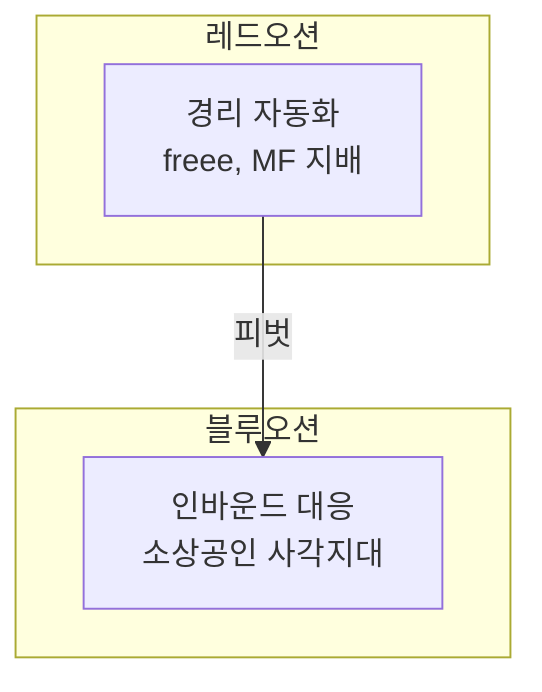
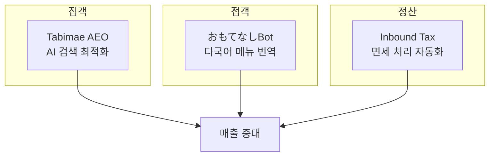
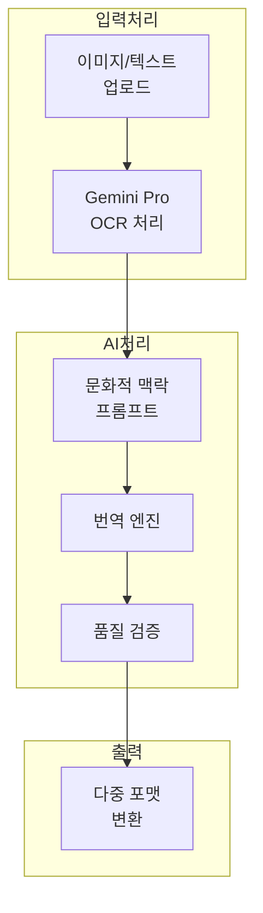

## 시작: AI 효율화 도구라는 꿈

2025년 11월, 저는 <strong>Agent Effi Flow</strong>라는 이름으로 AI 기반 업무 효율화 SaaS를 런칭했습니다. "영수증 OCR로 경리 업무를 자동화하자"라는 단순한 아이디어에서 시작했죠.

기술 스택은 탄탄했습니다:
- <strong>SvelteKit</strong> + <strong>Supabase</strong> + <strong>Vercel</strong>
- <strong>Google Gemini 2.5 Pro</strong> 기반 AI 처리
- 크레딧 기반 결제 시스템 (Stripe 연동)
- 5개 언어 다국어 지원

하지만 런칭 후 일주일, 냉정한 현실을 마주해야 했습니다.

---

## 현실 직면: 레드오션의 벽

### 일본 경리 시장의 진실

일본의 경리 자동화 시장을 조사하면서 충격적인 사실을 발견했습니다:

| 서비스 | 점유율 | MAU | 특징 |
|--------|--------|-----|------|
| freee | 33% | 370만+ | 확정신고 원클릭 |
| Money Forward | 27% | 300만+ | 금융 연동 최강 |
| 야요이 | 22% | - | 세무사 네트워크 |

<strong>영수증 OCR</strong>은 이미 이 거대 플레이어들의 <strong>기본 기능</strong>이었습니다. 1인 개발자가 이 시장에서 차별화를 만들어내기란 불가능에 가까웠죠.

### 위기의 신호들

```
❌ 검색 노출: 거의 없음
❌ 경쟁 우위: 명확하지 않음
❌ 가격 경쟁력: freee 기본 요금 ¥1,980/월과 비교 불가
❌ 신뢰도: 브랜드 인지도 제로
```

이대로는 안 된다는 것을 깨달았습니다.

---

## 전환점: 블루오션을 찾아서

### 일본 시장의 역설적 기회

일본은 세계 3위 경제 대국이지만, 디지털 경쟁력은 OECD 최하위권입니다. 이 <strong>디지털 역설</strong> 속에서 기회를 발견했습니다.



### 인바운드 3천만 시대

2024년 일본 방문 외국인 수가 <strong>3,600만 명</strong>을 돌파했습니다. 하지만:

- 소상공인의 <strong>72%</strong>가 외국어 대응에 어려움
- 메뉴판 번역 서비스 대부분이 <strong>문화적 맥락 무시</strong>
- "ホルモン"을 "Hormone"으로 번역하는 실수가 빈번

이것이 바로 제가 해결할 수 있는 문제였습니다.

---

## 새로운 비전: 가게를 지키는 AI 지배인

### 3 Pillar 전략



<strong>집객 → 접객 → 정산</strong>의 일관된 고객 여정을 AI로 지원하는 것이 새로운 비전입니다.

### 핵심 가치

| 키워드 | 의미 | 서비스 반영 |
|--------|------|------------|
| <strong>安心</strong> (안심) | 실수 없는 운영 | 문화적 오류 자동 검출 |
| <strong>おもてなし</strong> | 진심 어린 환대 | 맥락을 이해하는 번역 |
| <strong>売上</strong> (매출) | 사업 성장 | AI 검색 노출 최적화 |

---

## おもてなしBot: 첫 번째 결실

### 서비스 개요

2025년 12월 3일, <strong>おもてなしBot</strong>을 정식 런칭했습니다.

> "실수 없는 완벽한 다국어 응대"

메뉴판 사진을 업로드하면 <strong>13개 언어</strong>로 문화적 맥락을 반영한 번역을 제공합니다.

### 핵심 기능

#### 1. 문화적 맥락 번역

단순 직역이 아닌, 각 문화권의 식문화를 이해한 번역:

```
❌ 기존: ホルモン → "Hormone" (호르몬?)
✅ おもてなしBot: ホルモン → "Beef Offal BBQ" (소 내장 바베큐)

❌ 기존: ガス入りの水 → "Gas water" (가스 물?)
✅ おもてなしBot: ガス入りの水 → "Sparkling water" (탄산수)
```

#### 2. 업종별 프리셋

각 업종의 특성을 반영한 번역 최적화:

- <strong>이자카야</strong>: 안주 문화, 음주 매너 반영
- <strong>야키니쿠</strong>: 부위별 설명, 굽기 가이드
- <strong>스시</strong>: 계절 생선, 오마카세 개념
- <strong>라멘</strong>: 면 굵기, 국물 농도 용어

#### 3. 알레르기 정보 자동 검출

```
⚠️ 검출: 小麦粉 (밀가루) - Wheat flour
⚠️ 검출: えび (새우) - Shrimp
⚠️ 검출: 卵 (계란) - Egg
```

#### 4. 다양한 출력 형식

- <strong>텍스트</strong>: 간단한 복사-붙여넣기용
- <strong>Markdown</strong>: 문서화용
- <strong>CSV</strong>: 엑셀 편집용
- <strong>이미지</strong>: 실제 메뉴판 디자인용

---

## 기술 구현: 프롬프트 아키텍처

### 시스템 구조



### 프롬프트 설계 원칙

おもてなしBot의 핵심은 <strong>문화적 맥락을 이해하는 프롬프트</strong>입니다.

#### 언어별 문화 가이드라인

각 타겟 언어에 대해 문화적 특성을 정의했습니다:

```typescript
// 예시: 영어권 가이드라인
{
  language: 'en',
  cultural_notes: [
    'Avoid literal translations of Japanese onomatopoeia',
    'Include cooking method descriptions for unfamiliar dishes',
    'Add texture/flavor hints for adventurous items'
  ]
}
```

#### 오번역 방지 테이블

흔한 오번역 패턴을 사전에 정의:

| 일본어 | 잘못된 번역 | 올바른 번역 |
|--------|------------|------------|
| ホルモン | Hormone | Beef/Pork Offal |
| もつ | Motsu | Offal/Giblets |
| ガス入り | Gas in | Sparkling |
| 並 | Normal | Regular size |

#### 심각도 기반 검증

번역 결과를 3단계로 검증:

```typescript
type Severity = 'high' | 'medium' | 'low';

// high: 알레르기, 종교적 금기 관련 오류
// medium: 의미 왜곡, 부적절한 표현
// low: 스타일, 뉘앙스 개선 제안
```

### 크레딧 시스템

```typescript
const CREDIT_COSTS = {
  base: 10,        // 기본 텍스트 처리
  image_output: 30 // 이미지 생성 시 추가
};
```

소상공인이 부담 없이 사용할 수 있는 합리적인 가격을 설정했습니다.

---

## 경리 OCR: 전략적 일시 정지

기존 경리 OCR 기능은 <strong>일시 정지</strong>했습니다.

### 이유

1. <strong>레드오션 회피</strong>: freee, Money Forward와의 직접 경쟁 포기
2. <strong>리소스 집중</strong>: 인바운드 특화 기능에 개발력 집중
3. <strong>리브랜딩 탐색</strong>: 소상공인에게 더 도움이 되는 방향을 탐색하여 리뉴얼 계획 (일정 미정)

### 향후 계획

경리 OCR은 단순 영수증 인식이 아닌, <strong>인바운드 매출 특화</strong> 기능으로 재탄생할 예정입니다:

- 면세/과세 자동 분류
- Duty-Free, Tax-Free 키워드 감지
- 야요이, freee CSV 포맷 지원

---

## 배운 것들

### 1. 시장 선택이 기술보다 중요하다

아무리 좋은 기술도 레드오션에서는 빛을 발하기 어렵습니다. <strong>경쟁이 적은 시장</strong>을 찾는 것이 1인 개발자에게는 생존 전략입니다.

### 2. 니치를 깊게 파라

"모든 사람을 위한 서비스"보다 "특정 고객의 구체적인 문제 해결"이 훨씬 가치 있습니다.

### 3. 피벗은 실패가 아니다

방향 전환은 포기가 아닙니다. 시장의 피드백을 받아들이고 더 나은 기회를 찾아가는 <strong>전략적 결정</strong>입니다.

### 4. 문화적 맥락이 차별화다

AI 번역 서비스는 많지만, <strong>문화적 맥락</strong>을 이해하는 서비스는 드뭅니다. 이것이 おもてなしBot의 핵심 경쟁력입니다.

---

## 다음 단계

### Phase 3 (2025년 1〜2월)

- <strong>Tabimae AEO</strong>: AI 검색 엔진 최적화 홍보물 생성
- <strong>おもてなしBot 고도화</strong>: 배치 처리, 접객 스크립트

### 2026년 면세 제도 변경 대응

2026년 면세 처리 방식의 변화에 발맞춰, 인바운드 고객을 대상으로 면세 처리를 실시하는 소상공인을 위한 면세 처리용 영수증 OCR 기능을 더욱 강화할 계획입니다.

---

## 마무리

레드오션에서 허우적거리던 경리 OCR 서비스가, 인바운드 관광이라는 블루오션에서 새로운 가능성을 발견했습니다.

<strong>おもてなしBot</strong>은 그 첫 번째 결실입니다. "가게를 지키는 AI 지배인"이라는 비전 아래, 일본의 소상공인들이 전 세계 손님을 맞이할 수 있도록 계속 발전시켜 나가겠습니다.

---

**서비스 바로가기**: [Agent Effi Flow](https://agent-effi-flow.jangwook.net/)

피드백이나 질문이 있으시면 언제든 연락 주세요. 함께 더 나은 서비스를 만들어 나가고 싶습니다.
