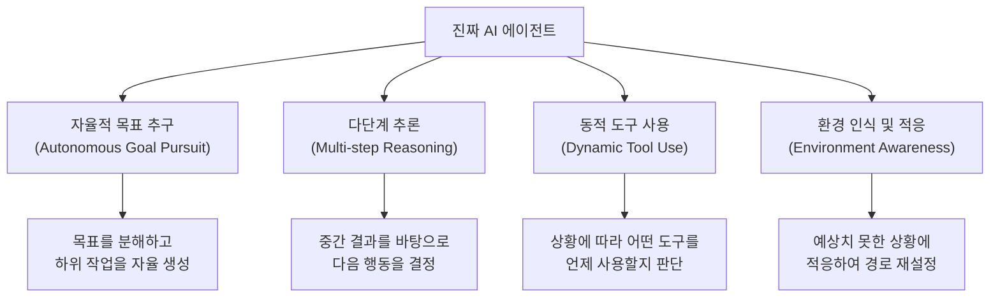
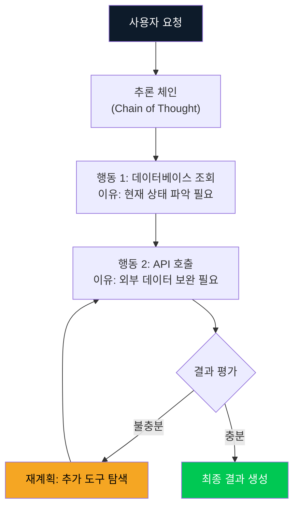
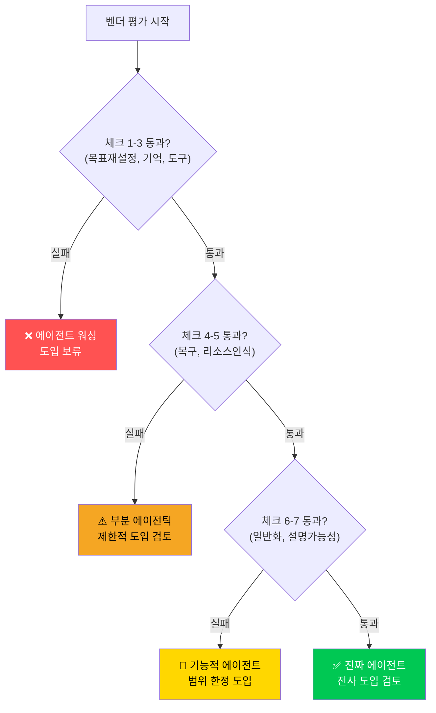

2026년 3월 현재, "AI 에이전트"라는 단어는 모든 IT 벤더의 마케팅 자료에 등장하고 있습니다. Gartner는 2026년 말까지 엔터프라이즈 애플리케이션의 40%에 AI 에이전트가 내장될 것이라고 예측했습니다. 하지만 냉정한 조사 결과는 다릅니다. 수천 개의 "AI 에이전트" 벤더 중 실제로 진정한 에이전틱 시스템을 구축하고 있는 곳은 <strong>약 130개에 불과</strong>합니다.

나머지 수천 개는 무엇일까요? 단순 자동화, if-then 규칙 엔진, 또는 LLM API 호출을 감싼 래퍼에 "AI 에이전트"라는 이름을 붙인 것들입니다. 이를 <strong>에이전트 워싱(Agent Washing)</strong>이라 합니다. 그린 워싱이 환경적이지 않은 제품을 친환경적으로 포장하듯, 에이전트 워싱은 단순한 자동화를 지능형 에이전트로 포장합니다.

Engineering Manager로서 이 함정을 피하는 것은 단순한 기술적 판단을 넘어 <strong>팀의 시간, 예산, 신뢰를 지키는 일</strong>입니다. 이 포스트에서는 실전에서 검증된 7가지 체크리스트를 통해 에이전트 워싱을 감별하는 방법을 소개합니다.

## 에이전트 워싱이란 무엇인가

에이전트 워싱을 이해하려면 먼저 <strong>진짜 AI 에이전트</strong>가 무엇인지 알아야 합니다.

진정한 AI 에이전트는 다음 네 가지 핵심 특성을 갖습니다:



반면, 에이전트 워싱의 특징은 다음과 같습니다:

- 미리 정의된 스크립트나 플로우차트를 실행
- 분기는 있지만 <strong>새로운 계획을 생성하지 않음</strong>
- 실패 시 인간에게 즉시 에스컬레이션 (자율 복구 없음)
- LLM을 사용하지만 단순 텍스트 생성용으로만 활용

## 7가지 감별 체크리스트

### ✅ 체크 1: "목표 재설정" 테스트

<strong>질문:</strong> 실행 중 예상치 못한 장애물이 생기면 어떻게 됩니까?

진짜 에이전트는 장애물을 만났을 때 <strong>스스로 대안 경로를 생성</strong>합니다. 에이전트 워싱 제품은 "시나리오 A가 실패했습니다. 지원팀에 문의하세요"와 같은 에러 메시지를 반환합니다.

**실전 테스트**: 데모 중에 의도적으로 비정상적인 입력값을 넣어보세요. 시스템이 새로운 접근법을 시도하는지, 아니면 단순히 에러를 반환하는지 확인합니다.

```python
# 진짜 에이전트의 반응 예시
# 장애물 발생 → 자율적 재계획

async def handle_obstacle(self, obstacle: Exception):
    # 에이전트가 스스로 대안을 생성
    alternative_plans = await self.llm.generate_alternatives(
        original_goal=self.current_goal,
        obstacle=str(obstacle),
        context=self.memory.get_context()
    )
    return await self.execute_best_plan(alternative_plans)

# 에이전트 워싱의 반응 예시
# 장애물 발생 → 에러 반환

def handle_obstacle(self, error):
    raise AgentError(f"Predefined flow failed: {error}")
    # 또는 단순히 None 반환
```

### ✅ 체크 2: "컨텍스트 기억" 테스트

<strong>질문:</strong> 이전 상호작용의 결과가 다음 행동에 얼마나 반영됩니까?

진짜 에이전트는 <strong>에피소딕 메모리</strong>를 활용해 이전 실패와 성공을 현재 결정에 반영합니다. 에이전트 워싱은 각 요청을 독립적으로 처리하거나, 단순히 이전 대화 텍스트만 붙여넣는 수준입니다.

**실전 테스트**: 같은 작업을 두 번 요청하되, 두 번째에는 첫 번째 결과의 단점을 언급하세요. 에이전트가 그 피드백을 반영해 다른 접근법을 취하는지 확인합니다.

### ✅ 체크 3: "도구 선택의 유연성" 테스트

<strong>질문:</strong> 사용 가능한 도구가 변경되었을 때 시스템은 어떻게 반응합니까?

진짜 에이전트는 현재 상황에서 <strong>어떤 도구가 최적인지를 런타임에 판단</strong>합니다. 에이전트 워싱은 특정 도구 사용 순서가 하드코딩되어 있어 도구가 없으면 작동하지 않습니다.

```python
# 진짜 에이전트: 도구 선택의 유연성

class GenuineAgent:
    async def select_tool(self, task: str, available_tools: list) -> Tool:
        # 현재 작업과 맥락을 분석해 최적 도구 동적 선택
        tool_analysis = await self.llm.analyze_tools(
            task=task,
            tools=[t.description for t in available_tools],
            history=self.memory.recent_actions
        )
        return available_tools[tool_analysis.best_tool_index]

# 에이전트 워싱: 하드코딩된 도구 순서

class WashedAgent:
    TOOL_SEQUENCE = ["search", "summarize", "format"]  # 변경 불가

    def execute(self, task):
        for tool_name in self.TOOL_SEQUENCE:
            result = self.tools[tool_name].run(task)  # 순서 고정
        return result
```

### ✅ 체크 4: "실패 복구" 테스트

<strong>질문:</strong> 하위 작업이 실패했을 때 전체 작업이 중단됩니까, 아니면 계속됩니까?

진짜 에이전트는 <strong>부분 실패에도 전체 목표를 향해 진행</strong>하며 실패한 부분을 우회하거나 재시도합니다. 에이전트 워싱은 하나가 실패하면 전체 파이프라인이 멈춥니다.

**실전 테스트**: 의도적으로 API를 일시적으로 비활성화하고 시스템이 어떻게 반응하는지 봅니다.

### ✅ 체크 5: "예산/시간 인식" 테스트

<strong>질문:</strong> 리소스 제약이 있을 때 시스템이 트레이드오프를 인식합니까?

진짜 에이전트는 주어진 <strong>시간, 토큰, [API 비용](/ko/blog/ko/ai-agent-cost-reality)의 제약 안에서 최적 결과를 도출</strong>하기 위해 전략을 조정합니다. 에이전트 워싱은 리소스 제약을 인식하지 못하고 항상 같은 방식으로 실행됩니다.

```python
# 진짜 에이전트: 리소스 인식

async def run_with_budget(self, task, token_budget=10000):
    estimated_cost = await self.estimate_cost(task)

    if estimated_cost > token_budget:
        # 예산 초과 시 전략 조정
        simplified_plan = await self.create_simplified_plan(
            task, max_tokens=token_budget * 0.8
        )
        return await self.execute(simplified_plan)
    return await self.execute_full_plan(task)
```

### ✅ 체크 6: "새로운 도메인 일반화" 테스트

<strong>질문:</strong> 훈련 데이터에 없는 새로운 유형의 작업도 처리할 수 있습니까?

진짜 에이전트는 <strong>전이 학습(transfer learning) 능력</strong>으로 새로운 도메인의 작업도 기존 지식을 활용해 처리합니다. 에이전트 워싱은 특정 사용 사례만 처리하도록 설계된 specialized 자동화입니다.

**실전 테스트**: 벤더가 데모하지 않은 새로운 엣지 케이스를 요청해보세요. "이 사용 사례는 현재 지원하지 않습니다"라는 응답은 에이전트 워싱의 신호입니다.

### ✅ 체크 7: "설명 가능한 추론" 테스트

<strong>질문:</strong> 시스템이 왜 특정 행동을 선택했는지 설명할 수 있습니까?

진짜 에이전트는 <strong>[의사결정 과정의 투명한 추적(trace)](/ko/blog/ko/ai-agent-observability-production-guide)</strong>을 제공합니다. 에이전트 워싱은 "블랙박스"로 작동하거나, 사전 작성된 설명만 반환합니다.



## EM이 벤더 평가 시 해야 할 질문들

위 7가지 체크리스트를 바탕으로, 벤더 미팅에서 직접 물어볼 수 있는 핵심 질문 목록입니다:

| 질문 | 진짜 에이전트의 답변 패턴 | 에이전트 워싱의 답변 패턴 |
|-----|----------------------|----------------------|
| "비정형 입력이 들어오면?" | "새로운 계획을 생성합니다" | "정해진 포맷으로 변환합니다" |
| "실패율은 어느 정도입니까?" | 구체적 수치 + 복구 방법 | "신뢰성 높음" (수치 없음) |
| "어떻게 학습/개선됩니까?" | RLHF, GRPO 등 구체적 메커니즘 | "정기적으로 업데이트됩니다" |
| "추론 과정을 볼 수 있습니까?" | 상세 trace 제공 | "결과만 제공됩니다" |
| "새 도구를 추가하면?" | "자동으로 활용 방법을 학습합니다" | "개발팀이 연동합니다" |

## 에이전트 워싱의 실제 비용

에이전트 워싱을 구별하지 못했을 때의 비용은 단순히 잘못된 구매에 그치지 않습니다.

**1. 기회비용**: 진짜 에이전틱 AI를 도입할 예산과 시간을 낭비합니다.

**2. 조직 신뢰 손상**: "AI 도입 실패" 경험이 쌓이면 팀이 향후 진짜 AI 프로젝트에도 회의적이 됩니다.

**3. 기술 부채**: 단순 자동화를 에이전트라고 믿고 아키텍처를 설계하면, 나중에 진짜 에이전트로 교체할 때 전면 재설계가 필요합니다.

**4. 경쟁 열위**: 진짜 에이전틱 AI를 도입한 경쟁사는 20-40%의 운영 비용 절감을 달성하는 동안, 에이전트 워싱 제품을 쓰는 조직은 그 혜택을 누리지 못합니다.

## 실전 평가 프레임워크

EM으로서 신규 AI 에이전트 도입을 검토할 때 다음 프레임워크를 활용하세요:



## 2026년 에이전트 시장의 현실

현재 기업 AI 도입 조사(2026년 3월)에 따르면:

- 57.3%의 조직이 에이전트를 프로덕션에서 운영 중
- 그러나 그 중 <strong>진정한 자율 에이전트</strong>는 전체의 20% 미만
- 나머지 80%는 자동화된 워크플로우, LLM 강화 챗봇, 또는 규칙 기반 시스템

이 격차가 바로 에이전트 워싱이 번성하는 이유입니다. "에이전트가 있다"와 "진짜 에이전틱 AI가 있다"는 전혀 다른 이야기입니다.

## 결론: 의심의 기술

에이전트 워싱 감별은 기술적 스킬이기도 하지만, 무엇보다 <strong>올바른 질문을 던지는 습관</strong>입니다.

벤더가 "AI 에이전트"를 자신 있게 선보일 때, EM으로서 당신은 7가지 체크리스트의 질문을 던져야 합니다. 대부분의 진짜 에이전틱 AI는 이 질문들을 반기며 구체적인 답변을 제공합니다. 에이전트 워싱 제품은 모호한 대답, 주제 전환, 또는 "로드맵에 있습니다"로 응답할 것입니다.

2026년 엔터프라이즈 AI 도입의 물결 속에서, 진짜와 가짜를 구별하는 능력은 EM의 핵심 경쟁력이 됩니다. 130개의 진짜 에이전트를 찾아내는 것, 그것이 2026년 EM에게 주어진 과제입니다.

## 참고 자료

- [AI Journey Report 2026: Generative to Agentic - ResearchAndMarkets](https://www.globenewswire.com/news-release/2026/03/12/3254690/28124/en/AI-Journey-Report-2026-Generative-to-Agentic-Understand-How-Agentic-AI-Can-Help-LLM-Vendors-Achieve-Profitability-and-Identify-the-Likely-Winners-from-the-First-Phase-of-the-AI-Inv.html)
- [State of Agent Engineering 2026 - LangChain](https://www.langchain.com/state-of-agent-engineering)
- [5 Key Trends Shaping Agentic Development in 2026 - The New Stack](https://thenewstack.io/5-key-trends-shaping-agentic-development-in-2026/)
- [Unlocking the value of multi-agent systems in 2026 - Computer Weekly](https://www.computerweekly.com/opinion/Unlocking-the-value-of-multi-agent-systems-in-2026)
- [2026 enterprise AI predictions - InformationWeek](https://www.informationweek.com/machine-learning-ai/2026-enterprise-ai-predictions-fragmentation-commodification-and-the-agent-push-facing-cios)
