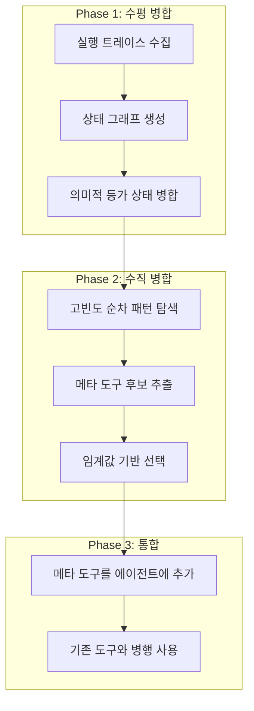
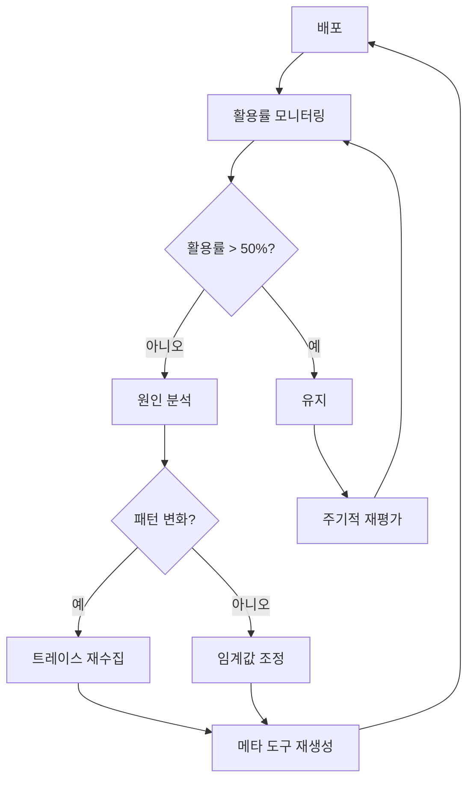

## 개요

AI 에이전트 시스템을 프로덕션에 배포하면 예상치 못한 비용과 지연이 발생합니다. 에이전트가 매번 LLM을 호출하여 다음 행동을 추론하기 때문입니다. 로그인, 검색, 폼 제출 같은 반복적인 패턴도 매번 새로운 추론을 거칩니다.

2026년 1월 arXiv에 발표된 <strong>"Optimizing Agentic Workflows using Meta-tools"</strong> 논문은 이 문제에 대한 실용적인 해법을 제시합니다. 핵심 아이디어는 간단합니다. 에이전트의 실행 로그를 분석하여 반복되는 도구 호출 패턴을 찾고, 이를 <strong>메타 도구(Meta-tool)</strong>라는 결정론적 복합 도구로 컴파일하는 것입니다.

이 글에서는 AWO(Agent Workflow Optimization) 프레임워크의 작동 원리를 분석하고, 엔지니어링 팀에서 어떻게 활용할 수 있는지 실전 관점에서 살펴봅니다.

## 왜 에이전트 워크플로우 최적화가 필요한가

현재 대부분의 AI 에이전트 시스템은 <strong>ReAct(Reasoning + Acting)</strong> 패턴을 따릅니다. 에이전트가 사용자 요청을 받으면 LLM이 추론하고, 도구를 호출하고, 결과를 관찰하고, 다시 추론하는 루프를 반복합니다.

문제는 이 과정에서 발생하는 비효율입니다:

- <strong>불필요한 추론</strong>: 매번 같은 패턴으로 실행되는 로그인, 검색 같은 작업도 LLM 추론을 거칩니다
- <strong>비용 누적</strong>: LLM 호출 한 번당 수 센트씩 쌓이면 대규모 배포에서 큰 비용이 됩니다
- <strong>지연 증가</strong>: 불필요한 LLM 호출은 응답 시간을 늘립니다
- <strong>할루시네이션 위험</strong>: LLM 호출이 많을수록 잘못된 판단이 발생할 확률도 높아집니다

실제 벤치마크에서 에이전트들은 동일한 작업에 대해 매우 다양한 실행 경로를 보여줍니다. 어떤 경우에는 3단계로 끝날 작업을 10단계 이상 거치기도 합니다.

## AWO 프레임워크: 3단계 최적화 파이프라인

AWO는 에이전트의 실행 이력(trace)을 분석하여 메타 도구를 자동으로 추출하는 프레임워크입니다. 크게 3단계로 구성됩니다.



### Phase 1: 수평 병합(Horizontal Merging)

첫 번째 단계에서는 여러 실행 트레이스를 하나의 상태 그래프로 통합합니다. 각 실행은 도구 호출의 순서열로 표현됩니다:

```
E_i = (Tool_1, Tool_2, ..., Tool_n)
```

핵심은 <strong>의미적으로 동등한 상태</strong>를 인식하는 것입니다. 예를 들어:

- 읽기 전용 작업은 순서가 바뀌어도 결과가 같습니다(교환 법칙)
- 사용자별 ID나 세션 토큰은 정규화하여 동일하게 취급합니다
- 반복되는 인증 흐름은 하나로 축약합니다

이 과정에서 도메인 전문가가 병합 규칙을 정의합니다. 완전 자동화는 아직 한계가 있지만, 규칙 자체는 재사용 가능합니다.

### Phase 2: 수직 병합(Vertical Merging)

수평 병합으로 통합된 그래프에서 <strong>고빈도 순차 패턴</strong>을 탐욕적(greedy) 알고리즘으로 추출합니다:

```python
# AWO 메타 도구 추출 알고리즘 (간략화)
def extract_meta_tools(graph, threshold_T):
    meta_tools = []
    while True:
        # 가중치가 임계값 이상인 간선 쌍 탐색
        pairs = find_high_weight_pairs(graph, threshold_T)
        if not pairs:
            break

        # 가장 높은 가중치의 쌍 선택
        best_pair = max(pairs, key=lambda p: p.weight)
        candidate = [best_pair.start, best_pair.end]

        # 후속 노드로 확장 (자식 노드의 가중치가 충분히 높으면)
        current = best_pair.end
        while child := select_high_freq_child(current, threshold_T):
            candidate.append(child)
            current = child

        meta_tools.append(candidate)
        graph = compress(graph, candidate)

    return meta_tools
```

선택 기준은 명확합니다. 간선의 가중치 `w(n_y, n_z)`가 해당 노드의 전체 자식 간선 가중치 합의 절반을 넘어야 합니다. 이는 해당 패턴이 <strong>압도적으로 자주</strong> 발생할 때만 메타 도구로 만든다는 의미입니다.

### Phase 3: 메타 도구 통합

추출된 메타 도구는 에이전트의 도구 세트에 추가됩니다. 기존 도구를 대체하는 것이 아니라 <strong>병행</strong>합니다. 에이전트는 상황에 따라 메타 도구를 사용하거나 기존 개별 도구를 사용할 수 있습니다.

## 실험 결과: 벤치마크별 성과

### VisualWebArena (웹 에이전트 벤치마크)

Reddit, Classifieds, Shopping 세 가지 웹 환경에서 910개 작업을 테스트했습니다.

| 지표 | Reddit | Classifieds | Shopping |
|------|--------|-------------|----------|
| LLM 호출 절감 | 5.6% | 8.3% | 10.2% |
| 비용 절감 | 5.7% | 8.5% | 10.2% |
| 성공률 변화 | +2.1%p | +4.2%p | +1.8%p |
| 생성된 메타 도구 수 | 2개 | 2개 | 2개 |

Shopping 카테고리에서 가장 큰 효과를 보였는데, 검색과 리뷰 작성 같은 반복 패턴이 명확했기 때문입니다.

<strong>실제 생성된 메타 도구 예시</strong>:

```
# Shopping 메타 도구: search
search [query]
  = type(search_box_id, query) → click(search_submit_id)

# Shopping 메타 도구: leave_review
leave_review [rating, title, review]
  = click(review_tab)
  → scroll_down()
  → set_rating(rating)
  → fill(title_field, title)
  → fill(review_field, review)
  → click(post_button)
```

### AppWorld (멀티앱 에이전트 벤치마크)

9개 애플리케이션 환경에서 168개 작업을 테스트했습니다.

| 지표 | GPT 5.1 | Claude 4.5 |
|------|---------|------------|
| LLM 호출 절감 | 11.9% | 7.2% |
| 비용 절감 | 15.0% | 4.2% |
| 메타 도구 활용률 | 98.2% | 39.3% |
| 생성된 메타 도구 수 | 5개 | 5개 |

흥미로운 점은 GPT 5.1이 메타 도구를 98.2%의 확률로 활용한 반면, Claude 4.5는 39.3%에 그쳤다는 것입니다. 이는 모델마다 <strong>도구 활용 성향</strong>이 다르다는 것을 보여줍니다.

## 실무 적용 가이드: 엔지니어링 팀을 위한 로드맵

### 1단계: 실행 트레이스 수집

AWO를 적용하려면 먼저 에이전트의 실행 로그를 체계적으로 수집해야 합니다.

```python
# 에이전트 실행 트레이스 수집 예시
import json
from datetime import datetime

class TraceCollector:
    def __init__(self):
        self.traces = []
        self.current_trace = []

    def log_tool_call(self, tool_name: str, params: dict, result: dict):
        self.current_trace.append({
            "tool": tool_name,
            "params": self._normalize_params(params),
            "timestamp": datetime.now().isoformat(),
            "success": result.get("success", True)
        })

    def _normalize_params(self, params: dict) -> dict:
        """사용자별 ID 등을 정규화하여 패턴 탐색을 용이하게 합니다"""
        normalized = {}
        for k, v in params.items():
            if k in ["user_id", "session_token"]:
                normalized[k] = "<NORMALIZED>"
            else:
                normalized[k] = v
        return normalized

    def end_trace(self):
        if self.current_trace:
            self.traces.append(self.current_trace)
            self.current_trace = []

    def export(self, path: str):
        with open(path, 'w') as f:
            json.dump(self.traces, f, indent=2)
```

### 2단계: 패턴 분석 및 메타 도구 후보 식별

수집된 트레이스에서 반복 패턴을 찾습니다. 실무에서는 완전 자동화보다 <strong>반자동 접근</strong>이 효과적입니다:

```python
from collections import Counter

def find_frequent_sequences(traces, min_length=2, min_freq=5):
    """빈출 도구 호출 시퀀스를 탐색합니다"""
    sequences = Counter()

    for trace in traces:
        tool_names = [step["tool"] for step in trace]
        # n-gram 방식으로 시퀀스 추출
        for length in range(min_length, min(len(tool_names), 6)):
            for i in range(len(tool_names) - length + 1):
                seq = tuple(tool_names[i:i + length])
                sequences[seq] += 1

    # 빈도 기준 필터링
    return {
        seq: count
        for seq, count in sequences.most_common()
        if count >= min_freq
    }
```

### 3단계: 메타 도구 구현 및 배포

식별된 패턴을 결정론적 함수로 구현합니다:

```python
# 메타 도구 구현 예시: 자동 로그인 + 검색
class MetaTool:
    def __init__(self, name: str, steps: list):
        self.name = name
        self.steps = steps

    async def execute(self, agent_context, **params):
        """LLM 추론 없이 결정론적으로 실행합니다"""
        results = []
        for step in self.steps:
            tool_name = step["tool"]
            tool_params = self._resolve_params(step["params"], params)
            result = await agent_context.call_tool(tool_name, tool_params)
            results.append(result)

            if not result.get("success"):
                # 실패 시 에이전트에게 제어권 반환
                return {"success": False, "partial_results": results}

        return {"success": True, "results": results}

    def _resolve_params(self, template: dict, actual: dict) -> dict:
        """템플릿 파라미터를 실제 값으로 치환합니다"""
        resolved = {}
        for k, v in template.items():
            if isinstance(v, str) and v.startswith("$"):
                resolved[k] = actual.get(v[1:], v)
            else:
                resolved[k] = v
        return resolved

# 사용 예시
auto_login_search = MetaTool(
    name="auto_login_and_search",
    steps=[
        {"tool": "get_credentials", "params": {"service": "$service"}},
        {"tool": "login", "params": {"username": "$username", "password": "$password"}},
        {"tool": "search", "params": {"query": "$query"}}
    ]
)
```

### 4단계: 모니터링 및 반복 개선

메타 도구 배포 후에는 활용률과 효과를 지속적으로 모니터링합니다:



## EM/VPoE 관점: 도입 시 고려사항

### 비용 대비 효과 분석

AWO의 ROI는 에이전트 사용 규모에 비례합니다:

- <strong>소규모</strong>(일 100건 미만): 도입 비용 대비 효과가 미미합니다
- <strong>중규모</strong>(일 1,000〜10,000건): 5〜15% 비용 절감이 유의미한 금액이 됩니다
- <strong>대규모</strong>(일 10,000건 이상): 필수적인 최적화 전략입니다

### 팀 역량 요구사항

AWO 도입에 필요한 역량:

- <strong>도메인 전문성</strong>: 수평 병합 규칙을 정의할 수 있는 해당 업무 도메인 이해
- <strong>로그 인프라</strong>: 에이전트 실행 트레이스를 체계적으로 수집하는 파이프라인
- <strong>테스트 환경</strong>: 메타 도구의 정확성을 검증할 벤치마크

### 주의사항

- 수평 병합 규칙은 <strong>수동 정의</strong>가 필요합니다. 완전 자동화 시도에서는 성능이 정체되었습니다
- 모델에 따라 메타 도구 활용률이 크게 다릅니다(GPT 98% vs Claude 39%)
- 작업 분포가 변하면 메타 도구를 <strong>재생성</strong>해야 합니다

## 다른 최적화 접근법과의 비교

| 접근법 | 방식 | AWO와의 차이 |
|--------|------|--------------|
| LLMCompiler | 병렬 DAG 실행 | 런타임 최적화 vs AWO는 사전 배포 최적화 |
| ReAct | 추론-행동 교대 | 중복 추론을 제거하지 않음 |
| Tree of Thought | 다중 추론 경로 탐색 | 탐색 vs AWO는 통합 |
| AVATAR | 대조 학습 기반 | 학습이 필요하지만 AWO는 실행 분석만 사용 |

AWO의 장점은 <strong>기존 시스템에 비침습적으로 적용</strong>할 수 있다는 점입니다. 에이전트의 코어 로직을 수정하지 않고 도구만 추가하면 됩니다.

## 결론

AWO 프레임워크는 AI 에이전트 시스템의 실질적인 운영 비용을 줄이는 실용적인 접근법입니다. 핵심은 "에이전트가 매번 추론할 필요가 없는 패턴은 결정론적으로 실행하자"는 단순한 원칙입니다.

프로덕션 환경에서 AI 에이전트를 운영하는 팀이라면, 실행 트레이스 수집부터 시작하는 것을 권합니다. 데이터가 쌓이면 어떤 패턴이 메타 도구 후보인지 자연스럽게 보이기 시작합니다.

## 참고 자료

- [Optimizing Agentic Workflows using Meta-tools (arXiv:2601.22037)](https://arxiv.org/abs/2601.22037)
- [A Practical Guide for Production-Grade Agentic AI Workflows (arXiv:2512.08769)](https://arxiv.org/abs/2512.08769)
- [How Agentic AI Will Reshape Engineering Workflows in 2026 (CIO)](https://www.cio.com/article/4134741/how-agentic-ai-will-reshape-engineering-workflows-in-2026.html)
- [7 Agentic AI Trends to Watch in 2026 (MachineLearningMastery)](https://machinelearningmastery.com/7-agentic-ai-trends-to-watch-in-2026/)
