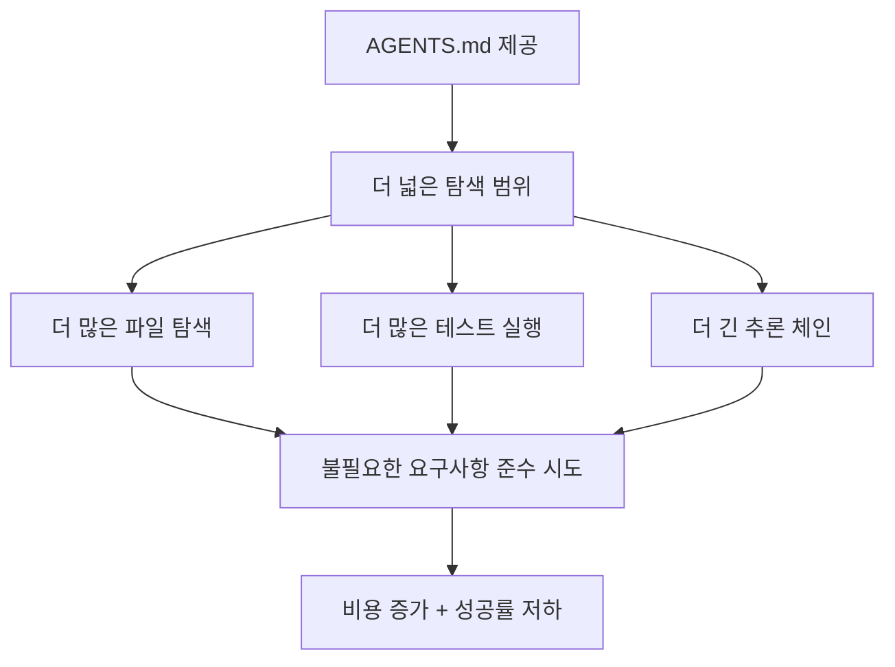

## 개요

Cursor, Claude Code, Codex 등 코딩 에이전트가 확산되면서, 리포지토리에 <strong>AGENTS.md</strong>(또는 CLAUDE.md, CURSOR.md) 파일을 두어 에이전트에게 프로젝트 컨텍스트를 제공하는 관행이 빠르게 퍼지고 있습니다. 현재 GitHub에만 6만 개 이상의 리포지토리가 이 파일을 포함하고 있죠.

그런데 이 파일이 <strong>정말로</strong> 에이전트의 작업 성공률을 높여줄까요? ETH Zürich 연구팀이 이 질문에 대한 <strong>최초의 실증적 답변</strong>을 내놓았습니다.

> 📄 논문: [Evaluating AGENTS.md: Are Repository-Level Context Files Helpful for Coding Agents?](https://arxiv.org/abs/2602.11988) (arXiv 2602.11988, 2026년 2월)

## 핵심 발견: 예상을 뒤엎는 결과

### LLM 생성 컨텍스트 파일은 오히려 성공률을 낮춘다

연구팀은 세 가지 설정에서 코딩 에이전트를 평가했습니다:

1. <strong>컨텍스트 파일 없음</strong> (기준선)
2. <strong>LLM이 자동 생성한 컨텍스트 파일</strong> (에이전트 개발사 권장 방식)
3. <strong>개발자가 직접 작성한 컨텍스트 파일</strong>

```
┌─────────────────────────────────────────────┐
│         설정별 평균 성공률 변화               │
├─────────────────────────────────────────────┤
│  컨텍스트 없음 (기준)      : ████████ 기준   │
│  LLM 생성 컨텍스트         : ██████▌  -3%    │
│  개발자 작성 컨텍스트       : ████████▌ +4%   │
└─────────────────────────────────────────────┘
```

핵심 수치를 정리하면:

- <strong>LLM 생성 파일</strong>: 평균 성공률 <strong>3% 감소</strong>
- <strong>개발자 작성 파일</strong>: 평균 성공률 <strong>4% 증가</strong> (미미한 수준)
- <strong>추론 비용</strong>: 두 경우 모두 <strong>20% 이상 증가</strong>

### 왜 이런 결과가 나왔을까?

연구팀은 에이전트의 행동 패턴을 상세히 분석했습니다:



에이전트는 컨텍스트 파일의 지시를 <strong>충실히 따르는</strong> 경향이 있었습니다. 문제는 그 지시 중 상당수가 해당 작업에 <strong>불필요한 요구사항</strong>이었다는 점입니다. 스타일 가이드 준수, 특정 테스트 패턴 사용 등의 지시가 오히려 작업을 복잡하게 만들었습니다.

## AGENTbench: 새로운 벤치마크

연구팀은 이 평가를 위해 <strong>AGENTbench</strong>라는 새로운 벤치마크를 구축했습니다.

| 항목 | 내용 |
|------|------|
| 인스턴스 수 | 138개 |
| 대상 리포지토리 | 12개 (개발자가 컨텍스트 파일을 실제로 사용하는 저장소) |
| 작업 유형 | 버그 수정 + 기능 추가 |
| 보완 벤치마크 | SWE-bench Lite (유명 리포지토리 대상) |

기존 SWE-bench는 유명 대형 리포지토리 위주라 AGENTS.md가 포함되어 있지 않았습니다. AGENTbench는 <strong>실제로 컨텍스트 파일을 사용하는 리포지토리</strong>에서 태스크를 수집한 최초의 벤치마크입니다.

## 실전 시사점: 어떻게 활용해야 할까?

### ❌ 하지 말아야 할 것

- LLM에게 `/init` 명령으로 AGENTS.md를 <strong>자동 생성</strong>시키는 것
- 프로젝트의 모든 규칙, 스타일 가이드, 아키텍처 설명을 한 파일에 몰아넣는 것
- 에이전트가 "다 읽어줄 거야"라고 기대하며 방대한 컨텍스트를 제공하는 것

### ✅ 해야 할 것

연구팀의 권장사항은 명확합니다: <strong>"최소한의 요구사항만 기술하라"</strong>

효과적인 AGENTS.md 작성 원칙:

1. <strong>빌드/테스트 명령어</strong>만 명시 (예: `npm test`, `pytest`)
2. <strong>프로젝트 고유 도구</strong> 사용법만 기술
3. 스타일 가이드나 아키텍처 설명은 <strong>별도 문서</strong>로 분리
4. 에이전트가 작업에 <strong>직접 필요한 정보</strong>만 포함

```markdown
# 좋은 AGENTS.md 예시

## 빌드
npm install && npm run build

## 테스트
npm test              # 전체 테스트
npm test -- --grep "패턴"  # 특정 테스트

## 린트
npm run lint          # 커밋 전 필수 실행
```

```markdown
# 나쁜 AGENTS.md 예시 (불필요한 요구사항 과다)

## 아키텍처
이 프로젝트는 클린 아키텍처를 따르며...
(장황한 설명 200줄)

## 코딩 스타일
모든 함수는 JSDoc 주석을 포함해야 하며...
변수명은 반드시 카멜케이스를...
(상세 규칙 100줄)

## 커밋 규칙
Conventional Commits를 따르며...
```

## 개발 커뮤니티의 반응

이 논문은 Hacker News에서 58포인트를 기록하며 활발한 토론을 이끌어냈습니다. 주요 반응은:

- <strong>"직감적으로 맞는 결과"</strong>: 과도한 지시가 에이전트를 오히려 혼란스럽게 한다는 경험적 공감
- <strong>"컨텍스트 윈도우 낭비"</strong>: 긴 AGENTS.md가 실제 코드 컨텍스트를 밀어낸다는 우려
- <strong>"미니멀이 최선"</strong>: 빌드/테스트 명령어만으로 충분하다는 실무 경험 공유

## 한계와 향후 전망

이 연구에는 몇 가지 한계가 있습니다:

- <strong>Python 중심</strong>: AGENTbench는 Python 프로젝트만 대상
- <strong>니치 리포지토리</strong>: 개발자가 컨텍스트 파일을 사용하는 리포지토리는 상대적으로 소규모
- <strong>정적 평가</strong>: 컨텍스트 파일이 반복 작업에서 누적 효과를 내는지는 미검증

향후 연구 방향으로는:

1. <strong>적응적 컨텍스트</strong>: 작업 유형에 따라 필요한 정보만 동적으로 제공
2. <strong>구조화된 컨텍스트</strong>: 자유 텍스트 대신 기계가 파싱하기 쉬운 형식 활용
3. <strong>다국어/다언어 확장</strong>: Python 외 언어에서의 효과 검증

## 결론

AGENTS.md는 코딩 에이전트 생태계에서 사실상의 표준이 되어가고 있지만, 이번 논문은 <strong>"많이 쓸수록 좋다"는 통념에 제동</strong>을 걸었습니다.

핵심 메시지는 간단합니다:

> <strong>컨텍스트 파일은 최소한으로, 빌드와 테스트 명령어 중심으로 작성하라.</strong>

에이전트 개발사의 권장대로 `/init`으로 자동 생성하는 것은 현재로서는 오히려 역효과를 낼 수 있습니다. 직접 작성하되, 꼭 필요한 정보만 담는 것이 가장 효과적인 전략입니다.

## 참고 자료

- [논문 원문 (arXiv)](https://arxiv.org/abs/2602.11988)
- [AGENTbench GitHub 리포지토리](https://github.com/eth-sri/agentbench)
- [AGENTS.md 공식 사이트](https://agents.md)
- [Hacker News 토론](https://news.ycombinator.com/item?id=43062692)
