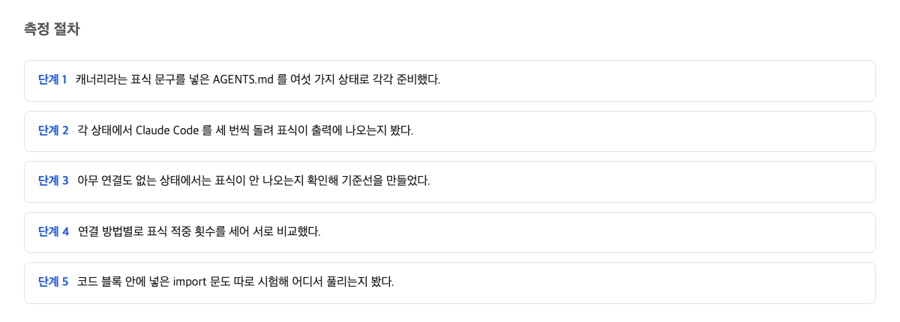
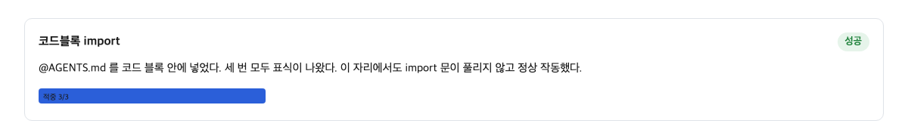

## AGENTS.md 와 CLAUDE.md 의 역할

요즘 AI 코딩 도구는 사람이 적어 둔 규칙 문서를 읽고 일한다. 그런데 이 도구들은 각자 자기 이름의 문서만 읽는다. 어떤 도구는 CLAUDE.md 라는 파일을 찾고, 어떤 도구는 AGENTS.md 라는 파일을 찾는다. 공식 문서도 이를 분명히 말한다.

> Claude Code reads `CLAUDE.md`, not `AGENTS.md`.
> — [Manage Claude's memory (CLAUDE.md) / Claude Code Docs](https://code.claude.com/docs/en/memory)

그리고 AGENTS.md 쪽 문서도 자기 역할을 설명한다.

> AGENTS.md complements this by containing the extra, sometimes detailed context coding agents need.
> — [AGENTS.md](https://agents.md/)

문제는 여기서 시작된다. 파일 이름이 다르면 AI 는 그 문서를 아예 읽지 못한다. 그래서 AGENTS.md 에 적어 둔 규칙을 Claude Code 에게도 읽히게 하려면, 두 문서를 어떻게든 이어 주어야 한다.

이게 나한테 뭘 뜻하냐면, 규칙 문서를 하나만 잘 적어 두는 걸로는 부족하고, 도구가 찾는 이름으로 연결해 주는 한 걸음이 더 필요하다는 것이다.

## 여섯 가지 설정과 측정 방법

이 글은 감으로 판단하지 않고 실제로 재어서 비교했다. 재어라 함은 숫자로 확인한다는 뜻이다. 방법은 간단하다. 규칙 문서 안 맨 첫머리에 알아볼 수 있는 표식, 즉 특별한 낱말 하나를 넣어 둔다. 그리고 설정을 바꿔 가며 AI 가 그 표식을 실제로 읽었는지를 본다. 표식이 읽히면 문서가 도착한 것이고, 안 읽히면 문서가 도착하지 않은 것이다.

설정은 여섯 가지였다. 첫째, AGENTS.md 만 놓고 아무 연결도 하지 않는 경우. 둘째, 문서를 통째로 복사해 CLAUDE.md 로 만드는 경우. 셋째, CLAUDE.md 첫 줄에 파일을 불러오는 표시를 넣는 경우. 여기서 불러오기란, 문서 안에 다른 문서의 경로를 적으면 시작할 때 그 파일 내용을 함께 펼쳐 읽는 기능이다. 공식 문서의 설명은 이렇다.

> CLAUDE.md files can import additional files using `@path/to/import` syntax. Imported files are expanded and loaded into context at launch alongside the CLAUDE.md that references them.
> — [Manage Claude's memory (CLAUDE.md) / Claude Code Docs (import syntax)](https://code.claude.com/docs/en/memory)

넷째, 복사 대신 문서를 이어 주는 연결 만들기 방법을 썼다. 이 방법의 실제 이름은 심볼릭 링크인데, 쉽게 말해 같은 내용을 가리키는 바로가기를 만드는 것이다. 다섯째, 불러오기 표시를 코드 블록으로 감싼 경우. 여기서 코드 블록이란 문서 안에서 "이것은 예시 글자이지 실제 명령이 아니다"라고 구역을 나누는 표시다. 여섯째, 아무 도구도 찾지 않는 이름의 문서를 둔 경우로, 비교할 기준선이 된다.

각 설정마다 3회씩, 모두 18회 실행을 돌렸다. 쓴 도구 버전과 환경은 모든 실행에서 같게 맞췄다.

이렇게 측정하면, 연결 방법이 다르면 결과도 다르지 않을까 하는 막연한 걱정을 숫자로 확인할 수 있다.

## 배선 없이 AGENTS.md 만 둔 결과

가장 먼저 확인한 것은 가장 단순한 경우다. AGENTS.md 만 책상 위에 놓아 두고 CLAUDE.md 는 만들지 않으면 어떻게 될까. 결론부터 말하면 도착하지 않는다. 표식 3회 중 0회. 문서가 한 번도 읽히지 않았다.

토큰 수치도 이를 뒷받침한다. 토큰은 AI 가 글을 읽을 때 세는 낱말 조각 같은 양의 단위라고 생각하면 된다. 아무 연결 없이 AGENTS.md 만 둔 경우의 들어간 양은 14,940 토큰이었고, 3회 모두 똑같았다. 이것은 아무것도 읽히지 않는 기준선 셀과 겨우 2 토큰 차이다. 즉 그 문서의 내용이 조금도 들어가지 않았다는 뜻이다. 이 글에서는 측정 구간 하나를 셀이라 부른다.

여기서 내가 챙겨야 할 건 이것이다. 파일 이름이 정확히 맞지 않으면 AI 는 그 문서를 애초에 열어 보지 않는다. 규칙을 적어 두는 것만으로는 부족하다.

## 세 가지 연결 방법의 실측 결과

이제 문서를 실제로 이어 준 세 가지 방법을 비교한다. 복사, 불러오기 표시, 연결 만들기다. 결과는 셋 모두 표식 3회 중 3회. 문서가 매번 도착했다.

토큰 양을 보면 이렇다. 복사한 경우가 17,862 토큰, 연결 만들기가 17,856 토큰, 불러오기 표시가 17,978 토큰이었다. 세 방법의 최대 격차는 122 토큰이다.

이 122 토큰이 큰 차이인지를 보려면 기준이 필요하다. 문서 한 벌, 즉 9,674 바이트짜리 이 규칙 문서 전체를 읽게 하는 데 드는 양을 재면 약 2,920 토큰이다. 복사 셀에서 기준선 셀을 빼면 정확히 이 값이 나온다. 122 토큰은 이 문서 한 벌 값의 4% 정도에 불과하다.

특히 중요한 확인이 하나 있다. 불러오기 방법이 문서를 두 번 청구하지 않는다는 점이다. 원본과 사본이 각각 계산되면 두 배가 나와야 하는데, 실제로는 복사보다 116 토큰 많을 뿐이었다. 이 116 토큰은 불러오기를 지시한 짧은 안내 문서 자체의 몫이지, 문서 값이 이중으로 나온 게 아니다.

결국 나한테 남는 건 이렇다. 같은 한 장의 메모를 어떤 방법으로 건네든 도착은 같다. 세 방법 중 어느 것을 골라도 성능은 신경 쓰지 않아도 된다. 고르는 기준은 집안 관리 방식이다. 문서를 두 벌 따로 관리하고 싶지 않은 사람은 복사하지 말고 연결로 이어 주는 방법을 그대로 쓰면 된다. 이 도구 전용 내용을 덧붙여야 하거나, 연결 만들기가 까다로운 환경에서 일하는 사람은 첫 줄에서 다른 파일을 불러오는 방법을 쓰면 된다. 실제로 공식 문서도 윈도우에서는 연결 만들기에 관리자 권한이 필요하니 불러오기를 쓰라고 안내한다.

## 코드 블록으로 감싼 불러오기 표시의 결과

여기서 뜻밖의 결과가 하나 나왔다. 불러오기 표시를 예시로 적으면서 습관처럼 코드 블록으로 감싼 것이다. 그러자 문서 전체가 사라졌다. 표식 3회 중 0회. 들어간 양은 15,081 토큰으로, 연결 없는 셀보다 겨우 141 토큰 많았을 뿐이다. 문서 한 벌 값인 2,920 토큰은 통째로 빠져 있었다.

코드 블록을 뜻하는 기호 여섯 개가 문서 한 벌의 도착 여부를 가른 것이다.

왜 이런 일이 벌어질까. 세션이 시작될 때 문서를 훑는 읽기 장치는 코드 블록 안의 글은 진짜 명령이 아니라 예시 글자라고 판단하고 건너뛴다. 공식 문서에 이 규칙이 분명히 적혀 있다.

> Import parsing skips Markdown code spans and fenced code blocks. To mention a path in your CLAUDE.md without importing it, wrap it in backticks: writing `@README` keeps the text literal, while @README outside backticks imports the file.
> — [Manage Claude's memory (CLAUDE.md) / Claude Code Docs](https://code.claude.com/docs/en/memory)

즉 블록으로 감싼 것은 표시가 이상해 보이는 정도가 아니라, 그 문서가 AI 에게 전달되는 글에 한 조각도 들어가지 않게 만드는 스위치였다. 그리고 이 조용한 실패는 에러도 경고도 없이 일어난다. 문서가 없다는 것조차 토큰 양을 재지 않으면 알 수 없었다.

요령은 간단하다. 예시로 경로를 적을 때만 코드 블록에 넣지 않으면, 그 한 가지가 문서 전체를 지켜 준다.

## 세 방법 비교의 결론

측정 결과를 한 문장으로 정리하면 이렇다. 세 가지 연결 방법은 도착률에서 완전히 같고 토큰 격차는 122 이내였다. 따라서 방법 선택은 성능 문제가 아니라 편의와 환경의 문제다.

한 가지 정직하게 덧붙일 것이 있다. 이번 측정은 설정 하나당 3회 반복이었다. 그리고 같은 실험에서 원인을 알 수 없는 109 토큰짜리 흔들림이 6개 구간 중 4개에서 관측됐다. 그러니 "세 방법이 4% 차이로 완전히 같다"는 통계적 주장은 이 횟수만으로는 담보하기 어렵다. 다만 실무에서 선택할 때의 질문은 어느 쪽이 깨지는가이고, 세 셀 모두 깨지지 않았다. 반면 코드 블록에 감싼 사건은 2,920 토큰 전체가 사라진 일이라, 그 흔들림의 27배 크기다. 이 크기는 109 토큰 흔들림으로는 설명할 수 없다.

## 이 글이 확인하지 못한 것

이번 측정은 설정당 3회라 드문 확률적 누락은 잡지 못했다. 다른 도구와의 비교, 윈도우 환경에서의 연결 만들기, 불러오기가 여러 단계 이어질 때의 동작도 이 데이터에 없다. 또 109 토큰 흔들림의 원인은 밝히지 못했다. 다음에 확인할 것은 큰 문서에서 코드 블록 함정이 같은 모양으로 나오는지다. 이 판단이 틀릴 조건은 하나다. 세 연결 방법 가운데 하나라도 문서가 반복해서 읽히지 않거나, 어떤 방법이 같은 문서 값을 두 번 청구하는 결과가 나오면 이 글의 판단은 틀린 것이다.

## 참고 자료

1. [Manage Claude's memory (CLAUDE.md) / Claude Code Docs](https://code.claude.com/docs/en/memory) — Anthropic (code.claude.com)
2. [AGENTS.md](https://agents.md/) — agents.md