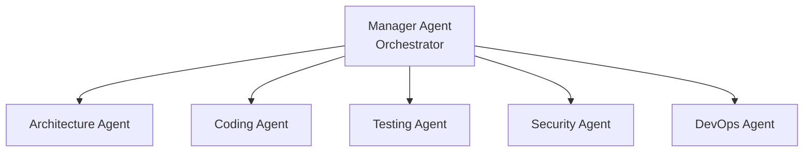
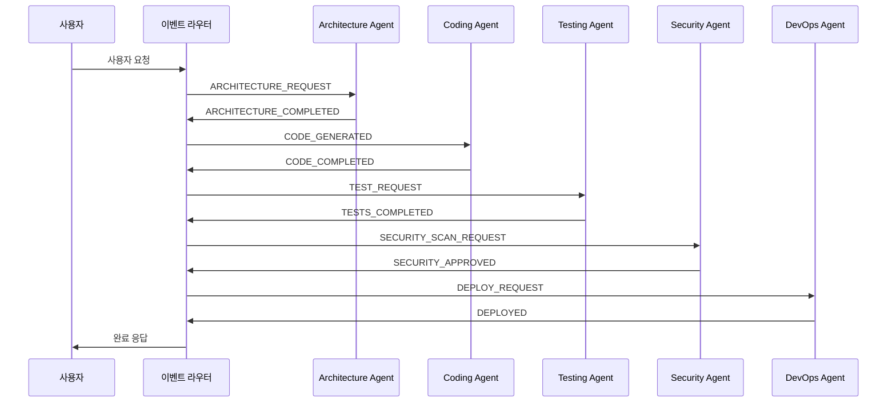
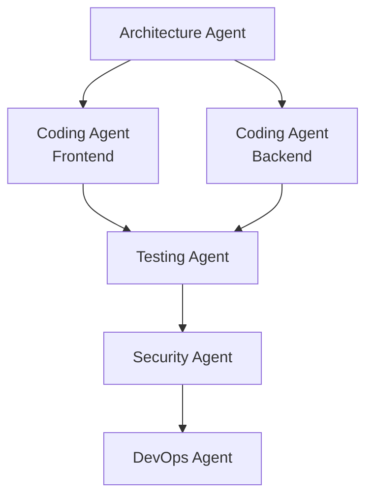
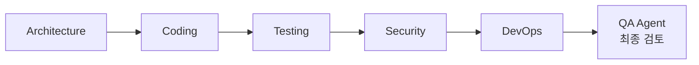

## 멀티 에이전트 시대의 도래

2025년, AI 개발은 새로운 전환점을 맞이했습니다. 단일 AI 에이전트가 모든 작업을 처리하던 시대에서, **여러 전문 에이전트가 협업하는 멀티 에이전트 시스템**으로 진화하고 있습니다.

한 명의 개발자가 5개의 전문 에이전트를 오케스트레이션하여 풀스택 애플리케이션을 구축하는 것, 이것이 바로 오늘날의 현실입니다.

### 왜 멀티 에이전트인가?

**단일 에이전트의 한계**:
- 컨텍스트 창 제한 (하나의 AI가 모든 것을 기억할 수 없음)
- 전문성 부족 (모든 도메인에 능통할 수 없음)
- 병렬 처리 불가능 (한 번에 하나의 작업만 수행)

**멀티 에이전트의 강점**:
- **분업과 전문화**: 각 에이전트가 특정 영역에 집중
- **병렬 실행**: 여러 작업을 동시에 처리
- **확장성**: 새로운 에이전트 추가로 기능 확장 가능
- **복원력**: 한 에이전트 실패가 전체 시스템에 영향 주지 않음

실제 도요타는 멀티 에이전트 시스템으로 **연간 10,000시간 이상 절감**했고, 전자상거래 API 프로젝트에서는 **버그 70% 감소, 리팩토링 시간 75% 단축**이라는 성과를 거두었습니다.

## 5개 전문 에이전트 아키텍처

풀스택 애플리케이션 개발을 위한 이상적인 에이전트 구성:

### 1. Architecture Agent (아키텍트 에이전트)

**역할**: 시스템 설계 및 구조 결정

**핵심 책임**:
- 시스템 아키텍처 설계 (마이크로서비스, 모놀리식, 서버리스 등)
- 데이터베이스 스키마 설계
- 기술 스택 선정
- 컴포넌트 간 인터페이스 정의
- 확장성 및 성능 고려사항

**출력 예시**:
````markdown
## System Architecture

### Technology Stack
- Frontend: React 18 + TypeScript
- Backend: Node.js (Express) + TypeScript
- Database: PostgreSQL 15 + Redis (캐싱)
- Infrastructure: AWS (ECS Fargate, RDS, ElastiCache)

### Component Structure
```
frontend/
├── components/       # React 컴포넌트
├── hooks/           # 커스텀 훅
├── services/        # API 클라이언트
└── store/           # 상태 관리 (Zustand)

backend/
├── domain/          # 비즈니스 로직
├── application/     # 유스케이스
├── infrastructure/  # DB, 외부 API
└── presentation/    # REST 컨트롤러
```

### Database Schema
```sql
CREATE TABLE users (
  id UUID PRIMARY KEY,
  email VARCHAR(255) UNIQUE NOT NULL,
  created_at TIMESTAMP DEFAULT NOW()
);

CREATE TABLE posts (
  id UUID PRIMARY KEY,
  user_id UUID REFERENCES users(id),
  title VARCHAR(255) NOT NULL,
  content TEXT,
  published_at TIMESTAMP
);
```
````

### 2. Coding Agent (코딩 에이전트)

**역할**: 코드 구현 및 생성

**핵심 책임**:
- Architecture Agent의 설계를 실제 코드로 구현
- 비즈니스 로직 작성
- API 엔드포인트 구현
- 프론트엔드 컴포넌트 개발
- 코드 리뷰 및 리팩토링

**실제 성과**:
- **구현 시간 35% 단축** (전문 개발자 대상 연구)
- **결함률 27% 감소**

**구현 예시**:
```typescript
// Architecture Agent 설계 → Coding Agent 구현

// domain/user.entity.ts
export class User {
  constructor(
    public readonly id: string,
    public readonly email: string,
    public readonly createdAt: Date
  ) {}

  static create(email: string): User {
    return new User(
      crypto.randomUUID(),
      email,
      new Date()
    );
  }
}

// application/user.service.ts
export class UserService {
  constructor(private userRepository: UserRepository) {}

  async createUser(email: string): Promise<User> {
    const existingUser = await this.userRepository.findByEmail(email);
    if (existingUser) {
      throw new Error('User already exists');
    }

    const user = User.create(email);
    await this.userRepository.save(user);
    return user;
  }
}

// presentation/user.controller.ts
export class UserController {
  constructor(private userService: UserService) {}

  async create(req: Request, res: Response) {
    try {
      const { email } = req.body;
      const user = await this.userService.createUser(email);
      res.status(201).json(user);
    } catch (error) {
      res.status(400).json({ error: error.message });
    }
  }
}
```

### 3. Testing Agent (테스팅 에이전트)

**역할**: 자동화된 테스트 작성 및 품질 보증

**핵심 책임**:
- 단위 테스트 생성
- 통합 테스트 작성
- E2E 테스트 시나리오 구현
- 테스트 커버리지 분석
- 버그 탐지 및 보고

**테스트 예시**:
```typescript
// user.service.test.ts
describe('UserService', () => {
  let userService: UserService;
  let mockRepository: jest.Mocked<UserRepository>;

  beforeEach(() => {
    mockRepository = {
      findByEmail: jest.fn(),
      save: jest.fn(),
    } as any;
    userService = new UserService(mockRepository);
  });

  describe('createUser', () => {
    it('should create a new user successfully', async () => {
      const email = 'test@example.com';
      mockRepository.findByEmail.mockResolvedValue(null);
      mockRepository.save.mockResolvedValue(undefined);

      const user = await userService.createUser(email);

      expect(user.email).toBe(email);
      expect(mockRepository.save).toHaveBeenCalledWith(
        expect.objectContaining({ email })
      );
    });

    it('should throw error if user already exists', async () => {
      const email = 'existing@example.com';
      const existingUser = User.create(email);
      mockRepository.findByEmail.mockResolvedValue(existingUser);

      await expect(userService.createUser(email)).rejects.toThrow(
        'User already exists'
      );
    });

    it('should generate valid UUID for user ID', async () => {
      mockRepository.findByEmail.mockResolvedValue(null);
      const user = await userService.createUser('test@example.com');

      expect(user.id).toMatch(
        /^[0-9a-f]{8}-[0-9a-f]{4}-4[0-9a-f]{3}-[89ab][0-9a-f]{3}-[0-9a-f]{12}$/i
      );
    });
  });
});

// 통합 테스트
describe('User API Integration', () => {
  it('POST /users should create user and return 201', async () => {
    const response = await request(app)
      .post('/users')
      .send({ email: 'integration@test.com' })
      .expect(201);

    expect(response.body).toMatchObject({
      email: 'integration@test.com',
      id: expect.any(String),
      createdAt: expect.any(String)
    });
  });
});
```

### 4. Security Agent (보안 에이전트)

**역할**: 보안 취약점 탐지 및 방어

**핵심 책임**:
- 코드 보안 스캐닝
- 취약점 탐지 (SQL 인젝션, XSS, CSRF 등)
- 규정 준수 검증 (GDPR, HIPAA)
- 보안 권장사항 제공
- 위협 분석 및 완화 전략

**보안 체크리스트 예시**:
```markdown
## Security Checklist

### Input Validation
- [x] 모든 사용자 입력 검증 (Joi/Zod 스키마)
- [x] SQL 인젝션 방지 (매개변수화된 쿼리)
- [x] XSS 방지 (입력 sanitization)
- [x] 파일 업로드 검증 (MIME 타입, 크기 제한)

### Authentication & Authorization
- [x] 비밀번호 해싱 (bcrypt, 비용 계수 12)
- [x] JWT 토큰 만료 설정 (액세스 15분, 리프레시 7일)
- [x] 속도 제한 (IP당 15분에 100회)
- [x] HTTPS 강제 (프로덕션)

### Data Protection
- [x] 환경 변수로 비밀키 관리
- [x] 데이터베이스 암호화 (at-rest, in-transit)
- [x] CORS 화이트리스트 설정
- [x] 민감 정보 로깅 방지

### Compliance
- [x] GDPR: 사용자 데이터 삭제 API
- [x] 로그 보관 정책 (90일)
- [x] 개인정보 처리방침 업데이트
```

**취약점 보고 예시**:
```typescript
// ❌ Security Agent가 탐지한 취약점
app.get('/user/:id', (req, res) => {
  const query = `SELECT * FROM users WHERE id = '${req.params.id}'`;
  // SQL Injection 위험!
  db.query(query, (err, result) => {
    res.json(result);
  });
});

// ✅ Security Agent가 제안한 수정
app.get('/user/:id', async (req, res) => {
  const { id } = req.params;

  // 입력 검증
  const schema = Joi.object({
    id: Joi.string().uuid().required()
  });
  const { error } = schema.validate({ id });
  if (error) {
    return res.status(400).json({ error: 'Invalid user ID' });
  }

  // 매개변수화된 쿼리
  const result = await db.query(
    'SELECT * FROM users WHERE id = $1',
    [id]
  );
  res.json(result.rows[0]);
});
```

### 5. DevOps Agent (데브옵스 에이전트)

**역할**: CI/CD, 배포, 모니터링

**핵심 책임**:
- CI/CD 파이프라인 구성
- 인프라 프로비저닝 (Terraform, CloudFormation)
- 컨테이너화 (Docker, Kubernetes)
- 모니터링 및 알림 설정
- 성능 최적화

**실제 성과**: 화학 산업 사례에서 **품질 실패 30% 감소**

**CI/CD 파이프라인 예시**:
```yaml
# .github/workflows/deploy.yml
name: Deploy to Production

on:
  push:
    branches: [main]

jobs:
  test:
    runs-on: ubuntu-latest
    steps:
      - uses: actions/checkout@v3
      - name: Run Tests
        run: |
          npm ci
          npm test -- --coverage
          # Testing Agent가 생성한 테스트 실행

  security:
    runs-on: ubuntu-latest
    steps:
      - uses: actions/checkout@v3
      - name: Security Scan
        run: |
          npm audit
          # Security Agent가 정의한 보안 체크
          npx snyk test

  build:
    needs: [test, security]
    runs-on: ubuntu-latest
    steps:
      - uses: actions/checkout@v3
      - name: Build Docker Image
        run: |
          docker build -t myapp:${{ github.sha }} .
          docker push myapp:${{ github.sha }}

  deploy:
    needs: build
    runs-on: ubuntu-latest
    steps:
      - name: Deploy to ECS
        run: |
          aws ecs update-service \
            --cluster production \
            --service myapp \
            --force-new-deployment

      - name: Health Check
        run: |
          # DevOps Agent가 정의한 헬스 체크
          for i in {1..30}; do
            if curl -f https://api.example.com/health; then
              echo "Deployment successful"
              exit 0
            fi
            sleep 10
          done
          echo "Deployment failed"
          exit 1
```

## 에이전트 오케스트레이션 패턴

### 1. 계층적 오케스트레이션 (Hierarchical)

**구조**: Manager 에이전트가 5개 전문 에이전트를 조율



**장점**:
- 명확한 명령 구조
- 중앙 집중식 진행 추적
- 디버깅 용이

**적합한 경우**:
- 작업을 명확히 분해할 수 있는 경우
- 중앙 모니터링이 필요한 경우
- 팀이 구조화된 워크플로우를 선호하는 경우

**실제 구현** (LangGraph 사용):
```python
from langgraph.graph import StateGraph, END

# 상태 정의
class AppState(TypedDict):
    requirements: str
    architecture: dict
    code: dict
    tests: dict
    security_report: dict
    deployment_config: dict

# 그래프 생성
workflow = StateGraph(AppState)

# 노드 추가 (각 노드 = 에이전트)
workflow.add_node("architect", architecture_agent)
workflow.add_node("coder", coding_agent)
workflow.add_node("tester", testing_agent)
workflow.add_node("security", security_agent)
workflow.add_node("devops", devops_agent)

# 엣지 추가 (작업 흐름)
workflow.add_edge("architect", "coder")
workflow.add_edge("coder", "tester")
workflow.add_edge("tester", "security")
workflow.add_edge("security", "devops")
workflow.add_edge("devops", END)

# 시작점 설정
workflow.set_entry_point("architect")

# 실행
app = workflow.compile()
result = app.invoke({
    "requirements": "Build a REST API for user management"
})
```

### 2. 이벤트 주도 아키텍처 (Event-Driven)

**구조**: 에이전트 간 비동기 이벤트 스트리밍

**장점**:
- 서비스 분리 (각 에이전트는 이벤트 라우터만 인식)
- 장애 격리 (한 에이전트 실패가 전파되지 않음)
- 확장 가능한 조정
- 실시간 처리

**이벤트 플로우 예시**:


**Redis Streams 구현**:
```typescript
import Redis from 'ioredis';

const redis = new Redis();

// Architecture Agent: 이벤트 발행
async function publishArchitectureComplete(architecture: any) {
  await redis.xadd(
    'agent-events',
    '*',
    'type', 'ARCHITECTURE_COMPLETED',
    'data', JSON.stringify(architecture),
    'timestamp', Date.now().toString()
  );
}

// Coding Agent: 이벤트 구독
async function listenForArchitecture() {
  const consumer = redis.duplicate();

  // 컨슈머 그룹 생성
  await consumer.xgroup(
    'CREATE', 'agent-events', 'coding-group', '0', 'MKSTREAM'
  ).catch(() => {}); // 이미 존재하면 무시

  while (true) {
    const events = await consumer.xreadgroup(
      'GROUP', 'coding-group', 'coder-1',
      'BLOCK', 5000,
      'STREAMS', 'agent-events', '>'
    );

    if (!events) continue;

    for (const [stream, messages] of events) {
      for (const [id, fields] of messages) {
        const event = parseEvent(fields);

        if (event.type === 'ARCHITECTURE_COMPLETED') {
          await generateCode(event.data);
          await redis.xack('agent-events', 'coding-group', id);
        }
      }
    }
  }
}
```

### 3. 그래프 기반 오케스트레이션

**구조**: DAG (Directed Acyclic Graph)로 의존성 표현

**장점**:
- 시각적 워크플로우 표현
- 병렬 작업 실행 가능
- 명확한 의존성 관리

**병렬 실행 예시**:


## 에이전트 간 통신 프로토콜

### Model Context Protocol (MCP)

**개발**: Anthropic (2024 오픈소스), OpenAI 공식 채택 (2025년 3월)

**목적**: 에이전트 ↔ 도구/메모리 간 수직적 통신

**특징**:
- JSON-RPC 클라이언트-서버 인터페이스
- 보안 컨텍스트 주입
- 구조화된 도구 호출
- 리소스 관리
- 접근 제어 강제

**사용 예시**:
```json
// MCP 요청: Coding Agent → 데이터베이스 도구
{
  "jsonrpc": "2.0",
  "id": 1,
  "method": "tools/call",
  "params": {
    "name": "database_query",
    "arguments": {
      "query": "SELECT * FROM users WHERE id = $1",
      "params": ["user-123"]
    }
  }
}

// MCP 응답
{
  "jsonrpc": "2.0",
  "id": 1,
  "result": {
    "content": [
      {
        "type": "text",
        "text": "{\"id\": \"user-123\", \"email\": \"test@example.com\"}"
      }
    ]
  }
}
```

**글로벌 채택률**: 2025년 기준 **전 세계 조직의 78%가 MCP 또는 A2A 프로토콜 사용**

### Agent-to-Agent Protocol (A2A)

**목적**: 에이전트 ↔ 에이전트 간 수평적 통신

**차이점**:
- MCP: 에이전트가 도구나 메모리에 접근할 때
- A2A: 에이전트끼리 직접 소통할 때

**A2A 메시지 예시**:
```json
// Architecture Agent → Coding Agent
{
  "from": "architecture-agent",
  "to": "coding-agent",
  "type": "TASK_ASSIGNMENT",
  "payload": {
    "task_id": "impl-user-api",
    "architecture": {
      "pattern": "clean-architecture",
      "layers": ["domain", "application", "infrastructure", "presentation"],
      "database": "postgresql"
    },
    "deadline": "2025-10-17T10:00:00Z"
  },
  "metadata": {
    "priority": "high",
    "confidence_score": 0.95
  }
}

// Coding Agent → Architecture Agent (완료 알림)
{
  "from": "coding-agent",
  "to": "architecture-agent",
  "type": "TASK_COMPLETED",
  "payload": {
    "task_id": "impl-user-api",
    "files_created": [
      "src/domain/user.entity.ts",
      "src/application/user.service.ts",
      "src/infrastructure/user.repository.ts",
      "src/presentation/user.controller.ts"
    ],
    "status": "success"
  }
}
```

## 에러 처리 및 복원력

### 1. Fallback 전략

**3단계 Fallback**:
```typescript
async function executeWithFallback(task: Task) {
  try {
    // Level 1: 기본 LLM (GPT-4)
    return await primaryAgent.execute(task);
  } catch (error) {
    console.warn('Primary agent failed, trying fallback');

    try {
      // Level 2: 대체 LLM (Claude)
      return await fallbackAgent.execute(task);
    } catch (fallbackError) {
      // Level 3: Human-in-the-Loop
      return await escalateToHuman(task, [error, fallbackError]);
    }
  }
}
```

### 2. 점진적 롤아웃 (Canary Deployment)

**에이전트 배포 전략**:
```yaml
# Canary 배포: 5% → 50% → 100%
deployment:
  strategy: canary
  steps:
    - percentage: 5
      duration: 1h
      metrics:
        - error_rate < 1%
        - response_time < 200ms

    - percentage: 50
      duration: 2h
      metrics:
        - error_rate < 0.5%
        - user_satisfaction > 4.5/5

    - percentage: 100
      # 모든 메트릭 통과 시에만 전체 롤아웃
```

### 3. Circuit Breaker 패턴

**에이전트 간 장애 전파 방지**:
```typescript
class CircuitBreaker {
  private failureCount = 0;
  private lastFailureTime: number | null = null;
  private state: 'CLOSED' | 'OPEN' | 'HALF_OPEN' = 'CLOSED';

  async call(agent: Agent, task: Task) {
    if (this.state === 'OPEN') {
      if (Date.now() - this.lastFailureTime! > 60000) {
        // 1분 후 재시도
        this.state = 'HALF_OPEN';
      } else {
        throw new Error('Circuit breaker is OPEN');
      }
    }

    try {
      const result = await agent.execute(task);
      this.onSuccess();
      return result;
    } catch (error) {
      this.onFailure();
      throw error;
    }
  }

  private onSuccess() {
    this.failureCount = 0;
    this.state = 'CLOSED';
  }

  private onFailure() {
    this.failureCount++;
    this.lastFailureTime = Date.now();

    if (this.failureCount >= 5) {
      this.state = 'OPEN';
      console.error('Circuit breaker opened after 5 failures');
    }
  }
}
```

## 실전 예제: Todo API 구축

전체 워크플로우를 5개 에이전트로 구현해봅시다.

### 요구사항
````markdown
## Todo API 요구사항

- 사용자별 할 일 목록 관리
- CRUD 작업 (생성, 조회, 수정, 삭제)
- 완료 상태 토글
- 마감일 관리
- RESTful API
````

### Phase 1: Architecture Agent

````markdown
## Architecture Design

### Technology Stack
- Backend: Node.js (Express) + TypeScript
- Database: PostgreSQL
- Cache: Redis (조회 성능 최적화)
- Testing: Jest + Supertest

### Database Schema
CREATE TABLE todos (
  id UUID PRIMARY KEY DEFAULT gen_random_uuid(),
  user_id UUID NOT NULL,
  title VARCHAR(255) NOT NULL,
  description TEXT,
  completed BOOLEAN DEFAULT FALSE,
  due_date TIMESTAMP,
  created_at TIMESTAMP DEFAULT NOW(),
  updated_at TIMESTAMP DEFAULT NOW()
);

CREATE INDEX idx_todos_user_id ON todos(user_id);
CREATE INDEX idx_todos_completed ON todos(completed);

### API Endpoints
- POST   /todos        → 할 일 생성
- GET    /todos        → 목록 조회
- GET    /todos/:id    → 단일 조회
- PUT    /todos/:id    → 수정
- DELETE /todos/:id    → 삭제
- PATCH  /todos/:id/toggle → 완료 토글
````

### Phase 2: Coding Agent

```typescript
// domain/todo.entity.ts
export class Todo {
  constructor(
    public readonly id: string,
    public readonly userId: string,
    public title: string,
    public description: string,
    public completed: boolean,
    public dueDate: Date | null,
    public readonly createdAt: Date,
    public updatedAt: Date
  ) {}

  static create(userId: string, title: string, description: string = '', dueDate: Date | null = null): Todo {
    return new Todo(
      crypto.randomUUID(),
      userId,
      title,
      description,
      false,
      dueDate,
      new Date(),
      new Date()
    );
  }

  toggle(): void {
    this.completed = !this.completed;
    this.updatedAt = new Date();
  }

  update(title?: string, description?: string, dueDate?: Date | null): void {
    if (title !== undefined) this.title = title;
    if (description !== undefined) this.description = description;
    if (dueDate !== undefined) this.dueDate = dueDate;
    this.updatedAt = new Date();
  }
}

// application/todo.service.ts
export class TodoService {
  constructor(
    private todoRepository: TodoRepository,
    private cache: RedisClient
  ) {}

  async createTodo(userId: string, title: string, description?: string, dueDate?: Date): Promise<Todo> {
    const todo = Todo.create(userId, title, description, dueDate);
    await this.todoRepository.save(todo);
    await this.cache.del(`todos:${userId}`); // 캐시 무효화
    return todo;
  }

  async getTodos(userId: string): Promise<Todo[]> {
    const cached = await this.cache.get(`todos:${userId}`);
    if (cached) {
      return JSON.parse(cached);
    }

    const todos = await this.todoRepository.findByUserId(userId);
    await this.cache.setex(`todos:${userId}`, 300, JSON.stringify(todos)); // 5분 캐싱
    return todos;
  }

  async toggleTodo(id: string, userId: string): Promise<Todo> {
    const todo = await this.todoRepository.findById(id);
    if (!todo || todo.userId !== userId) {
      throw new Error('Todo not found');
    }

    todo.toggle();
    await this.todoRepository.save(todo);
    await this.cache.del(`todos:${userId}`);
    return todo;
  }
}

// presentation/todo.controller.ts
export class TodoController {
  constructor(private todoService: TodoService) {}

  create = async (req: Request, res: Response) => {
    try {
      const { title, description, dueDate } = req.body;
      const userId = req.user!.id; // 인증 미들웨어에서 주입

      const todo = await this.todoService.createTodo(
        userId,
        title,
        description,
        dueDate ? new Date(dueDate) : undefined
      );

      res.status(201).json(todo);
    } catch (error) {
      res.status(400).json({ error: error.message });
    }
  };

  list = async (req: Request, res: Response) => {
    const userId = req.user!.id;
    const todos = await this.todoService.getTodos(userId);
    res.json(todos);
  };

  toggle = async (req: Request, res: Response) => {
    try {
      const { id } = req.params;
      const userId = req.user!.id;

      const todo = await this.todoService.toggleTodo(id, userId);
      res.json(todo);
    } catch (error) {
      res.status(404).json({ error: error.message });
    }
  };
}
```

### Phase 3: Testing Agent

```typescript
// todo.service.test.ts
describe('TodoService', () => {
  let service: TodoService;
  let mockRepository: jest.Mocked<TodoRepository>;
  let mockCache: jest.Mocked<RedisClient>;

  beforeEach(() => {
    mockRepository = {
      save: jest.fn(),
      findByUserId: jest.fn(),
      findById: jest.fn(),
    } as any;

    mockCache = {
      get: jest.fn(),
      setex: jest.fn(),
      del: jest.fn(),
    } as any;

    service = new TodoService(mockRepository, mockCache);
  });

  describe('createTodo', () => {
    it('should create todo and invalidate cache', async () => {
      const userId = 'user-123';
      const title = 'Buy groceries';

      const todo = await service.createTodo(userId, title);

      expect(todo.title).toBe(title);
      expect(todo.userId).toBe(userId);
      expect(todo.completed).toBe(false);
      expect(mockRepository.save).toHaveBeenCalled();
      expect(mockCache.del).toHaveBeenCalledWith(`todos:${userId}`);
    });
  });

  describe('getTodos', () => {
    it('should return cached todos if available', async () => {
      const userId = 'user-123';
      const cachedTodos = [{ id: '1', title: 'Test' }];
      mockCache.get.mockResolvedValue(JSON.stringify(cachedTodos));

      const todos = await service.getTodos(userId);

      expect(todos).toEqual(cachedTodos);
      expect(mockRepository.findByUserId).not.toHaveBeenCalled();
    });

    it('should fetch from DB and cache if not cached', async () => {
      const userId = 'user-123';
      const dbTodos = [Todo.create(userId, 'Test')];
      mockCache.get.mockResolvedValue(null);
      mockRepository.findByUserId.mockResolvedValue(dbTodos);

      const todos = await service.getTodos(userId);

      expect(todos).toEqual(dbTodos);
      expect(mockCache.setex).toHaveBeenCalledWith(
        `todos:${userId}`,
        300,
        JSON.stringify(dbTodos)
      );
    });
  });

  describe('toggleTodo', () => {
    it('should toggle todo completion status', async () => {
      const todo = Todo.create('user-123', 'Test');
      mockRepository.findById.mockResolvedValue(todo);

      const result = await service.toggleTodo(todo.id, 'user-123');

      expect(result.completed).toBe(true);
      expect(mockRepository.save).toHaveBeenCalled();
    });

    it('should throw error if todo not found', async () => {
      mockRepository.findById.mockResolvedValue(null);

      await expect(
        service.toggleTodo('invalid-id', 'user-123')
      ).rejects.toThrow('Todo not found');
    });

    it('should throw error if user does not own todo', async () => {
      const todo = Todo.create('other-user', 'Test');
      mockRepository.findById.mockResolvedValue(todo);

      await expect(
        service.toggleTodo(todo.id, 'user-123')
      ).rejects.toThrow('Todo not found');
    });
  });
});

// 통합 테스트
describe('Todo API Integration', () => {
  it('should create and retrieve todos', async () => {
    const createRes = await request(app)
      .post('/todos')
      .set('Authorization', 'Bearer test-token')
      .send({ title: 'Integration Test', description: 'Test todo' })
      .expect(201);

    expect(createRes.body).toMatchObject({
      title: 'Integration Test',
      completed: false
    });

    const listRes = await request(app)
      .get('/todos')
      .set('Authorization', 'Bearer test-token')
      .expect(200);

    expect(listRes.body).toHaveLength(1);
    expect(listRes.body[0].title).toBe('Integration Test');
  });
});
```

### Phase 4: Security Agent

````markdown
## Security Report

### Vulnerabilities Found: 2

#### 1. Missing Input Validation (HIGH)
**Location**: `todo.controller.ts:create()`
**Issue**: User input not validated before processing
**Recommendation**: Add Joi/Zod schema validation

#### 2. Cache Poisoning Risk (MEDIUM)
**Location**: `todo.service.ts:getTodos()`
**Issue**: Cache key based on user ID only, no integrity check
**Recommendation**: Add HMAC signature to cache keys

### Recommendations Applied:

```typescript
// 수정된 todo.controller.ts
import Joi from 'joi';

const createTodoSchema = Joi.object({
  title: Joi.string().min(1).max(255).required(),
  description: Joi.string().max(5000).optional(),
  dueDate: Joi.date().iso().optional()
});

export class TodoController {
  create = async (req: Request, res: Response) => {
    // 입력 검증 추가
    const { error, value } = createTodoSchema.validate(req.body);
    if (error) {
      return res.status(400).json({ error: error.details[0].message });
    }

    try {
      const { title, description, dueDate } = value;
      const userId = req.user!.id;

      const todo = await this.todoService.createTodo(
        userId,
        title,
        description,
        dueDate ? new Date(dueDate) : undefined
      );

      res.status(201).json(todo);
    } catch (error) {
      res.status(500).json({ error: 'Internal server error' });
    }
  };
}

// 수정된 todo.service.ts (캐시 보안 강화)
import crypto from 'crypto';

export class TodoService {
  private generateCacheKey(userId: string): string {
    const hmac = crypto.createHmac('sha256', process.env.CACHE_SECRET!);
    hmac.update(userId);
    const signature = hmac.digest('hex');
    return `todos:${userId}:${signature}`;
  }

  async getTodos(userId: string): Promise<Todo[]> {
    const cacheKey = this.generateCacheKey(userId);
    const cached = await this.cache.get(cacheKey);
    if (cached) {
      return JSON.parse(cached);
    }

    const todos = await this.todoRepository.findByUserId(userId);
    await this.cache.setex(cacheKey, 300, JSON.stringify(todos));
    return todos;
  }
}
```
````

### Phase 5: DevOps Agent

```yaml
# .github/workflows/deploy.yml
name: Deploy Todo API

on:
  push:
    branches: [main]

jobs:
  test:
    runs-on: ubuntu-latest
    steps:
      - uses: actions/checkout@v3

      - name: Setup Node.js
        uses: actions/setup-node@v3
        with:
          node-version: '18'

      - name: Install Dependencies
        run: npm ci

      - name: Run Tests
        run: npm test -- --coverage --coverageThreshold='{"global":{"lines":90}}'

      - name: Upload Coverage
        uses: codecov/codecov-action@v3

  security:
    runs-on: ubuntu-latest
    steps:
      - uses: actions/checkout@v3

      - name: Security Audit
        run: |
          npm audit --audit-level=moderate
          npx snyk test

      - name: SAST Scan
        uses: github/codeql-action/analyze@v2

  build:
    needs: [test, security]
    runs-on: ubuntu-latest
    steps:
      - uses: actions/checkout@v3

      - name: Build Docker Image
        run: |
          docker build -t todo-api:${{ github.sha }} .
          docker tag todo-api:${{ github.sha }} todo-api:latest

      - name: Push to ECR
        run: |
          aws ecr get-login-password | docker login --username AWS --password-stdin $ECR_REGISTRY
          docker push todo-api:${{ github.sha }}
          docker push todo-api:latest

  deploy:
    needs: build
    runs-on: ubuntu-latest
    steps:
      - name: Deploy to ECS
        run: |
          aws ecs update-service \
            --cluster production \
            --service todo-api \
            --force-new-deployment

      - name: Wait for Deployment
        run: |
          aws ecs wait services-stable \
            --cluster production \
            --services todo-api

      - name: Health Check
        run: |
          for i in {1..30}; do
            STATUS=$(curl -s -o /dev/null -w '%{http_code}' https://api.example.com/health)
            if [ "$STATUS" -eq 200 ]; then
              echo "✅ Deployment successful"
              exit 0
            fi
            echo "Waiting for service... (attempt $i/30)"
            sleep 10
          done
          echo "❌ Deployment failed"
          exit 1

      - name: Notify Slack
        if: always()
        run: |
          curl -X POST ${{ secrets.SLACK_WEBHOOK }} \
            -H 'Content-Type: application/json' \
            -d "{\"text\":\"Todo API deployment: ${{ job.status }}\"}"

# Terraform 인프라 코드
# infrastructure/main.tf
resource "aws_ecs_service" "todo_api" {
  name            = "todo-api"
  cluster         = aws_ecs_cluster.main.id
  task_definition = aws_ecs_task_definition.todo_api.arn
  desired_count   = 3
  launch_type     = "FARGATE"

  load_balancer {
    target_group_arn = aws_lb_target_group.todo_api.arn
    container_name   = "todo-api"
    container_port   = 3000
  }

  network_configuration {
    subnets          = aws_subnet.private.*.id
    security_groups  = [aws_security_group.todo_api.id]
    assign_public_ip = false
  }

  # Auto-scaling
  lifecycle {
    ignore_changes = [desired_count]
  }
}

resource "aws_appautoscaling_target" "todo_api" {
  max_capacity       = 10
  min_capacity       = 3
  resource_id        = "service/${aws_ecs_cluster.main.name}/${aws_ecs_service.todo_api.name}"
  scalable_dimension = "ecs:service:DesiredCount"
  service_namespace  = "ecs"
}

resource "aws_appautoscaling_policy" "cpu" {
  name               = "todo-api-cpu-scaling"
  policy_type        = "TargetTrackingScaling"
  resource_id        = aws_appautoscaling_target.todo_api.resource_id
  scalable_dimension = aws_appautoscaling_target.todo_api.scalable_dimension
  service_namespace  = aws_appautoscaling_target.todo_api.service_namespace

  target_tracking_scaling_policy_configuration {
    target_value       = 70.0
    predefined_metric_specification {
      predefined_metric_type = "ECSServiceAverageCPUUtilization"
    }
  }
}
```

## Best Practices

### 1. 에이전트 책임 분리

**원칙**: 각 에이전트는 단일 도메인에 집중

````markdown
✅ 좋은 예:
- Architecture Agent: 시스템 설계만
- Coding Agent: 코드 구현만
- Testing Agent: 테스트만

❌ 나쁜 예:
- 만능 Agent: 설계 + 코딩 + 테스트 + 배포 전부
````

**이점**:
- 복잡도 감소
- 디버깅 용이
- 컨텍스트 창 오버로드 방지
- 더 견고한 시스템

### 2. Quality Assurance Stage 추가

**최종 검토 단계**:


**QA Agent 역할**:
- 모든 에이전트 출력 검토
- 일관성 검증
- 품질 기준 충족 확인
- 문제 발견 시 해당 에이전트에게 재작업 요청

### 3. Human-in-the-Loop 통합

**언제 사람이 개입해야 하는가?**

| 상황 | HITL 필요 여부 | 이유 |
|------|---------------|------|
| 단순 CRUD API 구현 | ❌ | 완전 자동화 가능 |
| 복잡한 비즈니스 로직 결정 | ✅ | 도메인 전문가 판단 필요 |
| 보안 취약점 수정 | ✅ | 중요한 보안 결정 |
| 일반적인 테스트 작성 | ❌ | 자동화 가능 |
| 프로덕션 배포 승인 | ✅ | 최종 검토 필요 |
| 인프라 변경 | ✅ | 비용 및 영향 고려 |

**구현 예시**:
```typescript
async function deployToProduction(deployment: Deployment) {
  // DevOps Agent가 배포 계획 생성
  const plan = await devopsAgent.createDeploymentPlan(deployment);

  // Human approval 요청
  const approval = await requestHumanApproval({
    title: 'Production Deployment Approval',
    plan: plan,
    estimatedDowntime: '0 minutes',
    risks: ['Database migration', 'Config changes'],
    rollbackPlan: plan.rollbackStrategy
  });

  if (!approval.approved) {
    throw new Error(`Deployment rejected: ${approval.reason}`);
  }

  // 승인 후 배포 진행
  return await devopsAgent.execute(plan);
}
```

### 4. 관찰 가능성 (Observability)

**5가지 필수 관찰 영역** (Microsoft Azure 권장):

1. **포괄적 로깅**:
```typescript
class AgentLogger {
  log(agent: string, event: string, data: any) {
    console.log(JSON.stringify({
      timestamp: new Date().toISOString(),
      agent: agent,
      event: event,
      data: data,
      trace_id: getTraceId()
    }));
  }
}

// 사용
logger.log('coding-agent', 'task-started', {
  task_id: 'impl-user-api',
  estimated_duration: '5m'
});
```

2. **성능 메트릭**:
```typescript
const metrics = {
  agent_execution_time: new Histogram({
    name: 'agent_execution_seconds',
    help: 'Agent execution time',
    labelNames: ['agent_name', 'task_type']
  }),

  agent_errors: new Counter({
    name: 'agent_errors_total',
    help: 'Total agent errors',
    labelNames: ['agent_name', 'error_type']
  })
};

// 사용
const timer = metrics.agent_execution_time.startTimer({
  agent_name: 'coding-agent',
  task_type: 'generate-code'
});

try {
  await codingAgent.execute(task);
} catch (error) {
  metrics.agent_errors.inc({
    agent_name: 'coding-agent',
    error_type: error.constructor.name
  });
} finally {
  timer();
}
```

3. **품질 및 안전 표준 검증**
4. **규정 준수 모니터링**
5. **사용자 경험 최적화**

### 5. 에러 패턴 학습

**Microsoft AI Red Team의 12가지 실패 패턴** 참고:

```typescript
// 실패 패턴 감지 및 학습
class FailurePatternDetector {
  private patterns: Map<string, FailurePattern> = new Map();

  recordFailure(agent: string, error: Error, context: any) {
    const pattern = this.identifyPattern(error, context);

    if (this.patterns.has(pattern.id)) {
      const existing = this.patterns.get(pattern.id)!;
      existing.occurrences++;
      existing.contexts.push(context);
    } else {
      this.patterns.set(pattern.id, {
        id: pattern.id,
        agent: agent,
        errorType: error.constructor.name,
        occurrences: 1,
        contexts: [context]
      });
    }

    // 패턴이 3회 이상 반복되면 알림
    if (this.patterns.get(pattern.id)!.occurrences >= 3) {
      this.alertRecurringPattern(pattern);
    }
  }
}
```

## 미래 전망

### 2025년: "에이전틱 AI의 해"

업계 리더들의 합의: **2025년은 에이전틱 AI의 해**

**주요 트렌드**:

1. **조 단위 시장 기회**
   - AI 소프트웨어 개발 스택: 조 달러 규모 시장
   - 전 세계 3천만 개발자가 AI 코딩 어시스턴트 사용
   - 생산성 향상으로 전 세계 GDP에 조 단위 가치 창출

2. **프로토타입에서 프로덕션으로**
   - 2023-2024: 생성형 AI (GPT, 이미지 생성)
   - 2025+: 자율 에이전틱 시스템 (실제 업무 자동화)

3. **프로토콜 표준화**
   - **78%의 글로벌 조직**이 MCP 또는 A2A 프로토콜 사용
   - 업계 전반의 상호 운용성

4. **Sovereign AI**
   - 데이터 주권 및 지정학적 복원력
   - 자율 에이전트의 규정 준수 및 감사 가능성
   - 핵심 인프라 배포

5. **자가 치유 시스템 (Self-Healing)**
   - 자율적 에러 탐지 및 복구
   - 적응형 시스템 복원력
   - 인간 개입 없이 문제 해결

### 개발자 역할의 재정의

**Before (전통적 개발)**:
- 코드 작성 70% + 설계 20% + 테스트 10%

**After (에이전트 오케스트레이션)**:
- 요구사항 정의 30% + 에이전트 관리 40% + 검증 20% + 최적화 10%

**핵심 스킬 변화**:

| 전통적 스킬 | 중요도 | 새로운 핵심 스킬 |
|------------|-------|------------------|
| 코딩 속도 | ↓↓ | 요구사항 명확화 |
| 문법 지식 | ↓ | 시스템 아키텍처 |
| 디버깅 | → | 에이전트 프롬프트 엔지니어링 |
| 알고리즘 | → | 멀티 에이전트 오케스트레이션 |
| 코드 리뷰 | ↓ | 에이전트 출력 검증 |

## 시작하기

### 1주차: 프레임워크 선택 및 학습

```bash
# LangGraph 설치 (추천: 프로덕션 시스템)
pip install langgraph langchain-openai

# 또는 CrewAI (추천: 빠른 프로토타이핑)
pip install crewai langchain-openai

# 환경 변수 설정
export OPENAI_API_KEY="your-api-key"
```

**학습 자료**:
- [LangGraph 공식 튜토리얼](https://blog.langchain.com/langgraph-multi-agent-workflows/)
- [CrewAI GitHub](https://github.com/crewAIInc/crewAI)

### 2주차: 소규모 프로젝트 구현

**추천 시작 프로젝트**:
- 간단한 REST API (2-3개 엔드포인트)
- Architecture Agent + Coding Agent만 사용
- 수동 테스트 및 배포

### 3주차: 전체 파이프라인 확장

**5개 에이전트 통합**:
- Testing Agent 추가 → 자동화된 테스트
- Security Agent 추가 → 보안 스캐닝
- DevOps Agent 추가 → CI/CD 파이프라인

### 1개월 후: 프로덕션 투입

**성과 측정**:
- 개발 속도 향상률
- 버그 감소율
- 테스트 커버리지
- 팀 만족도

## 결론

멀티 에이전트 시스템은 더 이상 미래가 아닙니다. **지금 당장 적용할 수 있는 현실**입니다.

**핵심 요약**:
1. **5개 전문 에이전트**: Architecture, Coding, Testing, Security, DevOps
2. **오케스트레이션 패턴**: 계층적, 이벤트 주도, 그래프 기반
3. **통신 프로토콜**: MCP (도구 접근), A2A (에이전트 간 통신)
4. **복원력**: Fallback, Circuit Breaker, Canary 배포
5. **Best Practices**: 책임 분리, QA 단계, HITL, 관찰 가능성

**실제 성과**:
- 도요타: **연간 10,000시간 절약**
- E-commerce API: **버그 70% 감소, 리팩토링 75% 단축**
- 전문 개발자: **구현 시간 35% 단축, 결함 27% 감소**

이제 여러분의 차례입니다. 5개의 AI 에이전트를 오케스트레이션하여, 혼자서도 풀스택 애플리케이션을 구축할 수 있는 새로운 시대가 열렸습니다.

## 참고 자료

### 공식 문서
- [LangGraph Multi-Agent Workflows](https://blog.langchain.com/langgraph-multi-agent-workflows/)
- [Microsoft Agent Framework](https://azure.microsoft.com/en-us/blog/introducing-microsoft-agent-framework/)
- [AWS Multi-Agent Orchestration](https://aws.amazon.com/solutions/guidance/multi-agent-orchestration-on-aws/)

### 프레임워크 비교
- [LangGraph vs AutoGen vs CrewAI 비교](https://www.datagrom.com/data-science-machine-learning-ai-blog/langgraph-vs-autogen-vs-crewai-comparison-agentic-ai-frameworks)
- [Nuvi: AI Agent Framework 비교](https://www.nuvi.dev/blog/ai-agent-framework-comparison-langgraph-crewai-openai-swarm)

### 실전 사례
- [Google Cloud: 101 Gen AI 사용 사례](https://cloud.google.com/transform/101-real-world-generative-ai-use-cases-from-industry-leaders)
- [McKinsey: 에이전틱 AI 우위 확보하기](https://www.mckinsey.com/capabilities/quantumblack/our-insights/seizing-the-agentic-ai-advantage)

### 학술 논문
- [AgentOrchestra: 계층적 멀티 에이전트 프레임워크](https://arxiv.org/html/2506.12508v1)
- [에이전트 상호운용성 프로토콜 서베이](https://arxiv.org/html/2505.02279v1)
- [멀티 에이전트 협업 메커니즘](https://arxiv.org/html/2501.06322v1)

---

**다음 글**: [자가 치유 AI 시스템: 인간 개입 없이 자동으로 버그를 수정하는 에이전트 구축하기](/ko/blog/ko/self-healing-ai-systems)에서는 2025년 핵심 트렌드인 Self-Healing Systems의 구현 방법을 실전 코드와 함께 다룹니다.
